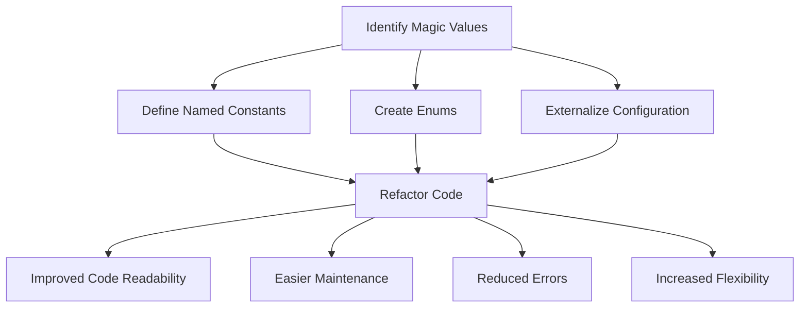

## 9.2.4 Magic Numbers and Strings

In the realm of software engineering, clarity and maintainability are paramount. Yet, many developers inadvertently introduce complexity and confusion into their code through the use of "magic numbers" and "magic strings." These are unexplained numerical or string literals that appear in code without context, making it difficult for others (or even the original author) to understand the code's intent. In this section, we will delve into what magic numbers and strings are, the problems they cause, and how to refactor them for improved code quality.

### Understanding Magic Numbers and Strings

**Magic Numbers** are numeric literals that are hard-coded into the program without explanation. They are "magic" because their purpose is not immediately clear, and they seem to appear out of nowhere. Similarly, **Magic Strings** are string literals used in the code without context or explanation. Both can lead to confusion and errors, especially when the code needs to be updated or maintained.

#### Example of Magic Numbers

Consider the following Java code snippet:

```java
public class Circle {
    public double calculateCircumference(double radius) {
        return 2 * 3.14159 * radius;
    }
}
```

In this example, `3.14159` is a magic number. While some might recognize it as an approximation of π (pi), its purpose is not explicitly stated in the code. This can lead to confusion, especially for someone unfamiliar with the mathematical constant.

#### Example of Magic Strings

Here's an example involving magic strings:

```java
public class User {
    public boolean isValidUser(String role) {
        return role.equals("admin");
    }
}
```

In this case, `"admin"` is a magic string. Its significance is not clear without additional context, and any typo in its usage could lead to bugs.

### Problems Caused by Magic Values

Magic numbers and strings can introduce several issues into your codebase:

1. **Lack of Clarity**: Without context, it's difficult to understand what a magic value represents, making the code harder to read and understand.

2. **Error-Prone**: Hard-coded values increase the risk of typos and errors, especially if the same value is used in multiple places.

3. **Difficult Maintenance**: If a magic value needs to be changed, it must be updated everywhere it appears in the code, increasing the risk of missing an occurrence.

4. **Poor Scalability**: As the codebase grows, managing and understanding magic values becomes increasingly challenging.

5. **Reduced Flexibility**: Magic values hard-code assumptions into the code, making it less adaptable to change.

### Solutions to Eliminate Magic Values

To address these issues, consider the following strategies:

#### 1. Use Named Constants

Define constants with meaningful names to replace magic numbers and strings. This not only clarifies their purpose but also centralizes their definition, making updates easier.

```java
public class Circle {
    private static final double PI = 3.14159;

    public double calculateCircumference(double radius) {
        return 2 * PI * radius;
    }
}
```

In this refactored example, `PI` is a named constant that clearly indicates its purpose.

#### 2. Use Enums for Magic Strings

Enums are a powerful feature in Java that can replace magic strings, providing type safety and a clear set of possible values.

```java
public enum UserRole {
    ADMIN, USER, GUEST
}

public class User {
    public boolean isValidUser(UserRole role) {
        return role == UserRole.ADMIN;
    }
}
```

By using an enum, we eliminate the risk of typos and make the code more robust.

#### 3. Externalize Configuration

For values that might change based on environment or deployment, consider storing them in configuration files or using dependency injection.

```properties
pi.value=3.14159
```

```java
import java.util.Properties;
import java.io.InputStream;
import java.io.IOException;

public class Circle {
    private static double PI;

    static {
        try (InputStream input = Circle.class.getClassLoader().getResourceAsStream("config.properties")) {
            Properties prop = new Properties();
            if (input == null) {
                System.out.println("Sorry, unable to find config.properties");
                return;
            }
            prop.load(input);
            PI = Double.parseDouble(prop.getProperty("pi.value"));
        } catch (IOException ex) {
            ex.printStackTrace();
        }
    }

    public double calculateCircumference(double radius) {
        return 2 * PI * radius;
    }
}
```

In this example, the value of π is read from a configuration file, allowing it to be changed without modifying the code.

#### 4. Implement Validation

Ensure that values are within expected ranges or formats by implementing validation logic.

```java
public class Circle {
    private static final double PI = 3.14159;

    public double calculateCircumference(double radius) {
        if (radius < 0) {
            throw new IllegalArgumentException("Radius cannot be negative");
        }
        return 2 * PI * radius;
    }
}
```

By validating inputs, we prevent invalid data from causing unexpected behavior.

### Benefits of Eliminating Magic Values

Refactoring code to eliminate magic numbers and strings offers several benefits:

- **Improved Readability**: Named constants and enums make the code more self-explanatory.
- **Easier Maintenance**: Centralized definitions simplify updates and reduce the risk of errors.
- **Reduced Errors**: Type safety and validation help prevent bugs.
- **Increased Flexibility**: Externalized configuration allows for easier adaptation to different environments.

### Encouraging Best Practices

To maintain a clean and maintainable codebase, consistently use constants and enums for any values that might otherwise be magic numbers or strings. Document any necessary literals with comments to explain their purpose.

### Try It Yourself

To reinforce these concepts, take the following steps:

1. **Identify Magic Values**: Review your codebase and identify any magic numbers or strings.
2. **Refactor**: Replace them with named constants, enums, or configuration values.
3. **Validate**: Implement validation logic where appropriate.
4. **Experiment**: Try modifying the refactored code to see how easy it is to update and maintain.

### Visualizing the Problem

To better understand the impact of magic numbers and strings, consider the following diagram illustrating the flow of refactoring:



This flowchart demonstrates the steps involved in identifying and refactoring magic values, leading to various benefits.

### Conclusion

Magic numbers and strings are a common anti-pattern that can significantly impact the readability and maintainability of your code. By replacing them with named constants, enums, and externalized configuration, you can create a more robust and flexible codebase. Remember, clear and maintainable code is not just a best practice—it's a necessity for successful software development.

## Quiz Time!



### What is a magic number in programming?

- [x] A numeric literal used in code without explanation
- [ ] A number that has special mathematical properties
- [ ] A number that is used for encryption
- [ ] A number that is generated randomly

> **Explanation:** A magic number is a numeric literal used in code without explanation, making it unclear and potentially confusing.

### Why are magic numbers considered an anti-pattern?

- [x] They make code difficult to understand and maintain
- [ ] They are always incorrect
- [ ] They are too complex to use
- [ ] They are only used in outdated programming languages

> **Explanation:** Magic numbers make code difficult to understand and maintain because their purpose is not clear without context.

### How can magic numbers be eliminated from code?

- [x] By using named constants
- [ ] By using random numbers instead
- [ ] By removing all numbers from the code
- [ ] By converting them to strings

> **Explanation:** Using named constants provides context and clarity, eliminating the need for magic numbers.

### What is a magic string?

- [x] A string literal used in code without explanation
- [ ] A string that performs a magic trick
- [ ] A string that is encrypted
- [ ] A string that is generated randomly

> **Explanation:** A magic string is a string literal used in code without explanation, similar to a magic number.

### Which of the following is a solution for magic strings?

- [x] Using enums
- [ ] Using arrays
- [ ] Using loops
- [ ] Using recursion

> **Explanation:** Enums provide a clear and type-safe way to replace magic strings.

### What is the benefit of using enums over magic strings?

- [x] Type safety and clarity
- [ ] They are faster to execute
- [ ] They use less memory
- [ ] They are easier to write

> **Explanation:** Enums offer type safety and clarity, making the code more robust and understandable.

### How can configuration values be externalized?

- [x] By using configuration files
- [ ] By hardcoding them in the code
- [ ] By using inline comments
- [ ] By using global variables

> **Explanation:** Configuration files allow values to be changed without modifying the code, providing flexibility.

### What is the role of validation in handling magic values?

- [x] Ensuring values are within expected ranges
- [ ] Making the code run faster
- [ ] Reducing the number of variables
- [ ] Simplifying the code structure

> **Explanation:** Validation ensures values are within expected ranges, preventing errors and unexpected behavior.

### What is a key benefit of eliminating magic numbers and strings?

- [x] Improved code readability
- [ ] Faster execution time
- [ ] Reduced file size
- [ ] Increased complexity

> **Explanation:** Eliminating magic numbers and strings improves code readability, making it easier to understand and maintain.

### True or False: Magic numbers and strings are only a problem in large codebases.

- [ ] True
- [x] False

> **Explanation:** Magic numbers and strings can cause confusion and errors in any size codebase, not just large ones.


