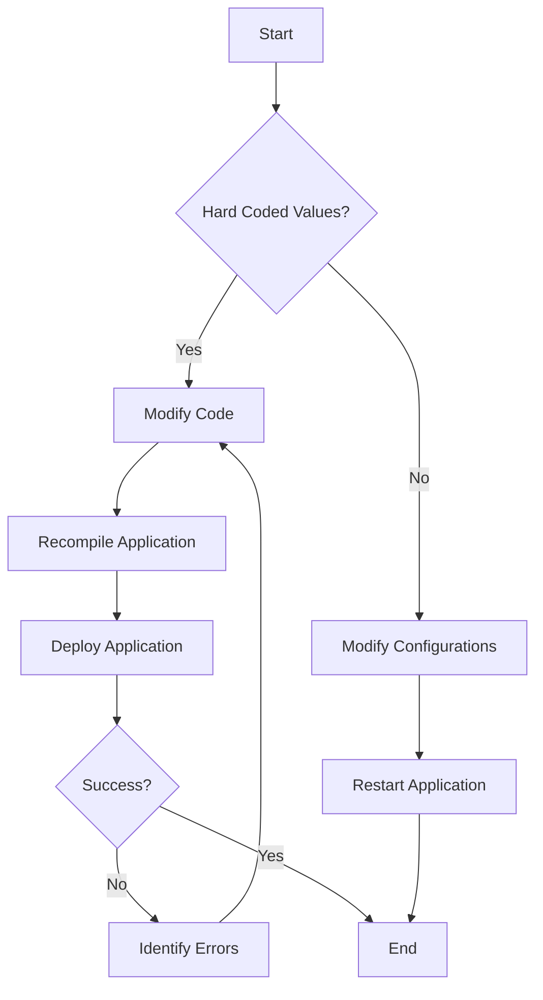

## 9.2.5 Hard Coding

In the realm of software development, **hard coding** refers to the practice of embedding configuration data, resources, or other variable elements directly into the source code. This anti-pattern can manifest in various forms, such as fixed file paths, database connection strings, or even user credentials hard-coded into the application. While it might seem convenient for quick prototyping or small-scale projects, hard coding poses significant challenges as applications grow in complexity and scale.

### Understanding Hard Coding

Let's start by defining hard coding more precisely. Hard coding occurs when values that are likely to change over time or vary between environments are directly embedded in the codebase. This practice can lead to several issues, particularly when the software needs to be modified, deployed across different environments, or scaled.

#### Manifestations of Hard Coding

1. **Fixed File Paths**: Hard-coded paths to files or directories can break when the application is deployed on a different system or when the directory structure changes.

2. **Database Connection Strings**: Embedding database URLs, usernames, and passwords directly in the code can lead to security vulnerabilities and make it difficult to switch between different database environments.

3. **API Endpoints and Keys**: Hard coding API URLs and keys can complicate the process of updating or switching to new APIs and expose sensitive information.

4. **User Interface Text**: Directly embedding UI text in the code makes it challenging to support multiple languages or update the text without recompiling the application.

### Why Hard Coding is Problematic

Hard coding introduces several challenges and risks that can hinder the maintainability, scalability, and security of software applications.

#### Difficulty in Modifying Configurations

When configurations are hard-coded, any change requires altering the source code, recompiling, and redeploying the application. This process is not only time-consuming but also error-prone, as it increases the likelihood of introducing bugs during updates.

#### Increased Risk of Errors During Deployment or Scaling

Hard-coded values can lead to deployment errors, especially when moving applications between environments such as development, testing, and production. Each environment might require different configurations, and hard coding makes it difficult to manage these differences efficiently.

#### Challenges in Maintaining Different Environments

In a typical software development lifecycle, applications are deployed across various environments, each with its own set of configurations. Hard coding makes it challenging to maintain consistency and control over these configurations, leading to potential discrepancies and errors.

### Java-Specific Examples of Hard Coding

Let's explore some common instances of hard coding in Java applications and their implications.

#### Hard-Coded File Paths

```java
// Example of a hard-coded file path
public class FileReader {
    public void readFile() {
        String filePath = "/usr/local/data/config.txt"; // Hard-coded path
        // Code to read the file
    }
}
```

In this example, the file path is hard-coded, making it inflexible and prone to errors if the directory structure changes or if the application is deployed on a different system.

#### Hard-Coded Database Connection Strings

```java
// Example of a hard-coded database connection string
public class DatabaseConnector {
    public void connect() {
        String url = "jdbc:mysql://localhost:3306/mydb"; // Hard-coded URL
        String user = "admin"; // Hard-coded username
        String password = "password"; // Hard-coded password
        // Code to establish a database connection
    }
}
```

Hard coding database credentials not only poses a security risk but also makes it difficult to switch between different database environments.

### Best Practices to Avoid Hard Coding

To mitigate the issues associated with hard coding, developers can adopt several best practices that promote the externalization of configurations.

#### Use Configuration Files

Externalize settings by using configuration files such as properties files or YAML files. This approach allows for easy modification of configurations without altering the source code.

```java
// Example of using a properties file for configurations
import java.io.InputStream;
import java.util.Properties;

public class ConfigLoader {
    private Properties properties = new Properties();

    public ConfigLoader() {
        try (InputStream input = getClass().getClassLoader().getResourceAsStream("config.properties")) {
            if (input == null) {
                System.out.println("Sorry, unable to find config.properties");
                return;
            }
            properties.load(input);
        } catch (Exception ex) {
            ex.printStackTrace();
        }
    }

    public String getProperty(String key) {
        return properties.getProperty(key);
    }
}
```

In this example, configurations are stored in a `config.properties` file, which can be easily modified without changing the code.

#### Employ Environment Variables or Command-Line Arguments

For runtime configurations, use environment variables or command-line arguments to pass values to the application. This approach provides flexibility and allows for different configurations across environments.

```java
// Example of using environment variables
public class EnvConfig {
    public static void main(String[] args) {
        String dbUrl = System.getenv("DB_URL"); // Retrieve from environment variable
        String dbUser = System.getenv("DB_USER");
        String dbPassword = System.getenv("DB_PASSWORD");
        // Use the retrieved values to connect to the database
    }
}
```

#### Utilize Java Frameworks for Externalized Configurations

Java frameworks like Spring provide robust support for externalized configurations. The `@Value` annotation, for instance, allows for injecting property values directly into beans.

```java
// Example using Spring's @Value annotation
import org.springframework.beans.factory.annotation.Value;
import org.springframework.stereotype.Component;

@Component
public class AppConfig {
    @Value("${app.name}")
    private String appName;

    @Value("${app.version}")
    private String appVersion;

    public void printConfig() {
        System.out.println("App Name: " + appName);
        System.out.println("App Version: " + appVersion);
    }
}
```

In this example, the application name and version are externalized in a properties file and injected into the `AppConfig` class.

### Securing Sensitive Data

It's crucial to avoid hard-coding sensitive data such as passwords, API keys, or tokens. Instead, use secure methods to manage and access this information.

#### Use Secret Management Tools

Consider using secret management tools like HashiCorp Vault or AWS Secrets Manager to securely store and access sensitive data.

#### Encrypt Sensitive Information

If sensitive data must be stored in configuration files, ensure it is encrypted and only decrypted at runtime.

### Regular Reviews and Refactoring

Regularly review your codebase to identify and refactor hard-coded values. This practice not only improves code quality but also enhances security and maintainability.

#### Conduct Code Reviews

Incorporate code reviews into your development process to catch instances of hard coding early and ensure best practices are followed.

#### Refactor Legacy Code

Legacy codebases often contain hard-coded values. Prioritize refactoring these areas to align with modern best practices.

### Visualizing the Impact of Hard Coding

To better understand the impact of hard coding and the benefits of externalizing configurations, let's visualize the process using a flowchart.



**Diagram Description**: This flowchart illustrates the traditional process of modifying hard-coded values, which involves changing the code, recompiling, and redeploying the application. In contrast, externalized configurations allow for direct modifications without altering the code, streamlining the process.

### Try It Yourself

To solidify your understanding, try modifying the code examples provided. Replace hard-coded values with configurations stored in a properties file or environment variables. Experiment with different configurations to see how they affect the application's behavior.

### Knowledge Check

- Reflect on your current projects: Do you have any hard-coded values that could be externalized?
- Consider the security implications of hard-coding sensitive data. How can you improve the security of your applications?

### Embrace the Journey

Remember, avoiding hard coding is a journey, not a destination. As you continue to develop and maintain software, keep exploring new tools and techniques to manage configurations effectively. Stay curious, and enjoy the process of creating more robust and maintainable applications.

### References and Further Reading

- [Spring Framework Documentation](https://spring.io/projects/spring-framework)
- [Java Properties Class](https://docs.oracle.com/javase/8/docs/api/java/util/Properties.html)
- [Environment Variables in Java](https://www.baeldung.com/java-environment-variables)
- [HashiCorp Vault](https://www.vaultproject.io/)
- [AWS Secrets Manager](https://aws.amazon.com/secrets-manager/)

## Quiz Time!



### What is hard coding?

- [x] Embedding configuration data directly in the source code
- [ ] Using configuration files to manage settings
- [ ] Storing data in a database
- [ ] Utilizing environment variables for configurations

> **Explanation:** Hard coding refers to embedding configuration data directly in the source code, which can lead to maintenance and scalability issues.

### Why is hard coding problematic?

- [x] It makes modifying configurations difficult
- [x] It increases the risk of errors during deployment
- [ ] It improves performance
- [ ] It enhances security

> **Explanation:** Hard coding makes it difficult to modify configurations without changing the code and increases the risk of errors during deployment, especially across different environments.

### Which of the following is an example of hard coding in Java?

- [x] Hard-coded file paths
- [x] Hard-coded database connection strings
- [ ] Using properties files for configurations
- [ ] Employing environment variables

> **Explanation:** Hard-coded file paths and database connection strings are common examples of hard coding in Java.

### What is a best practice to avoid hard coding?

- [x] Use configuration files
- [ ] Embed values directly in the code
- [ ] Ignore configuration management
- [ ] Hard-code sensitive data

> **Explanation:** Using configuration files is a best practice to avoid hard coding, allowing for easy modification of settings without altering the code.

### How can sensitive data be secured in configurations?

- [x] Use secret management tools
- [x] Encrypt sensitive information
- [ ] Hard-code passwords in the code
- [ ] Store sensitive data in plain text

> **Explanation:** Using secret management tools and encrypting sensitive information are effective ways to secure data in configurations.

### What is the role of environment variables in configuration management?

- [x] They provide runtime configurations
- [ ] They are used for hard coding values
- [ ] They store data in the database
- [ ] They replace the need for configuration files

> **Explanation:** Environment variables provide runtime configurations, offering flexibility across different environments.

### Which Java framework supports externalized configurations?

- [x] Spring
- [ ] Hibernate
- [ ] JUnit
- [ ] Log4j

> **Explanation:** The Spring framework supports externalized configurations, allowing for flexible and maintainable application settings.

### What is the benefit of using the `@Value` annotation in Spring?

- [x] It allows injecting property values into beans
- [ ] It hard-codes values in the code
- [ ] It stores data in the database
- [ ] It replaces the need for configuration files

> **Explanation:** The `@Value` annotation in Spring allows for injecting property values into beans, facilitating externalized configurations.

### How can regular reviews help in managing hard-coded values?

- [x] By identifying and refactoring hard-coded values
- [ ] By embedding more values in the code
- [ ] By ignoring configuration management
- [ ] By hard-coding sensitive data

> **Explanation:** Regular reviews help identify and refactor hard-coded values, improving code quality and maintainability.

### True or False: Hard coding is a recommended practice for managing configurations in large-scale applications.

- [ ] True
- [x] False

> **Explanation:** False. Hard coding is not recommended for managing configurations in large-scale applications due to its maintenance and scalability challenges.


