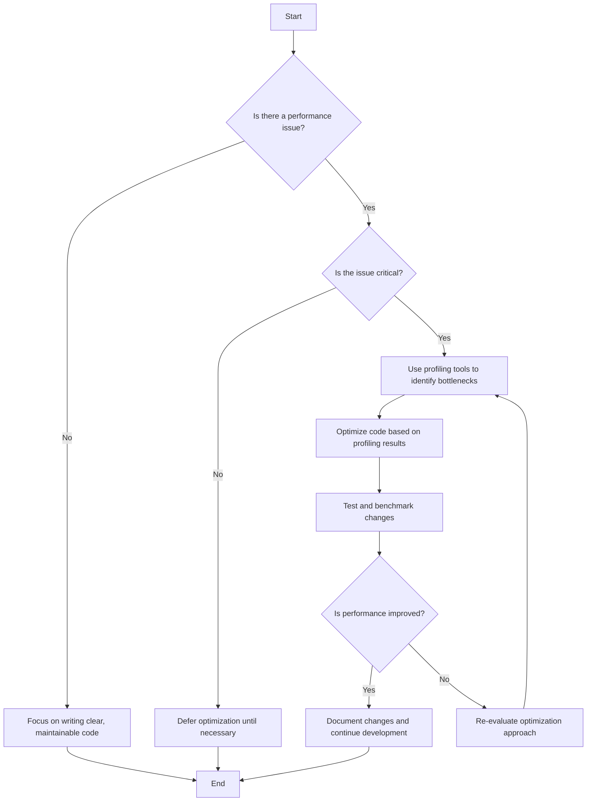

## 9.2.6 Premature Optimization

In the realm of software engineering, the pursuit of performance can often lead developers down a treacherous path. This path is known as "premature optimization," a concept famously encapsulated by Donald Knuth's assertion that "premature optimization is the root of all evil." This section will delve into why premature optimization is considered detrimental, its negative impacts, and strategies to avoid falling into this anti-pattern trap.

### Understanding Premature Optimization

Premature optimization occurs when developers focus on improving the performance of a piece of code before it is necessary, often at the expense of code clarity and maintainability. This tendency can lead to several adverse outcomes, including increased complexity, wasted resources, and the introduction of bugs. 

#### Why is Premature Optimization Harmful?

1. **Increased Code Complexity**: Optimizing code too early can lead to convoluted logic that is difficult to understand and maintain. This complexity can obscure the original intent of the code, making it harder for other developers to work with it.

2. **Wasted Development Time**: Developers may spend significant time optimizing parts of the code that do not impact the overall performance of the application. This time could be better spent on developing new features or improving code quality.

3. **Introduction of Bugs**: Unnecessary optimizations can introduce subtle bugs, as changes are made to the code without a clear understanding of their necessity or impact.

4. **Misguided Focus**: Premature optimization can divert attention from more critical aspects of software development, such as functionality, usability, and maintainability.

### Donald Knuth's Wisdom

Donald Knuth's quote, "premature optimization is the root of all evil," serves as a cautionary reminder to software developers. It emphasizes the importance of focusing on writing correct and maintainable code before considering performance enhancements. The quote suggests that optimization should be a deliberate process, informed by evidence and necessity rather than assumption.

### Negative Impacts of Premature Optimization

Let's explore some of the specific negative impacts premature optimization can have on Java projects:

#### Increased Code Complexity

When developers attempt to optimize code without a clear understanding of its performance characteristics, they often introduce unnecessary complexity. This complexity can manifest in several ways:

- **Obfuscated Logic**: Optimizations may lead to convoluted logic that is difficult to follow. For example, using complex algorithms or data structures that are not needed for the problem at hand.

- **Reduced Readability**: Code that is heavily optimized can be challenging to read and understand, especially for developers who are not familiar with the original intent.

- **Difficult Maintenance**: As code becomes more complex, maintaining it becomes more challenging. This can lead to increased costs and time spent on future development.

#### Wasted Development Time

Premature optimization often results in developers spending time on non-critical performance areas. This can lead to:

- **Delayed Feature Development**: Time spent on unnecessary optimizations could be better used for developing new features or improving existing ones.

- **Inefficient Resource Allocation**: Development resources are finite, and focusing on optimization too early can lead to inefficient use of these resources.

#### Potential Introduction of Bugs

Optimizing code without a clear understanding of its impact can introduce new bugs. These bugs can arise from:

- **Unintended Side Effects**: Changes made to optimize code may have unintended consequences, affecting other parts of the application.

- **Lack of Testing**: Optimizations may not be thoroughly tested, leading to bugs that are difficult to detect and fix.

### Examples of Premature Optimization in Java

To illustrate the pitfalls of premature optimization, let's consider some examples from Java projects:

#### Example 1: Over-Optimizing Data Structures

A developer decides to replace a simple `ArrayList` with a more complex data structure, such as a `TreeSet`, to improve performance. However, the application only ever deals with small datasets, and the overhead of maintaining the `TreeSet` outweighs any potential performance gains.

```java
import java.util.ArrayList;
import java.util.TreeSet;

public class DataStructureExample {
    public static void main(String[] args) {
        // Original implementation using ArrayList
        ArrayList<String> list = new ArrayList<>();
        list.add("Apple");
        list.add("Banana");
        list.add("Cherry");

        // Premature optimization using TreeSet
        TreeSet<String> set = new TreeSet<>(list);

        // The TreeSet adds unnecessary complexity for small datasets
        System.out.println("Using TreeSet: " + set);
    }
}
```

#### Example 2: Unnecessary Loop Unrolling

A developer attempts to optimize a loop by manually unrolling it, believing it will improve performance. However, the compiler already performs this optimization, and the manual unrolling makes the code harder to read and maintain.

```java
public class LoopUnrollingExample {
    public static void main(String[] args) {
        int[] numbers = {1, 2, 3, 4, 5, 6, 7, 8};

        // Original loop
        for (int i = 0; i < numbers.length; i++) {
            System.out.println(numbers[i]);
        }

        // Premature optimization: manual loop unrolling
        System.out.println(numbers[0]);
        System.out.println(numbers[1]);
        System.out.println(numbers[2]);
        System.out.println(numbers[3]);
        System.out.println(numbers[4]);
        System.out.println(numbers[5]);
        System.out.println(numbers[6]);
        System.out.println(numbers[7]);
    }
}
```

### Strategies to Avoid Premature Optimization

To avoid the pitfalls of premature optimization, developers should adopt the following strategies:

#### Focus on Writing Clear, Maintainable Code

Prioritize writing code that is easy to read and maintain. This includes:

- **Using Descriptive Names**: Choose variable and method names that clearly convey their purpose.

- **Keeping Methods Short**: Break down complex methods into smaller, more manageable pieces.

- **Following Coding Standards**: Adhere to established coding conventions to ensure consistency.

#### Use Profiling Tools

Before optimizing, use profiling tools to identify actual performance bottlenecks. Profiling tools can provide valuable insights into where the application spends most of its time, allowing developers to focus their optimization efforts where they will have the most impact.

- **Java Profilers**: Tools like VisualVM, JProfiler, and YourKit can help identify performance bottlenecks in Java applications.

#### Optimize Only When Necessary

Only optimize code after establishing that a performance issue exists and is impacting the application. This involves:

- **Setting Performance Goals**: Clearly define performance objectives and measure against them.

- **Testing and Benchmarking**: Use testing and benchmarking to verify the impact of optimizations.

#### Adopt Agile Practices

Agile practices, such as iterative development and constant feedback, can help prevent premature optimization. By focusing on delivering small, incremental improvements, developers can ensure that optimizations are based on actual needs rather than assumptions.

- **Iterative Development**: Break down development into small, manageable iterations, allowing for continuous feedback and improvement.

- **Continuous Integration**: Use continuous integration to ensure that changes are tested and validated regularly.

#### Balance Performance with Code Quality

Strive to balance performance considerations with code quality and maintainability. This involves:

- **Prioritizing Readability**: Ensure that code remains readable and maintainable, even after optimization.

- **Documenting Changes**: Clearly document any optimizations made to the code, including the rationale and expected impact.

### Visualizing the Impact of Premature Optimization

To better understand the impact of premature optimization, let's visualize the process using a flowchart. This flowchart illustrates the decision-making process for optimizing code:



### Try It Yourself

To better understand the impact of premature optimization, try modifying the provided code examples. Experiment with different data structures and loop optimizations, and use profiling tools to measure the impact on performance. Consider the following questions:

- How does the choice of data structure affect performance for different dataset sizes?
- What impact does manual loop unrolling have on code readability and maintainability?
- How can profiling tools help identify actual performance bottlenecks?

### Knowledge Check

Before moving on, let's summarize the key takeaways from this section:

- Premature optimization is the practice of focusing on performance improvements before they are necessary, often at the expense of code clarity and maintainability.
- Donald Knuth's quote, "premature optimization is the root of all evil," emphasizes the importance of writing correct and maintainable code before considering performance enhancements.
- The negative impacts of premature optimization include increased code complexity, wasted development time, and the potential introduction of bugs.
- Strategies to avoid premature optimization include focusing on writing clear, maintainable code, using profiling tools, optimizing only when necessary, adopting agile practices, and balancing performance with code quality.

### Embrace the Journey

Remember, the journey to mastering software development is ongoing. As you continue to develop your skills, keep in mind the importance of writing clear, maintainable code and optimizing only when necessary. Stay curious, embrace feedback, and enjoy the process of continuous learning and improvement.

## Quiz Time!



### What is premature optimization?

- [x] Focusing on improving performance before it's necessary.
- [ ] Optimizing code after identifying performance issues.
- [ ] Writing code without considering performance.
- [ ] Refactoring code to improve maintainability.

> **Explanation:** Premature optimization refers to the practice of focusing on performance improvements before they are necessary, often leading to increased complexity and potential issues.

### Why is premature optimization considered harmful?

- [x] It increases code complexity without clear benefits.
- [x] It wastes development time on non-critical areas.
- [ ] It always improves performance.
- [ ] It simplifies code logic.

> **Explanation:** Premature optimization can lead to increased complexity and wasted resources, as developers focus on non-critical performance areas without clear benefits.

### What does Donald Knuth's quote suggest about optimization?

- [x] Focus on writing correct and maintainable code first.
- [ ] Optimize code at the beginning of development.
- [ ] Ignore performance considerations entirely.
- [ ] Always prioritize performance over maintainability.

> **Explanation:** Donald Knuth's quote emphasizes the importance of writing correct and maintainable code before considering performance enhancements.

### Which tool can help identify performance bottlenecks in Java applications?

- [x] VisualVM
- [ ] Git
- [ ] Maven
- [ ] Eclipse

> **Explanation:** VisualVM is a profiling tool that can help identify performance bottlenecks in Java applications.

### What should developers prioritize before optimizing code?

- [x] Writing clear, maintainable code
- [ ] Implementing complex algorithms
- [ ] Using advanced data structures
- [ ] Refactoring for performance

> **Explanation:** Developers should prioritize writing clear, maintainable code before focusing on optimization.

### When should developers optimize code?

- [x] After establishing a performance issue exists
- [ ] During initial development
- [ ] Before any testing
- [ ] Without profiling

> **Explanation:** Developers should optimize code only after identifying a performance issue that impacts the application.

### How can agile practices help prevent premature optimization?

- [x] By emphasizing iterative development and feedback
- [ ] By focusing on complex optimizations
- [ ] By ignoring performance considerations
- [ ] By using static code analysis

> **Explanation:** Agile practices, such as iterative development and constant feedback, help ensure optimizations are based on actual needs rather than assumptions.

### What is a potential consequence of premature optimization?

- [x] Introduction of bugs
- [ ] Simplified code logic
- [ ] Improved readability
- [ ] Reduced complexity

> **Explanation:** Premature optimization can introduce bugs due to unnecessary code alterations and lack of thorough testing.

### What is the main focus of premature optimization?

- [x] Performance improvements
- [ ] Code readability
- [ ] Feature development
- [ ] Usability enhancements

> **Explanation:** Premature optimization focuses on performance improvements, often at the expense of other important aspects like readability and maintainability.

### True or False: Premature optimization should be a primary focus during initial development.

- [ ] True
- [x] False

> **Explanation:** Premature optimization should not be a primary focus during initial development. Developers should prioritize writing clear, maintainable code and optimize only when necessary.


