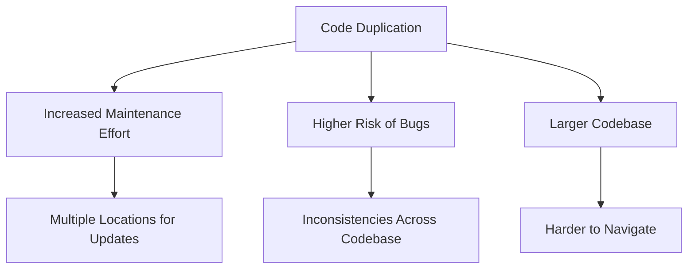

## 9.2.7 Copy-Paste Programming

Copy-paste programming is a common anti-pattern that occurs when developers duplicate code by copying and pasting it in different parts of the codebase. While this may seem like a quick solution to replicate functionality, it often leads to redundancy, inconsistency, and a host of maintenance challenges. In this section, we will delve into the nature of copy-paste programming, explore its pitfalls, and discuss strategies to avoid it, ensuring a clean and efficient codebase.

### Understanding Copy-Paste Programming

Copy-paste programming typically arises in scenarios where developers need to implement similar functionality across different parts of an application. Instead of abstracting the common logic into reusable components, they opt for the seemingly easier route of duplicating code. This approach can be tempting, especially under tight deadlines or when dealing with complex systems where the immediate need is to "just make it work."

#### Common Occurrences

1. **Feature Replication**: When a new feature is similar to an existing one, developers might copy the existing code and make minor modifications.
2. **Bug Fixes**: Fixing a bug in one part of the code and then copying the fix to other similar parts without consolidating the logic.
3. **Codebase Expansion**: As projects grow, developers might duplicate code to meet new requirements without refactoring the existing codebase.

### Problems Associated with Code Duplication

Code duplication can lead to several issues that complicate software maintenance and evolution:

#### Increased Maintenance Effort

When code is duplicated, any change or bug fix must be applied to multiple locations. This increases the maintenance burden and the likelihood of missing some instances, leading to inconsistencies.

#### Higher Risk of Bugs and Inconsistencies

Duplicated code can diverge over time as different developers modify it independently. This can introduce subtle bugs and inconsistencies, making the system harder to understand and debug.

#### Larger Codebases

A codebase with significant duplication is inherently larger and more complex. This makes it difficult to navigate, understand, and extend, particularly for new team members.

### Examples in Java

Let's consider a simple example where methods are duplicated instead of being abstracted:

```java
public class OrderProcessor {

    public void processOnlineOrder(Order order) {
        // Validate order
        if (order == null || order.getItems().isEmpty()) {
            throw new IllegalArgumentException("Order cannot be null or empty");
        }
        // Calculate total
        double total = 0;
        for (Item item : order.getItems()) {
            total += item.getPrice();
        }
        // Apply discount
        total = applyDiscount(total);
        // Process payment
        processPayment(order, total);
        // Ship order
        shipOrder(order);
    }

    public void processInStoreOrder(Order order) {
        // Validate order
        if (order == null || order.getItems().isEmpty()) {
            throw new IllegalArgumentException("Order cannot be null or empty");
        }
        // Calculate total
        double total = 0;
        for (Item item : order.getItems()) {
            total += item.getPrice();
        }
        // Apply discount
        total = applyDiscount(total);
        // Process payment
        processPayment(order, total);
        // Hand over to customer
        handOverToCustomer(order);
    }

    private double applyDiscount(double total) {
        // Apply some discount logic
        return total * 0.9;
    }

    private void processPayment(Order order, double total) {
        // Payment processing logic
    }

    private void shipOrder(Order order) {
        // Shipping logic
    }

    private void handOverToCustomer(Order order) {
        // In-store handover logic
    }
}
```

In this example, the `processOnlineOrder` and `processInStoreOrder` methods contain duplicated logic for validating orders and calculating totals. This duplication can be refactored into a reusable method.

### Strategies to Avoid Copy-Paste Programming

To mitigate the issues caused by code duplication, consider the following strategies:

#### Refactor Common Code

Identify common logic and refactor it into reusable methods or utility classes. This reduces duplication and centralizes logic, making it easier to maintain.

```java
public class OrderProcessor {

    public void processOrder(Order order, boolean isOnline) {
        validateOrder(order);
        double total = calculateTotal(order);
        total = applyDiscount(total);
        processPayment(order, total);
        
        if (isOnline) {
            shipOrder(order);
        } else {
            handOverToCustomer(order);
        }
    }

    private void validateOrder(Order order) {
        if (order == null || order.getItems().isEmpty()) {
            throw new IllegalArgumentException("Order cannot be null or empty");
        }
    }

    private double calculateTotal(Order order) {
        double total = 0;
        for (Item item : order.getItems()) {
            total += item.getPrice();
        }
        return total;
    }

    // Other methods remain unchanged...
}
```

#### Use Inheritance or Interfaces

Leverage inheritance or interfaces to promote code reuse and handle variations in behavior. This can help eliminate duplication by allowing shared logic to reside in a base class or interface.

#### Employ Design Patterns

Design patterns like Strategy or Template Method can be instrumental in handling variations without duplicating code. These patterns promote flexibility and reuse by encapsulating varying behavior.

**Strategy Pattern Example:**

```java
public interface PaymentStrategy {
    void processPayment(Order order, double total);
}

public class CreditCardPayment implements PaymentStrategy {
    @Override
    public void processPayment(Order order, double total) {
        // Credit card payment logic
    }
}

public class PayPalPayment implements PaymentStrategy {
    @Override
    public void processPayment(Order order, double total) {
        // PayPal payment logic
    }
}

public class OrderProcessor {
    private PaymentStrategy paymentStrategy;

    public OrderProcessor(PaymentStrategy paymentStrategy) {
        this.paymentStrategy = paymentStrategy;
    }

    public void processOrder(Order order) {
        validateOrder(order);
        double total = calculateTotal(order);
        total = applyDiscount(total);
        paymentStrategy.processPayment(order, total);
        // Further processing...
    }

    // Other methods remain unchanged...
}
```

### Role of IDE Features and Tools

Modern Integrated Development Environments (IDEs) offer features and tools to detect duplicate code. These tools can analyze the codebase and highlight areas with significant duplication, providing an opportunity for refactoring.

**Tools for Detecting Duplicate Code:**

- **IntelliJ IDEA**: Offers built-in inspections to detect code duplication.
- **Eclipse**: Provides plugins like Checkstyle and PMD for identifying duplicate code.
- **SonarQube**: A popular code quality tool that can analyze code duplication across the codebase.

### Encouraging Code Reviews and Pair Programming

Code reviews and pair programming are effective practices for identifying and eliminating unnecessary duplication. They foster collaboration and knowledge sharing, helping teams to maintain a clean and efficient codebase.

### Emphasizing the DRY Principle

The DRY (Don't Repeat Yourself) principle is a fundamental tenet of software development that advocates for reducing repetition within code. By adhering to this principle, developers can create more maintainable and efficient systems.

### Try It Yourself

Experiment with the provided examples by refactoring the duplicated logic into reusable methods or classes. Try implementing different design patterns like Strategy or Template Method to handle variations in behavior. Use your IDE's features to detect and refactor duplicate code in your projects.

### Visualizing Code Duplication



This diagram illustrates the consequences of code duplication, highlighting the increased maintenance effort, higher risk of bugs, and larger codebase challenges.

### Knowledge Check

- What are the common scenarios where copy-paste programming occurs?
- How does code duplication increase maintenance effort?
- What strategies can be employed to avoid copy-paste programming?
- How can design patterns like Strategy or Template Method help in reducing code duplication?
- What role do IDE features and tools play in detecting duplicate code?

### Summary

Copy-paste programming is a prevalent anti-pattern that can lead to significant maintenance challenges and inconsistencies within a codebase. By understanding its pitfalls and employing strategies to avoid it, developers can maintain a clean and efficient codebase. Emphasizing the DRY principle, leveraging design patterns, and utilizing modern IDE tools are key to preventing code duplication and fostering a collaborative development environment.

## Quiz Time!



### What is a common cause of copy-paste programming?

- [x] Tight deadlines and immediate needs
- [ ] Lack of programming knowledge
- [ ] Use of advanced design patterns
- [ ] Over-reliance on IDE tools

> **Explanation:** Developers often resort to copy-paste programming under tight deadlines or when they need to quickly replicate functionality without refactoring.

### How does code duplication increase maintenance effort?

- [x] Changes must be applied to multiple locations
- [ ] It makes code easier to understand
- [ ] It reduces the need for documentation
- [ ] It simplifies debugging

> **Explanation:** When code is duplicated, any changes or bug fixes must be applied to all instances, increasing the maintenance burden.

### Which design pattern can help reduce code duplication?

- [x] Strategy Pattern
- [ ] Singleton Pattern
- [ ] Observer Pattern
- [ ] Factory Pattern

> **Explanation:** The Strategy Pattern allows for encapsulating varying behavior, promoting code reuse and reducing duplication.

### What is the role of IDE features in preventing code duplication?

- [x] Detecting and highlighting duplicate code
- [ ] Automatically refactoring code
- [ ] Writing new code
- [ ] Managing version control

> **Explanation:** IDEs offer tools and inspections to detect duplicate code, providing opportunities for refactoring and reducing duplication.

### How does the DRY principle help in maintaining a clean codebase?

- [x] By reducing repetition and centralizing logic
- [ ] By encouraging code duplication
- [ ] By promoting the use of global variables
- [ ] By simplifying code documentation

> **Explanation:** The DRY principle advocates for reducing repetition, which helps in maintaining a clean and efficient codebase.

### What is a benefit of using the Template Method pattern?

- [x] It defines the skeleton of an algorithm, allowing variations in subclasses
- [ ] It ensures a class has only one instance
- [ ] It provides a way to access elements of a collection
- [ ] It decouples an abstraction from its implementation

> **Explanation:** The Template Method pattern defines the skeleton of an algorithm, allowing subclasses to implement specific steps, reducing duplication.

### What is a disadvantage of code duplication?

- [x] Larger codebases that are harder to navigate
- [ ] Easier code readability
- [ ] Simplified debugging
- [ ] Reduced risk of bugs

> **Explanation:** Code duplication leads to larger codebases, making them harder to navigate and understand.

### Which tool can be used to detect duplicate code in Java?

- [x] SonarQube
- [ ] Git
- [ ] Maven
- [ ] Jenkins

> **Explanation:** SonarQube is a popular code quality tool that can analyze code duplication across the codebase.

### What is a key takeaway from avoiding copy-paste programming?

- [x] It fosters a clean and efficient codebase
- [ ] It increases the complexity of code
- [ ] It encourages code duplication
- [ ] It simplifies the development process

> **Explanation:** Avoiding copy-paste programming helps maintain a clean and efficient codebase, reducing maintenance challenges.

### Copy-paste programming is often a result of tight deadlines.

- [x] True
- [ ] False

> **Explanation:** Developers may resort to copy-paste programming under tight deadlines to quickly replicate functionality without refactoring.



Remember, this is just the beginning. As you progress, you'll build more complex and interactive applications. Keep experimenting, stay curious, and enjoy the journey!
