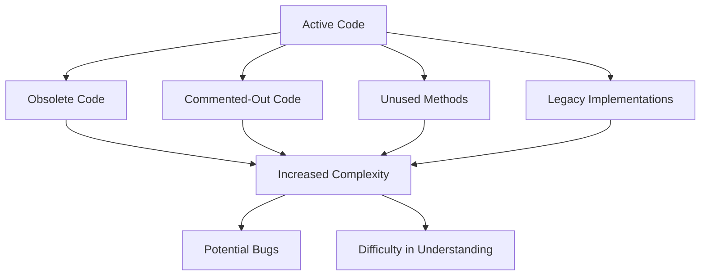

## 9.2.8 Lava Flow

In the realm of software development, maintaining a clean and efficient codebase is crucial for long-term success. However, one of the common pitfalls that developers encounter is the accumulation of outdated or unused code, known as the "Lava Flow" anti-pattern. This section delves into the nature of Lava Flow, its origins, the challenges it poses, and strategies to combat it effectively.

### Understanding the Lava Flow Anti-Pattern

The term "Lava Flow" is derived from the geological phenomenon where molten lava flows slowly and eventually hardens into rock. Similarly, in software development, code that was once fluid and adaptable can become rigid and obsolete over time. This often happens when code is hastily written to meet deadlines, poorly documented, or left untouched due to the fear of breaking something unknown.

#### How Lava Flow Develops

Lava Flow typically accumulates in a codebase due to several factors:

1. **Rushed Development**: In the fast-paced world of software development, teams often prioritize delivering features quickly over maintaining clean code. This can lead to temporary solutions or "quick fixes" that are never revisited or cleaned up.

2. **Poor Documentation**: Without proper documentation, developers may hesitate to remove or refactor code, fearing unintended consequences. This leads to a buildup of unused or redundant code.

3. **Fear of Unknown Code**: Developers may be reluctant to delete code they don't fully understand, especially if it was written by someone else. This fear of the unknown can cause obsolete code to linger indefinitely.

4. **Lack of Ownership**: When no one takes responsibility for maintaining a particular section of the codebase, it can become neglected and cluttered over time.

### Negative Consequences of Lava Flow

The presence of Lava Flow in a codebase can have several detrimental effects:

- **Increased Complexity and Code Size**: As obsolete code accumulates, the overall complexity and size of the codebase increase. This makes it more challenging to navigate and understand, especially for new developers.

- **Potential for Bugs**: Unused code can interfere with active code, leading to unexpected behavior or bugs. This is particularly true if the obsolete code is inadvertently executed or interacts with current functionality.

- **Difficulty in Understanding**: For new developers or team members, a cluttered codebase can be overwhelming. It becomes difficult to discern which parts of the code are relevant and which are not, slowing down onboarding and development processes.

### Examples of Lava Flow in Java Projects

Lava Flow can manifest in various forms within Java projects:

- **Unused Classes and Methods**: Classes or methods that are no longer called or referenced but remain in the codebase.

- **Commented-Out Code**: Code that has been commented out with the intention of being removed later but is never revisited.

- **Redundant Code**: Duplicate or similar code blocks that serve no purpose but to clutter the codebase.

- **Legacy Code**: Code that was once necessary but has been replaced by newer implementations, yet still exists in the project.

Here's an example of Lava Flow in a Java project:

```java
public class UserManager {

    // This method was replaced by a more efficient implementation
    // but remains in the codebase.
    public void addUserLegacy(String username) {
        // Legacy code
        System.out.println("Adding user: " + username);
    }

    // New implementation
    public void addUser(String username) {
        // Current code
        System.out.println("User " + username + " added successfully.");
    }

    // Commented-out code that should be removed
    /*
    public void removeUser(String username) {
        // Code to remove user
    }
    */
}
```

### Strategies to Prevent and Eliminate Lava Flows

To maintain a clean and efficient codebase, it's essential to adopt strategies that prevent and eliminate Lava Flows:

1. **Regular Code Reviews and Refactoring**: Conduct regular code reviews to identify and remove unused code. Refactoring should be a continuous process to ensure the codebase remains clean and efficient.

2. **Use Version Control Systems**: Leverage version control systems like Git to safely delete code. Knowing that code can be retrieved if necessary provides confidence to remove obsolete sections.

3. **Implement Thorough Testing**: Ensure that comprehensive tests are in place to verify that removing code does not affect functionality. This includes unit tests, integration tests, and regression tests.

4. **Encourage a Culture of Code Cleanliness**: Foster a team culture that values clean code and ongoing maintenance. Encourage developers to take ownership of the code they write and maintain.

5. **Document Code Changes**: Maintain clear documentation of code changes and the reasons behind them. This helps future developers understand the codebase and reduces the fear of removing unknown code.

6. **Automate Code Quality Checks**: Use tools like SonarQube or Checkstyle to automate code quality checks. These tools can help identify unused code and other potential issues.

### Benefits of a Leaner Codebase

By actively managing and eliminating Lava Flows, a codebase can achieve several benefits:

- **Improved Readability**: A cleaner codebase is easier to read and understand, making it more accessible to new developers and team members.

- **Easier Navigation**: With less clutter, developers can navigate the codebase more efficiently, leading to faster development and debugging.

- **Reduced Maintenance Costs**: A leaner codebase requires less maintenance, reducing the time and resources needed to manage it.

- **Enhanced Performance**: Removing unused code can lead to performance improvements, as there is less code to compile and execute.

### Visualizing Lava Flow in Codebases

To better understand the impact of Lava Flow, let's visualize how it can clutter a codebase:



**Diagram Description**: This flowchart illustrates how active code can become cluttered with obsolete, commented-out, unused, and legacy code, leading to increased complexity, potential bugs, and difficulty in understanding the codebase.

### Try It Yourself

To gain hands-on experience with managing Lava Flow, try the following exercise:

1. **Identify Unused Code**: Take a look at one of your Java projects and identify any unused classes, methods, or commented-out code.

2. **Refactor the Codebase**: Remove the identified unused code, ensuring that you have adequate tests in place to verify that functionality is not affected.

3. **Document Changes**: Document the changes you made and the reasons for removing the code. This will help maintain clarity for future developers.

4. **Commit Changes to Version Control**: Use your version control system to commit the changes, providing a clear commit message that explains the refactoring.

By practicing these steps, you'll develop a keen eye for identifying and managing Lava Flow in your projects.

### Knowledge Check

Before we conclude, let's reinforce our understanding of the Lava Flow anti-pattern with a few questions:

- What are the primary causes of Lava Flow in a codebase?
- How can version control systems help in managing Lava Flow?
- What are the benefits of maintaining a leaner codebase?

### Embrace the Journey

Remember, maintaining a clean and efficient codebase is an ongoing journey. As you progress in your software development career, you'll encounter various challenges, including Lava Flow. By adopting the strategies outlined in this section, you'll be better equipped to manage and eliminate code clutter, leading to more maintainable and scalable projects. Keep experimenting, stay curious, and enjoy the journey!

## Quiz Time!



### What is the primary cause of the Lava Flow anti-pattern?

- [x] Rushed development and poor documentation
- [ ] Lack of testing
- [ ] Overuse of design patterns
- [ ] Excessive commenting

> **Explanation:** Rushed development and poor documentation often lead to the accumulation of obsolete code, contributing to the Lava Flow anti-pattern.


### Which of the following is a consequence of Lava Flow?

- [x] Increased complexity and code size
- [ ] Improved performance
- [ ] Enhanced readability
- [ ] Simplified navigation

> **Explanation:** Lava Flow increases complexity and code size, making the codebase harder to navigate and understand.


### How can version control systems help manage Lava Flow?

- [x] By allowing safe deletion of code with the ability to retrieve it later
- [ ] By automatically refactoring code
- [ ] By generating documentation
- [ ] By enforcing coding standards

> **Explanation:** Version control systems enable developers to safely delete obsolete code, knowing it can be retrieved if necessary.


### What is a common form of Lava Flow in Java projects?

- [x] Unused classes and methods
- [ ] Overloaded constructors
- [ ] Excessive use of interfaces
- [ ] Dynamic proxies

> **Explanation:** Unused classes and methods are common manifestations of Lava Flow in Java projects.


### Which strategy can help prevent Lava Flow?

- [x] Regular code reviews and refactoring
- [ ] Increasing the number of developers
- [ ] Adding more comments to the code
- [ ] Using more design patterns

> **Explanation:** Regular code reviews and refactoring help identify and remove unused code, preventing Lava Flow.


### What is the benefit of a leaner codebase?

- [x] Improved readability and easier navigation
- [ ] Increased code size
- [ ] More complex logic
- [ ] Higher maintenance costs

> **Explanation:** A leaner codebase is easier to read and navigate, reducing maintenance costs.


### How can thorough testing help in managing Lava Flow?

- [x] By ensuring that removing code does not affect functionality
- [ ] By increasing code complexity
- [ ] By generating more code
- [ ] By reducing the need for documentation

> **Explanation:** Thorough testing ensures that removing obsolete code does not impact the application's functionality.


### What role does documentation play in managing Lava Flow?

- [x] It helps future developers understand the codebase
- [ ] It increases code complexity
- [ ] It eliminates the need for testing
- [ ] It automatically removes unused code

> **Explanation:** Documentation provides clarity and understanding, reducing the fear of removing unknown code.


### Why is it important to encourage a culture of code cleanliness?

- [x] To foster responsibility and ongoing maintenance
- [ ] To increase code size
- [ ] To reduce testing efforts
- [ ] To avoid using design patterns

> **Explanation:** Encouraging a culture of code cleanliness promotes responsibility and ongoing maintenance, preventing Lava Flow.


### True or False: Lava Flow can lead to potential bugs if obsolete code interferes with active code.

- [x] True
- [ ] False

> **Explanation:** True, obsolete code can interfere with active code, leading to potential bugs.


