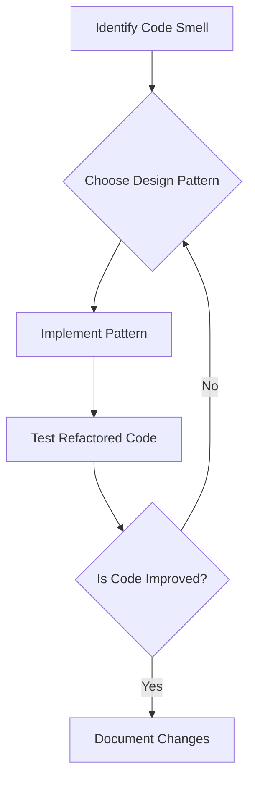

## 9.3.2 Applying Design Patterns in Refactoring

Refactoring is a crucial process in software development that involves restructuring existing code without changing its external behavior. The goal is to improve the code's structure, readability, and maintainability. Design patterns, which are proven solutions to common design problems, can play a significant role in refactoring by providing a framework for addressing design issues effectively.

### Understanding Design Patterns in Refactoring

Design patterns are not just about code reuse; they encapsulate best practices and provide a shared language for developers to communicate complex design ideas succinctly. When applied during refactoring, design patterns can transform a tangled codebase into a more modular, flexible, and understandable system.

#### Benefits of Applying Design Patterns in Refactoring

1. **Improved Modularity and Flexibility**: Design patterns help break down monolithic code structures into smaller, more manageable components. This modularity facilitates easier updates and extensions.

2. **Easier Maintenance and Extension**: By organizing code into well-defined patterns, developers can more easily identify where changes need to be made, reducing the risk of introducing bugs.

3. **Enhanced Readability and Communication**: Patterns provide a common vocabulary that makes it easier for teams to understand and discuss the architecture of a system.

### Refactoring Scenarios with Design Patterns

Let's explore some common refactoring scenarios where design patterns can be particularly beneficial.

#### Replacing Conditional Logic with the Strategy Pattern

Conditional logic can often lead to complex and hard-to-maintain code. The Strategy pattern provides a way to define a family of algorithms, encapsulate each one, and make them interchangeable.

**Before Refactoring:**

```java
public class PaymentProcessor {
    public void processPayment(String paymentType) {
        if (paymentType.equals("CreditCard")) {
            // Process credit card payment
        } else if (paymentType.equals("PayPal")) {
            // Process PayPal payment
        } else if (paymentType.equals("Bitcoin")) {
            // Process Bitcoin payment
        }
    }
}
```

**After Refactoring with Strategy Pattern:**

```java
// Strategy Interface
interface PaymentStrategy {
    void pay();
}

// Concrete Strategies
class CreditCardPayment implements PaymentStrategy {
    public void pay() {
        // Process credit card payment
    }
}

class PayPalPayment implements PaymentStrategy {
    public void pay() {
        // Process PayPal payment
    }
}

class BitcoinPayment implements PaymentStrategy {
    public void pay() {
        // Process Bitcoin payment
    }
}

// Context
public class PaymentProcessor {
    private PaymentStrategy strategy;

    public PaymentProcessor(PaymentStrategy strategy) {
        this.strategy = strategy;
    }

    public void processPayment() {
        strategy.pay();
    }
}
```

**Try It Yourself**: Experiment by adding a new payment method, such as `ApplePayPayment`, and see how easily it integrates into the existing structure.

#### Simplifying Complex Inheritance with Composition and the Decorator Pattern

Inheritance can lead to rigid and complex hierarchies. The Decorator pattern, which favors composition over inheritance, allows for dynamic behavior extension.

**Before Refactoring:**

```java
public class Coffee {
    public double cost() {
        return 5.0;
    }
}

public class MilkCoffee extends Coffee {
    public double cost() {
        return super.cost() + 1.5;
    }
}

public class SugarMilkCoffee extends MilkCoffee {
    public double cost() {
        return super.cost() + 0.5;
    }
}
```

**After Refactoring with Decorator Pattern:**

```java
// Component Interface
interface Coffee {
    double cost();
}

// Concrete Component
class SimpleCoffee implements Coffee {
    public double cost() {
        return 5.0;
    }
}

// Decorator
abstract class CoffeeDecorator implements Coffee {
    protected Coffee coffee;

    public CoffeeDecorator(Coffee coffee) {
        this.coffee = coffee;
    }

    public double cost() {
        return coffee.cost();
    }
}

// Concrete Decorators
class MilkDecorator extends CoffeeDecorator {
    public MilkDecorator(Coffee coffee) {
        super(coffee);
    }

    public double cost() {
        return super.cost() + 1.5;
    }
}

class SugarDecorator extends CoffeeDecorator {
    public SugarDecorator(Coffee coffee) {
        super(coffee);
    }

    public double cost() {
        return super.cost() + 0.5;
    }
}
```

**Try It Yourself**: Add a new decorator, such as `VanillaDecorator`, and apply it to a `SimpleCoffee` to see how the cost changes.

#### Encapsulating Object Creation with Factory Patterns

Direct instantiation of objects can lead to tight coupling. Factory patterns provide a way to encapsulate object creation, promoting loose coupling.

**Before Refactoring:**

```java
public class NotificationService {
    public void sendNotification(String type) {
        if (type.equals("Email")) {
            new EmailNotification().send();
        } else if (type.equals("SMS")) {
            new SMSNotification().send();
        }
    }
}
```

**After Refactoring with Factory Method Pattern:**

```java
// Product Interface
interface Notification {
    void send();
}

// Concrete Products
class EmailNotification implements Notification {
    public void send() {
        // Send email notification
    }
}

class SMSNotification implements Notification {
    public void send() {
        // Send SMS notification
    }
}

// Creator
abstract class NotificationFactory {
    public abstract Notification createNotification();

    public void sendNotification() {
        Notification notification = createNotification();
        notification.send();
    }
}

// Concrete Creators
class EmailNotificationFactory extends NotificationFactory {
    public Notification createNotification() {
        return new EmailNotification();
    }
}

class SMSNotificationFactory extends NotificationFactory {
    public Notification createNotification() {
        return new SMSNotification();
    }
}
```

**Try It Yourself**: Implement a new `PushNotificationFactory` and see how it fits into the existing factory structure.

### Visualizing the Refactoring Process

Below is a flowchart illustrating the refactoring process using design patterns:



### Avoiding Overuse of Design Patterns

While design patterns offer numerous benefits, it's essential to avoid overusing them. Applying a pattern without a justified need can lead to unnecessary complexity. Always consider whether a pattern genuinely addresses the design issue at hand.

### Thoughtful Consideration of Patterns

When refactoring, carefully evaluate which pattern best suits the specific problem. Consider factors such as the pattern's intent, the complexity it introduces, and how it aligns with the overall architecture.

### Evolving Codebase Towards Better Architecture

Design patterns play a pivotal role in evolving a codebase towards a more robust architecture. By systematically applying patterns during refactoring, developers can incrementally improve the design, making the system more adaptable to future changes.

### Knowledge Check

- **What is the primary goal of refactoring?**
- **How can the Strategy pattern help in refactoring conditional logic?**
- **What are the benefits of using the Decorator pattern over inheritance?**
- **Why is it important to encapsulate object creation with Factory patterns?**
- **How can overusing design patterns negatively impact a codebase?**

### Conclusion

Refactoring with design patterns is a powerful approach to improving software design. By understanding and applying the right patterns, developers can enhance code modularity, flexibility, and readability, ultimately leading to a more maintainable and scalable system. Remember, this is just the beginning. As you progress, you'll build more complex and interactive systems. Keep experimenting, stay curious, and enjoy the journey!

## Quiz Time!



### What is the primary benefit of using design patterns during refactoring?

- [x] They provide tested solutions to common design problems.
- [ ] They increase the complexity of the code.
- [ ] They make the code harder to understand.
- [ ] They are only useful for new projects.

> **Explanation:** Design patterns offer proven solutions to common design issues, making code more modular and maintainable.

### How does the Strategy pattern improve code structure?

- [x] By replacing conditional logic with interchangeable algorithms.
- [ ] By increasing the number of classes.
- [ ] By adding more inheritance.
- [ ] By making code less readable.

> **Explanation:** The Strategy pattern encapsulates algorithms, allowing them to be interchangeable, thus simplifying conditional logic.

### What is a key advantage of the Decorator pattern?

- [x] It allows dynamic behavior extension without modifying existing code.
- [ ] It simplifies the code by reducing the number of classes.
- [ ] It increases the coupling between classes.
- [ ] It requires complex inheritance hierarchies.

> **Explanation:** The Decorator pattern uses composition to add behavior dynamically, avoiding the need for complex inheritance.

### Why is encapsulating object creation important?

- [x] It reduces coupling and enhances flexibility.
- [ ] It makes the code more rigid.
- [ ] It complicates the object creation process.
- [ ] It is only necessary for large projects.

> **Explanation:** Encapsulating object creation with Factory patterns reduces coupling and makes the system more adaptable.

### What should be considered before applying a design pattern?

- [x] Whether it genuinely addresses the design issue.
- [ ] If it will increase the number of lines of code.
- [ ] If it will make the code more complex.
- [ ] If it is the most popular pattern.

> **Explanation:** It's crucial to ensure that a pattern is applied only when it effectively solves a design problem.

### How can overusing design patterns negatively impact a codebase?

- [x] By introducing unnecessary complexity.
- [ ] By making the code more readable.
- [ ] By increasing modularity.
- [ ] By reducing the number of classes.

> **Explanation:** Overuse of patterns can lead to complexity that outweighs their benefits, making the code harder to manage.

### What is the role of design patterns in evolving a codebase?

- [x] They guide the codebase towards better architecture.
- [ ] They make the codebase more rigid.
- [ ] They increase the number of bugs.
- [ ] They are only useful for legacy systems.

> **Explanation:** Design patterns help in systematically improving the architecture, making the codebase more robust.

### What is a common pitfall when using design patterns?

- [x] Applying them without a justified need.
- [ ] Making the code more modular.
- [ ] Enhancing code readability.
- [ ] Improving maintainability.

> **Explanation:** Patterns should only be used when they address a specific design issue to avoid unnecessary complexity.

### What is the main goal of refactoring?

- [x] To improve the code's structure and maintainability.
- [ ] To add new features to the code.
- [ ] To increase the code's complexity.
- [ ] To make the code run faster.

> **Explanation:** Refactoring aims to enhance the code's structure and maintainability without altering its external behavior.

### True or False: Design patterns should be applied to every part of a codebase.

- [ ] True
- [x] False

> **Explanation:** Design patterns should be applied judiciously, only where they solve specific design problems effectively.


