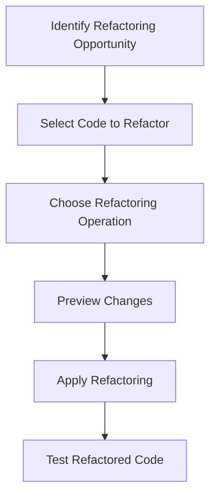

## 9.3.3 Tools for Refactoring in Java

Refactoring is a critical practice in software development that involves restructuring existing code without altering its external behavior. This process is essential for maintaining code quality, improving readability, and ensuring scalability. In the Java ecosystem, several tools and Integrated Development Environments (IDEs) offer robust support for refactoring tasks, minimizing the risk of introducing errors and enhancing developer productivity. In this section, we will explore the importance of refactoring tools, delve into the capabilities of popular Java IDEs, and discuss additional tools that can aid in identifying and implementing refactoring opportunities.

### The Importance of Refactoring Tools

Refactoring tools are indispensable for developers aiming to maintain clean and efficient codebases. These tools automate repetitive and error-prone tasks, allowing developers to focus on higher-level design improvements. By leveraging refactoring tools, developers can:

- **Ensure Code Integrity**: Automated tools maintain references and dependencies, reducing the likelihood of introducing bugs during refactoring.
- **Enhance Productivity**: Automating mundane tasks allows developers to spend more time on creative problem-solving.
- **Facilitate Collaboration**: Consistent code quality and structure make it easier for teams to collaborate and onboard new members.
- **Support Continuous Improvement**: Regular refactoring with the aid of tools helps in keeping the codebase adaptable to changing requirements.

### Popular Java IDEs and Their Refactoring Capabilities

Java developers have access to several powerful IDEs that offer built-in refactoring features. Let's explore the capabilities of some of the most popular ones:

#### IntelliJ IDEA

IntelliJ IDEA is renowned for its intelligent code analysis and refactoring capabilities. It offers a comprehensive suite of refactoring tools that streamline the development process:

- **Rename Refactoring**: Easily rename variables, methods, and classes across the entire codebase while maintaining all references.
- **Extract Method/Class**: Simplify complex methods by extracting parts of the code into new methods or classes.
- **Inline Variable/Method**: Replace a variable or method with its value or implementation throughout the codebase.
- **Move/Copy Classes and Interfaces**: Reorganize code by moving or copying classes and interfaces to different packages.
- **Change Method Signature**: Modify method parameters and return types while updating all calls to the method.

IntelliJ IDEA also provides a powerful preview feature that shows the impact of refactoring changes before they are applied, ensuring that developers can make informed decisions.

#### Eclipse

Eclipse is another widely used IDE that offers a robust set of refactoring tools. Its refactoring capabilities include:

- **Rename**: Change the names of variables, methods, and classes with automatic updates to all references.
- **Extract Method**: Create new methods from selected code blocks to improve readability and reuse.
- **Inline**: Replace method calls or variable references with their actual content.
- **Move**: Relocate classes, methods, or fields to different packages or classes.
- **Refactor Menu**: A centralized menu that provides access to various refactoring operations, enhancing ease of use.

Eclipse's refactoring tools are integrated with its code analysis features, providing real-time feedback on potential issues and improvements.

#### NetBeans

NetBeans offers a user-friendly interface with a range of refactoring tools designed to improve code quality:

- **Rename**: Update names of code elements with automatic adjustments to all occurrences.
- **Extract Method/Variable**: Simplify complex code by extracting methods or variables.
- **Encapsulate Fields**: Automatically generate getter and setter methods for class fields.
- **Introduce Parameter**: Convert local variables to method parameters to increase method flexibility.
- **Change Method Parameters**: Adjust method signatures with ease, updating all related calls.

NetBeans also supports refactoring previews, allowing developers to review changes before applying them.

### Common Refactoring Operations Supported by IDEs

Refactoring operations are essential for maintaining and improving code quality. Here are some common operations supported by IDEs:

- **Rename Variables, Methods, and Classes**: This operation updates all references to a renamed element, ensuring consistency across the codebase.
  
  ```java
  // Before refactoring
  int a = calculateArea(length, width);
  
  // After refactoring
  int area = calculateArea(length, width);
  ```

- **Extract Methods or Classes**: This operation helps in breaking down large methods into smaller, more manageable pieces, improving readability and reusability.

  ```java
  // Before refactoring
  public void processOrder(Order order) {
      // Code to validate order
      // Code to calculate total
      // Code to apply discounts
  }
  
  // After refactoring
  public void processOrder(Order order) {
      validateOrder(order);
      calculateTotal(order);
      applyDiscounts(order);
  }
  ```

- **Inline Variables or Methods**: This operation replaces a variable or method with its value or implementation, reducing unnecessary indirection.

  ```java
  // Before refactoring
  int result = multiply(a, b);
  
  // After refactoring
  int result = a * b;
  ```

- **Move or Copy Classes and Interfaces**: This operation allows developers to reorganize code by moving or copying classes and interfaces to different packages, improving modularity.

- **Change Method Signatures**: This operation enables developers to modify method parameters and return types, updating all calls to the method to reflect the changes.

### Maintaining Code References and Dependencies

One of the key advantages of using refactoring tools is their ability to maintain code references and dependencies. These tools automatically update all occurrences of a refactored element, ensuring that the codebase remains consistent and error-free. This capability is particularly important in large codebases where manual updates would be time-consuming and error-prone.

### Static Code Analysis Tools and Plugins

In addition to IDEs, static code analysis tools and plugins play a crucial role in identifying code smells and suggesting refactoring opportunities. Some popular tools include:

- **SonarLint**: A plugin that provides real-time feedback on code quality issues directly within the IDE. It highlights code smells, bugs, and security vulnerabilities, offering suggestions for improvement.

- **PMD**: A static code analysis tool that scans Java code for potential issues such as unused variables, empty catch blocks, and overly complex methods. PMD can be integrated into build processes to enforce coding standards.

- **Checkstyle**: A tool that checks Java code against a set of coding standards, helping developers maintain consistent code quality across projects.

These tools complement IDE refactoring features by providing additional insights into code quality and potential improvement areas.

### Automated Refactoring Libraries and Frameworks

Automated refactoring libraries and frameworks can be integrated into build processes to streamline refactoring tasks. These tools automate repetitive refactoring operations, allowing developers to focus on more complex design improvements. Some notable tools include:

- **JRebel**: A Java development tool that allows developers to see code changes instantly without restarting the application. While not a traditional refactoring tool, JRebel enhances the development workflow by reducing turnaround time.

- **Lombok**: A Java library that reduces boilerplate code by generating common methods such as getters, setters, and equals/hashCode at compile time. Lombok simplifies code maintenance and refactoring by minimizing repetitive code.

### Refactoring Workflows Using IDE Features

To illustrate the power of IDE refactoring tools, let's walk through a typical refactoring workflow using IntelliJ IDEA:

1. **Identify the Refactoring Opportunity**: Use static code analysis tools like SonarLint to identify code smells or areas for improvement.

2. **Select the Code to Refactor**: Highlight the code segment you wish to refactor. For example, a long method that can be broken down into smaller methods.

3. **Choose the Refactoring Operation**: Right-click the selected code and choose the appropriate refactoring operation from the context menu. For instance, select "Extract Method" to create a new method from the highlighted code.

4. **Preview Changes**: Review the refactoring preview to understand the impact of the changes. IntelliJ IDEA provides a detailed preview showing all affected code segments.

5. **Apply Refactoring**: Once satisfied with the preview, apply the refactoring changes. The IDE will automatically update all references and dependencies.

6. **Test the Refactored Code**: Run unit tests to ensure that the refactored code behaves as expected and no new issues have been introduced.

### Try It Yourself

To get hands-on experience with refactoring tools, try the following exercise:

- **Exercise**: Open a Java project in your preferred IDE (IntelliJ IDEA, Eclipse, or NetBeans). Identify a method that can be improved by extracting smaller methods. Use the IDE's refactoring tools to perform the extraction and observe how the IDE maintains code references.

- **Experiment**: Modify the extracted methods to introduce new functionality. Use the IDE's refactoring tools to rename methods or change method signatures, and observe how the changes propagate throughout the codebase.

### Encouraging Proficiency with Refactoring Tools

Becoming proficient with refactoring tools is essential for enhancing productivity and code quality. Here are some tips to help you master these tools:

- **Explore IDE Documentation**: Familiarize yourself with the refactoring features offered by your IDE by exploring its documentation and tutorials.

- **Practice Regularly**: Incorporate refactoring into your daily development routine to build muscle memory and confidence with the tools.

- **Attend Workshops and Training**: Participate in workshops or training sessions focused on refactoring and code quality to learn best practices and advanced techniques.

- **Engage with the Community**: Join online forums and communities to share experiences and learn from other developers' refactoring strategies.

### Visualizing Refactoring Processes

To better understand the refactoring process, let's visualize a typical refactoring workflow using a flowchart:



This flowchart illustrates the sequential steps involved in a typical refactoring process, highlighting the importance of careful planning and testing.

### Conclusion

Refactoring is a vital practice for maintaining high-quality Java codebases. By leveraging the powerful refactoring tools available in popular IDEs and complementing them with static code analysis tools, developers can efficiently improve code structure and readability while minimizing the risk of introducing errors. Mastering these tools not only enhances productivity but also fosters a culture of continuous improvement and collaboration within development teams.

## Quiz Time!



### What is the primary benefit of using refactoring tools in Java development?

- [x] Ensuring code integrity by maintaining references and dependencies
- [ ] Increasing code complexity for advanced features
- [ ] Reducing the need for testing after changes
- [ ] Eliminating the need for code reviews

> **Explanation:** Refactoring tools help maintain code integrity by automatically updating references and dependencies, reducing the risk of errors.


### Which IDE is known for its intelligent code analysis and comprehensive refactoring tools?

- [x] IntelliJ IDEA
- [ ] Visual Studio Code
- [ ] Sublime Text
- [ ] Atom

> **Explanation:** IntelliJ IDEA is renowned for its intelligent code analysis and comprehensive refactoring capabilities.


### What is the purpose of the "Extract Method" refactoring operation?

- [x] To break down large methods into smaller, more manageable pieces
- [ ] To inline all method calls with their implementation
- [ ] To rename methods across the codebase
- [ ] To move methods to different classes

> **Explanation:** The "Extract Method" operation simplifies complex methods by creating new methods from selected code blocks.


### Which tool provides real-time feedback on code quality issues within the IDE?

- [x] SonarLint
- [ ] JRebel
- [ ] Lombok
- [ ] Maven

> **Explanation:** SonarLint provides real-time feedback on code quality issues directly within the IDE.


### What is a key advantage of using static code analysis tools like PMD?

- [x] Identifying potential issues such as unused variables and complex methods
- [ ] Automatically generating code documentation
- [ ] Compiling Java code into bytecode
- [ ] Managing project dependencies

> **Explanation:** Static code analysis tools like PMD identify potential issues in code, such as unused variables and overly complex methods.


### Which refactoring operation involves replacing a variable or method with its value or implementation?

- [x] Inline
- [ ] Extract
- [ ] Rename
- [ ] Move

> **Explanation:** The "Inline" operation replaces a variable or method with its actual content, reducing unnecessary indirection.


### How do refactoring tools help in maintaining code references and dependencies?

- [x] By automatically updating all occurrences of a refactored element
- [ ] By removing all dependencies from the codebase
- [ ] By generating new code without references
- [ ] By converting all code to a single file

> **Explanation:** Refactoring tools automatically update all occurrences of a refactored element, ensuring consistency.


### Which library reduces boilerplate code by generating common methods at compile time?

- [x] Lombok
- [ ] JRebel
- [ ] Checkstyle
- [ ] PMD

> **Explanation:** Lombok reduces boilerplate code by generating methods like getters and setters at compile time.


### What is the role of the "Preview Changes" feature in refactoring tools?

- [x] To show the impact of refactoring changes before they are applied
- [ ] To compile the code after refactoring
- [ ] To automatically deploy changes to production
- [ ] To generate unit tests for refactored code

> **Explanation:** The "Preview Changes" feature allows developers to review the impact of refactoring changes before applying them.


### True or False: Automated refactoring libraries can be integrated into build processes to streamline refactoring tasks.

- [x] True
- [ ] False

> **Explanation:** Automated refactoring libraries can indeed be integrated into build processes, automating repetitive refactoring operations.


