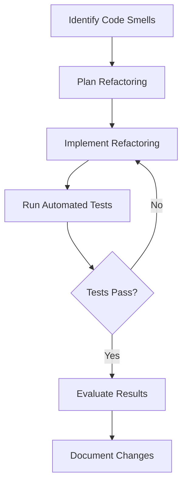

## 9.3 Refactoring Techniques

Refactoring is a critical practice in software development that involves restructuring existing code without changing its external behavior. This process is essential for maintaining code quality, enhancing readability, reducing complexity, and ensuring that the software remains adaptable to future changes. In this section, we will delve into the importance of refactoring, its goals, and how it integrates into the development lifecycle, particularly within agile methodologies. We will also explore common scenarios that necessitate refactoring and the benefits of regular refactoring practices.

### Understanding Refactoring

Refactoring is the process of improving the internal structure of code while preserving its functionality. It is a disciplined technique for cleaning up code that might have become cluttered over time due to various factors such as rushed development, evolving requirements, or lack of initial design foresight. The primary aim of refactoring is to make the codebase more understandable and easier to modify, which in turn reduces the likelihood of introducing bugs when implementing new features.

#### Importance of Refactoring

Refactoring is crucial for several reasons:

- **Improved Readability**: Clean, well-structured code is easier for developers to read and understand, which is vital for effective collaboration and onboarding new team members.
- **Reduced Complexity**: Simplifying complex code structures makes it easier to manage and extend, reducing the cognitive load on developers.
- **Enhanced Maintainability**: By organizing code logically and consistently, refactoring makes it easier to maintain and update the software as requirements change.
- **Facilitating New Features**: A well-refactored codebase allows for the seamless integration of new features without the need for extensive rework.
- **Reduced Technical Debt**: Regular refactoring helps manage and reduce technical debt, which can accumulate over time and hinder development progress.

### Goals of Refactoring

The primary goals of refactoring include:

- **Improving Code Quality**: Refactoring aims to enhance the quality of the code by making it more efficient, readable, and maintainable.
- **Preserving Functionality**: The external behavior of the code should remain unchanged, ensuring that existing features continue to work as expected.
- **Enhancing Flexibility**: By decoupling components and improving modularity, refactoring makes the codebase more adaptable to change.
- **Facilitating Testing**: Clean and well-structured code is easier to test, and refactoring often involves writing or updating tests to ensure continued functionality.

### Refactoring in the Development Lifecycle

Refactoring is not a one-time activity but an ongoing process that should be integrated into the development lifecycle. In agile methodologies, refactoring is often performed iteratively as part of the regular development cycle. This approach ensures that the code remains clean and maintainable as new features are added and requirements evolve.

#### Agile Methodologies and Refactoring

In agile development, refactoring is a continuous activity that aligns with the principles of iterative development and continuous improvement. Agile teams often use techniques such as pair programming and code reviews to identify areas for refactoring. Additionally, agile practices like Test-Driven Development (TDD) and Continuous Integration (CI) provide a safety net for refactoring by ensuring that changes do not break existing functionality.

### Common Scenarios for Refactoring

Several scenarios may necessitate refactoring, including:

- **Code Smells**: Indicators of potential issues in the code, such as duplicated code, long methods, large classes, and complex conditional logic.
- **Changing Requirements**: As software evolves, requirements may change, necessitating modifications to the codebase to accommodate new functionality.
- **Performance Optimization**: Refactoring can help improve performance by optimizing inefficient code paths and reducing resource consumption.
- **Legacy Code Maintenance**: Older codebases may require refactoring to align with modern coding standards and practices.

### Benefits of Regular Refactoring

Regular refactoring offers numerous benefits, including:

- **Easier Implementation of New Features**: A clean and well-organized codebase facilitates the addition of new features without extensive rework.
- **Reduced Technical Debt**: By addressing technical debt regularly, teams can prevent it from accumulating and becoming a barrier to progress.
- **Improved Team Productivity**: Developers can work more efficiently with a codebase that is easy to understand and modify.
- **Increased Code Quality**: Regular refactoring helps maintain high code quality, reducing the likelihood of bugs and errors.

### The Role of Automated Testing in Refactoring

Automated testing plays a crucial role in refactoring by providing a safety net that ensures changes do not introduce new bugs. A robust suite of automated tests allows developers to refactor code with confidence, knowing that any regressions will be quickly identified. Test coverage should be comprehensive, covering both unit tests and integration tests to validate the functionality of the entire system.

### Preparing for Detailed Refactoring Techniques

In the subsequent sections, we will explore specific refactoring techniques in detail. These techniques will provide practical guidance on how to identify and address common code issues, improve code structure, and enhance maintainability. By mastering these techniques, developers can ensure their code remains clean, efficient, and adaptable to future changes.

### Try It Yourself

To get hands-on experience with refactoring, try the following exercise:

1. **Identify Code Smells**: Review a piece of code you have written or have access to and identify any code smells, such as duplicated code or long methods.
2. **Plan Refactoring**: Determine which refactoring techniques could be applied to address the identified issues.
3. **Implement Refactoring**: Apply the chosen refactoring techniques, ensuring that you have a suite of tests to verify the code's functionality.
4. **Evaluate Results**: Assess the impact of the refactoring on code readability, complexity, and maintainability.

By regularly practicing refactoring, you will develop a keen eye for identifying code issues and applying effective solutions.

### Visualizing the Refactoring Process

To better understand the refactoring process, consider the following diagram that illustrates the steps involved in refactoring a codebase:

**Diagram Description**: This flowchart represents the refactoring process, starting with identifying code smells, planning and implementing refactoring, running automated tests, evaluating results, and documenting changes.

### Knowledge Check

Before moving on to the next section, consider the following questions to reinforce your understanding of refactoring:

- What are the primary goals of refactoring?
- How does refactoring fit into agile methodologies?
- What role does automated testing play in refactoring?
- What are some common scenarios that necessitate refactoring?

By reflecting on these questions, you can solidify your understanding of the importance and benefits of refactoring in software development.

### Embrace the Journey

Remember, refactoring is an ongoing journey that requires continuous learning and adaptation. As you progress in your software development career, you will encounter new challenges and opportunities to apply refactoring techniques. Keep experimenting, stay curious, and enjoy the journey of creating clean, efficient, and maintainable code.

## Quiz Time!



### What is the primary purpose of refactoring?

- [x] To improve the internal structure of code without changing its external behavior
- [ ] To add new features to the codebase
- [ ] To optimize the code for performance
- [ ] To rewrite the code from scratch

> **Explanation:** Refactoring focuses on improving the internal structure of the code while preserving its external behavior.

### Which of the following is NOT a goal of refactoring?

- [ ] Improving code quality
- [ ] Preserving functionality
- [x] Increasing the number of lines of code
- [ ] Enhancing flexibility

> **Explanation:** Refactoring aims to improve code quality, preserve functionality, and enhance flexibility, not to increase the number of lines of code.

### How does refactoring fit into agile methodologies?

- [x] It is a continuous activity aligned with iterative development and continuous improvement
- [ ] It is performed only at the end of a project
- [ ] It is done only when a major release is planned
- [ ] It is not part of agile methodologies

> **Explanation:** In agile methodologies, refactoring is a continuous activity that aligns with iterative development and continuous improvement.

### What role does automated testing play in refactoring?

- [x] It provides a safety net to ensure changes do not introduce new bugs
- [ ] It is not necessary for refactoring
- [ ] It slows down the refactoring process
- [ ] It is only used for performance testing

> **Explanation:** Automated testing ensures that refactoring does not introduce new bugs by providing a safety net.

### Which scenario might necessitate refactoring?

- [x] Code smells
- [x] Changing requirements
- [ ] Perfectly optimized code
- [x] Legacy code maintenance

> **Explanation:** Refactoring is often necessary in the presence of code smells, changing requirements, and legacy code maintenance.

### What is a benefit of regular refactoring?

- [x] Easier implementation of new features
- [ ] Increased technical debt
- [ ] More complex codebase
- [ ] Reduced team productivity

> **Explanation:** Regular refactoring makes it easier to implement new features and reduces technical debt.

### What is a common indicator of potential code issues?

- [x] Code smells
- [ ] Perfect code structure
- [ ] Complete lack of comments
- [ ] Excessive documentation

> **Explanation:** Code smells are indicators of potential issues in the code.

### What is a key benefit of having a robust suite of automated tests during refactoring?

- [x] It allows developers to refactor code with confidence
- [ ] It eliminates the need for manual testing
- [ ] It increases the complexity of the codebase
- [ ] It ensures all code is perfectly optimized

> **Explanation:** A robust suite of automated tests allows developers to refactor code with confidence, knowing that any regressions will be quickly identified.

### What should be done after implementing refactoring?

- [x] Run automated tests
- [ ] Ignore the changes
- [ ] Immediately deploy to production
- [ ] Delete the original code

> **Explanation:** After implementing refactoring, automated tests should be run to ensure the changes do not introduce new bugs.

### Refactoring is a one-time activity in the development lifecycle.

- [ ] True
- [x] False

> **Explanation:** Refactoring is an ongoing process that should be integrated into the development lifecycle.


