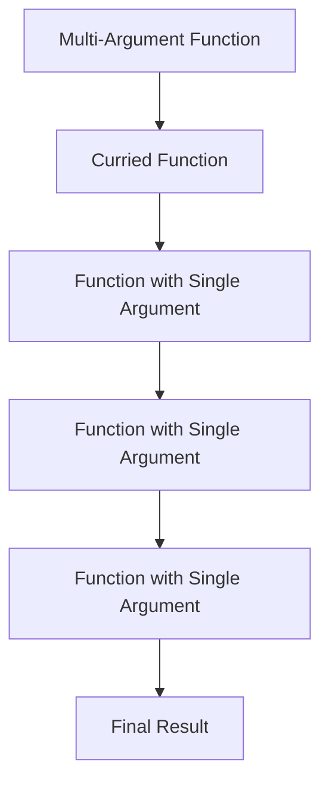

## 9.6.2 Currying with Lambdas

Currying is a powerful concept in functional programming that transforms a function with multiple arguments into a sequence of functions, each taking a single argument. This technique, combined with Java's lambda expressions, can greatly enhance code readability and flexibility. In this section, we will delve into how Java developers can implement currying using lambdas, explore practical applications, and understand the benefits of this approach.

### Understanding Currying

Currying is named after the mathematician Haskell Curry and is a fundamental concept in functional programming languages. It allows a function with multiple parameters to be decomposed into a series of functions, each accepting a single parameter. This transformation enables partial application, where some arguments are fixed, resulting in a new function with fewer parameters.

#### Example of Currying

Consider a simple mathematical function that adds three numbers:

```java
int add(int x, int y, int z) {
    return x + y + z;
}
```

Currying this function would transform it into a series of functions:

```java
Function<Integer, Function<Integer, Function<Integer, Integer>>> curriedAdd =
    x -> y -> z -> x + y + z;
```

In this curried form, `curriedAdd` is a function that takes an integer `x` and returns another function that takes an integer `y`, which in turn returns a function that takes an integer `z` and finally returns the sum `x + y + z`.

### Implementing Currying with Lambdas

Java 8 introduced lambda expressions, which provide a concise way to express instances of single-method interfaces (functional interfaces). Lambdas are ideal for implementing currying because they allow functions to be treated as first-class citizens.

#### Using Functional Interfaces

Java's `Function` interface can represent functions with varying arities. By nesting `Function` interfaces, we can create curried functions.

```java
import java.util.function.Function;

Function<Integer, Function<Integer, Function<Integer, Integer>>> curriedAdd =
    x -> y -> z -> x + y + z;
```

Here, `curriedAdd` is a `Function` that takes an `Integer` and returns another `Function`, which continues this pattern until the final `Integer` is returned.

#### Practical Example: Creating Specialized Functions

Currying is particularly useful for creating specialized functions by fixing certain arguments. For instance, suppose we have a function that calculates the volume of a cuboid:

```java
Function<Integer, Function<Integer, Function<Integer, Integer>>> volume =
    length -> width -> height -> length * width * height;
```

We can create a specialized function for cuboids with a fixed length of 10:

```java
Function<Integer, Function<Integer, Integer>> volumeWithFixedLength = volume.apply(10);
```

Now, `volumeWithFixedLength` is a function that takes `width` and `height` as arguments, simplifying the process of calculating volumes for cuboids with a fixed length.

### Benefits of Currying with Lambdas

Currying with lambdas offers several advantages:

- **Code Reusability**: By transforming functions into curried forms, developers can easily create specialized versions of functions without duplicating code.
- **Improved Readability**: Currying breaks down complex functions into simpler, single-argument functions, making the code easier to understand and maintain.
- **Flexibility**: Currying allows for partial application, enabling developers to fix certain arguments and create new functions dynamically.

### Real-World Applications

Currying is widely used in scenarios where functions need to be customized or reused with different sets of parameters. Some practical applications include:

- **Configuration Functions**: In software configuration, currying can be used to create functions that apply default settings, allowing for easy overrides.
- **Event Handling**: Currying can simplify event handling by creating specialized handlers with pre-configured parameters.
- **Data Processing Pipelines**: In data processing, currying enables the creation of flexible pipelines where certain stages are fixed, and others are dynamic.

### Code Example: Currying in Action

Let's implement a real-world example where currying is used to create a configurable logging function:

```java
import java.util.function.Function;

public class Logger {
    public static void main(String[] args) {
        Function<String, Function<String, Function<String, String>>> logMessage =
            level -> timestamp -> message -> "[" + level + "] " + timestamp + ": " + message;

        // Create a logger with a fixed level of "INFO"
        Function<String, Function<String, String>> infoLogger = logMessage.apply("INFO");

        // Create a logger with a fixed level of "ERROR"
        Function<String, Function<String, String>> errorLogger = logMessage.apply("ERROR");

        // Log an info message
        String infoLog = infoLogger.apply("2024-11-25 10:00:00").apply("Application started");
        System.out.println(infoLog);

        // Log an error message
        String errorLog = errorLogger.apply("2024-11-25 10:05:00").apply("Null pointer exception");
        System.out.println(errorLog);
    }
}
```

In this example, `logMessage` is a curried function that constructs log messages with a specified level, timestamp, and message. By fixing the log level, we create specialized loggers for "INFO" and "ERROR" levels.

### Visualizing Currying with Lambdas

To better understand the flow of currying with lambdas, consider the following diagram illustrating the transformation of a multi-argument function into a curried form:



**Diagram Explanation**: The diagram shows the transformation of a multi-argument function into a series of single-argument functions, each returning another function until the final result is obtained.

### Common Pitfalls and How to Avoid Them

While currying offers many benefits, there are some common pitfalls to be aware of:

- **Overcomplication**: Overusing currying can lead to overly complex code. Use currying judiciously where it adds value.
- **Performance Considerations**: Currying introduces additional function calls, which may impact performance in performance-critical applications. Consider the trade-offs between readability and performance.
- **Type Safety**: Ensure that the types of curried functions are correctly defined to avoid runtime errors.

### Encouraging Experimentation

To fully grasp the power of currying with lambdas, experiment with the provided code examples. Try modifying the functions to see how currying can be applied to different scenarios. Consider creating your own curried functions for tasks you frequently encounter in your projects.

### Conclusion

Currying with lambdas in Java is a powerful technique that enhances code readability, reusability, and flexibility. By transforming multi-argument functions into curried forms, developers can create specialized functions with ease, improving the overall design and maintainability of their code. Embrace currying as a tool in your functional programming toolkit, and explore its potential in your Java applications.

### Key Takeaways

- Currying transforms multi-argument functions into a series of single-argument functions.
- Java's lambda expressions and functional interfaces facilitate currying.
- Currying enables partial application, allowing for the creation of specialized functions.
- Use currying to improve code readability, reusability, and flexibility.
- Be mindful of potential pitfalls, such as overcomplication and performance impacts.

### Further Reading

- [Java Documentation](https://docs.oracle.com/en/java/)
- [Functional Programming in Java](https://www.oracle.com/technical-resources/articles/java/functional-programming.html)
- [Lambda Expressions in Java](https://docs.oracle.com/javase/tutorial/java/javaOO/lambdaexpressions.html)

## Test Your Knowledge: Currying with Lambdas in Java Quiz



### What is the primary benefit of currying in functional programming?

- [x] It transforms a function with multiple arguments into a sequence of single-argument functions.
- [ ] It increases the number of arguments a function can take.
- [ ] It improves the performance of function calls.
- [ ] It simplifies the syntax of lambda expressions.

> **Explanation:** Currying transforms a function with multiple arguments into a sequence of single-argument functions, enabling partial application and specialization.

### How does currying enhance code reusability?

- [x] By allowing the creation of specialized functions with fixed arguments.
- [ ] By reducing the number of functions needed in a program.
- [ ] By eliminating the need for lambda expressions.
- [ ] By increasing the complexity of function signatures.

> **Explanation:** Currying allows developers to fix certain arguments, creating specialized functions that can be reused in different contexts.

### Which Java feature is essential for implementing currying?

- [x] Lambda expressions
- [ ] Generics
- [ ] Annotations
- [ ] Reflection

> **Explanation:** Lambda expressions provide a concise way to implement currying by allowing functions to be treated as first-class citizens.

### What is a potential drawback of using currying excessively?

- [x] Overcomplication of code
- [ ] Improved performance
- [ ] Increased readability
- [ ] Simplified function signatures

> **Explanation:** Overusing currying can lead to overly complex code, making it harder to understand and maintain.

### In the provided example, what does the `infoLogger` function do?

- [x] It logs messages with a fixed "INFO" level.
- [ ] It logs messages with a fixed "ERROR" level.
- [ ] It logs messages with a dynamic level.
- [ ] It logs messages without a timestamp.

> **Explanation:** The `infoLogger` function is a specialized logger with a fixed "INFO" level, created by currying the `logMessage` function.

### What is partial application in the context of currying?

- [x] Fixing some arguments of a function to create a new function with fewer parameters.
- [ ] Applying all arguments of a function at once.
- [ ] Reducing the number of arguments a function can take.
- [ ] Eliminating the need for function arguments.

> **Explanation:** Partial application involves fixing some arguments of a function, resulting in a new function with fewer parameters.

### How can currying improve code readability?

- [x] By breaking down complex functions into simpler, single-argument functions.
- [ ] By increasing the number of function calls.
- [ ] By reducing the number of lines of code.
- [ ] By eliminating the need for comments.

> **Explanation:** Currying simplifies complex functions into a series of single-argument functions, making the code easier to understand and maintain.

### What is the role of the `Function` interface in currying?

- [x] It represents functions with varying arities in Java.
- [ ] It provides default implementations for curried functions.
- [ ] It eliminates the need for lambda expressions.
- [ ] It simplifies the creation of multi-argument functions.

> **Explanation:** The `Function` interface is used to represent functions with varying arities, allowing for the implementation of curried functions in Java.

### Which of the following is a real-world application of currying?

- [x] Creating specialized event handlers with pre-configured parameters.
- [ ] Reducing the number of classes in a program.
- [ ] Eliminating the need for functional interfaces.
- [ ] Increasing the complexity of data processing pipelines.

> **Explanation:** Currying can be used to create specialized event handlers with pre-configured parameters, simplifying event handling in applications.

### True or False: Currying can only be used in functional programming languages.

- [ ] True
- [x] False

> **Explanation:** Currying is a concept from functional programming, but it can be implemented in any language that supports first-class functions, including Java.


