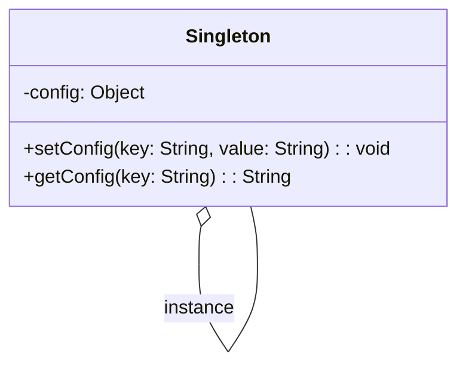
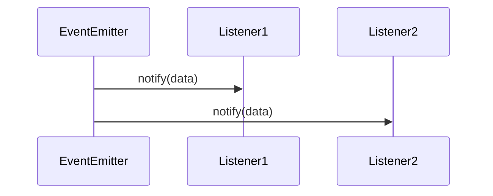

## 1.1 What Are Design Patterns in JavaScript?

Design patterns are a crucial concept in software engineering, offering reusable solutions to common problems encountered during software development. In the context of JavaScript, design patterns help developers write clean, efficient, and maintainable code. This section will delve into the definition, history, and significance of design patterns, particularly in JavaScript, and illustrate their application through examples.

### Definition of Design Patterns

Design patterns are standardized solutions to recurring design problems in software development. They represent best practices refined over time by experienced developers and are categorized into three main types: creational, structural, and behavioral patterns. Each pattern addresses a specific problem and provides a template for solving it, allowing developers to apply these solutions to their own code.

### History and Origin of Design Patterns

The concept of design patterns originated in the field of architecture, introduced by Christopher Alexander in the 1970s. Alexander's work focused on identifying patterns in building design that could be reused to solve architectural problems. This idea was later adapted to software engineering by the "Gang of Four" (Erich Gamma, Richard Helm, Ralph Johnson, and John Vlissides) in their seminal book, "Design Patterns: Elements of Reusable Object-Oriented Software," published in 1994. The book cataloged 23 design patterns, providing a foundation for modern software design.

### Relevance of Design Patterns to JavaScript Developers

JavaScript, being a versatile and widely-used language for web development, benefits greatly from the application of design patterns. These patterns help developers manage the complexity of JavaScript applications, especially as they scale. By using design patterns, developers can:

- **Enhance Code Reusability**: Patterns provide a proven template for solving problems, reducing the need to reinvent the wheel.
- **Improve Code Maintainability**: Patterns promote clean and organized code, making it easier to understand and modify.
- **Facilitate Communication**: Patterns serve as a common language among developers, improving collaboration and understanding.
- **Encourage Best Practices**: Patterns embody best practices, guiding developers towards efficient and effective solutions.

### Examples of Design Patterns Solving Recurring Problems

Let's explore some common design patterns in JavaScript and how they address typical development challenges.

#### The Singleton Pattern

**Intent**: Ensure a class has only one instance and provide a global point of access to it.

**Example**: Managing a single configuration object across an application.

```javascript
class Singleton {
  constructor() {
    if (!Singleton.instance) {
      this.config = {};
      Singleton.instance = this;
    }
    return Singleton.instance;
  }

  setConfig(key, value) {
    this.config[key] = value;
  }

  getConfig(key) {
    return this.config[key];
  }
}

const instance1 = new Singleton();
const instance2 = new Singleton();

instance1.setConfig('theme', 'dark');

console.log(instance2.getConfig('theme')); // Output: dark
```

> **Explanation**: The Singleton pattern ensures that `instance1` and `instance2` are the same instance, sharing the same configuration object.

#### The Observer Pattern

**Intent**: Define a one-to-many dependency between objects so that when one object changes state, all its dependents are notified and updated automatically.

**Example**: Implementing a simple event system.

```javascript
class EventEmitter {
  constructor() {
    this.events = {};
  }

  on(event, listener) {
    if (!this.events[event]) {
      this.events[event] = [];
    }
    this.events[event].push(listener);
  }

  emit(event, data) {
    if (this.events[event]) {
      this.events[event].forEach(listener => listener(data));
    }
  }
}

const emitter = new EventEmitter();

emitter.on('dataReceived', (data) => {
  console.log(`Data received: ${data}`);
});

emitter.emit('dataReceived', 'Hello, World!');
```

> **Explanation**: The Observer pattern allows the `EventEmitter` to notify all registered listeners when an event occurs, promoting loose coupling between components.

### The Role of Design Patterns in Writing Clean, Maintainable Code

Design patterns play a vital role in writing code that is not only functional but also clean and maintainable. They provide a structured approach to problem-solving, ensuring that code is organized and easy to understand. By adhering to design patterns, developers can create systems that are flexible and adaptable to change, reducing the risk of introducing bugs when modifying or extending the codebase.

### Visualizing Design Patterns

To better understand how design patterns work, let's visualize the Singleton and Observer patterns using Mermaid.js diagrams.

#### Singleton Pattern Diagram



> **Caption**: This diagram illustrates the Singleton pattern, showing the single instance relationship.

#### Observer Pattern Diagram



> **Caption**: This sequence diagram represents the Observer pattern, depicting how the `EventEmitter` notifies multiple listeners.

### References and Links

For further reading on design patterns, consider exploring the following resources:

- [MDN Web Docs on JavaScript Design Patterns](https://developer.mozilla.org/en-US/docs/Web/JavaScript/Guide/Design_Patterns)
- [W3Schools JavaScript Design Patterns](https://www.w3schools.com/js/js_design_patterns.asp)
- [Refactoring Guru: Design Patterns](https://refactoring.guru/design-patterns)

### Knowledge Check

Let's test your understanding of design patterns in JavaScript with some questions and exercises.

1. **What is the primary purpose of design patterns in software development?**
2. **How does the Singleton pattern ensure a single instance of a class?**
3. **Explain how the Observer pattern promotes loose coupling.**
4. **Try modifying the Singleton example to include a method for removing a configuration key.**
5. **Create a new event in the Observer pattern example and add a listener for it.**

### Embrace the Journey

Remember, mastering design patterns is a journey. As you continue to explore and apply these patterns, you'll find yourself writing more efficient and maintainable code. Keep experimenting, stay curious, and enjoy the process!

### Quiz

## Test Your Knowledge on JavaScript Design Patterns



### What is a design pattern in software development?

- [x] A reusable solution to a common problem in software design
- [ ] A specific programming language feature
- [ ] A type of algorithm
- [ ] A software bug

> **Explanation:** Design patterns are reusable solutions to common problems in software design, not specific language features or algorithms.

### Who introduced the concept of design patterns to software engineering?

- [x] The Gang of Four
- [ ] Christopher Alexander
- [ ] Tim Berners-Lee
- [ ] Brendan Eich

> **Explanation:** The Gang of Four introduced design patterns to software engineering, adapting the concept from Christopher Alexander's work in architecture.

### What is the main benefit of using the Singleton pattern?

- [x] Ensures a class has only one instance
- [ ] Allows multiple instances of a class
- [ ] Improves performance
- [ ] Simplifies code

> **Explanation:** The Singleton pattern ensures a class has only one instance, providing a global point of access to it.

### How does the Observer pattern help in software design?

- [x] It defines a one-to-many dependency between objects
- [ ] It ensures a class has only one instance
- [ ] It simplifies complex interfaces
- [ ] It enhances object functionality

> **Explanation:** The Observer pattern defines a one-to-many dependency, allowing objects to be notified of changes in another object.

### Which of the following is a key characteristic of design patterns?

- [x] They provide a template for solving problems
- [ ] They are specific to JavaScript
- [ ] They are only used in web development
- [ ] They are a type of data structure

> **Explanation:** Design patterns provide a template for solving problems and are not specific to any programming language or domain.

### What is the primary role of design patterns in JavaScript?

- [x] To enhance code reusability and maintainability
- [ ] To improve execution speed
- [ ] To reduce memory usage
- [ ] To simplify syntax

> **Explanation:** Design patterns enhance code reusability and maintainability, making it easier to manage complex applications.

### Which pattern is used to notify multiple objects of a change in another object?

- [x] Observer pattern
- [ ] Singleton pattern
- [ ] Factory pattern
- [ ] Adapter pattern

> **Explanation:** The Observer pattern is used to notify multiple objects of a change in another object.

### What is a common use case for the Singleton pattern?

- [x] Managing a single configuration object
- [ ] Creating multiple instances of a class
- [ ] Simplifying complex interfaces
- [ ] Enhancing object functionality

> **Explanation:** The Singleton pattern is commonly used to manage a single configuration object across an application.

### How do design patterns facilitate communication among developers?

- [x] By providing a common language and understanding
- [ ] By simplifying syntax
- [ ] By reducing code size
- [ ] By improving execution speed

> **Explanation:** Design patterns provide a common language and understanding, improving collaboration among developers.

### True or False: Design patterns are specific to object-oriented programming.

- [ ] True
- [x] False

> **Explanation:** Design patterns are not specific to object-oriented programming; they can be applied in various programming paradigms.


