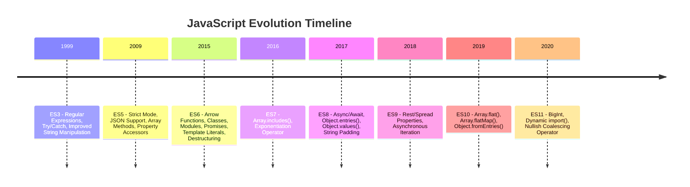

## 1.2 The Evolution of JavaScript: From ES3 to ESNext

JavaScript has undergone a remarkable transformation since its inception, evolving from a simple scripting language to a powerful tool for building complex web applications. This evolution is marked by the introduction of various ECMAScript (ES) versions, each bringing new features and capabilities that have significantly influenced modern coding practices and design patterns. In this section, we will explore the key milestones in JavaScript's evolution, from ES3 to ESNext, and highlight the major features introduced in each version that are relevant to design patterns.

### Key Milestones in JavaScript's Evolution

#### ECMAScript 3 (ES3) - The Foundation

Released in December 1999, ECMAScript 3 (ES3) laid the foundation for JavaScript as we know it today. It introduced several core features that are still in use, including:

- **Regular Expressions**: Provided powerful pattern matching capabilities.
- **Try/Catch Exception Handling**: Enabled robust error handling.
- **Improved String Manipulation**: Enhanced string handling with methods like `split()`, `replace()`, and `match()`.

ES3 set the stage for JavaScript's widespread adoption by standardizing the language and ensuring cross-browser compatibility.

#### ECMAScript 5 (ES5) - The Modernization

Released in December 2009, ECMAScript 5 (ES5) marked a significant step forward in JavaScript's evolution. It introduced several features that improved the language's usability and performance:

- **Strict Mode**: Enabled a stricter parsing and error handling mode to catch common coding mistakes.
- **JSON Support**: Provided native support for JSON parsing and stringification.
- **Array Methods**: Introduced methods like `forEach()`, `map()`, `filter()`, `reduce()`, and `some()`, which facilitated functional programming patterns.
- **Property Accessors**: Allowed the definition of getter and setter functions for object properties.

ES5's enhancements made JavaScript more robust and easier to work with, paving the way for more complex applications.

#### ECMAScript 6 (ES6/ES2015) - The Game Changer

Released in June 2015, ECMAScript 6 (ES6), also known as ECMAScript 2015, was a game changer for JavaScript. It introduced a plethora of new features that revolutionized the language:

- **Arrow Functions**: Provided a concise syntax for writing functions and lexically bound the `this` keyword.
- **Classes**: Introduced a class syntax for object-oriented programming, making it easier to implement design patterns like the Singleton and Factory patterns.
- **Modules**: Enabled modular code organization with `import` and `export` statements, facilitating the use of the Module pattern.
- **Promises**: Simplified asynchronous programming, allowing for cleaner and more manageable code.
- **Template Literals**: Allowed for multi-line strings and embedded expressions, enhancing string manipulation.
- **Destructuring Assignment**: Made it easier to extract values from arrays and objects, improving code readability.

ES6's features have had a profound impact on JavaScript coding practices, making the language more expressive and powerful.

#### ECMAScript 2016 (ES7) and Beyond - Incremental Improvements

Subsequent ECMAScript versions, starting with ECMAScript 2016 (ES7), have continued to build on the foundation laid by ES6, introducing incremental improvements and new features:

- **ES7 (2016)**: Introduced the `Array.prototype.includes()` method and the exponentiation operator (`**`).
- **ES8 (2017)**: Added `async/await` for asynchronous programming, `Object.entries()`, `Object.values()`, and string padding methods.
- **ES9 (2018)**: Brought in rest/spread properties for objects, asynchronous iteration, and improvements to regular expressions.
- **ES10 (2019)**: Introduced `Array.prototype.flat()`, `Array.prototype.flatMap()`, and `Object.fromEntries()`.
- **ES11 (2020)**: Added `BigInt` for handling large integers, dynamic `import()`, and the `nullish coalescing operator` (`??`).

Each new version has introduced features that enhance JavaScript's capabilities, making it easier to implement modern design patterns and build sophisticated applications.

### Visualizing JavaScript's Evolution

To better understand the evolution of JavaScript, let's visualize the key milestones and features introduced in each ECMAScript version using a timeline:



### Impact on Modern JavaScript Coding Practices

The evolution of JavaScript has had a profound impact on modern coding practices and the application of design patterns. Let's explore how some of the key features introduced in recent ECMAScript versions have influenced JavaScript development:

#### Classes and Object-Oriented Programming

The introduction of classes in ES6 has made it easier to implement object-oriented design patterns in JavaScript. Classes provide a more intuitive syntax for creating objects and managing inheritance, making patterns like the Singleton, Factory, and Observer patterns more accessible.

#### Modules and Code Organization

ES6 modules have revolutionized code organization in JavaScript. By allowing developers to split code into reusable modules, they facilitate the implementation of the Module pattern and promote better separation of concerns. This modular approach has become a cornerstone of modern JavaScript development, enabling the creation of scalable and maintainable applications.

#### Arrow Functions and Functional Programming

Arrow functions, introduced in ES6, have simplified the syntax for writing functions and enabled more concise and expressive code. They are particularly useful in functional programming, where they can be used to implement patterns like map-reduce and currying. Arrow functions also lexically bind the `this` keyword, reducing common pitfalls associated with function context.

#### Promises and Asynchronous Programming

Promises, introduced in ES6, have transformed asynchronous programming in JavaScript. They provide a more manageable way to handle asynchronous operations, reducing the complexity of callback-based code. The addition of `async/await` in ES8 further simplifies asynchronous programming, allowing developers to write asynchronous code that looks and behaves like synchronous code.

#### Destructuring and Enhanced Readability

Destructuring assignment, introduced in ES6, has improved code readability by making it easier to extract values from arrays and objects. This feature is particularly useful in design patterns that involve complex data structures, such as the Builder pattern.

### Compatibility and Transpilation Considerations

While the features introduced in recent ECMAScript versions have greatly enhanced JavaScript's capabilities, they also raise compatibility concerns. Not all browsers support the latest ECMAScript features, which can pose challenges for developers aiming to use modern JavaScript in their applications.

To address these compatibility issues, developers often use transpilers like Babel, which convert modern JavaScript code into a version compatible with older browsers. This process, known as transpilation, allows developers to take advantage of the latest language features while ensuring broad compatibility.

### Try It Yourself

To get hands-on experience with some of the features discussed, try modifying the following code examples:

```javascript
// Example: Using Arrow Functions and Destructuring
const numbers = [1, 2, 3, 4, 5];

// Use arrow function and destructuring to sum numbers
const sum = numbers.reduce((acc, num) => acc + num, 0);
console.log(`Sum: ${sum}`); // Output: Sum: 15

// Try modifying the array or the reduce function to see different results
```

### Knowledge Check

To reinforce your understanding of JavaScript's evolution, consider the following questions:

1. What are some key features introduced in ES6 that have influenced modern JavaScript coding practices?
2. How do modules introduced in ES6 improve code organization?
3. What is the purpose of using a transpiler like Babel in modern JavaScript development?
4. How do arrow functions differ from regular functions in terms of the `this` keyword?

### Summary

JavaScript's evolution from ES3 to ESNext has been marked by the introduction of powerful new features that have transformed the language and influenced modern coding practices. From the foundational improvements in ES3 to the game-changing features in ES6 and beyond, each ECMAScript version has contributed to making JavaScript a more expressive and capable language. By understanding these key milestones and features, developers can better leverage JavaScript's capabilities to implement effective design patterns and build sophisticated web applications.

Remember, this is just the beginning. As you progress, you'll build more complex and interactive web pages. Keep experimenting, stay curious, and enjoy the journey!

## Quiz: Test Your Knowledge on JavaScript's Evolution



### Which ECMAScript version introduced classes and modules?

- [ ] ES3
- [ ] ES5
- [x] ES6
- [ ] ES7

> **Explanation:** ES6, also known as ECMAScript 2015, introduced classes and modules, which have significantly influenced modern JavaScript coding practices.

### What feature in ES6 allows for more concise function syntax and lexically binds the `this` keyword?

- [ ] Promises
- [x] Arrow Functions
- [ ] Classes
- [ ] Modules

> **Explanation:** Arrow functions in ES6 provide a concise syntax for writing functions and lexically bind the `this` keyword, reducing common pitfalls associated with function context.

### Which ECMAScript version introduced the `async/await` syntax?

- [ ] ES6
- [ ] ES7
- [x] ES8
- [ ] ES9

> **Explanation:** The `async/await` syntax was introduced in ES8 (2017) to simplify asynchronous programming by allowing developers to write asynchronous code that looks and behaves like synchronous code.

### What is the purpose of using a transpiler like Babel in modern JavaScript development?

- [x] To convert modern JavaScript code into a version compatible with older browsers
- [ ] To minify JavaScript code for production
- [ ] To bundle JavaScript modules
- [ ] To lint JavaScript code

> **Explanation:** A transpiler like Babel is used to convert modern JavaScript code into a version compatible with older browsers, allowing developers to use the latest language features while ensuring broad compatibility.

### Which ECMAScript version introduced the `Array.prototype.includes()` method?

- [ ] ES5
- [x] ES7
- [ ] ES8
- [ ] ES9

> **Explanation:** The `Array.prototype.includes()` method was introduced in ES7 (2016) to provide a more intuitive way to check for the presence of an element in an array.

### What feature in ES6 allows for extracting values from arrays and objects?

- [ ] Promises
- [ ] Classes
- [x] Destructuring Assignment
- [ ] Modules

> **Explanation:** Destructuring assignment in ES6 allows for extracting values from arrays and objects, improving code readability and making it easier to work with complex data structures.

### Which ECMAScript version introduced BigInt for handling large integers?

- [ ] ES9
- [ ] ES10
- [x] ES11
- [ ] ES12

> **Explanation:** BigInt was introduced in ES11 (2020) to handle large integers that exceed the safe integer limit for the Number type in JavaScript.

### What is the main advantage of using ES6 modules in JavaScript?

- [ ] They allow for asynchronous programming
- [x] They enable modular code organization
- [ ] They provide a more concise syntax for functions
- [ ] They improve error handling

> **Explanation:** ES6 modules enable modular code organization by allowing developers to split code into reusable modules, promoting better separation of concerns and facilitating the implementation of the Module pattern.

### Which ECMAScript version introduced the `nullish coalescing operator` (`??`)?

- [ ] ES9
- [ ] ES10
- [x] ES11
- [ ] ES12

> **Explanation:** The `nullish coalescing operator` (`??`) was introduced in ES11 (2020) to provide a more concise way to handle default values when dealing with `null` or `undefined`.

### True or False: ES5 introduced native support for JSON parsing and stringification.

- [x] True
- [ ] False

> **Explanation:** ES5 introduced native support for JSON parsing and stringification, making it easier to work with JSON data in JavaScript.


