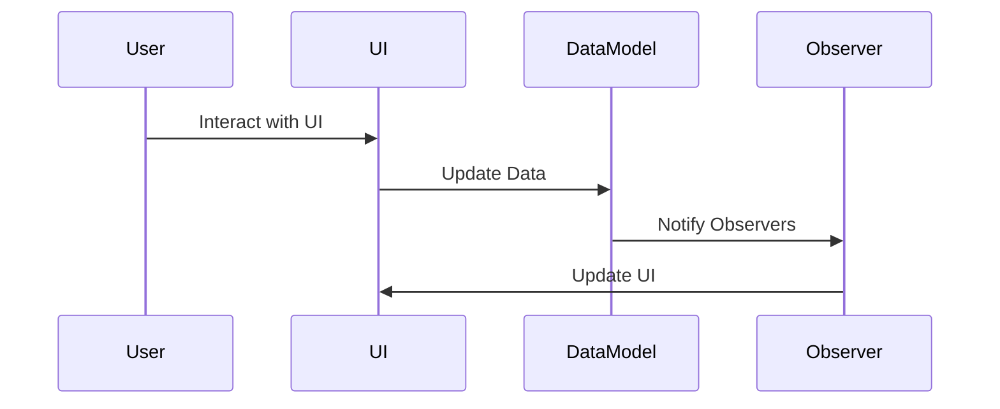

## 1.3 Why Design Patterns Matter in JavaScript

### Introduction

In the ever-evolving landscape of web development, JavaScript has emerged as a cornerstone technology. Its versatility and ubiquity have made it the language of choice for both client-side and server-side development. However, with great power comes great responsibility. As applications grow in complexity, developers face numerous challenges, such as maintaining code readability, ensuring scalability, and facilitating team collaboration. This is where design patterns come into play. They offer proven solutions to common problems, enabling developers to write code that is not only efficient but also maintainable and scalable.

### Challenges in JavaScript Development

JavaScript, while powerful, presents unique challenges that can hinder development if not addressed properly. Let's explore some of these challenges and how design patterns can help mitigate them:

1. **Code Complexity and Maintainability**: As applications grow, the codebase can become unwieldy, making it difficult to manage and maintain. Design patterns provide a structured approach to organizing code, making it easier to understand and modify.

2. **Scalability**: With the increasing demand for web applications to handle more users and data, scalability becomes a critical concern. Design patterns help in creating scalable architectures that can grow with the application's needs.

3. **Reusability**: Writing reusable code is a hallmark of efficient programming. Design patterns encourage code reuse by providing templates for solving common problems, reducing redundancy, and increasing productivity.

4. **Team Collaboration**: In large projects, multiple developers work on different parts of the application. Design patterns offer a common language and set of practices that facilitate communication and collaboration among team members.

5. **Performance Optimization**: Poorly structured code can lead to performance bottlenecks. Design patterns help in optimizing code by promoting best practices and efficient algorithms.

### Improving Code Reusability and Readability

Design patterns are instrumental in enhancing code reusability and readability. They provide a blueprint for solving specific problems, allowing developers to apply the same solution across different parts of the application. This not only reduces the amount of code but also makes it easier to read and understand.

#### Example: The Singleton Pattern

The Singleton pattern ensures that a class has only one instance and provides a global point of access to it. This is particularly useful in scenarios where a single object is needed to coordinate actions across the system, such as a configuration manager or a logging service.

```javascript
class Singleton {
  constructor() {
    if (!Singleton.instance) {
      Singleton.instance = this;
      // Initialize any properties here
    }
    return Singleton.instance;
  }

  log(message) {
    console.log(message);
  }
}

const instance1 = new Singleton();
const instance2 = new Singleton();

console.log(instance1 === instance2); // true
```

In this example, the Singleton pattern ensures that only one instance of the `Singleton` class is created, promoting code reusability and reducing the risk of errors.

### Real-World Scenarios

Design patterns are not just theoretical concepts; they have practical applications in real-world scenarios. Let's explore a few examples where design patterns enhance JavaScript applications:

1. **User Interface Components**: In modern web applications, user interfaces are often composed of reusable components. The Composite pattern allows developers to treat individual components and compositions of components uniformly, simplifying the management of complex UIs.

2. **Data Management**: The Observer pattern is widely used in data-binding scenarios, where changes in one part of the application need to be reflected in another. This pattern is the backbone of many modern frameworks like React and Angular.

3. **Network Requests**: The Proxy pattern can be used to control access to network resources, such as caching responses or managing authentication, improving both performance and security.

### Benefits in Team Collaboration and Large Projects

Design patterns play a crucial role in team collaboration, especially in large projects. They provide a common vocabulary that all team members can understand, reducing misunderstandings and improving communication. By adhering to design patterns, teams can ensure consistency across the codebase, making it easier for new developers to onboard and contribute effectively.

#### Example: The Factory Pattern

The Factory pattern is a creational pattern that provides an interface for creating objects in a superclass but allows subclasses to alter the type of objects that will be created. This pattern is particularly useful in large projects where different teams might be responsible for different parts of the application.

```javascript
class Car {
  constructor(model) {
    this.model = model;
  }
}

class CarFactory {
  createCar(type) {
    switch (type) {
      case 'sedan':
        return new Car('Sedan');
      case 'suv':
        return new Car('SUV');
      default:
        throw new Error('Unknown car type');
    }
  }
}

const factory = new CarFactory();
const sedan = factory.createCar('sedan');
const suv = factory.createCar('suv');

console.log(sedan.model); // Sedan
console.log(suv.model); // SUV
```

In this example, the Factory pattern allows different teams to extend the `CarFactory` class to create new types of cars without modifying the existing code, promoting collaboration and flexibility.

### Impact on Application Performance and Scalability

Design patterns have a significant impact on application performance and scalability. By promoting best practices and efficient algorithms, they help developers write code that performs well under load and can scale as the application grows.

#### Example: The Flyweight Pattern

The Flyweight pattern is a structural pattern that minimizes memory usage by sharing as much data as possible with similar objects. This is particularly useful in applications that need to handle a large number of similar objects, such as a text editor or a game.

```javascript
class Character {
  constructor(char) {
    this.char = char;
  }

  display(position) {
    console.log(`Character: ${this.char}, Position: ${position}`);
  }
}

class CharacterFactory {
  constructor() {
    this.characters = {};
  }

  getCharacter(char) {
    if (!this.characters[char]) {
      this.characters[char] = new Character(char);
    }
    return this.characters[char];
  }
}

const factory = new CharacterFactory();
const charA = factory.getCharacter('A');
const charB = factory.getCharacter('B');

charA.display(1);
charB.display(2);
charA.display(3);
```

In this example, the Flyweight pattern reduces memory usage by sharing `Character` objects, improving performance and scalability.

### Visualizing Design Patterns

To better understand the role of design patterns in JavaScript, let's visualize the interaction between different components in a web application using the Observer pattern.



**Figure 1**: This sequence diagram illustrates how the Observer pattern facilitates communication between the user interface and the data model, ensuring that changes in the data are automatically reflected in the UI.

### Knowledge Check

To reinforce your understanding of why design patterns matter in JavaScript, consider the following questions:

1. What are some challenges in JavaScript development that design patterns address?
2. How do design patterns improve code reusability and readability?
3. Can you provide an example of a real-world scenario where a design pattern enhances a JavaScript application?
4. What are the benefits of using design patterns in team collaboration and large projects?
5. How do design patterns impact application performance and scalability?

### Conclusion

Design patterns are an essential tool in the JavaScript developer's toolkit. They provide a structured approach to solving common problems, improving code quality, and facilitating collaboration. By understanding and applying design patterns, developers can create applications that are efficient, scalable, and maintainable. Remember, this is just the beginning. As you progress, you'll discover more patterns and techniques that will enhance your skills and enable you to tackle even more complex challenges. Keep experimenting, stay curious, and enjoy the journey!

## Quiz: Understanding the Importance of Design Patterns in JavaScript



### What is one of the main challenges in JavaScript development that design patterns help address?

- [x] Code complexity and maintainability
- [ ] Lack of libraries
- [ ] Limited browser support
- [ ] Slow execution speed

> **Explanation:** Design patterns help manage code complexity and maintainability by providing structured solutions to common problems.

### How do design patterns improve code reusability?

- [x] By providing templates for solving common problems
- [ ] By increasing the number of lines of code
- [ ] By making code more complex
- [ ] By reducing the need for documentation

> **Explanation:** Design patterns offer templates that can be reused across different parts of an application, reducing redundancy and increasing productivity.

### Which design pattern is useful for ensuring a class has only one instance?

- [x] Singleton Pattern
- [ ] Factory Pattern
- [ ] Observer Pattern
- [ ] Composite Pattern

> **Explanation:** The Singleton pattern ensures that a class has only one instance and provides a global point of access to it.

### In what scenario is the Observer pattern particularly useful?

- [x] Data-binding scenarios
- [ ] Creating a single instance of a class
- [ ] Managing object creation
- [ ] Structuring complex UIs

> **Explanation:** The Observer pattern is useful in data-binding scenarios where changes in one part of the application need to be reflected in another.

### What is a benefit of using design patterns in team collaboration?

- [x] They provide a common vocabulary for developers
- [ ] They increase the number of bugs
- [ ] They make code harder to understand
- [ ] They reduce the need for testing

> **Explanation:** Design patterns offer a common vocabulary that facilitates communication and collaboration among team members.

### How do design patterns impact application performance?

- [x] By promoting best practices and efficient algorithms
- [ ] By increasing memory usage
- [ ] By slowing down execution
- [ ] By making code harder to read

> **Explanation:** Design patterns help optimize code by promoting best practices and efficient algorithms, improving performance.

### Which pattern minimizes memory usage by sharing data among similar objects?

- [x] Flyweight Pattern
- [ ] Singleton Pattern
- [ ] Factory Pattern
- [ ] Observer Pattern

> **Explanation:** The Flyweight pattern minimizes memory usage by sharing as much data as possible with similar objects.

### What is the main advantage of the Factory pattern in large projects?

- [x] It allows different teams to extend classes without modifying existing code
- [ ] It ensures a class has only one instance
- [ ] It simplifies complex UIs
- [ ] It manages object creation

> **Explanation:** The Factory pattern allows different teams to extend classes to create new types of objects without modifying existing code.

### How do design patterns facilitate scalability?

- [x] By creating scalable architectures
- [ ] By increasing code complexity
- [ ] By reducing code readability
- [ ] By limiting the number of users

> **Explanation:** Design patterns help in creating scalable architectures that can grow with the application's needs.

### True or False: Design patterns are only useful for small projects.

- [ ] True
- [x] False

> **Explanation:** Design patterns are beneficial for projects of all sizes, but they are especially valuable in large projects where maintainability, scalability, and team collaboration are critical.


