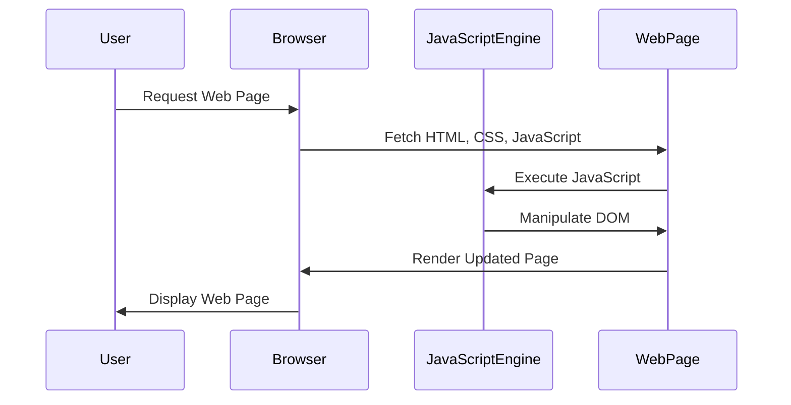

## 1.4 History of JavaScript and Its Ecosystem

JavaScript has become an indispensable part of modern web development, but its journey from a simple scripting language to a powerful tool for building complex applications is a fascinating story. In this section, we will explore the history of JavaScript, its evolution, and the growth of its ecosystem, including the emergence of popular libraries, frameworks, and tools that have shaped the way we develop web applications today.

### The Origins of JavaScript

JavaScript was created in 1995 by Brendan Eich while he was working at Netscape Communications. Originally named Mocha, it was later renamed to LiveScript and finally to JavaScript. The language was designed to be a lightweight scripting language for adding interactivity to web pages, complementing the static nature of HTML and CSS.

JavaScript's initial purpose was to enable web developers to create dynamic content, such as form validation and simple animations, directly in the browser. Its syntax was influenced by Java, which was popular at the time, but it was designed to be more accessible to non-programmers.

### Key Milestones in JavaScript History

JavaScript's journey from a simple scripting language to a powerful tool for building complex applications is marked by several key milestones:

- **1995**: JavaScript is created by Brendan Eich at Netscape.
- **1996**: Microsoft introduces JScript, a JavaScript implementation for Internet Explorer.
- **1997**: The first version of ECMAScript, the standardized version of JavaScript, is released.
- **1999**: ECMAScript 3 is released, introducing regular expressions, better string handling, and more.
- **2005**: AJAX (Asynchronous JavaScript and XML) becomes popular, enabling dynamic web applications.
- **2009**: ECMAScript 5 is released, adding strict mode, JSON support, and more.
- **2009**: Node.js is introduced, allowing JavaScript to be used for server-side development.
- **2015**: ECMAScript 6 (ES6) is released, introducing classes, modules, arrow functions, and more.
- **2016**: ECMAScript 7 (ES7) is released, adding features like the `exponentiation operator` and `Array.prototype.includes`.
- **2017**: ECMAScript 8 (ES8) introduces async/await, making asynchronous code easier to write and read.
- **2018**: ECMAScript 9 (ES9) adds features like rest/spread properties and asynchronous iteration.
- **2019**: ECMAScript 10 (ES10) introduces features like Array.prototype.flat and Object.fromEntries.

### The Rise of Popular Libraries and Frameworks

As JavaScript evolved, so did the tools and libraries that developers use to build web applications. Some of the most influential libraries and frameworks include:

- **[jQuery](https://jquery.com/):** Released in 2006, jQuery simplified DOM manipulation, event handling, and AJAX interactions, making it easier to create dynamic web pages. Its motto, "Write less, do more," resonated with developers, and it quickly became one of the most popular JavaScript libraries.

- **[React](https://reactjs.org/):** Developed by Facebook and released in 2013, React introduced a component-based architecture and a virtual DOM, enabling developers to build large-scale applications with better performance and maintainability. React's declarative approach to UI development has made it a favorite among developers.

- **[Angular](https://angular.io/):** Originally released by Google in 2010 as AngularJS, Angular was a comprehensive framework for building single-page applications. In 2016, Angular was completely rewritten as Angular 2, adopting a component-based architecture and TypeScript as its primary language.

- **[Vue.js](https://vuejs.org/):** Created by Evan You and released in 2014, Vue.js is a progressive framework for building user interfaces. It is designed to be incrementally adoptable, allowing developers to use it for small parts of an application or as a full-fledged framework for building complex applications.

### The Evolution of JavaScript Tooling and Package Management

As JavaScript applications grew in complexity, so did the need for better tooling and package management. This led to the development of tools and package managers that have become essential for modern JavaScript development:

- **npm (Node Package Manager):** Introduced in 2010, npm is the default package manager for Node.js. It allows developers to easily install, share, and manage JavaScript packages, making it easier to build and maintain applications.

- **Yarn:** Released by Facebook in 2016, Yarn is an alternative package manager to npm. It offers faster package installation, deterministic builds, and better security features, making it a popular choice among developers.

- **Webpack:** A module bundler for JavaScript applications, Webpack allows developers to bundle their code and assets for deployment. It supports features like code splitting, hot module replacement, and tree shaking, making it a powerful tool for optimizing JavaScript applications.

- **Babel:** A JavaScript compiler that allows developers to use the latest JavaScript features while maintaining compatibility with older browsers. Babel transpiles modern JavaScript code into a version that can run in environments that do not support the latest features.

### The Impact of JavaScript's Ecosystem on Development Practices

The growth of JavaScript's ecosystem has had a profound impact on development practices. With the availability of powerful libraries, frameworks, and tools, developers can build complex applications more efficiently and with greater ease. The component-based architecture popularized by frameworks like React and Angular has led to more modular and maintainable codebases.

JavaScript's ecosystem has also fostered a culture of open-source collaboration, with developers contributing to and benefiting from a vast array of community-driven projects. This collaborative spirit has accelerated the pace of innovation and has made JavaScript one of the most vibrant and dynamic programming languages in the world.

### Visualizing JavaScript's Interaction with Web Browsers and Web Pages

To better understand how JavaScript interacts with web browsers and web pages, let's visualize the process using a Mermaid.js diagram:

**Diagram Description:** This sequence diagram illustrates the interaction between a user, a web browser, the JavaScript engine, and a web page. The user requests a web page, which the browser fetches, including HTML, CSS, and JavaScript. The JavaScript engine executes the JavaScript code, manipulating the DOM, and the browser renders the updated page for the user.

### Try It Yourself

To better understand the evolution of JavaScript and its ecosystem, try experimenting with some of the popular libraries and frameworks mentioned in this section. For example, you can create a simple React application using Create React App, or explore the Vue.js documentation to build a small project. Experimenting with these tools will give you a deeper appreciation for the power and flexibility of modern JavaScript development.

### Knowledge Check

- What was the original name of JavaScript?
- Who created JavaScript and in what year?
- Name three key milestones in the history of JavaScript.
- What is the primary purpose of npm?
- How did the introduction of frameworks like React and Angular change JavaScript development practices?

### Summary

In this section, we explored the rich history of JavaScript, from its inception as a simple scripting language to its current status as a cornerstone of modern web development. We discussed key milestones in JavaScript's evolution, the rise of influential libraries and frameworks, and the development of essential tools and package managers. The growth of JavaScript's ecosystem has transformed the way we build web applications, enabling developers to create more complex and interactive experiences with greater efficiency and ease.

### Embrace the Journey

Remember, this is just the beginning. As you progress, you'll build more complex and interactive web pages. Keep experimenting, stay curious, and enjoy the journey!

## Quiz: Test Your Knowledge on JavaScript History and Ecosystem



### What was the original name of JavaScript?

- [x] Mocha
- [ ] LiveScript
- [ ] ECMAScript
- [ ] JScript

> **Explanation:** JavaScript was originally named Mocha before being renamed to LiveScript and finally to JavaScript.

### Who created JavaScript?

- [x] Brendan Eich
- [ ] Tim Berners-Lee
- [ ] James Gosling
- [ ] Guido van Rossum

> **Explanation:** Brendan Eich created JavaScript while working at Netscape Communications in 1995.

### Which company introduced JScript?

- [x] Microsoft
- [ ] Netscape
- [ ] Google
- [ ] Sun Microsystems

> **Explanation:** Microsoft introduced JScript as a JavaScript implementation for Internet Explorer.

### What year was ECMAScript 6 (ES6) released?

- [x] 2015
- [ ] 2009
- [ ] 2017
- [ ] 2018

> **Explanation:** ECMAScript 6 (ES6) was released in 2015, introducing many new features like classes and modules.

### Which library popularized the component-based architecture?

- [x] React
- [ ] jQuery
- [ ] AngularJS
- [ ] Vue.js

> **Explanation:** React, developed by Facebook, popularized the component-based architecture for building user interfaces.

### What is the primary purpose of npm?

- [x] Package management
- [ ] Code compilation
- [ ] Module bundling
- [ ] Code minification

> **Explanation:** npm (Node Package Manager) is primarily used for managing JavaScript packages.

### Which tool is known for module bundling?

- [x] Webpack
- [ ] Babel
- [ ] Yarn
- [ ] ESLint

> **Explanation:** Webpack is a module bundler that helps bundle JavaScript code and assets for deployment.

### What feature did ECMAScript 8 (ES8) introduce?

- [x] async/await
- [ ] Arrow functions
- [ ] Classes
- [ ] Modules

> **Explanation:** ECMAScript 8 (ES8) introduced async/await, making asynchronous code easier to write and read.

### Which package manager was released by Facebook?

- [x] Yarn
- [ ] npm
- [ ] Webpack
- [ ] Babel

> **Explanation:** Yarn was released by Facebook as an alternative package manager to npm.

### True or False: JavaScript was designed to be a server-side language.

- [ ] True
- [x] False

> **Explanation:** JavaScript was originally designed as a client-side scripting language for adding interactivity to web pages.


