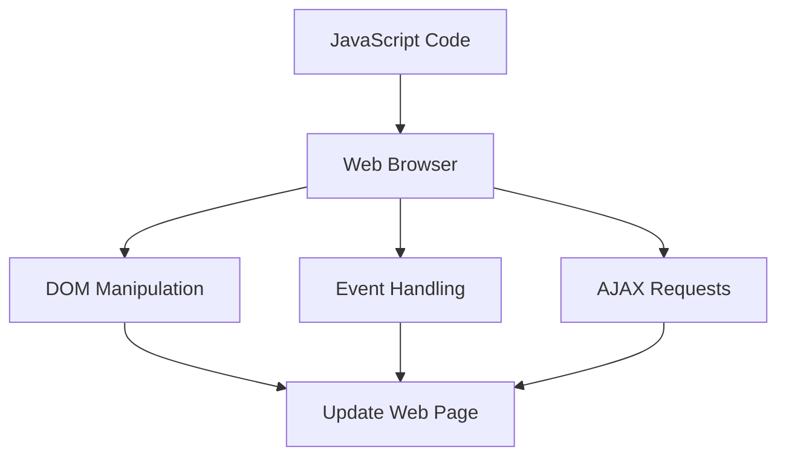

## 1.5 Comparing JavaScript with Other Programming Languages

JavaScript is a versatile and widely-used programming language, primarily known for its role in web development. However, to truly appreciate its strengths and limitations, it's essential to compare it with other prominent programming languages such as Java, Python, and Ruby. This comparison will help us understand JavaScript's unique features, its execution environment, and how it approaches problem-solving differently.

### Key Programming Languages for Comparison

#### Java

Java is a statically-typed, object-oriented programming language that has been a staple in enterprise-level applications. It is known for its portability across platforms, thanks to the Java Virtual Machine (JVM).

#### Python

Python is a dynamically-typed, high-level language known for its readability and simplicity. It is widely used in data science, machine learning, and web development.

#### Ruby

Ruby is a dynamic, object-oriented language, famous for its elegant syntax and the Ruby on Rails web framework. It emphasizes simplicity and productivity.

### Language Paradigms: Functional vs. Object-Oriented

JavaScript is a multi-paradigm language, supporting both functional and object-oriented programming. Let's explore how it compares with other languages in these paradigms.

#### Functional Programming

JavaScript supports functional programming with first-class functions, closures, and higher-order functions. This allows developers to write concise and expressive code.

- **Example: Functional Programming in JavaScript**

```javascript
// Higher-order function example
function map(arr, fn) {
  const result = [];
  for (let i = 0; i < arr.length; i++) {
    result.push(fn(arr[i]));
  }
  return result;
}

const numbers = [1, 2, 3, 4];
const doubled = map(numbers, (n) => n * 2);
console.log(doubled); // [2, 4, 6, 8]
```

- **Python** also supports functional programming with features like list comprehensions and lambda functions.

```python
# List comprehension in Python
numbers = [1, 2, 3, 4]
doubled = [n * 2 for n in numbers]
print(doubled)  # [2, 4, 6, 8]
```

- **Java** has incorporated functional programming features with the introduction of lambdas and the Stream API in Java 8.

```java
import java.util.Arrays;
import java.util.List;
import java.util.stream.Collectors;

public class Main {
    public static void main(String[] args) {
        List<Integer> numbers = Arrays.asList(1, 2, 3, 4);
        List<Integer> doubled = numbers.stream()
                                       .map(n -> n * 2)
                                       .collect(Collectors.toList());
        System.out.println(doubled); // [2, 4, 6, 8]
    }
}
```

- **Ruby** supports functional programming with blocks, procs, and lambdas.

```ruby
numbers = [1, 2, 3, 4]
doubled = numbers.map { |n| n * 2 }
puts doubled.inspect # [2, 4, 6, 8]
```

#### Object-Oriented Programming

JavaScript's object-oriented capabilities are based on prototypes rather than classes, which is a significant difference from class-based languages like Java.

- **Example: Object-Oriented Programming in JavaScript**

```javascript
// Prototype-based inheritance
function Animal(name) {
  this.name = name;
}

Animal.prototype.speak = function() {
  console.log(`${this.name} makes a noise.`);
};

const dog = new Animal('Dog');
dog.speak(); // Dog makes a noise.
```

- **Java** uses class-based inheritance.

```java
class Animal {
    private String name;

    public Animal(String name) {
        this.name = name;
    }

    public void speak() {
        System.out.println(name + " makes a noise.");
    }
}

public class Main {
    public static void main(String[] args) {
        Animal dog = new Animal("Dog");
        dog.speak(); // Dog makes a noise.
    }
}
```

- **Python** supports both procedural and object-oriented programming.

```python
class Animal:
    def __init__(self, name):
        self.name = name

    def speak(self):
        print(f"{self.name} makes a noise.")

dog = Animal("Dog")
dog.speak()  # Dog makes a noise.
```

- **Ruby** is purely object-oriented, where everything is an object.

```ruby
class Animal
  def initialize(name)
    @name = name
  end

  def speak
    puts "#{@name} makes a noise."
  end
end

dog = Animal.new("Dog")
dog.speak # Dog makes a noise.
```

### JavaScript's Execution Environment

JavaScript's execution environment significantly impacts its use and capabilities. It runs in web browsers and on the server-side with Node.js.

#### Browser Environment

In the browser, JavaScript interacts with the Document Object Model (DOM) to manipulate web pages dynamically. This capability makes it indispensable for front-end development.

- **Example: DOM Manipulation in JavaScript**

```javascript
// Changing the text of an HTML element
document.getElementById('myElement').textContent = 'Hello, World!';
```

#### Node.js Environment

Node.js extends JavaScript's capabilities to the server-side, allowing for the development of scalable network applications.

- **Example: Simple HTTP Server in Node.js**

```javascript
const http = require('http');

const server = http.createServer((req, res) => {
  res.statusCode = 200;
  res.setHeader('Content-Type', 'text/plain');
  res.end('Hello, World!\n');
});

server.listen(3000, '127.0.0.1', () => {
  console.log('Server running at http://127.0.0.1:3000/');
});
```

### Design Patterns in JavaScript vs. Other Languages

Design patterns are solutions to common problems in software design. While the patterns themselves are language-agnostic, their implementation can vary significantly between languages.

#### Singleton Pattern

- **JavaScript**

```javascript
const Singleton = (function() {
  let instance;

  function createInstance() {
    const object = new Object('I am the instance');
    return object;
  }

  return {
    getInstance: function() {
      if (!instance) {
        instance = createInstance();
      }
      return instance;
    }
  };
})();

const instance1 = Singleton.getInstance();
const instance2 = Singleton.getInstance();
console.log(instance1 === instance2); // true
```

- **Java**

```java
public class Singleton {
    private static Singleton instance;

    private Singleton() {}

    public static Singleton getInstance() {
        if (instance == null) {
            instance = new Singleton();
        }
        return instance;
    }
}

public class Main {
    public static void main(String[] args) {
        Singleton instance1 = Singleton.getInstance();
        Singleton instance2 = Singleton.getInstance();
        System.out.println(instance1 == instance2); // true
    }
}
```

#### Observer Pattern

- **JavaScript**

```javascript
class Subject {
  constructor() {
    this.observers = [];
  }

  subscribe(observer) {
    this.observers.push(observer);
  }

  unsubscribe(observer) {
    this.observers = this.observers.filter(obs => obs !== observer);
  }

  notify(data) {
    this.observers.forEach(observer => observer(data));
  }
}

const subject = new Subject();

const observer1 = (data) => console.log(`Observer 1: ${data}`);
const observer2 = (data) => console.log(`Observer 2: ${data}`);

subject.subscribe(observer1);
subject.subscribe(observer2);

subject.notify('Hello Observers!'); // Observer 1: Hello Observers! Observer 2: Hello Observers!
```

- **Python**

```python
class Subject:
    def __init__(self):
        self._observers = []

    def subscribe(self, observer):
        self._observers.append(observer)

    def unsubscribe(self, observer):
        self._observers.remove(observer)

    def notify(self, data):
        for observer in self._observers:
            observer(data)

subject = Subject()

def observer1(data):
    print(f"Observer 1: {data}")

def observer2(data):
    print(f"Observer 2: {data}")

subject.subscribe(observer1)
subject.subscribe(observer2)

subject.notify("Hello Observers!")  # Observer 1: Hello Observers! Observer 2: Hello Observers!
```

### Strengths and Weaknesses of JavaScript

#### Strengths

1. **Ubiquity**: JavaScript is the only language that runs natively in web browsers, making it essential for web development.
2. **Asynchronous Programming**: JavaScript's event-driven, non-blocking architecture is ideal for handling I/O operations efficiently.
3. **Rich Ecosystem**: With npm, JavaScript has a vast ecosystem of libraries and tools.

#### Weaknesses

1. **Dynamic Typing**: While flexible, dynamic typing can lead to runtime errors that are hard to debug.
2. **Inconsistent Browser Support**: Differences in how browsers implement JavaScript can lead to compatibility issues.
3. **Security Concerns**: JavaScript's ability to execute code from various sources can pose security risks if not managed properly.

### Visualizing JavaScript's Interaction with Web Browsers and Web Pages



**Description**: This diagram illustrates how JavaScript interacts with web browsers to manipulate the DOM, handle events, and make AJAX requests, ultimately updating the web page.

### Try It Yourself

Experiment with the code examples provided. Try modifying the JavaScript code to add new features or change the behavior. For instance, in the Observer Pattern example, add a third observer and see how it affects the output.

### Knowledge Check

- What are the main differences between JavaScript's prototype-based inheritance and Java's class-based inheritance?
- How does JavaScript's execution environment in the browser differ from Node.js?
- What are some strengths and weaknesses of JavaScript compared to Python and Ruby?
- How can design patterns be implemented differently in JavaScript compared to Java?

### Summary

In this section, we've explored how JavaScript compares with other programming languages like Java, Python, and Ruby. We've examined its unique features, execution environments, and how it implements design patterns. Understanding these differences helps us appreciate JavaScript's role in modern web development and its versatility as a programming language.

### Embrace the Journey

Remember, this is just the beginning. As you progress, you'll build more complex and interactive web pages. Keep experimenting, stay curious, and enjoy the journey!

## Quiz: Understanding JavaScript's Unique Features Compared to Other Languages



### What is a key difference between JavaScript and Java in terms of inheritance?

- [x] JavaScript uses prototype-based inheritance, while Java uses class-based inheritance.
- [ ] JavaScript uses class-based inheritance, while Java uses prototype-based inheritance.
- [ ] Both JavaScript and Java use prototype-based inheritance.
- [ ] Both JavaScript and Java use class-based inheritance.

> **Explanation:** JavaScript uses prototype-based inheritance, which is different from Java's class-based inheritance model.

### Which language feature allows JavaScript to handle asynchronous operations efficiently?

- [x] Event-driven, non-blocking architecture
- [ ] Static typing
- [ ] Class-based inheritance
- [ ] Strong typing

> **Explanation:** JavaScript's event-driven, non-blocking architecture is ideal for handling asynchronous operations efficiently.

### What is a common use case for JavaScript in the browser environment?

- [x] DOM manipulation
- [ ] Machine learning
- [ ] System programming
- [ ] Database management

> **Explanation:** JavaScript is commonly used for DOM manipulation in the browser environment to create dynamic web pages.

### How does Node.js extend JavaScript's capabilities?

- [x] By allowing JavaScript to run on the server-side
- [ ] By adding static typing to JavaScript
- [ ] By providing a graphical user interface
- [ ] By enabling JavaScript to compile to machine code

> **Explanation:** Node.js extends JavaScript's capabilities by allowing it to run on the server-side, enabling the development of scalable network applications.

### Which of the following is a strength of JavaScript?

- [x] Ubiquity in web browsers
- [ ] Strong typing
- [ ] Static typing
- [ ] Lack of security concerns

> **Explanation:** JavaScript's ubiquity in web browsers is a significant strength, making it essential for web development.

### What is a weakness of JavaScript compared to Python?

- [x] Dynamic typing can lead to runtime errors
- [ ] Lack of support for functional programming
- [ ] Inability to run on the server-side
- [ ] Limited library ecosystem

> **Explanation:** JavaScript's dynamic typing can lead to runtime errors, which is a weakness compared to Python's more explicit error handling.

### How does JavaScript handle asynchronous programming?

- [x] Through event-driven, non-blocking architecture
- [ ] By using static typing
- [ ] By relying on class-based inheritance
- [ ] By using strong typing

> **Explanation:** JavaScript handles asynchronous programming through its event-driven, non-blocking architecture.

### What is a common design pattern used in JavaScript?

- [x] Singleton Pattern
- [ ] Factory Pattern
- [ ] Adapter Pattern
- [ ] Bridge Pattern

> **Explanation:** The Singleton Pattern is a common design pattern used in JavaScript to ensure a class has only one instance.

### Which language is known for its elegant syntax and productivity?

- [x] Ruby
- [ ] Java
- [ ] Python
- [ ] C++

> **Explanation:** Ruby is known for its elegant syntax and productivity, particularly with the Ruby on Rails framework.

### True or False: JavaScript is the only language that runs natively in web browsers.

- [x] True
- [ ] False

> **Explanation:** JavaScript is indeed the only language that runs natively in web browsers, making it essential for web development.


