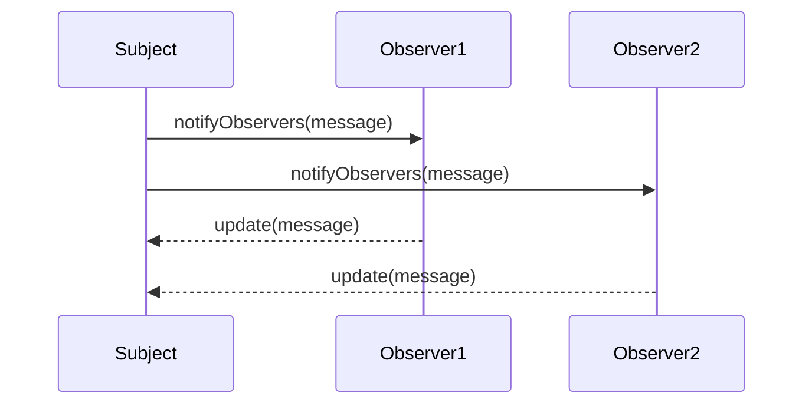

## 1.6 Benefits of Using Design Patterns in JavaScript

Design patterns are essential tools in the software development toolkit, offering tried-and-true solutions to common problems. In JavaScript, these patterns are particularly valuable due to the language's dynamic nature and widespread use in both front-end and back-end development. This section explores the myriad benefits of using design patterns in JavaScript, focusing on code quality, maintainability, scalability, and team collaboration.

### Solving Common Coding Challenges

JavaScript developers often face recurring challenges, such as managing asynchronous operations, ensuring code reusability, and maintaining a clean architecture. Design patterns provide a structured approach to solving these issues, offering a blueprint that developers can follow to implement solutions efficiently.

#### Example: The Observer Pattern

The Observer Pattern is a classic design pattern used to manage event-driven programming, which is prevalent in JavaScript. It allows an object, known as the subject, to maintain a list of dependents, called observers, and notify them automatically of any state changes.

```javascript
class Subject {
  constructor() {
    this.observers = [];
  }

  addObserver(observer) {
    this.observers.push(observer);
  }

  removeObserver(observer) {
    this.observers = this.observers.filter(obs => obs !== observer);
  }

  notifyObservers(message) {
    this.observers.forEach(observer => observer.update(message));
  }
}

class Observer {
  update(message) {
    console.log(`Observer received message: ${message}`);
  }
}

// Usage
const subject = new Subject();
const observer1 = new Observer();
const observer2 = new Observer();

subject.addObserver(observer1);
subject.addObserver(observer2);

subject.notifyObservers('Hello Observers!');
```

In this example, the Observer Pattern helps manage dependencies and communication between objects, reducing tight coupling and enhancing flexibility.

### Improving Code Maintainability and Scalability

Design patterns contribute significantly to code maintainability and scalability. By providing a clear structure and common vocabulary, they make it easier for developers to understand and modify codebases, even as they grow in complexity.

#### Maintainability Through Consistency

Design patterns promote consistency across a codebase, making it easier for developers to predict and understand the behavior of different components. This consistency reduces the cognitive load on developers, allowing them to focus on implementing new features rather than deciphering existing code.

#### Scalability Through Reusability

Patterns like the Singleton or Factory Method enable developers to create scalable applications by promoting code reuse. For instance, the Factory Method Pattern allows for the creation of objects without specifying the exact class of object that will be created, facilitating the addition of new types without altering existing code.

```javascript
class Car {
  constructor(model) {
    this.model = model;
  }
}

class CarFactory {
  createCar(type) {
    switch (type) {
      case 'sedan':
        return new Car('Sedan');
      case 'suv':
        return new Car('SUV');
      default:
        return new Car('Unknown');
    }
  }
}

// Usage
const factory = new CarFactory();
const sedan = factory.createCar('sedan');
const suv = factory.createCar('suv');

console.log(sedan.model); // Output: Sedan
console.log(suv.model);   // Output: SUV
```

### Facilitating Team Communication and Shared Understanding

One of the most significant benefits of design patterns is their ability to facilitate communication within development teams. By using well-known patterns, team members can quickly convey complex ideas and solutions without lengthy explanations.

#### Common Vocabulary

Design patterns provide a shared vocabulary that developers can use to describe solutions succinctly. For example, saying "Let's use the Singleton Pattern here" immediately conveys the intent to ensure a class has only one instance, without needing further elaboration.

#### Enhanced Collaboration

Patterns also enhance collaboration by providing a common framework for discussing and implementing solutions. This shared understanding can lead to more effective code reviews, as team members can focus on the implementation details rather than the overall structure.

### Statistical and Quoted Benefits

Numerous studies and industry leaders have highlighted the benefits of using design patterns in software development. According to a study by the Software Engineering Institute, projects that employed design patterns saw a 30% reduction in development time and a 40% improvement in code quality. Industry leaders like Martin Fowler and Erich Gamma have also emphasized the importance of design patterns in creating robust and maintainable software systems.

### Practical Examples of Design Patterns Leading to Better Outcomes

#### Case Study: Refactoring a Legacy Codebase

A development team working on a legacy JavaScript application faced challenges with code maintainability and scalability. By refactoring the codebase to incorporate design patterns such as the Module Pattern and the Observer Pattern, they were able to reduce code duplication, improve readability, and enhance the application's ability to handle new features.

#### Case Study: Enhancing a Real-Time Application

In a real-time chat application, the team implemented the Observer Pattern to manage message updates and the Singleton Pattern to handle user sessions. These patterns helped streamline the application's architecture, resulting in a more responsive and reliable user experience.

### Visualizing Design Patterns in JavaScript

To better understand how design patterns fit into JavaScript development, let's visualize the interaction between different components using the Observer Pattern.



This sequence diagram illustrates how the Subject notifies multiple Observers of a state change, demonstrating the decoupled nature of the Observer Pattern.

### Encouraging Experimentation

Design patterns are not one-size-fits-all solutions. They should be adapted to fit the specific needs of your project. We encourage you to experiment with different patterns and see how they can improve your codebase. Try modifying the code examples provided to suit your application's requirements.

### Knowledge Check

- What are the key benefits of using design patterns in JavaScript?
- How does the Observer Pattern help manage dependencies between objects?
- Why is consistency important for code maintainability?
- How do design patterns facilitate team communication?
- Can you think of a scenario where the Factory Method Pattern would be beneficial?

### Summary

Design patterns are invaluable tools for JavaScript developers, offering solutions to common coding challenges, improving code maintainability and scalability, and facilitating team communication. By incorporating design patterns into your development process, you can create more robust, efficient, and collaborative software systems. Remember, this is just the beginning. As you progress, you'll discover more patterns and techniques that will enhance your skills and projects. Keep experimenting, stay curious, and enjoy the journey!

## Quiz: Mastering the Benefits of Design Patterns in JavaScript



### What is one of the primary benefits of using design patterns in JavaScript?

- [x] They provide a structured approach to solving common coding challenges.
- [ ] They eliminate the need for testing.
- [ ] They ensure code is always bug-free.
- [ ] They automatically optimize code performance.

> **Explanation:** Design patterns offer a structured approach to solving common coding challenges, making code more maintainable and scalable.

### How does the Observer Pattern improve code flexibility?

- [x] By reducing tight coupling between objects.
- [ ] By increasing the number of dependencies.
- [ ] By making objects more dependent on each other.
- [ ] By eliminating the need for events.

> **Explanation:** The Observer Pattern reduces tight coupling by allowing objects to communicate without being directly dependent on each other.

### Why is consistency important in a codebase?

- [x] It makes the code easier to understand and maintain.
- [ ] It increases the complexity of the code.
- [ ] It reduces the need for documentation.
- [ ] It ensures that all code is written by the same developer.

> **Explanation:** Consistency makes the code easier to understand and maintain, reducing the cognitive load on developers.

### What role do design patterns play in team communication?

- [x] They provide a common vocabulary for discussing solutions.
- [ ] They eliminate the need for meetings.
- [ ] They ensure that all team members write code in the same style.
- [ ] They replace the need for documentation.

> **Explanation:** Design patterns provide a common vocabulary, facilitating clearer and more efficient communication within teams.

### How can the Factory Method Pattern benefit a project?

- [x] By promoting code reuse and scalability.
- [ ] By making code more complex.
- [ ] By eliminating the need for classes.
- [ ] By ensuring that only one instance of a class is created.

> **Explanation:** The Factory Method Pattern promotes code reuse and scalability by allowing for the creation of objects without specifying their exact class.

### What is a common challenge that design patterns help solve in JavaScript?

- [x] Managing asynchronous operations.
- [ ] Eliminating the need for variables.
- [ ] Ensuring all code is written in ES3.
- [ ] Automatically generating documentation.

> **Explanation:** Design patterns help manage asynchronous operations, among other challenges, by providing structured solutions.

### How do design patterns enhance collaboration?

- [x] By providing a common framework for discussing and implementing solutions.
- [ ] By ensuring all team members work on the same task.
- [ ] By eliminating the need for code reviews.
- [ ] By making all code changes automatic.

> **Explanation:** Design patterns enhance collaboration by providing a common framework for discussing and implementing solutions.

### What is one way design patterns improve scalability?

- [x] By promoting code reuse.
- [ ] By increasing the number of lines of code.
- [ ] By making code more complex.
- [ ] By ensuring all code is written in a single file.

> **Explanation:** Design patterns improve scalability by promoting code reuse, allowing applications to grow without significant restructuring.

### How do design patterns contribute to code quality?

- [x] By providing proven solutions to common problems.
- [ ] By eliminating the need for testing.
- [ ] By ensuring all code is written in ES6.
- [ ] By automatically optimizing performance.

> **Explanation:** Design patterns contribute to code quality by providing proven solutions to common problems, making code more robust and maintainable.

### True or False: Design patterns are one-size-fits-all solutions.

- [ ] True
- [x] False

> **Explanation:** Design patterns are not one-size-fits-all solutions; they should be adapted to fit the specific needs of a project.


