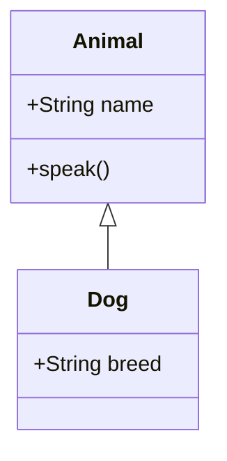
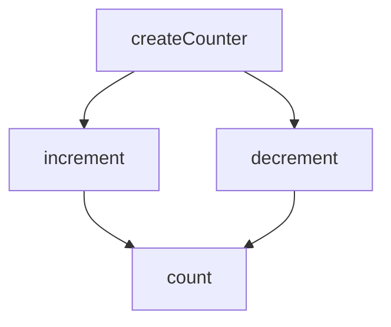

## 1.7 Overview of JavaScript's Features Relevant to Design Patterns

JavaScript is a versatile language that supports multiple programming paradigms, including object-oriented, functional, and imperative programming. This flexibility is largely due to its unique features, which play a crucial role in implementing design patterns. In this section, we'll explore these features, understand how they enable design patterns, and provide code examples to illustrate their use.

### Key JavaScript Features

#### Closures

**Closures** are a fundamental concept in JavaScript, allowing functions to access variables from an enclosing scope even after that scope has finished executing. This feature is particularly useful for implementing patterns like the Module Pattern, which relies on encapsulating private data.

**Example:**

```javascript
function createCounter() {
  let count = 0;
  return {
    increment: function() {
      count++;
      return count;
    },
    decrement: function() {
      count--;
      return count;
    }
  };
}

const counter = createCounter();
console.log(counter.increment()); // 1
console.log(counter.decrement()); // 0
```

**Explanation:** In this example, `createCounter` returns an object with methods that can modify the `count` variable. The `count` variable is enclosed within the function scope, making it private and only accessible through the returned methods.

#### Prototypes

JavaScript's prototype-based inheritance is another key feature that influences design patterns. Unlike classical inheritance, JavaScript objects inherit directly from other objects, allowing for flexible and dynamic object creation.

**Example:**

```javascript
function Animal(name) {
  this.name = name;
}

Animal.prototype.speak = function() {
  console.log(`${this.name} makes a noise.`);
};

const dog = new Animal('Dog');
dog.speak(); // Dog makes a noise.
```

**Explanation:** Here, `Animal` is a constructor function, and `speak` is added to its prototype. This allows all instances of `Animal` to share the `speak` method, demonstrating prototype-based inheritance.

#### First-Class Functions

In JavaScript, functions are first-class citizens, meaning they can be assigned to variables, passed as arguments, and returned from other functions. This feature is essential for patterns like Strategy and Command, where functions are used to encapsulate behavior.

**Example:**

```javascript
function executeStrategy(strategy, data) {
  return strategy(data);
}

const add = (a, b) => a + b;
const multiply = (a, b) => a * b;

console.log(executeStrategy(add, [2, 3])); // 5
console.log(executeStrategy(multiply, [2, 3])); // 6
```

**Explanation:** The `executeStrategy` function takes a strategy function and data as arguments, allowing different strategies to be executed dynamically.

#### Asynchronous Programming

JavaScript's asynchronous capabilities, including callbacks, promises, and async/await, are crucial for patterns that deal with asynchronous operations, such as the Observer and Mediator patterns.

**Example:**

```javascript
function fetchData(url) {
  return fetch(url)
    .then(response => response.json())
    .then(data => console.log(data))
    .catch(error => console.error('Error:', error));
}

fetchData('https://api.example.com/data');
```

**Explanation:** This example uses promises to handle asynchronous HTTP requests, making it easier to manage complex asynchronous workflows.

### How These Features Enable Design Patterns

- **Encapsulation and Privacy:** Closures provide a way to encapsulate data and create private variables, essential for patterns like the Module Pattern.
- **Inheritance and Reusability:** Prototypes allow for object inheritance and method sharing, enabling patterns like the Prototype and Decorator patterns.
- **Dynamic Behavior:** First-class functions enable dynamic behavior and strategy switching, crucial for patterns like Strategy and Command.
- **Asynchronous Handling:** JavaScript's asynchronous features facilitate patterns that require non-blocking operations, such as Observer and Mediator.

### Limitations and Considerations

While JavaScript's features provide great flexibility, they also come with certain limitations and considerations:

- **Complexity:** Using closures and prototypes can lead to complex code that's difficult to understand and maintain.
- **Performance:** Overuse of closures can lead to memory leaks if not managed properly.
- **Compatibility:** Some features, like async/await, require modern JavaScript environments, which may not be available in older browsers.

### Preparing for Deeper Dives

Understanding these foundational features will prepare you for deeper dives into specific design patterns in later chapters. As you progress, you'll see how these features are applied in various patterns and how they can be combined to solve complex problems.

### Try It Yourself

Experiment with the code examples provided. Try modifying them to see how changes affect the behavior. For instance, add more methods to the `createCounter` closure or create additional strategies for the `executeStrategy` function.

### Visualizing JavaScript's Features

To better understand how these features interact, let's visualize the prototype chain and closure scope using Mermaid.js diagrams.

#### Prototype Chain



**Description:** This diagram shows the prototype chain, where `Dog` inherits from `Animal`, allowing it to use the `speak` method.

#### Closure Scope



**Description:** This diagram illustrates the closure scope, where `increment` and `decrement` have access to the `count` variable within `createCounter`.

### References and Links

- [MDN Web Docs: Closures](https://developer.mozilla.org/en-US/docs/Web/JavaScript/Closures)
- [MDN Web Docs: Prototypes](https://developer.mozilla.org/en-US/docs/Web/JavaScript/Inheritance_and_the_prototype_chain)
- [MDN Web Docs: First-Class Functions](https://developer.mozilla.org/en-US/docs/Glossary/First-class_Function)
- [MDN Web Docs: Promises](https://developer.mozilla.org/en-US/docs/Web/JavaScript/Guide/Using_promises)

### Knowledge Check

- What are closures, and how do they enable encapsulation in JavaScript?
- How does prototype-based inheritance differ from classical inheritance?
- Why are first-class functions important for implementing design patterns?
- What are some limitations of using closures in JavaScript?
- How do promises and async/await facilitate asynchronous programming?

### Embrace the Journey

Remember, this is just the beginning. As you progress, you'll build more complex and interactive web applications using these foundational features. Keep experimenting, stay curious, and enjoy the journey!

## Quiz: Understanding JavaScript Features for Design Patterns



### What is a closure in JavaScript?

- [x] A function that retains access to its lexical scope even after the function has finished executing.
- [ ] A method for creating objects.
- [ ] A way to handle asynchronous operations.
- [ ] A type of loop in JavaScript.

> **Explanation:** A closure is a function that retains access to its lexical scope, allowing it to access variables from an enclosing scope even after that scope has finished executing.

### How do prototypes enable inheritance in JavaScript?

- [x] By allowing objects to inherit properties and methods from other objects.
- [ ] By creating a new class for each object.
- [ ] By using closures to encapsulate data.
- [ ] By defining functions as first-class citizens.

> **Explanation:** Prototypes enable inheritance by allowing objects to inherit properties and methods from other objects, creating a prototype chain.

### What is the significance of first-class functions in JavaScript?

- [x] They allow functions to be passed as arguments, returned from other functions, and assigned to variables.
- [ ] They are used to create classes.
- [ ] They are a type of loop in JavaScript.
- [ ] They are used for error handling.

> **Explanation:** First-class functions can be passed as arguments, returned from other functions, and assigned to variables, enabling dynamic behavior and strategy switching.

### Which feature is essential for implementing the Module Pattern?

- [x] Closures
- [ ] Prototypes
- [ ] First-class functions
- [ ] Promises

> **Explanation:** Closures are essential for implementing the Module Pattern as they allow for encapsulation and privacy of variables.

### What is a limitation of using closures in JavaScript?

- [x] They can lead to memory leaks if not managed properly.
- [ ] They do not support inheritance.
- [ ] They cannot be used with asynchronous code.
- [ ] They are not compatible with modern JavaScript environments.

> **Explanation:** Closures can lead to memory leaks if variables are not properly managed, as they retain references to their lexical scope.

### How do promises facilitate asynchronous programming?

- [x] By providing a way to handle asynchronous operations in a more manageable and readable manner.
- [ ] By creating synchronous loops.
- [ ] By allowing functions to be first-class citizens.
- [ ] By enabling prototype-based inheritance.

> **Explanation:** Promises provide a way to handle asynchronous operations in a more manageable and readable manner, avoiding callback hell.

### What is the role of async/await in JavaScript?

- [x] To simplify the syntax for working with promises and asynchronous code.
- [ ] To create closures.
- [ ] To define prototypes.
- [ ] To handle errors.

> **Explanation:** Async/await simplifies the syntax for working with promises and asynchronous code, making it easier to read and write.

### What is a potential drawback of using prototypes?

- [x] They can make code harder to understand due to the prototype chain.
- [ ] They do not support encapsulation.
- [ ] They cannot be used with first-class functions.
- [ ] They are not compatible with closures.

> **Explanation:** Prototypes can make code harder to understand due to the prototype chain, which can be complex to follow.

### Which feature allows for dynamic behavior in JavaScript?

- [x] First-class functions
- [ ] Closures
- [ ] Prototypes
- [ ] Promises

> **Explanation:** First-class functions allow for dynamic behavior by enabling functions to be passed as arguments, returned from other functions, and assigned to variables.

### True or False: JavaScript's asynchronous features are not relevant to design patterns.

- [ ] True
- [x] False

> **Explanation:** False. JavaScript's asynchronous features are highly relevant to design patterns, especially those dealing with asynchronous operations like Observer and Mediator.




