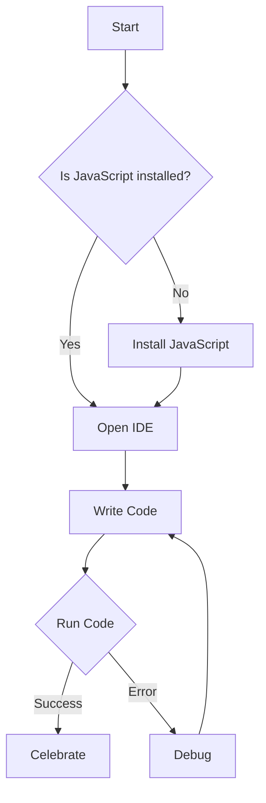

## 1.8 How to Use This Guide

Welcome to the "Mastering JavaScript Design Patterns: Best Practices and Advanced Techniques for Modern Web Development" guide. This comprehensive resource is designed to help you unlock the full potential of JavaScript through a deep dive into design patterns, best practices, and advanced programming techniques. Whether you're a beginner, an intermediate developer, or an advanced practitioner, this guide is structured to cater to your learning needs and objectives.

### Understanding the Structure of the Guide

This guide is organized into 29 chapters, each focusing on a specific aspect of JavaScript and its application in modern web development. Here's a brief overview of how the topics are structured:

- **Introduction to Design Patterns in JavaScript**: Provides foundational knowledge about design patterns and their relevance in JavaScript.
- **Core Concepts of JavaScript**: Covers essential JavaScript concepts such as the engine, execution context, and asynchronous programming.
- **JavaScript Language Features and Best Practices**: Discusses language features, coding conventions, and performance optimization.
- **Idiomatic JavaScript Patterns**: Explores common JavaScript patterns and idioms.
- **Creational, Structural, and Behavioral Design Patterns**: Delves into specific design patterns and their implementation in JavaScript.
- **Asynchronous Patterns and Concurrency**: Focuses on handling asynchronous operations and concurrency.
- **Functional and Object-Oriented Programming**: Examines different programming paradigms within JavaScript.
- **Modular JavaScript and Code Organization**: Discusses module systems and code organization strategies.
- **Testing and Quality Assurance**: Provides insights into testing methodologies and tools.
- **Performance Optimization Patterns**: Offers techniques for optimizing JavaScript performance.
- **Security Patterns**: Covers security best practices and patterns.
- **Front-End and Back-End Development Patterns**: Tailored for developers focusing on either front-end or back-end development.
- **Integration with Other Systems**: Explores interoperability with various systems and services.
- **Mobile and Desktop Development**: Discusses JavaScript's role in mobile and desktop application development.
- **WebAssembly and Advanced Techniques**: Introduces WebAssembly and other advanced JavaScript techniques.
- **Emerging Technologies and Advanced Topics**: Looks at cutting-edge technologies and their integration with JavaScript.
- **Build Tools and Automation**: Covers tools and practices for automating development workflows.
- **Internationalization and Localization**: Discusses adapting applications for global audiences.
- **Anti-Patterns and Common Pitfalls**: Identifies common mistakes and how to avoid them.
- **Data Structures and Algorithms**: Explores algorithms and data structures in JavaScript.
- **TypeScript and JavaScript Design Patterns**: Introduces TypeScript and its integration with JavaScript patterns.
- **Domain-Driven Design in JavaScript**: Discusses applying domain-driven design principles in JavaScript projects.
- **Appendices**: Provides additional resources, glossaries, and FAQs.

### Pathways for Different Skill Levels

#### Beginners

If you're new to JavaScript or design patterns, start with the **Introduction to Design Patterns in JavaScript** and **Core Concepts of JavaScript** chapters. These sections will build a solid foundation by explaining essential concepts and terminology. As you progress, explore the **Idiomatic JavaScript Patterns** to familiarize yourself with common patterns used in everyday coding.

**Recommended Pathway:**

1. **Introduction to Design Patterns in JavaScript**
2. **Core Concepts of JavaScript**
3. **Idiomatic JavaScript Patterns**
4. **JavaScript Language Features and Best Practices**

#### Intermediate Developers

For those with a working knowledge of JavaScript, focus on the **JavaScript Language Features and Best Practices** and **Creational, Structural, and Behavioral Design Patterns** chapters. These sections will enhance your understanding of design patterns and how to apply them effectively in your projects.

**Recommended Pathway:**

1. **JavaScript Language Features and Best Practices**
2. **Creational Design Patterns in JavaScript**
3. **Structural Design Patterns in JavaScript**
4. **Behavioral Design Patterns in JavaScript**

#### Advanced Practitioners

Advanced developers should delve into the **Asynchronous Patterns and Concurrency**, **Functional Programming in JavaScript**, and **Object-Oriented Programming in JavaScript** chapters. These sections cover complex topics and advanced techniques that will refine your skills and expand your toolkit.

**Recommended Pathway:**

1. **Asynchronous Patterns and Concurrency in JavaScript**
2. **Functional Programming in JavaScript**
3. **Object-Oriented Programming in JavaScript**
4. **Metaprogramming and Advanced Techniques**

### Key Chapters for Specific Interests

#### Front-End Developers

Front-end developers should pay special attention to the **Front-End Development Patterns** and **Modular JavaScript and Code Organization** chapters. These sections provide insights into building efficient, scalable, and maintainable front-end applications.

**Recommended Sections:**

- **Front-End Development Patterns**
- **Modular JavaScript and Code Organization**
- **Performance Optimization Patterns**

#### Node.js Developers

Node.js developers will benefit from the **Back-End Development with Node.js** and **Integration with Other Systems** chapters. These sections cover server-side JavaScript development, including RESTful APIs, microservices, and real-time applications.

**Recommended Sections:**

- **Back-End Development with Node.js**
- **Integration with Other Systems**
- **Security Patterns**

### Setting Up Your Development Environment

To get the most out of this guide, it's essential to set up a robust development environment. Here are some tips to help you get started:

1. **Install Node.js**: Ensure you have the latest version of Node.js installed. This will provide you with the JavaScript runtime and npm (Node Package Manager) for managing dependencies.

2. **Choose an IDE**: Select a powerful Integrated Development Environment (IDE) like Visual Studio Code, which offers excellent support for JavaScript and TypeScript.

3. **Set Up Version Control**: Use Git for version control to manage your code changes and collaborate with others.

4. **Install Linters and Formatters**: Use ESLint for linting and Prettier for code formatting to maintain code quality and consistency.

5. **Explore Browser Developer Tools**: Familiarize yourself with browser developer tools for debugging and performance profiling.

6. **Use Package Managers**: Leverage npm or Yarn for managing project dependencies and scripts.

### Engaging with Code Examples and Exercises

This guide is packed with code examples and exercises designed to reinforce your learning. Here are some tips for engaging with these resources:

- **Experiment with Code**: Don't just read the examples—try them out! Modify the code to see how changes affect the outcome.

- **Use "Try It Yourself" Sections**: Each chapter includes sections where you can experiment with code snippets. Use these opportunities to deepen your understanding.

- **Solve Practice Problems**: At the end of each chapter, you'll find exercises and practice problems. These are designed to challenge your understanding and help you apply what you've learned.

- **Review Key Takeaways**: Summarize the main points of each chapter to reinforce your learning.

### Encouragement and Support

Remember, mastering JavaScript design patterns is a journey. As you progress through this guide, you'll build a deeper understanding of JavaScript and its capabilities. Stay curious, keep experimenting, and don't hesitate to revisit sections as needed. This guide is here to support you every step of the way.

### Visualizing Concepts

To aid your understanding, this guide includes diagrams and visualizations created with Mermaid.js. These visuals help illustrate complex concepts, such as the Document Object Model (DOM) tree structure, variable scope chains, and program flow in control structures. Here's an example of a simple flowchart:

### References and Further Reading

Throughout this guide, you'll find hyperlinks to reputable external resources, such as the [MDN Web Docs](https://developer.mozilla.org/) and [W3Schools](https://www.w3schools.com/). These links provide additional information and deeper dives into specific topics.

### Knowledge Check and Exercises

To reinforce your learning, each chapter includes a knowledge check section with questions and small challenges. At the end of the guide, you'll find a comprehensive quiz to test your understanding of the material.

### Embrace the Journey

As you embark on this journey, remember that learning is a continuous process. Embrace the challenges, celebrate your successes, and enjoy the process of mastering JavaScript design patterns. This guide is your companion, providing the knowledge and support you need to succeed.

### Best Practices for Tags

To help you navigate this guide and find relevant content, we've used specific and relevant tags. These tags reflect key topics, technologies, and concepts covered in the guide, such as "JavaScript," "Design Patterns," "Web Development," and more.

---

## Quiz: Navigating the JavaScript Design Patterns Guide



### What is the primary purpose of this guide?

- [x] To provide a comprehensive understanding of JavaScript design patterns and best practices.
- [ ] To teach basic JavaScript syntax.
- [ ] To focus solely on front-end development.
- [ ] To offer a history of JavaScript.

> **Explanation:** The guide is designed to provide a comprehensive understanding of JavaScript design patterns and best practices for modern web development.

### Which section should beginners start with?

- [x] Introduction to Design Patterns in JavaScript
- [ ] Asynchronous Patterns and Concurrency
- [ ] Metaprogramming and Advanced Techniques
- [ ] Security Patterns

> **Explanation:** Beginners should start with the "Introduction to Design Patterns in JavaScript" to build a solid foundation.

### What tool is recommended for version control?

- [x] Git
- [ ] SVN
- [ ] Mercurial
- [ ] CVS

> **Explanation:** Git is the recommended tool for version control due to its widespread use and robust features.

### Which IDE is suggested for JavaScript development?

- [x] Visual Studio Code
- [ ] Eclipse
- [ ] NetBeans
- [ ] IntelliJ IDEA

> **Explanation:** Visual Studio Code is suggested due to its excellent support for JavaScript and TypeScript.

### What should advanced developers focus on?

- [x] Asynchronous Patterns and Concurrency
- [ ] Introduction to Design Patterns in JavaScript
- [ ] Core Concepts of JavaScript
- [ ] JavaScript Language Features and Best Practices

> **Explanation:** Advanced developers should focus on "Asynchronous Patterns and Concurrency" to refine their skills.

### What is the role of ESLint in the development environment?

- [x] To lint code and maintain quality
- [ ] To compile JavaScript code
- [ ] To manage dependencies
- [ ] To format code

> **Explanation:** ESLint is used to lint code and maintain quality by identifying and fixing issues.

### Which chapter is recommended for Node.js developers?

- [x] Back-End Development with Node.js
- [ ] Front-End Development Patterns
- [ ] Functional Programming in JavaScript
- [ ] Security Patterns

> **Explanation:** Node.js developers should focus on "Back-End Development with Node.js" for server-side JavaScript development.

### What is the purpose of the "Try It Yourself" sections?

- [x] To encourage experimentation with code snippets
- [ ] To provide historical context
- [ ] To offer theoretical explanations
- [ ] To list JavaScript libraries

> **Explanation:** The "Try It Yourself" sections are designed to encourage experimentation with code snippets.

### What is the benefit of using Mermaid.js diagrams?

- [x] To visually represent complex concepts
- [ ] To write JavaScript code
- [ ] To manage project dependencies
- [ ] To automate testing

> **Explanation:** Mermaid.js diagrams are used to visually represent complex concepts, aiding understanding.

### True or False: This guide is only for front-end developers.

- [ ] True
- [x] False

> **Explanation:** False. This guide is designed for both front-end and back-end developers, covering a wide range of topics.


