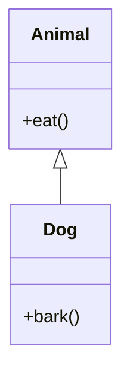
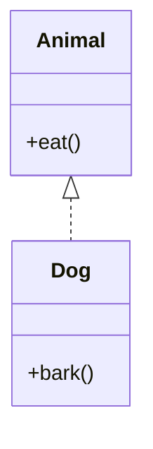

## 10.1 Classical vs Prototypal Inheritance

In the realm of object-oriented programming (OOP), inheritance is a fundamental concept that allows new objects to take on the properties and behaviors of existing objects. JavaScript, a versatile and dynamic language, offers a unique approach to inheritance that differs from classical languages like Java and C++. In this section, we will delve into the intricacies of classical and prototypal inheritance, providing a comprehensive understanding of how each model works, their implications, and best practices for using them effectively in JavaScript.

### Classical Inheritance

**Definition and Characteristics**

Classical inheritance is a model commonly found in languages such as Java, C++, and C#. It is based on the concept of classes, which serve as blueprints for creating objects. In classical inheritance:

- **Classes** define the structure and behavior of objects.
- **Inheritance** is achieved through a hierarchical class structure, where subclasses inherit properties and methods from their parent classes.
- **Encapsulation** is emphasized, with private and public access modifiers controlling visibility.
- **Polymorphism** allows objects to be treated as instances of their parent class, enabling dynamic method invocation.

**Example of Classical Inheritance in Java**

```java
class Animal {
    void eat() {
        System.out.println("This animal eats food.");
    }
}

class Dog extends Animal {
    void bark() {
        System.out.println("The dog barks.");
    }
}

public class Main {
    public static void main(String[] args) {
        Dog dog = new Dog();
        dog.eat(); // Inherited method
        dog.bark(); // Own method
    }
}
```

In this example, the `Dog` class inherits from the `Animal` class, gaining access to the `eat` method while adding its own `bark` method.

### Prototypal Inheritance

**Definition and Characteristics**

Prototypal inheritance is the native inheritance model in JavaScript. Unlike classical inheritance, it does not rely on classes but rather on prototypes. Key characteristics include:

- **Objects** are the primary entities, and every object has a prototype.
- **Inheritance** is achieved by linking objects directly, allowing them to share properties and methods.
- **Dynamic** nature, where properties and methods can be added or modified at runtime.
- **Flexibility** in creating and extending objects without rigid class hierarchies.

**Example of Prototypal Inheritance in JavaScript**

```javascript
const animal = {
    eat() {
        console.log("This animal eats food.");
    }
};

const dog = Object.create(animal);
dog.bark = function() {
    console.log("The dog barks.");
};

dog.eat(); // Inherited method
dog.bark(); // Own method
```

Here, the `dog` object is created with `animal` as its prototype, inheriting the `eat` method and adding its own `bark` method.

### Differences Between Classical and Prototypal Inheritance

**Structure and Syntax**

- **Classical Inheritance** uses classes and extends keywords to establish inheritance hierarchies.
- **Prototypal Inheritance** uses objects and the `Object.create()` method to link prototypes.

**Flexibility**

- **Classical Inheritance** is more rigid, with a fixed class hierarchy.
- **Prototypal Inheritance** offers greater flexibility, allowing objects to be extended and modified dynamically.

**Performance**

- **Classical Inheritance** can be more performant in languages optimized for class-based structures.
- **Prototypal Inheritance** may introduce overhead due to dynamic property lookups along the prototype chain.

**Code Reusability**

- **Classical Inheritance** promotes code reuse through class hierarchies.
- **Prototypal Inheritance** allows for more granular reuse by sharing properties and methods between objects.

### Implications of Using Each Model in JavaScript

**Classical Inheritance in JavaScript**

JavaScript introduced the `class` syntax in ES6 to provide a more familiar structure for developers coming from class-based languages. However, it's important to note that JavaScript classes are syntactical sugar over prototypal inheritance.

**Example of JavaScript Class Syntax**

```javascript
class Animal {
    eat() {
        console.log("This animal eats food.");
    }
}

class Dog extends Animal {
    bark() {
        console.log("The dog barks.");
    }
}

const dog = new Dog();
dog.eat(); // Inherited method
dog.bark(); // Own method
```

While this syntax resembles classical inheritance, it still operates on JavaScript's prototypal model under the hood.

**Prototypal Inheritance in JavaScript**

Prototypal inheritance is more aligned with JavaScript's dynamic nature, offering a more flexible approach to object creation and extension.

**Example of Dynamic Object Extension**

```javascript
const animal = {
    eat() {
        console.log("This animal eats food.");
    }
};

const dog = Object.create(animal);
dog.bark = function() {
    console.log("The dog barks.");
};

// Adding a new method dynamically
dog.run = function() {
    console.log("The dog runs.");
};

dog.run(); // New method
```

### Best Practices for Leveraging Prototypal Inheritance

1. **Use Object.create()**: Prefer `Object.create()` for creating new objects with a specified prototype, ensuring a clean and efficient prototype chain.

2. **Avoid Modifying Built-in Prototypes**: Modifying built-in prototypes like `Array.prototype` or `Object.prototype` can lead to unexpected behavior and conflicts.

3. **Leverage Mixins for Composition**: Use mixins to compose objects with shared behavior, promoting code reuse without rigid hierarchies.

4. **Understand the Prototype Chain**: Be aware of the prototype chain and how property lookups work to avoid performance pitfalls.

5. **Embrace Dynamic Extension**: Take advantage of JavaScript's dynamic nature to extend objects as needed, but do so judiciously to maintain code clarity.

### Comparing Flexibility and Complexity

**Flexibility**

- **Prototypal Inheritance**: Offers greater flexibility, allowing developers to create and extend objects dynamically. This is particularly useful in scenarios where objects need to adapt to changing requirements.

- **Classical Inheritance**: Provides a more structured approach, which can be beneficial for large-scale applications with well-defined hierarchies.

**Complexity**

- **Prototypal Inheritance**: Can introduce complexity due to the dynamic nature of objects and prototype chains. Developers must be cautious of potential performance issues and maintain clear code organization.

- **Classical Inheritance**: While more structured, it can lead to deep inheritance hierarchies that are difficult to manage and understand.

### Visualizing Inheritance Models

To better understand the differences between classical and prototypal inheritance, let's visualize these models using Mermaid.js diagrams.

**Classical Inheritance Diagram**



**Prototypal Inheritance Diagram**



In the classical inheritance diagram, the `Dog` class extends the `Animal` class, forming a hierarchical relationship. In the prototypal inheritance diagram, the `Dog` object is linked to the `Animal` object, illustrating a more flexible and dynamic relationship.

### Knowledge Check

- **What are the key differences between classical and prototypal inheritance?**
- **How does JavaScript's `class` syntax relate to prototypal inheritance?**
- **What are some best practices for using prototypal inheritance effectively?**

### Exercises

1. **Implement a simple inheritance hierarchy using JavaScript's `class` syntax.**
2. **Create a set of objects using prototypal inheritance and demonstrate dynamic extension.**
3. **Compare the performance of classical and prototypal inheritance in a small benchmark.**

### Summary

In this section, we've explored the fundamental differences between classical and prototypal inheritance, understanding how each model works and their implications in JavaScript. By leveraging the flexibility of prototypal inheritance and the structure of classical inheritance, developers can create robust and adaptable applications. Remember, this is just the beginning. As you progress, you'll build more complex and interactive web pages. Keep experimenting, stay curious, and enjoy the journey!

## Quiz: Understanding Inheritance in JavaScript



### What is the primary entity in prototypal inheritance?

- [x] Objects
- [ ] Classes
- [ ] Functions
- [ ] Modules

> **Explanation:** In prototypal inheritance, objects are the primary entities, and every object has a prototype.

### Which method is used to create a new object with a specified prototype in JavaScript?

- [x] Object.create()
- [ ] Object.new()
- [ ] Object.prototype()
- [ ] Object.extend()

> **Explanation:** `Object.create()` is used to create a new object with a specified prototype.

### What is a key characteristic of classical inheritance?

- [x] Hierarchical class structure
- [ ] Dynamic object linking
- [ ] Prototype chain
- [ ] Function composition

> **Explanation:** Classical inheritance is characterized by a hierarchical class structure where subclasses inherit from parent classes.

### How does JavaScript's `class` syntax relate to prototypal inheritance?

- [x] It's syntactical sugar over prototypal inheritance
- [ ] It completely replaces prototypal inheritance
- [ ] It introduces classical inheritance
- [ ] It does not relate to inheritance

> **Explanation:** JavaScript's `class` syntax is syntactical sugar over prototypal inheritance, providing a more familiar structure for developers.

### Which inheritance model offers greater flexibility?

- [x] Prototypal inheritance
- [ ] Classical inheritance
- [ ] Neither
- [ ] Both equally

> **Explanation:** Prototypal inheritance offers greater flexibility, allowing objects to be extended and modified dynamically.

### What is a best practice for leveraging prototypal inheritance?

- [x] Use Object.create() for creating new objects
- [ ] Modify built-in prototypes
- [ ] Avoid using prototypes
- [ ] Use deep inheritance hierarchies

> **Explanation:** Using `Object.create()` for creating new objects with a specified prototype is a best practice in prototypal inheritance.

### What can introduce complexity in prototypal inheritance?

- [x] Dynamic nature of objects
- [ ] Fixed class hierarchies
- [ ] Encapsulation
- [ ] Polymorphism

> **Explanation:** The dynamic nature of objects and prototype chains can introduce complexity in prototypal inheritance.

### Which inheritance model is more aligned with JavaScript's dynamic nature?

- [x] Prototypal inheritance
- [ ] Classical inheritance
- [ ] Both equally
- [ ] Neither

> **Explanation:** Prototypal inheritance is more aligned with JavaScript's dynamic nature, allowing for flexible object creation and extension.

### What is a potential performance issue with prototypal inheritance?

- [x] Dynamic property lookups
- [ ] Fixed class hierarchies
- [ ] Lack of encapsulation
- [ ] Overuse of classes

> **Explanation:** Dynamic property lookups along the prototype chain can introduce performance overhead in prototypal inheritance.

### True or False: JavaScript's `class` syntax introduces classical inheritance.

- [ ] True
- [x] False

> **Explanation:** False. JavaScript's `class` syntax is syntactical sugar over prototypal inheritance, not classical inheritance.


