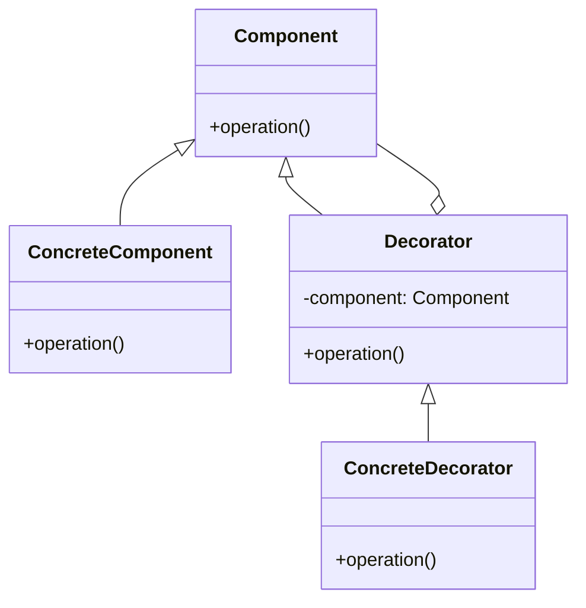

## 10.10 Decorator Pattern for Object Augmentation

The Decorator Pattern is a structural design pattern that allows behavior to be added to individual objects dynamically without altering the original object. This pattern is particularly useful in JavaScript, where objects can be easily extended and modified. In this section, we will explore the Decorator Pattern in depth, providing examples and discussing its applications in modern web development.

### Understanding the Decorator Pattern

#### Definition

The Decorator Pattern is a design pattern used to extend the functionality of objects by wrapping them with additional behavior. Unlike subclassing, which creates a new class with extended functionality, the Decorator Pattern allows for the addition of responsibilities to objects at runtime.

#### Key Participants

- **Component**: The original object that can be decorated.
- **Decorator**: An object that wraps the component and adds new behavior.
- **Concrete Decorator**: A specific implementation of a decorator that adds particular functionality.

#### Intent

The primary intent of the Decorator Pattern is to provide a flexible alternative to subclassing for extending functionality. It allows for the dynamic composition of behavior, enabling developers to add new features to objects without modifying their structure.

### Visualizing the Decorator Pattern

Below is a simple diagram illustrating the Decorator Pattern:



**Diagram Description**: This diagram shows the relationship between the Component, Decorator, and Concrete Decorator. The Decorator wraps the Component, and the Concrete Decorator extends the Decorator to add new behavior.

### Implementing the Decorator Pattern in JavaScript

#### Using Functions

In JavaScript, functions can be used to implement decorators. Let's consider a simple example where we have a basic `Car` object, and we want to add new features like `turbo` and `sunroof`.

```javascript
// Base component
function Car() {
    this.description = "Basic Car";
}

Car.prototype.getDescription = function() {
    return this.description;
};

Car.prototype.cost = function() {
    return 15000;
};

// Decorator 1
function Turbo(car) {
    this.car = car;
}

Turbo.prototype.getDescription = function() {
    return this.car.getDescription() + ', Turbo';
};

Turbo.prototype.cost = function() {
    return this.car.cost() + 5000;
};

// Decorator 2
function Sunroof(car) {
    this.car = car;
}

Sunroof.prototype.getDescription = function() {
    return this.car.getDescription() + ', Sunroof';
};

Sunroof.prototype.cost = function() {
    return this.car.cost() + 3000;
};

// Usage
let myCar = new Car();
myCar = new Turbo(myCar);
myCar = new Sunroof(myCar);

console.log(myCar.getDescription()); // Output: Basic Car, Turbo, Sunroof
console.log(myCar.cost()); // Output: 23000
```

**Explanation**: In this example, the `Car` object is decorated with `Turbo` and `Sunroof` to add new features. Each decorator adds its own behavior to the `getDescription` and `cost` methods.

#### Using Classes

With the introduction of ES6, JavaScript now supports classes, making it easier to implement decorators using class syntax.

```javascript
// Base component
class Car {
    constructor() {
        this.description = "Basic Car";
    }

    getDescription() {
        return this.description;
    }

    cost() {
        return 15000;
    }
}

// Decorator 1
class Turbo {
    constructor(car) {
        this.car = car;
    }

    getDescription() {
        return this.car.getDescription() + ', Turbo';
    }

    cost() {
        return this.car.cost() + 5000;
    }
}

// Decorator 2
class Sunroof {
    constructor(car) {
        this.car = car;
    }

    getDescription() {
        return this.car.getDescription() + ', Sunroof';
    }

    cost() {
        return this.car.cost() + 3000;
    }
}

// Usage
let myCar = new Car();
myCar = new Turbo(myCar);
myCar = new Sunroof(myCar);

console.log(myCar.getDescription()); // Output: Basic Car, Turbo, Sunroof
console.log(myCar.cost()); // Output: 23000
```

**Explanation**: This example demonstrates the same functionality as the previous one, but using ES6 classes for a more modern approach.

### Use Cases for the Decorator Pattern

The Decorator Pattern is particularly useful in scenarios where:

- **Dynamic Behavior**: You need to add behavior to objects dynamically at runtime.
- **Open/Closed Principle**: You want to adhere to the open/closed principle, allowing objects to be open for extension but closed for modification.
- **Avoiding Subclass Explosion**: You want to avoid creating a large number of subclasses for every possible combination of features.

#### Enhancing Objects with New Methods or Properties

Consider a scenario where you have a `User` object, and you want to add roles and permissions dynamically.

```javascript
// Base component
class User {
    constructor(name) {
        this.name = name;
    }

    getName() {
        return this.name;
    }
}

// Decorator for adding roles
class RoleDecorator {
    constructor(user, role) {
        this.user = user;
        this.role = role;
    }

    getName() {
        return `${this.user.getName()} [${this.role}]`;
    }
}

// Decorator for adding permissions
class PermissionDecorator {
    constructor(user, permission) {
        this.user = user;
        this.permission = permission;
    }

    getName() {
        return `${this.user.getName()} with ${this.permission} permission`;
    }
}

// Usage
let user = new User("Alice");
user = new RoleDecorator(user, "Admin");
user = new PermissionDecorator(user, "Read-Write");

console.log(user.getName()); // Output: Alice [Admin] with Read-Write permission
```

**Explanation**: This example shows how decorators can be used to add roles and permissions to a `User` object dynamically.

### Differences from Subclassing

While subclassing involves creating a new class that inherits from an existing class, the Decorator Pattern involves wrapping an object with additional functionality. Here are some key differences:

- **Flexibility**: Decorators provide more flexibility as they allow for the dynamic composition of behavior at runtime.
- **Single Responsibility**: Decorators adhere to the single responsibility principle by allowing each decorator to focus on a specific behavior.
- **Avoiding Inheritance**: Decorators avoid the complexities and limitations of inheritance, such as the diamond problem.

### JavaScript Decorators (Stage 2 Proposal)

JavaScript decorators are a stage 2 proposal for adding a decorator syntax to the language. They provide a way to annotate and modify classes and methods at design time. Although not yet part of the ECMAScript standard, they offer a glimpse into the future of JavaScript.

#### Example of JavaScript Decorators

```javascript
function readonly(target, key, descriptor) {
    descriptor.writable = false;
    return descriptor;
}

class Car {
    @readonly
    getDescription() {
        return "Basic Car";
    }
}

const myCar = new Car();
console.log(myCar.getDescription()); // Output: Basic Car
myCar.getDescription = function() { return "Modified Car"; }; // Error: Cannot assign to read only property
```

**Explanation**: In this example, the `readonly` decorator is used to make the `getDescription` method of the `Car` class immutable.

### Design Considerations

When using the Decorator Pattern, consider the following:

- **Performance**: Adding multiple layers of decorators can impact performance, especially if each decorator adds significant overhead.
- **Complexity**: Overusing decorators can lead to complex and difficult-to-maintain code. Use them judiciously.
- **Compatibility**: Ensure that decorators are compatible with the objects they wrap, especially when dealing with third-party libraries.

### JavaScript Unique Features

JavaScript's dynamic nature makes it particularly well-suited for the Decorator Pattern. The ability to modify objects at runtime and the flexibility of functions and closures allow for powerful and expressive decorators.

### Differences and Similarities with Other Patterns

The Decorator Pattern is often confused with the Proxy Pattern. While both involve wrapping objects, the Proxy Pattern focuses on controlling access to an object, whereas the Decorator Pattern focuses on adding behavior.

### Try It Yourself

Experiment with the provided examples by adding new decorators or modifying existing ones. Try creating a `SportsPackage` decorator for the `Car` example that adds a sports package to the car.

### Knowledge Check

- What is the primary intent of the Decorator Pattern?
- How does the Decorator Pattern differ from subclassing?
- What are some use cases for the Decorator Pattern?
- How can JavaScript decorators be used to modify class methods?

### Embrace the Journey

Remember, this is just the beginning. As you progress, you'll build more complex and interactive web applications. Keep experimenting, stay curious, and enjoy the journey!

## Quiz: Mastering the Decorator Pattern in JavaScript



### What is the primary purpose of the Decorator Pattern?

- [x] To add behavior to objects dynamically without altering their structure
- [ ] To create new classes with extended functionality
- [ ] To simplify object inheritance
- [ ] To manage object lifecycle

> **Explanation:** The Decorator Pattern allows for the dynamic addition of behavior to objects without modifying their structure.

### How does the Decorator Pattern differ from subclassing?

- [x] Decorators add behavior at runtime, while subclassing adds behavior at compile time
- [ ] Decorators create new classes, while subclassing modifies existing classes
- [ ] Decorators are less flexible than subclassing
- [ ] Decorators and subclassing are the same

> **Explanation:** Decorators allow for the dynamic composition of behavior at runtime, unlike subclassing, which is static.

### Which of the following is a use case for the Decorator Pattern?

- [x] Adding roles and permissions to a user object
- [ ] Creating a new class hierarchy
- [ ] Simplifying object construction
- [ ] Managing object dependencies

> **Explanation:** The Decorator Pattern is useful for dynamically adding roles and permissions to objects.

### What is a potential drawback of using the Decorator Pattern?

- [x] Increased complexity and potential performance overhead
- [ ] Reduced flexibility in object design
- [ ] Difficulty in creating new classes
- [ ] Limited to a single programming language

> **Explanation:** Overusing decorators can lead to complex and difficult-to-maintain code, and multiple layers can impact performance.

### What is the status of JavaScript decorators in the ECMAScript standard?

- [x] Stage 2 proposal
- [ ] Fully standardized
- [ ] Deprecated
- [ ] Not yet proposed

> **Explanation:** JavaScript decorators are currently a stage 2 proposal and not yet part of the ECMAScript standard.

### Which pattern is often confused with the Decorator Pattern?

- [x] Proxy Pattern
- [ ] Singleton Pattern
- [ ] Factory Pattern
- [ ] Observer Pattern

> **Explanation:** The Decorator Pattern is often confused with the Proxy Pattern, but they serve different purposes.

### What is a key benefit of using decorators over subclassing?

- [x] Adherence to the single responsibility principle
- [ ] Easier to implement
- [ ] Better performance
- [ ] Simplified object creation

> **Explanation:** Decorators adhere to the single responsibility principle by allowing each decorator to focus on a specific behavior.

### How can decorators be implemented in JavaScript?

- [x] Using functions or classes to wrap objects
- [ ] By modifying the prototype chain
- [ ] Through direct object modification
- [ ] Using only ES6 classes

> **Explanation:** Decorators can be implemented using functions or classes to wrap and extend objects.

### What is a common use case for JavaScript decorators (stage 2 proposal)?

- [x] Annotating and modifying class methods
- [ ] Creating new object instances
- [ ] Simplifying inheritance
- [ ] Managing object state

> **Explanation:** JavaScript decorators are used to annotate and modify class methods at design time.

### True or False: The Decorator Pattern is only applicable to object-oriented programming languages.

- [ ] True
- [x] False

> **Explanation:** The Decorator Pattern can be applied in any language that supports dynamic object modification, including JavaScript.


