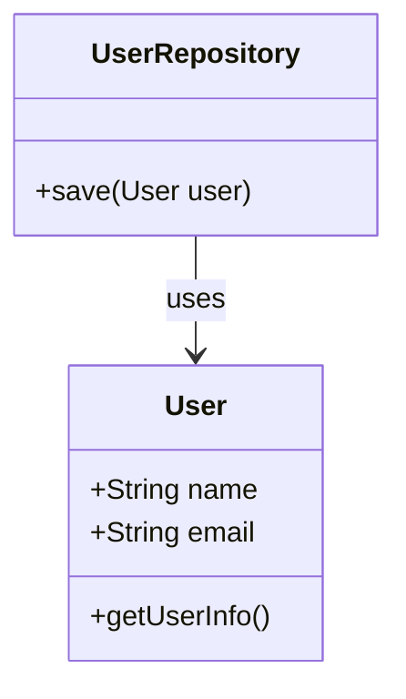

## 10.11 SOLID Principles Applied to JavaScript

The SOLID principles are a set of five design principles intended to make software designs more understandable, flexible, and maintainable. These principles are crucial in object-oriented programming (OOP) and can be effectively applied to JavaScript, despite its dynamic nature. In this section, we will explore each SOLID principle, provide JavaScript examples, and discuss the benefits and challenges of applying these principles in JavaScript development.

### Single Responsibility Principle (SRP)

**Definition**: A class should have only one reason to change, meaning it should have only one job or responsibility.

**Explanation**: The Single Responsibility Principle emphasizes that a class or module should focus on a single task or functionality. This makes the code easier to understand, test, and maintain.

**JavaScript Example**:

```javascript
// Before applying SRP
class User {
    constructor(name, email) {
        this.name = name;
        this.email = email;
    }

    getUserInfo() {
        return `Name: ${this.name}, Email: ${this.email}`;
    }

    saveUserToDatabase() {
        // Code to save user to database
    }
}

// After applying SRP
class User {
    constructor(name, email) {
        this.name = name;
        this.email = email;
    }

    getUserInfo() {
        return `Name: ${this.name}, Email: ${this.email}`;
    }
}

class UserRepository {
    save(user) {
        // Code to save user to database
    }
}
```

**Benefits**: By adhering to SRP, we ensure that each class or module has a clear purpose, making it easier to modify and extend without affecting unrelated functionalities.

**Challenges**: In JavaScript, where functions and objects can be easily extended, it's tempting to add multiple responsibilities to a single entity. Discipline in design is required to maintain SRP.

### Open/Closed Principle (OCP)

**Definition**: Software entities should be open for extension but closed for modification.

**Explanation**: The Open/Closed Principle encourages developers to write code that can be extended without altering existing code, thus reducing the risk of introducing bugs.

**JavaScript Example**:

```javascript
// Before applying OCP
class Rectangle {
    constructor(width, height) {
        this.width = width;
        this.height = height;
    }

    area() {
        return this.width * this.height;
    }
}

class Circle {
    constructor(radius) {
        this.radius = radius;
    }

    area() {
        return Math.PI * this.radius * this.radius;
    }
}

// After applying OCP using polymorphism
class Shape {
    area() {
        throw new Error("Method 'area()' must be implemented.");
    }
}

class Rectangle extends Shape {
    constructor(width, height) {
        super();
        this.width = width;
        this.height = height;
    }

    area() {
        return this.width * this.height;
    }
}

class Circle extends Shape {
    constructor(radius) {
        super();
        this.radius = radius;
    }

    area() {
        return Math.PI * this.radius * this.radius;
    }
}
```

**Benefits**: OCP allows for the addition of new functionalities with minimal risk of breaking existing code, promoting a more robust and flexible codebase.

**Challenges**: Implementing OCP can sometimes lead to complex inheritance hierarchies or require additional abstraction, which can be challenging to manage in JavaScript.

### Liskov Substitution Principle (LSP)

**Definition**: Objects of a superclass should be replaceable with objects of a subclass without affecting the correctness of the program.

**Explanation**: The Liskov Substitution Principle ensures that a subclass can stand in for its superclass without altering the desirable properties of the program.

**JavaScript Example**:

```javascript
// Violating LSP
class Bird {
    fly() {
        console.log("Flying");
    }
}

class Penguin extends Bird {
    fly() {
        throw new Error("Penguins can't fly");
    }
}

// Adhering to LSP
class Bird {
    move() {
        console.log("Moving");
    }
}

class FlyingBird extends Bird {
    fly() {
        console.log("Flying");
    }
}

class Penguin extends Bird {
    swim() {
        console.log("Swimming");
    }
}
```

**Benefits**: Adhering to LSP ensures that the system remains consistent and predictable, allowing for safer polymorphism and code reuse.

**Challenges**: In JavaScript, dynamic typing can make it difficult to enforce LSP, requiring careful design and testing to ensure compliance.

### Interface Segregation Principle (ISP)

**Definition**: Clients should not be forced to depend on interfaces they do not use.

**Explanation**: The Interface Segregation Principle advocates for creating specific interfaces rather than a single, general-purpose interface.

**JavaScript Example**:

```javascript
// Violating ISP
class Worker {
    work() {
        console.log("Working");
    }

    eat() {
        console.log("Eating");
    }
}

class Robot extends Worker {
    eat() {
        throw new Error("Robots don't eat");
    }
}

// Adhering to ISP
class Workable {
    work() {
        console.log("Working");
    }
}

class Eatable {
    eat() {
        console.log("Eating");
    }
}

class HumanWorker extends Workable {
    eat() {
        console.log("Eating");
    }
}

class RobotWorker extends Workable {}
```

**Benefits**: ISP leads to more modular and flexible code, allowing clients to depend only on the interfaces they need.

**Challenges**: JavaScript lacks native interface support, requiring developers to simulate interfaces using classes or objects, which can be cumbersome.

### Dependency Inversion Principle (DIP)

**Definition**: High-level modules should not depend on low-level modules. Both should depend on abstractions.

**Explanation**: The Dependency Inversion Principle encourages the use of abstractions to decouple high-level and low-level components, promoting flexibility and reusability.

**JavaScript Example**:

```javascript
// Violating DIP
class Database {
    connect() {
        console.log("Connecting to database");
    }
}

class Application {
    constructor() {
        this.database = new Database();
    }

    start() {
        this.database.connect();
    }
}

// Adhering to DIP
class Database {
    connect() {
        console.log("Connecting to database");
    }
}

class Application {
    constructor(database) {
        this.database = database;
    }

    start() {
        this.database.connect();
    }
}

// Usage
const database = new Database();
const app = new Application(database);
app.start();
```

**Benefits**: DIP promotes a more flexible and testable codebase by reducing dependencies between high-level and low-level modules.

**Challenges**: Implementing DIP in JavaScript requires careful design to avoid tight coupling, especially in large codebases.

### Benefits of Adhering to SOLID Principles

- **Maintainability**: SOLID principles lead to cleaner, more organized code that is easier to maintain and extend.
- **Scalability**: By promoting modularity and flexibility, SOLID principles facilitate the growth and scaling of applications.
- **Testability**: SOLID codebases are generally easier to test, as components are well-defined and decoupled.
- **Reusability**: SOLID principles encourage the creation of reusable components, reducing duplication and effort.

### Challenges in Applying SOLID Principles in JavaScript

- **Dynamic Typing**: JavaScript's dynamic nature can make it difficult to enforce certain principles, such as LSP and ISP.
- **Lack of Interfaces**: JavaScript does not have native support for interfaces, requiring developers to simulate them using classes or objects.
- **Complexity**: Over-application of SOLID principles can lead to unnecessary complexity, especially in small projects.

### Best Practices for Maintaining SOLID Codebases

- **Use Design Patterns**: Leverage design patterns to implement SOLID principles effectively.
- **Refactor Regularly**: Continuously refactor code to adhere to SOLID principles, improving maintainability and flexibility.
- **Write Tests**: Ensure that code is well-tested to verify compliance with SOLID principles.
- **Stay Informed**: Keep up-to-date with best practices and emerging trends in software design and architecture.

### Try It Yourself

Experiment with the provided code examples by modifying them to suit different scenarios. For instance, try adding new shapes to the OCP example or creating new worker types in the ISP example. Observe how adhering to SOLID principles makes these changes easier and more intuitive.

### Visualizing SOLID Principles in JavaScript



**Caption**: This diagram illustrates the Single Responsibility Principle by separating user data management from database operations.

### References and Links

- [MDN Web Docs: JavaScript](https://developer.mozilla.org/en-US/docs/Web/JavaScript)
- [SOLID Principles Explained](https://www.freecodecamp.org/news/solid-principles-explained-in-plain-english/)
- [JavaScript Design Patterns](https://addyosmani.com/resources/essentialjsdesignpatterns/book/)

### Knowledge Check

- What is the Single Responsibility Principle, and how does it benefit code maintainability?
- How can the Open/Closed Principle be applied in JavaScript?
- Why is the Liskov Substitution Principle important for polymorphism?
- What challenges might you face when applying the Interface Segregation Principle in JavaScript?
- How does the Dependency Inversion Principle promote flexibility in software design?

### Embrace the Journey

Remember, mastering SOLID principles is a journey. As you continue to apply these principles, you'll develop a deeper understanding of software design and architecture. Keep experimenting, stay curious, and enjoy the process of becoming a more proficient JavaScript developer!

## Quiz: Test Your Knowledge on SOLID Principles in JavaScript



### What does the Single Responsibility Principle emphasize?

- [x] A class should have only one reason to change.
- [ ] A class should be open for extension.
- [ ] A class should implement multiple interfaces.
- [ ] A class should depend on low-level modules.

> **Explanation:** The Single Responsibility Principle states that a class should have only one reason to change, meaning it should have only one job or responsibility.

### How can the Open/Closed Principle be applied in JavaScript?

- [x] By using polymorphism to extend functionality without modifying existing code.
- [ ] By creating large, monolithic classes.
- [ ] By avoiding the use of inheritance.
- [ ] By using global variables.

> **Explanation:** The Open/Closed Principle can be applied by using polymorphism to extend functionality without modifying existing code, thus keeping the codebase stable and flexible.

### Why is the Liskov Substitution Principle important?

- [x] It ensures that a subclass can replace a superclass without affecting the program's correctness.
- [ ] It allows for the use of multiple inheritance.
- [ ] It promotes the use of global variables.
- [ ] It encourages the use of dynamic typing.

> **Explanation:** The Liskov Substitution Principle ensures that a subclass can replace a superclass without affecting the program's correctness, allowing for safer polymorphism and code reuse.

### What is a challenge when applying the Interface Segregation Principle in JavaScript?

- [x] JavaScript lacks native interface support.
- [ ] JavaScript is a statically typed language.
- [ ] JavaScript does not support inheritance.
- [ ] JavaScript cannot handle multiple interfaces.

> **Explanation:** A challenge when applying the Interface Segregation Principle in JavaScript is that it lacks native interface support, requiring developers to simulate interfaces using classes or objects.

### How does the Dependency Inversion Principle promote flexibility?

- [x] By reducing dependencies between high-level and low-level modules.
- [ ] By increasing the use of global variables.
- [ ] By enforcing strict type checking.
- [ ] By using only low-level modules.

> **Explanation:** The Dependency Inversion Principle promotes flexibility by reducing dependencies between high-level and low-level modules, allowing for more modular and testable code.

### What is a benefit of adhering to SOLID principles?

- [x] Improved maintainability and scalability of the codebase.
- [ ] Increased use of global variables.
- [ ] Reduced need for testing.
- [ ] More complex code structures.

> **Explanation:** Adhering to SOLID principles improves the maintainability and scalability of the codebase by promoting modularity and flexibility.

### What is a challenge in applying SOLID principles in JavaScript?

- [x] JavaScript's dynamic typing can make it difficult to enforce certain principles.
- [ ] JavaScript is a statically typed language.
- [ ] JavaScript does not support object-oriented programming.
- [ ] JavaScript lacks support for functions.

> **Explanation:** A challenge in applying SOLID principles in JavaScript is its dynamic typing, which can make it difficult to enforce certain principles like LSP and ISP.

### What is a best practice for maintaining SOLID codebases?

- [x] Regularly refactor code to adhere to SOLID principles.
- [ ] Avoid writing tests.
- [ ] Use global variables extensively.
- [ ] Avoid using design patterns.

> **Explanation:** A best practice for maintaining SOLID codebases is to regularly refactor code to adhere to SOLID principles, improving maintainability and flexibility.

### What is the role of design patterns in implementing SOLID principles?

- [x] They provide a structured approach to applying SOLID principles.
- [ ] They increase the complexity of the codebase.
- [ ] They discourage the use of interfaces.
- [ ] They promote the use of global variables.

> **Explanation:** Design patterns provide a structured approach to applying SOLID principles, helping to create more organized and maintainable code.

### True or False: SOLID principles are only applicable to statically typed languages.

- [ ] True
- [x] False

> **Explanation:** False. SOLID principles can be applied to any object-oriented language, including dynamically typed languages like JavaScript.




