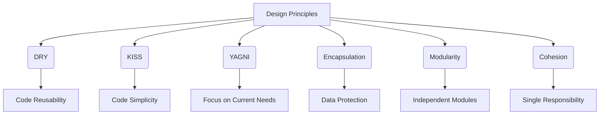

## 10.12 Design Principles and Best Practices

In the realm of JavaScript and object-oriented programming (OOP), adhering to design principles and best practices is crucial for writing maintainable, efficient, and scalable code. This section will delve into key principles such as DRY, KISS, and YAGNI, and explore the importance of encapsulation, modularity, and cohesion. We'll also provide guidelines on naming conventions, code organization, and documentation, while highlighting the role of design patterns in promoting best practices. Additionally, we'll discuss the significance of code reviews and continuous refactoring, and encourage adherence to coding standards and conventions.

### Key Design Principles

#### DRY (Don't Repeat Yourself)

The DRY principle emphasizes the reduction of code duplication. By ensuring that each piece of knowledge or logic is represented only once in your codebase, you minimize the risk of inconsistencies and make maintenance easier.

**Example:**

```javascript
// Before applying DRY
function calculateAreaOfCircle(radius) {
    return Math.PI * radius * radius;
}

function calculateCircumferenceOfCircle(radius) {
    return 2 * Math.PI * radius;
}

// After applying DRY
function calculateCircleMetrics(radius) {
    const pi = Math.PI;
    return {
        area: pi * radius * radius,
        circumference: 2 * pi * radius
    };
}
```

In the example above, the value of `Math.PI` is reused, reducing repetition and potential errors.

#### KISS (Keep It Simple, Stupid)

The KISS principle advocates for simplicity in design. Complex solutions are more prone to errors and harder to maintain. Aim for clarity and simplicity in your code.

**Example:**

```javascript
// Complex solution
function isEven(number) {
    if (number % 2 === 0) {
        return true;
    } else {
        return false;
    }
}

// Simple solution
function isEven(number) {
    return number % 2 === 0;
}
```

The simplified version of the `isEven` function is easier to read and understand.

#### YAGNI (You Aren't Gonna Need It)

YAGNI is a principle that discourages adding functionality until it is necessary. Avoid over-engineering and focus on current requirements.

**Example:**

```javascript
// Over-engineered solution
function calculateDiscount(price, discountType) {
    if (discountType === 'percentage') {
        return price * 0.9; // 10% discount
    } else if (discountType === 'fixed') {
        return price - 10; // $10 discount
    } else {
        return price;
    }
}

// Simple solution
function calculateDiscount(price) {
    return price * 0.9; // 10% discount
}
```

The second example focuses on the current requirement without unnecessary complexity.

### Importance of Encapsulation, Modularity, and Cohesion

#### Encapsulation

Encapsulation is the practice of bundling data and methods that operate on that data within a single unit or class. It restricts direct access to some of an object's components, which can prevent the accidental modification of data.

**Example:**

```javascript
class BankAccount {
    constructor(balance) {
        this._balance = balance;
    }

    deposit(amount) {
        if (amount > 0) {
            this._balance += amount;
        }
    }

    withdraw(amount) {
        if (amount > 0 && amount <= this._balance) {
            this._balance -= amount;
        }
    }

    getBalance() {
        return this._balance;
    }
}

const account = new BankAccount(100);
account.deposit(50);
console.log(account.getBalance()); // 150
```

In this example, the `_balance` property is encapsulated within the `BankAccount` class, and can only be modified through the `deposit` and `withdraw` methods.

#### Modularity

Modularity refers to the division of a software system into separate modules that can be developed, tested, and maintained independently. This approach enhances code reusability and maintainability.

**Example:**

```javascript
// mathUtils.js
export function add(a, b) {
    return a + b;
}

export function subtract(a, b) {
    return a - b;
}

// main.js
import { add, subtract } from './mathUtils.js';

console.log(add(5, 3)); // 8
console.log(subtract(5, 3)); // 2
```

By separating the math utility functions into their own module, we can easily reuse them across different parts of the application.

#### Cohesion

Cohesion refers to how closely related the responsibilities of a single module or class are. High cohesion means that a module or class has a single, well-defined purpose, which makes it easier to understand and maintain.

**Example:**

```javascript
class User {
    constructor(name, email) {
        this.name = name;
        this.email = email;
    }

    sendEmail(message) {
        console.log(`Sending email to ${this.email}: ${message}`);
    }
}

const user = new User('Alice', 'alice@example.com');
user.sendEmail('Hello, Alice!');
```

The `User` class has high cohesion because it focuses solely on user-related functionality.

### Guidelines on Naming Conventions, Code Organization, and Documentation

#### Naming Conventions

- **Use descriptive names**: Choose names that clearly describe the purpose of variables, functions, and classes.
- **Follow consistent casing**: Use camelCase for variables and functions, PascalCase for classes, and UPPER_CASE for constants.
- **Avoid abbreviations**: Abbreviations can be confusing; use full words instead.

#### Code Organization

- **Group related code**: Organize code into modules or classes based on functionality.
- **Separate concerns**: Use the separation of concerns principle to divide code into distinct sections with specific responsibilities.
- **Use comments wisely**: Write comments to explain complex logic, but avoid over-commenting.

#### Documentation

- **Document public APIs**: Provide clear documentation for any public-facing functions or classes.
- **Use JSDoc**: Utilize JSDoc comments to describe the purpose and usage of functions and classes.
- **Keep documentation up-to-date**: Regularly update documentation to reflect changes in the codebase.

### Role of Design Patterns in Promoting Best Practices

Design patterns provide proven solutions to common problems in software design. They promote best practices by encouraging code reuse, flexibility, and maintainability.

**Example: Singleton Pattern**

The Singleton pattern ensures that a class has only one instance and provides a global point of access to it.

```javascript
class Singleton {
    constructor() {
        if (!Singleton.instance) {
            Singleton.instance = this;
        }
        return Singleton.instance;
    }

    someMethod() {
        console.log('Singleton method');
    }
}

const instance1 = new Singleton();
const instance2 = new Singleton();

console.log(instance1 === instance2); // true
```

In this example, the Singleton pattern is used to ensure that only one instance of the class exists.

### Importance of Code Reviews and Continuous Refactoring

#### Code Reviews

- **Improve code quality**: Code reviews help identify bugs and improve code quality before changes are merged.
- **Encourage collaboration**: They foster collaboration and knowledge sharing among team members.
- **Ensure adherence to standards**: Code reviews ensure that coding standards and best practices are followed.

#### Continuous Refactoring

- **Enhance maintainability**: Regular refactoring improves code readability and maintainability.
- **Reduce technical debt**: It helps reduce technical debt by addressing code smells and inefficiencies.
- **Adapt to changing requirements**: Refactoring allows the codebase to adapt to new requirements without major rewrites.

### Adherence to Coding Standards and Conventions

- **Follow industry standards**: Adhere to widely accepted coding standards and conventions, such as those provided by Airbnb or Google.
- **Use linters**: Utilize tools like ESLint to enforce coding standards and catch potential issues.
- **Consistent formatting**: Maintain consistent code formatting using tools like Prettier.

### Visualizing Design Principles

Below is a Mermaid.js diagram illustrating the relationship between key design principles and best practices.



**Diagram Description:** This diagram illustrates how various design principles contribute to best practices in software development. DRY leads to code reusability, KISS promotes simplicity, YAGNI focuses on current needs, encapsulation protects data, modularity encourages independent modules, and cohesion ensures single responsibility.

### Knowledge Check

- **What is the DRY principle, and why is it important?**
- **How does the KISS principle contribute to code maintainability?**
- **Explain the concept of encapsulation with an example.**
- **What are the benefits of modularity in software design?**
- **How do design patterns promote best practices in software development?**

### Exercises

1. **Refactor the following code to adhere to the DRY principle:**

```javascript
function calculateRectangleArea(width, height) {
    return width * height;
}

function calculateTriangleArea(base, height) {
    return 0.5 * base * height;
}
```

2. **Identify and simplify the code using the KISS principle:**

```javascript
function isPositiveNumber(number) {
    if (number > 0) {
        return true;
    } else {
        return false;
    }
}
```

3. **Create a module for math operations and demonstrate its usage in a separate file.**

### Summary

In this section, we've explored essential design principles and best practices for object-oriented programming in JavaScript. By adhering to principles like DRY, KISS, and YAGNI, and focusing on encapsulation, modularity, and cohesion, we can write high-quality, maintainable code. Design patterns play a crucial role in promoting best practices, while code reviews and continuous refactoring ensure ongoing code quality. Remember to follow coding standards and conventions to maintain consistency across your codebase.

### Embrace the Journey

Remember, mastering design principles and best practices is a continuous journey. As you apply these concepts, you'll develop more robust and efficient software solutions. Keep experimenting, stay curious, and enjoy the process of becoming a better developer!

## Quiz: Test Your Knowledge on JavaScript Design Principles and Best Practices



### What does the DRY principle stand for?

- [x] Don't Repeat Yourself
- [ ] Do Repeat Yourself
- [ ] Don't Reuse Yourself
- [ ] Do Reuse Yourself

> **Explanation:** DRY stands for "Don't Repeat Yourself," emphasizing the reduction of code duplication.

### Which principle encourages simplicity in design?

- [ ] DRY
- [x] KISS
- [ ] YAGNI
- [ ] SOLID

> **Explanation:** KISS stands for "Keep It Simple, Stupid," advocating for simplicity in design.

### What is the main benefit of encapsulation?

- [ ] Increased complexity
- [x] Data protection
- [ ] Code duplication
- [ ] Reduced readability

> **Explanation:** Encapsulation protects data by restricting direct access to an object's components.

### How does modularity benefit software design?

- [ ] Increases code duplication
- [ ] Reduces code readability
- [x] Encourages independent modules
- [ ] Decreases code reusability

> **Explanation:** Modularity divides a software system into separate modules that can be developed, tested, and maintained independently.

### What role do design patterns play in software development?

- [x] Promote best practices
- [ ] Increase code complexity
- [ ] Discourage code reuse
- [ ] Reduce code readability

> **Explanation:** Design patterns provide proven solutions to common problems, promoting best practices in software development.

### Why are code reviews important?

- [ ] They reduce collaboration
- [x] They improve code quality
- [ ] They increase bugs
- [ ] They discourage knowledge sharing

> **Explanation:** Code reviews help identify bugs and improve code quality before changes are merged.

### What is the purpose of continuous refactoring?

- [ ] Increase technical debt
- [x] Enhance maintainability
- [ ] Reduce code readability
- [ ] Discourage code reuse

> **Explanation:** Continuous refactoring improves code readability and maintainability, reducing technical debt.

### Which tool can be used to enforce coding standards?

- [ ] Prettier
- [ ] Babel
- [x] ESLint
- [ ] Webpack

> **Explanation:** ESLint is a tool used to enforce coding standards and catch potential issues.

### What does YAGNI stand for?

- [ ] You Are Gonna Need It
- [x] You Aren't Gonna Need It
- [ ] You Always Gonna Need It
- [ ] You Aren't Gonna Need Anything

> **Explanation:** YAGNI stands for "You Aren't Gonna Need It," discouraging adding functionality until necessary.

### True or False: High cohesion means a module has multiple responsibilities.

- [ ] True
- [x] False

> **Explanation:** High cohesion means a module has a single, well-defined purpose, not multiple responsibilities.




