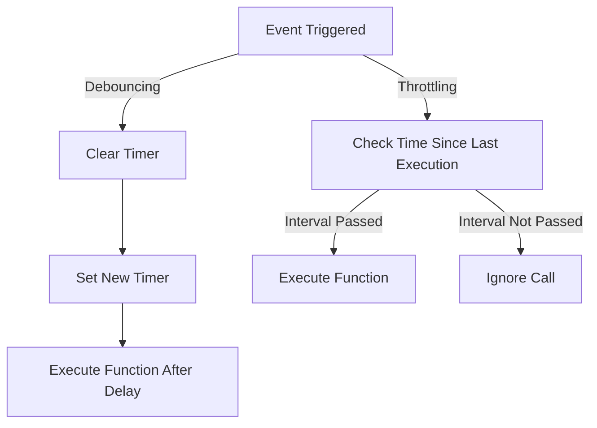

---

linkTitle: "10.2 Debouncing and Throttling"
title: "Debouncing and Throttling in JavaScript and TypeScript: Mastering Concurrency Patterns"
description: "Explore the essential concurrency patterns of debouncing and throttling in JavaScript and TypeScript. Learn how to optimize performance and enhance user experience by controlling function execution during rapid events."
categories:
- JavaScript
- TypeScript
- Concurrency Patterns
tags:
- Debouncing
- Throttling
- Performance Optimization
- Event Handling
- JavaScript Patterns
date: 2024-10-25
type: docs
nav_weight: 1020000
canonical: "https://softwarepatternslexicon.com/patterns-js/10/2"
license: "© 2024 Tokenizer Inc. CC BY-NC-SA 4.0"
---

## 10.2 Debouncing and Throttling

In the world of web development, efficiently managing the execution of functions during rapid events is crucial for performance optimization and enhancing user experience. Two powerful concurrency patterns, **debouncing** and **throttling**, help achieve this by controlling how frequently a function is executed in response to events like scrolling, resizing, or typing. Let's delve into these patterns, understand their differences, and learn how to implement them effectively in JavaScript and TypeScript.

### Understand the Concepts

#### Debouncing

Debouncing is a technique used to delay the execution of a function until after a specified period of inactivity. It ensures that a function is called only once after a series of rapid events. This is particularly useful in scenarios where you want to prevent excessive function calls, such as handling window resize or input events.

#### Throttling

Throttling, on the other hand, limits the execution of a function to at most once in a specified time interval. It ensures that a function is called at regular intervals during rapid events, making it ideal for scenarios where you want to maintain a consistent rate of function execution, such as controlling API request rates or handling continuous scroll events.

### Implementation Steps

#### Implement Debouncing

To implement debouncing, follow these steps:

1. **Use a Timer Variable:** Store a reference to the timeout.
2. **Clear Existing Timer:** On each event, clear the existing timer.
3. **Set a New Timer:** Set a new timer for the specified delay.
4. **Execute the Function:** When the timer expires, execute the function.

Here's a code example demonstrating a debounce function:

```javascript
function debounce(func, delay) {
  let timeoutId;
  return function (...args) {
    clearTimeout(timeoutId);
    timeoutId = setTimeout(() => func.apply(this, args), delay);
  };
}

// Usage
const debouncedFunction = debounce(() => {
  console.log('Debounced function executed');
}, 300);
```

#### Implement Throttling

To implement throttling, follow these steps:

1. **Use a Flag or Timestamp:** Determine when the function was last called.
2. **Ignore Calls Before Interval:** If the function is called again before the interval has passed, ignore the call.
3. **Reset Flag or Update Timestamp:** After the interval, reset the flag or update the timestamp.

Here's a code example demonstrating a throttle function:

```javascript
function throttle(func, interval) {
  let lastTime = 0;
  return function (...args) {
    const now = Date.now();
    if (now - lastTime >= interval) {
      lastTime = now;
      func.apply(this, args);
    }
  };
}

// Usage
const throttledFunction = throttle(() => {
  console.log('Throttled function executed');
}, 300);
```

### Use Cases

#### Debouncing

- **Window Resize or Scroll Events:** Prevent excessive function calls during rapid resize or scroll events.
- **Search Input Processing:** Delay processing until the user stops typing, reducing unnecessary API calls.

#### Throttling

- **Continuous Events:** Limit the frequency of function calls on events like scroll or mousemove.
- **API Request Rates:** Control the rate of API requests to avoid overwhelming the server.

### Practice

- **Debouncing Example:** Implement a search input that debounces user input before making an API call.
- **Throttling Example:** Use throttling to limit the frequency of an event handler attached to window scroll.

### Considerations

- **Choosing Between Debouncing and Throttling:** Decide based on the desired behavior. Use debouncing when you want to wait for a pause in events, and throttling when you need regular execution intervals.
- **Impact on User Experience:** Be mindful of delays, as they might affect responsiveness. Balance performance optimization with user experience.

### Visual Aids

To better understand the differences between debouncing and throttling, let's visualize their behavior using a simple diagram:



### Conclusion

Debouncing and throttling are essential concurrency patterns in JavaScript and TypeScript that help optimize performance and enhance user experience by controlling function execution during rapid events. By understanding their differences and implementing them effectively, you can significantly improve the responsiveness and efficiency of your web applications.

## Quiz Time!



### What is the main purpose of debouncing?

- [x] To delay the processing of an event until after a specified period of inactivity.
- [ ] To limit the execution of a function to at most once in a specified time interval.
- [ ] To execute a function immediately after an event is triggered.
- [ ] To prevent a function from being executed more than once.

> **Explanation:** Debouncing delays the processing of an event until after a specified period of inactivity, ensuring that a function is called only once after a series of rapid events.

### What is the main purpose of throttling?

- [ ] To delay the processing of an event until after a specified period of inactivity.
- [x] To limit the execution of a function to at most once in a specified time interval.
- [ ] To execute a function immediately after an event is triggered.
- [ ] To prevent a function from being executed more than once.

> **Explanation:** Throttling limits the execution of a function to at most once in a specified time interval, ensuring that a function is called at regular intervals during rapid events.

### Which of the following is a suitable use case for debouncing?

- [x] Handling window resize or scroll events.
- [ ] Limiting frequency of function calls on continuous events.
- [ ] Controlling API request rates.
- [ ] Executing a function immediately after an event is triggered.

> **Explanation:** Debouncing is suitable for handling window resize or scroll events to prevent excessive function calls.

### Which of the following is a suitable use case for throttling?

- [ ] Handling window resize or scroll events.
- [x] Limiting frequency of function calls on continuous events.
- [ ] Delaying search input processing.
- [ ] Executing a function immediately after an event is triggered.

> **Explanation:** Throttling is suitable for limiting the frequency of function calls on continuous events like scroll or mousemove.

### How does debouncing affect function execution?

- [x] It delays execution until after a period of inactivity.
- [ ] It executes the function immediately.
- [ ] It prevents the function from being executed.
- [ ] It executes the function at regular intervals.

> **Explanation:** Debouncing delays function execution until after a specified period of inactivity.

### How does throttling affect function execution?

- [ ] It delays execution until after a period of inactivity.
- [ ] It executes the function immediately.
- [x] It executes the function at regular intervals.
- [ ] It prevents the function from being executed.

> **Explanation:** Throttling executes the function at regular intervals during rapid events.

### What is a common implementation step for both debouncing and throttling?

- [x] Using a timer or timestamp to control execution.
- [ ] Executing the function immediately.
- [ ] Preventing the function from being executed.
- [ ] Ignoring all function calls.

> **Explanation:** Both debouncing and throttling use a timer or timestamp to control when the function is executed.

### In the context of debouncing, what happens when a new event is triggered?

- [x] The existing timer is cleared, and a new one is set.
- [ ] The function is executed immediately.
- [ ] The function is ignored.
- [ ] The function is executed at regular intervals.

> **Explanation:** In debouncing, when a new event is triggered, the existing timer is cleared, and a new one is set.

### In the context of throttling, what happens if the function is called before the interval has passed?

- [ ] The function is executed immediately.
- [ ] The function is executed at regular intervals.
- [x] The call is ignored.
- [ ] The existing timer is cleared, and a new one is set.

> **Explanation:** In throttling, if the function is called before the interval has passed, the call is ignored.

### Debouncing and throttling are used to optimize performance in web applications.

- [x] True
- [ ] False

> **Explanation:** Both debouncing and throttling are concurrency patterns used to optimize performance and enhance user experience by controlling function execution during rapid events.


