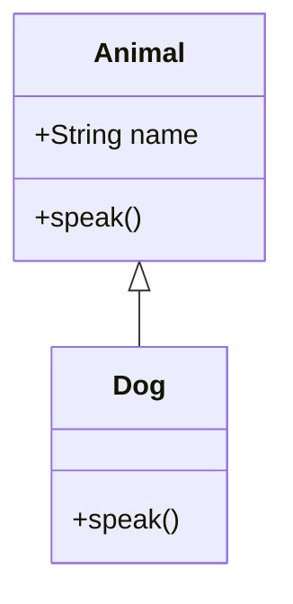

## 10.2 ES6 Classes and Their Internals

JavaScript has long been known for its prototypal inheritance model, which can be quite different from the classical inheritance model found in many other programming languages. With the introduction of ES6 (ECMAScript 2015), JavaScript developers gained access to a new syntax for creating objects and handling inheritance: ES6 classes. While these classes provide a more familiar syntax for those coming from class-based languages, they are essentially syntactic sugar over JavaScript's existing prototypal inheritance.

### Understanding ES6 Class Syntax

ES6 classes provide a cleaner and more intuitive syntax for creating objects and handling inheritance. Let's explore the basic syntax of ES6 classes, including class declarations and expressions.

#### Class Declarations

A class declaration is a straightforward way to define a class. Here's a simple example:

```javascript
class Animal {
  constructor(name) {
    this.name = name;
  }

  speak() {
    console.log(`${this.name} makes a noise.`);
  }
}

const animal = new Animal('Dog');
animal.speak(); // Output: Dog makes a noise.
```

In this example, we define a class `Animal` with a constructor and a method `speak`. The `constructor` method is a special method for creating and initializing an object created with a class.

#### Class Expressions

Classes can also be defined using expressions. This can be useful when you need to define a class conditionally or dynamically:

```javascript
const Animal = class {
  constructor(name) {
    this.name = name;
  }

  speak() {
    console.log(`${this.name} makes a noise.`);
  }
};

const animal = new Animal('Cat');
animal.speak(); // Output: Cat makes a noise.
```

Both class declarations and expressions can be used to create classes, but class declarations are hoisted, whereas class expressions are not.

### Constructors and Methods

The `constructor` method is a special method for creating and initializing objects. It is called automatically when a new instance of the class is created.

#### Instance Methods

Instance methods are defined within the class body and are available on instances of the class:

```javascript
class Vehicle {
  constructor(type) {
    this.type = type;
  }

  describe() {
    console.log(`This is a ${this.type}.`);
  }
}

const car = new Vehicle('Car');
car.describe(); // Output: This is a Car.
```

#### Static Methods

Static methods are defined using the `static` keyword and are called on the class itself, not on instances of the class:

```javascript
class MathUtils {
  static add(a, b) {
    return a + b;
  }
}

console.log(MathUtils.add(5, 3)); // Output: 8
```

Static methods are often used for utility functions that are related to the class but do not require an instance to operate.

### Inheritance with `extends`

ES6 classes support inheritance through the `extends` keyword, allowing one class to inherit from another:

```javascript
class Animal {
  constructor(name) {
    this.name = name;
  }

  speak() {
    console.log(`${this.name} makes a noise.`);
  }
}

class Dog extends Animal {
  speak() {
    console.log(`${this.name} barks.`);
  }
}

const dog = new Dog('Rex');
dog.speak(); // Output: Rex barks.
```

In this example, `Dog` extends `Animal`, inheriting its properties and methods. The `speak` method in `Dog` overrides the `speak` method in `Animal`.

### Internal Implementation Using Prototypes

Under the hood, ES6 classes are implemented using JavaScript's prototypal inheritance. Each class has a prototype object that instances of the class inherit from. When a method is called on an instance, JavaScript looks for the method on the instance's prototype chain.

Here's a simplified view of how classes and prototypes work:

```javascript
function Animal(name) {
  this.name = name;
}

Animal.prototype.speak = function() {
  console.log(`${this.name} makes a noise.`);
};

function Dog(name) {
  Animal.call(this, name);
}

Dog.prototype = Object.create(Animal.prototype);
Dog.prototype.constructor = Dog;

Dog.prototype.speak = function() {
  console.log(`${this.name} barks.`);
};

const dog = new Dog('Buddy');
dog.speak(); // Output: Buddy barks.
```

In this example, we manually set up the prototype chain using constructor functions and the `Object.create` method. ES6 classes automate this process, providing a cleaner syntax.

### Advantages and Limitations of ES6 Classes

#### Advantages

- **Cleaner Syntax**: ES6 classes provide a more readable and concise syntax for defining objects and inheritance.
- **Familiarity**: Developers coming from class-based languages like Java or C++ will find the syntax familiar.
- **Built-in Inheritance**: The `extends` keyword simplifies the process of setting up inheritance.

#### Limitations

- **Syntactic Sugar**: ES6 classes are syntactic sugar over JavaScript's prototypal inheritance, which means they don't introduce new functionality.
- **Static Nature**: Unlike prototypal inheritance, classes don't support dynamic inheritance changes at runtime.
- **Misconceptions**: Some developers may mistakenly believe that ES6 classes introduce classical inheritance, which can lead to confusion.

### Common Misconceptions About ES6 Classes

1. **Classes Are Not Objects**: While classes provide a blueprint for creating objects, they are not objects themselves.
2. **No Private Members**: ES6 classes do not support private members natively, although private fields are available in newer ECMAScript versions.
3. **Prototypes Still Matter**: Despite the class syntax, understanding prototypes is crucial for mastering JavaScript inheritance.

### Visualizing Class Inheritance

To better understand how class inheritance works, let's visualize the prototype chain using a Mermaid.js diagram:



This diagram shows that `Dog` inherits from `Animal`, and both classes have a `speak` method.

### Try It Yourself

Experiment with the following code examples to deepen your understanding of ES6 classes:

1. **Modify the `speak` method** in the `Animal` class to include the type of animal.
2. **Add a new static method** to the `MathUtils` class that multiplies two numbers.
3. **Create a new class** that extends `Dog` and overrides the `speak` method to include a unique sound.

### Knowledge Check

- What is the purpose of the `constructor` method in an ES6 class?
- How do static methods differ from instance methods?
- What is the role of the `extends` keyword in class inheritance?
- How are ES6 classes implemented internally in JavaScript?
- What are some common misconceptions about ES6 classes?

### Summary

ES6 classes provide a more intuitive and familiar syntax for object-oriented programming in JavaScript, making it easier to define and manage objects and inheritance. While they offer several advantages, it's important to remember that they are syntactic sugar over JavaScript's prototypal inheritance. Understanding both classes and prototypes is essential for mastering JavaScript's object-oriented capabilities.

Remember, this is just the beginning. As you progress, you'll build more complex and interactive applications using ES6 classes. Keep experimenting, stay curious, and enjoy the journey!

## Quiz: Mastering ES6 Classes in JavaScript



### What is the primary purpose of the `constructor` method in an ES6 class?

- [x] To initialize new instances of the class
- [ ] To define static methods
- [ ] To create private members
- [ ] To set up inheritance

> **Explanation:** The `constructor` method is used to initialize new instances of the class, setting up initial properties and values.

### How do static methods differ from instance methods in ES6 classes?

- [x] Static methods are called on the class itself, not on instances
- [ ] Static methods can access instance properties
- [ ] Static methods are inherited by subclasses
- [ ] Static methods are automatically bound to instances

> **Explanation:** Static methods are called on the class itself and do not have access to instance properties.

### What keyword is used to set up inheritance in ES6 classes?

- [x] `extends`
- [ ] `inherits`
- [ ] `super`
- [ ] `prototype`

> **Explanation:** The `extends` keyword is used to set up inheritance between classes in ES6.

### How are ES6 classes implemented internally in JavaScript?

- [x] Using prototypes
- [ ] Using classical inheritance
- [ ] Using closures
- [ ] Using modules

> **Explanation:** ES6 classes are implemented using JavaScript's prototypal inheritance model.

### Which of the following is a common misconception about ES6 classes?

- [x] They introduce classical inheritance
- [ ] They provide a cleaner syntax
- [ ] They support static methods
- [ ] They are syntactic sugar

> **Explanation:** A common misconception is that ES6 classes introduce classical inheritance, but they are actually syntactic sugar over prototypal inheritance.

### What is the role of the `super` keyword in ES6 classes?

- [x] To call the constructor of the parent class
- [ ] To define static methods
- [ ] To create private members
- [ ] To set up inheritance

> **Explanation:** The `super` keyword is used to call the constructor of the parent class in a subclass.

### Can ES6 classes have private members?

- [ ] Yes, natively in all versions
- [x] No, not natively in ES6
- [ ] Yes, using the `private` keyword
- [ ] Yes, using closures

> **Explanation:** ES6 classes do not natively support private members, although newer ECMAScript versions have introduced private fields.

### What is the benefit of using ES6 classes over traditional constructor functions?

- [x] Cleaner and more intuitive syntax
- [ ] Better performance
- [ ] More powerful inheritance
- [ ] Automatic memory management

> **Explanation:** ES6 classes provide a cleaner and more intuitive syntax for defining objects and inheritance.

### Which method is automatically called when a new instance of a class is created?

- [x] `constructor`
- [ ] `initialize`
- [ ] `setup`
- [ ] `create`

> **Explanation:** The `constructor` method is automatically called when a new instance of a class is created.

### True or False: ES6 classes are a new type of object in JavaScript.

- [ ] True
- [x] False

> **Explanation:** False. ES6 classes are not a new type of object; they are syntactic sugar over JavaScript's existing prototypal inheritance.


