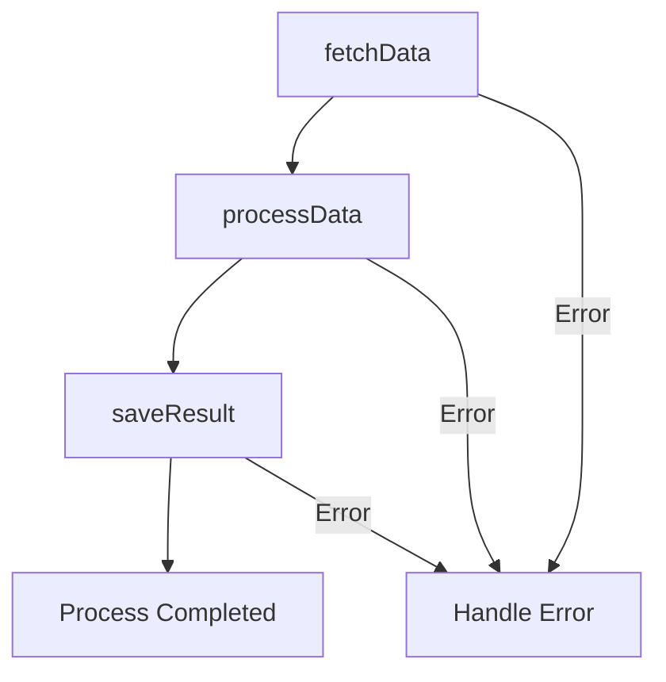

## 10.3 Promise Pipelining and Chaining

In modern JavaScript and TypeScript development, handling asynchronous operations efficiently is crucial. Promises offer a robust way to manage these operations, and understanding how to pipeline and chain them effectively can significantly enhance your code's readability and maintainability.

### Introduction

Promise pipelining and chaining are techniques used to manage sequences of asynchronous operations. These patterns allow developers to execute operations in a specific order, where each operation begins after the previous one completes, and the result of one operation is passed as input to the next.

### Detailed Explanation

#### Promise Pipelining

Promise pipelining involves chaining multiple asynchronous operations such that each operation starts only after the previous one has completed. This pattern is particularly useful when the output of one operation is required as the input for the next.

#### Promise Chaining

Promise chaining utilizes the `.then()` method to handle the fulfillment of Promises in a sequential manner. This approach facilitates a readable and maintainable flow of asynchronous code, allowing developers to handle operations step-by-step.

### Implementation Steps

#### Create Functions Returning Promises

To effectively use promise pipelining and chaining, ensure that each asynchronous function returns a Promise. This is the foundation for chaining operations together.

```javascript
function fetchData() {
  return new Promise((resolve, reject) => {
    // Simulate an asynchronous operation
    setTimeout(() => {
      const data = { id: 1, name: 'John Doe' };
      resolve(data);
    }, 1000);
  });
}
```

#### Chain Promises Using `.then()`

Begin by calling the first function and chain subsequent functions using `.then()`. Each `.then()` receives the result of the previous operation.

```javascript
fetchData()
  .then(data => {
    console.log('Data fetched:', data);
    return processData(data);
  })
  .then(result => {
    console.log('Data processed:', result);
    return saveResult(result);
  })
  .then(() => {
    console.log('Process completed');
  })
  .catch(error => {
    console.error('Error:', error);
  });
```

#### Handle Errors Appropriately

Use `.catch()` at the end of the chain to capture any errors that occur during the execution of any of the Promises. You can also implement additional `.catch()` blocks after specific `.then()` calls if needed.

#### Use `async/await` for Cleaner Syntax

For a more readable and cleaner syntax, you can use `async/await`. This approach allows you to write asynchronous code that looks synchronous, making it easier to follow.

```javascript
async function executeTasks() {
  try {
    const data = await fetchData();
    console.log('Data fetched:', data);
    const result = await processData(data);
    console.log('Data processed:', result);
    await saveResult(result);
    console.log('Process completed');
  } catch (error) {
    console.error('Error:', error);
  }
}

executeTasks();
```

### Visual Aids

To better understand the flow of promise chaining, consider the following diagram:



### Use Cases

- **Sequence-dependent asynchronous operations:** For example, authenticating a user before fetching their data.
- **Database transactions:** Where each step depends on the successful completion of the previous one.

### Practice

**Exercise:** Implement a signup workflow that:
- Validates user input.
- Creates a user account.
- Sends a confirmation email.
- Use Promise chaining to sequence these operations.

```javascript
function validateInput(input) {
  return new Promise((resolve, reject) => {
    if (input.isValid) {
      resolve(input);
    } else {
      reject('Invalid input');
    }
  });
}

function createUserAccount(user) {
  return new Promise((resolve, reject) => {
    // Simulate account creation
    setTimeout(() => {
      resolve({ userId: 123, ...user });
    }, 1000);
  });
}

function sendConfirmationEmail(user) {
  return new Promise((resolve, reject) => {
    // Simulate sending email
    setTimeout(() => {
      resolve('Email sent to ' + user.email);
    }, 1000);
  });
}

validateInput({ isValid: true, email: 'user@example.com' })
  .then(user => createUserAccount(user))
  .then(account => sendConfirmationEmail(account))
  .then(message => console.log(message))
  .catch(error => console.error('Error:', error));
```

### Considerations

- **Data Passing:** Ensure each Promise returns the necessary data for the next step.
- **Error Handling:** Be mindful of error propagation and handle exceptions properly.
- **Avoid Deep Nesting:** Prevent deeply nested `.then()` chains by returning Promises cleanly.

### Advantages and Disadvantages

#### Advantages

- **Readability:** Provides a clear, linear flow of asynchronous operations.
- **Error Handling:** Centralized error handling with `.catch()`.
- **Maintainability:** Easier to maintain and modify due to its structured approach.

#### Disadvantages

- **Complexity:** Can become complex with deeply nested chains.
- **Error Propagation:** Requires careful handling to ensure errors are caught and managed appropriately.

### Best Practices

- Use `async/await` for a cleaner syntax when possible.
- Always return Promises from functions to enable chaining.
- Use `.catch()` to handle errors at the end of the chain.
- Avoid deeply nested chains by breaking them into smaller functions.

### Conclusion

Promise pipelining and chaining are powerful patterns for managing asynchronous operations in JavaScript and TypeScript. By understanding and implementing these patterns, developers can write more readable, maintainable, and efficient code. As you continue to work with asynchronous operations, consider these patterns as essential tools in your development toolkit.

## Quiz Time!



### What is Promise Pipelining?

- [x] Chain multiple asynchronous operations where each operation starts after the previous one completes.
- [ ] Execute multiple asynchronous operations simultaneously.
- [ ] Handle errors in asynchronous operations.
- [ ] Use callbacks for asynchronous operations.

> **Explanation:** Promise pipelining involves chaining multiple asynchronous operations such that each operation starts only after the previous one has completed.

### What method is used for Promise Chaining?

- [x] `.then()`
- [ ] `.catch()`
- [ ] `.finally()`
- [ ] `.all()`

> **Explanation:** Promise chaining utilizes the `.then()` method to handle the fulfillment of Promises in a sequential manner.

### How can you handle errors in a Promise chain?

- [x] Use `.catch()` at the end of the chain.
- [ ] Use `.then()` at the end of the chain.
- [ ] Use `.finally()` at the end of the chain.
- [ ] Use `try/catch` blocks.

> **Explanation:** Use `.catch()` at the end of the chain to capture any errors that occur during the execution of any of the Promises.

### What is the advantage of using `async/await` over `.then()` chaining?

- [x] Cleaner and more readable syntax.
- [ ] Faster execution of asynchronous operations.
- [ ] Better error handling.
- [ ] Simultaneous execution of operations.

> **Explanation:** `async/await` provides a cleaner and more readable syntax, making asynchronous code easier to follow.

### Which of the following is a use case for Promise Chaining?

- [x] Sequence-dependent asynchronous operations.
- [ ] Simultaneous data fetching.
- [ ] Error logging.
- [ ] UI rendering.

> **Explanation:** Promise chaining is useful for sequence-dependent asynchronous operations, where each step depends on the previous one.

### What should each asynchronous function return to enable chaining?

- [x] A Promise
- [ ] A callback
- [ ] An object
- [ ] A string

> **Explanation:** Each asynchronous function should return a Promise to enable chaining.

### How can you avoid deeply nested `.then()` chains?

- [x] Break them into smaller functions.
- [ ] Use more `.catch()` blocks.
- [ ] Use `setTimeout` to delay operations.
- [ ] Use synchronous code.

> **Explanation:** Avoid deeply nested chains by breaking them into smaller functions to improve readability and maintainability.

### What is a disadvantage of Promise Chaining?

- [x] Can become complex with deeply nested chains.
- [ ] Provides centralized error handling.
- [ ] Offers a clear flow of operations.
- [ ] Improves code maintainability.

> **Explanation:** Promise chaining can become complex with deeply nested chains, making it harder to manage.

### What is the purpose of the `.catch()` method in a Promise chain?

- [x] To handle errors that occur during the execution of Promises.
- [ ] To execute code after all Promises are resolved.
- [ ] To log the results of Promises.
- [ ] To execute code before any Promises are resolved.

> **Explanation:** The `.catch()` method is used to handle errors that occur during the execution of Promises.

### True or False: `async/await` can be used with Promise chaining.

- [x] True
- [ ] False

> **Explanation:** True. `async/await` can be used to handle asynchronous operations in a cleaner way, and it can be combined with Promise chaining for better readability.


