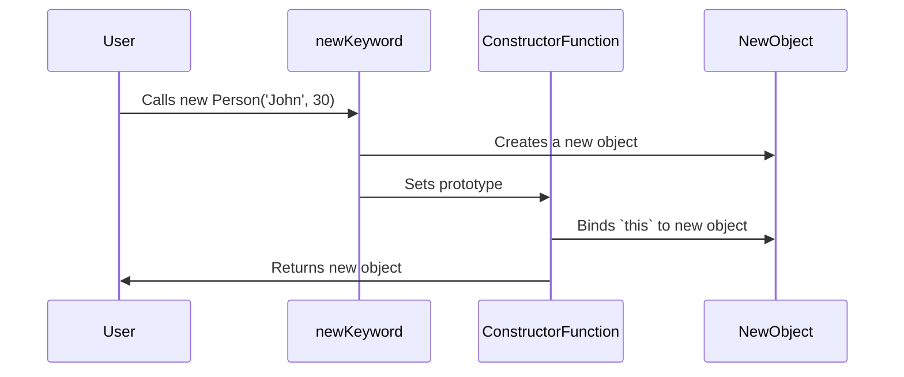

## 10.3 Constructor Functions and the `new` Keyword

In the realm of JavaScript, constructor functions and the `new` keyword have been pivotal in object-oriented programming, especially before the introduction of ES6 classes. This section delves into the mechanics of constructor functions, the role of the `new` keyword, and how these concepts compare to modern ES6 classes. We'll also explore common pitfalls and best practices to ensure constructors are used correctly.

### Understanding Constructor Functions

Constructor functions in JavaScript are special functions used to create and initialize objects. They serve as blueprints for creating multiple instances of an object with similar properties and methods.

#### Syntax of Constructor Functions

A constructor function is defined like a regular function but is conventionally named with an initial capital letter to distinguish it from regular functions. Here's a basic example:

```javascript
function Person(name, age) {
    this.name = name;
    this.age = age;
    this.greet = function() {
        console.log(`Hello, my name is ${this.name} and I am ${this.age} years old.`);
    };
}
```

In this example, `Person` is a constructor function that initializes an object with `name` and `age` properties and a `greet` method.

### The Role of the `new` Keyword

The `new` keyword is crucial when using constructor functions. It performs four essential steps to create a new object:

1. **Create a New Object**: A new, empty object is created.
2. **Set the Prototype**: The prototype of the new object is set to the prototype of the constructor function.
3. **Bind `this`**: The `this` keyword within the constructor function is bound to the new object.
4. **Return the Object**: The new object is returned unless the constructor function explicitly returns a different object.

Let's see how this works in practice:

```javascript
const john = new Person('John', 30);
john.greet(); // Output: Hello, my name is John and I am 30 years old.
```

### Visualizing the `new` Keyword Process

To better understand the process, let's visualize the steps using a Mermaid.js diagram:



### Creating Objects with Constructor Functions

Constructor functions allow for creating multiple instances with shared properties and methods. Here's an example of creating several `Person` objects:

```javascript
const alice = new Person('Alice', 25);
const bob = new Person('Bob', 28);

alice.greet(); // Output: Hello, my name is Alice and I am 25 years old.
bob.greet();   // Output: Hello, my name is Bob and I am 28 years old.
```

### Comparing Constructor Functions with ES6 Classes

With the advent of ES6, JavaScript introduced classes, providing a more intuitive and syntactically cleaner way to create objects. However, under the hood, ES6 classes are essentially syntactic sugar over the existing prototype-based inheritance.

#### ES6 Class Syntax

Here's how the `Person` constructor function can be rewritten using an ES6 class:

```javascript
class Person {
    constructor(name, age) {
        this.name = name;
        this.age = age;
    }

    greet() {
        console.log(`Hello, my name is ${this.name} and I am ${this.age} years old.`);
    }
}

const charlie = new Person('Charlie', 35);
charlie.greet(); // Output: Hello, my name is Charlie and I am 35 years old.
```

#### Key Differences

- **Syntax**: Classes provide a cleaner and more concise syntax.
- **Methods**: Methods in classes are automatically added to the prototype, whereas in constructor functions, they must be explicitly added.
- **Inheritance**: Classes support inheritance through the `extends` keyword, making it easier to create subclasses.

### Potential Pitfalls and Best Practices

While constructor functions are powerful, they come with potential pitfalls:

#### Forgetting the `new` Keyword

Forgetting to use the `new` keyword can lead to unexpected behavior, as `this` will not refer to a new object but rather the global object (or `undefined` in strict mode).

```javascript
const dave = Person('Dave', 40); // Incorrect usage
console.log(dave); // Output: undefined
```

#### Ensuring Correct Usage

To ensure constructor functions are called correctly, you can use patterns like the following:

1. **Self-Invoking Constructor Pattern**: Check if `this` is an instance of the constructor and return a new instance if not.

```javascript
function Person(name, age) {
    if (!(this instanceof Person)) {
        return new Person(name, age);
    }
    this.name = name;
    this.age = age;
}
```

2. **Factory Functions**: Use a factory function to encapsulate object creation, eliminating the need for `new`.

```javascript
function createPerson(name, age) {
    return {
        name: name,
        age: age,
        greet: function() {
            console.log(`Hello, my name is ${this.name} and I am ${this.age} years old.`);
        }
    };
}

const emma = createPerson('Emma', 22);
emma.greet(); // Output: Hello, my name is Emma and I am 22 years old.
```

### Try It Yourself

Experiment with the examples provided. Try modifying the `Person` constructor function to include additional properties or methods. Observe how the `new` keyword affects object creation and explore the differences when using ES6 classes.

### Key Takeaways

- Constructor functions and the `new` keyword are foundational to JavaScript's object-oriented programming.
- The `new` keyword automates object creation, prototype setting, and `this` binding.
- ES6 classes offer a more intuitive syntax but are fundamentally similar to constructor functions.
- Be mindful of common pitfalls, such as forgetting the `new` keyword, and use patterns to ensure constructors are called correctly.

### Further Reading

For more information on constructor functions and ES6 classes, consider exploring the following resources:

- [MDN Web Docs: Working with Objects](https://developer.mozilla.org/en-US/docs/Web/JavaScript/Guide/Working_with_Objects)
- [MDN Web Docs: Classes](https://developer.mozilla.org/en-US/docs/Web/JavaScript/Reference/Classes)
- [JavaScript Info: Constructor, operator "new"](https://javascript.info/constructor-new)

---

## Quiz: Mastering Constructor Functions and the `new` Keyword



### What is the primary purpose of a constructor function in JavaScript?

- [x] To create and initialize objects
- [ ] To define global variables
- [ ] To execute asynchronous code
- [ ] To manipulate the DOM

> **Explanation:** Constructor functions are used to create and initialize objects in JavaScript.

### What happens if you forget to use the `new` keyword with a constructor function?

- [x] `this` refers to the global object
- [ ] A syntax error occurs
- [ ] The function does not execute
- [ ] The object is created but not initialized

> **Explanation:** Without `new`, `this` refers to the global object, leading to unexpected behavior.

### Which of the following is NOT a step performed by the `new` keyword?

- [ ] Create a new object
- [ ] Set the prototype
- [x] Execute a callback function
- [ ] Bind `this` to the new object

> **Explanation:** The `new` keyword does not execute a callback function; it creates an object, sets the prototype, and binds `this`.

### How can you ensure a constructor function is called correctly?

- [x] Use a self-invoking constructor pattern
- [ ] Use a global variable
- [ ] Avoid using `this`
- [ ] Use arrow functions

> **Explanation:** A self-invoking constructor pattern checks if `this` is an instance and returns a new instance if not.

### What is a key difference between constructor functions and ES6 classes?

- [x] Classes provide a cleaner syntax
- [ ] Constructor functions support inheritance
- [ ] Classes cannot have methods
- [ ] Constructor functions are faster

> **Explanation:** ES6 classes provide a cleaner and more intuitive syntax compared to constructor functions.

### What does the `new` keyword return if the constructor function explicitly returns an object?

- [x] The explicitly returned object
- [ ] `undefined`
- [ ] The new object
- [ ] `null`

> **Explanation:** If a constructor function explicitly returns an object, that object is returned instead of the new object.

### Which pattern can be used to avoid the need for the `new` keyword?

- [x] Factory functions
- [ ] Singleton pattern
- [ ] Observer pattern
- [ ] Module pattern

> **Explanation:** Factory functions encapsulate object creation, eliminating the need for the `new` keyword.

### What is the conventional naming convention for constructor functions?

- [x] Capitalized first letter
- [ ] All lowercase
- [ ] All uppercase
- [ ] CamelCase

> **Explanation:** Constructor functions are conventionally named with a capitalized first letter to distinguish them from regular functions.

### True or False: ES6 classes are fundamentally different from constructor functions.

- [ ] True
- [x] False

> **Explanation:** ES6 classes are syntactic sugar over constructor functions and prototype-based inheritance.

### Which of the following is a potential pitfall when using constructor functions?

- [x] Forgetting the `new` keyword
- [ ] Using too many parameters
- [ ] Not defining a prototype
- [ ] Using arrow functions

> **Explanation:** Forgetting the `new` keyword can lead to unexpected behavior, as `this` will not refer to the new object.


