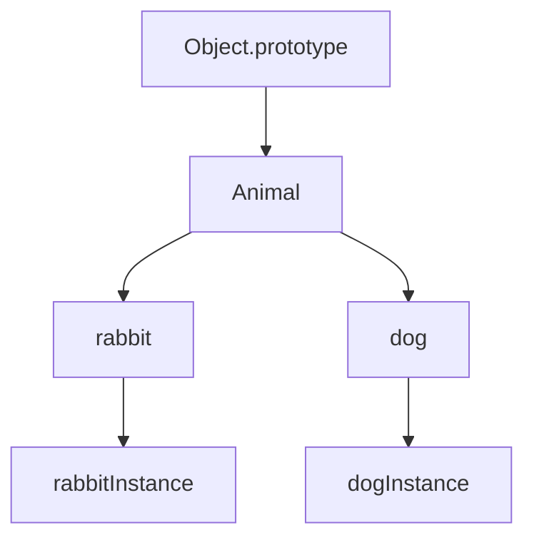

## 10.4 The Prototype Chain in Depth

In JavaScript, the prototype chain is a fundamental concept that underpins inheritance and property lookup. Understanding the prototype chain is crucial for mastering JavaScript's object-oriented programming capabilities. This section delves deeply into the prototype chain, explaining how it works, how objects inherit properties, and how you can manipulate it to create robust and efficient code.

### Understanding the Prototype Chain

The prototype chain is a mechanism by which JavaScript objects inherit properties and methods from other objects. Every JavaScript object has a prototype, which is another object from which it inherits properties. This chain of prototypes continues until it reaches an object with a `null` prototype, known as the end of the prototype chain.

#### How Property Lookup Works

When you access a property on an object, JavaScript first looks for the property directly on the object. If it doesn't find it, JavaScript then looks up the prototype chain, checking each prototype object until it finds the property or reaches the end of the chain.

```javascript
// Example of property lookup
const animal = {
  eats: true
};

const rabbit = Object.create(animal);
rabbit.jumps = true;

console.log(rabbit.jumps); // true, found on rabbit
console.log(rabbit.eats);  // true, found on animal
```

In this example, `rabbit` inherits from `animal`. When we access `rabbit.eats`, JavaScript doesn't find `eats` on `rabbit`, so it looks up the prototype chain and finds it on `animal`.

### The Role of `Object.prototype`

At the top of the prototype chain is `Object.prototype`. This is the prototype from which all standard JavaScript objects inherit. It provides common methods like `toString()`, `valueOf()`, and `hasOwnProperty()`.

```javascript
const obj = {};
console.log(obj.toString()); // [object Object]
```

In this example, `obj` is an empty object, but it still has access to `toString()` because it inherits from `Object.prototype`.

### Built-in Prototypes

JavaScript provides several built-in prototypes, such as `Array.prototype`, `Function.prototype`, and `String.prototype`. These prototypes provide methods specific to their respective object types.

```javascript
const arr = [1, 2, 3];
console.log(arr.join('-')); // "1-2-3"
```

Here, `arr` is an array, and it inherits the `join()` method from `Array.prototype`.

### Manipulating the Prototype Chain

JavaScript provides several methods for working with the prototype chain, including `Object.create()`, `Object.getPrototypeOf()`, and `Object.setPrototypeOf()`.

#### `Object.create()`

`Object.create()` creates a new object with the specified prototype. This is a powerful way to create objects that inherit from other objects.

```javascript
const animal = {
  eats: true
};

const rabbit = Object.create(animal);
console.log(rabbit.eats); // true
```

#### `Object.getPrototypeOf()`

`Object.getPrototypeOf()` returns the prototype of the specified object. This method is useful for inspecting the prototype chain.

```javascript
const animal = {
  eats: true
};

const rabbit = Object.create(animal);
console.log(Object.getPrototypeOf(rabbit) === animal); // true
```

#### `Object.setPrototypeOf()`

`Object.setPrototypeOf()` sets the prototype of a specified object. Use this method with caution, as changing the prototype of an object can have performance implications.

```javascript
const animal = {
  eats: true
};

const rabbit = {};
Object.setPrototypeOf(rabbit, animal);
console.log(rabbit.eats); // true
```

### The `__proto__` and `prototype` Properties

The `__proto__` property is a historical way to access an object's prototype. While it's widely supported, it's recommended to use `Object.getPrototypeOf()` and `Object.setPrototypeOf()` for better performance and readability.

The `prototype` property, on the other hand, is a property of constructor functions. It defines the prototype for all instances created by that constructor.

```javascript
function Animal() {}
Animal.prototype.eats = true;

const rabbit = new Animal();
console.log(rabbit.eats); // true
```

In this example, `Animal.prototype` is the prototype for all instances created by `new Animal()`.

### Visualizing the Prototype Chain

To better understand the prototype chain, let's visualize it using a diagram.



**Diagram Description:** This diagram shows the prototype chain where `rabbit` and `dog` inherit from `Animal`, which in turn inherits from `Object.prototype`. Instances of `rabbit` and `dog` inherit properties and methods from their respective prototypes.

### Practical Examples

Let's explore some practical examples to solidify our understanding of the prototype chain.

#### Example 1: Custom Prototypes

```javascript
function Person(name) {
  this.name = name;
}

Person.prototype.greet = function() {
  console.log(`Hello, my name is ${this.name}`);
};

const alice = new Person('Alice');
alice.greet(); // "Hello, my name is Alice"
```

In this example, `Person.prototype` provides a `greet` method that all instances of `Person` can use.

#### Example 2: Extending Built-in Prototypes

While it's possible to extend built-in prototypes, it's generally discouraged as it can lead to conflicts and unexpected behavior.

```javascript
Array.prototype.last = function() {
  return this[this.length - 1];
};

const numbers = [1, 2, 3];
console.log(numbers.last()); // 3
```

### Best Practices and Considerations

- **Avoid Modifying Built-in Prototypes:** Modifying built-in prototypes can lead to conflicts and bugs, especially when using third-party libraries.
- **Use `Object.create()` for Inheritance:** `Object.create()` is a clean and efficient way to set up inheritance without the need for constructor functions.
- **Inspect Prototypes with `Object.getPrototypeOf()`:** Use `Object.getPrototypeOf()` to inspect and understand the prototype chain of objects.

### Try It Yourself

Experiment with the prototype chain by creating custom objects and prototypes. Try modifying the examples provided and observe how changes affect property lookup and inheritance.

### Summary

The prototype chain is a powerful feature of JavaScript that enables inheritance and property sharing among objects. By understanding how the prototype chain works, you can create more efficient and maintainable code. Remember to use the provided methods and best practices to manipulate and inspect the prototype chain effectively.

### Further Reading

- [MDN Web Docs: Inheritance and the prototype chain](https://developer.mozilla.org/en-US/docs/Web/JavaScript/Inheritance_and_the_prototype_chain)
- [JavaScript.info: Prototypes, inheritance](https://javascript.info/prototype-inheritance)

## Quiz: Mastering the JavaScript Prototype Chain



### What is the prototype chain in JavaScript?

- [x] A mechanism by which objects inherit properties and methods from other objects.
- [ ] A method for creating new objects from existing ones.
- [ ] A way to define private properties in JavaScript.
- [ ] A feature exclusive to ES6 and later versions.

> **Explanation:** The prototype chain is a mechanism by which JavaScript objects inherit properties and methods from other objects.

### Which method is used to create a new object with a specified prototype?

- [x] Object.create()
- [ ] Object.setPrototypeOf()
- [ ] Object.getPrototypeOf()
- [ ] Object.defineProperty()

> **Explanation:** `Object.create()` is used to create a new object with a specified prototype.

### What is the top of the prototype chain for standard JavaScript objects?

- [x] Object.prototype
- [ ] Array.prototype
- [ ] Function.prototype
- [ ] null

> **Explanation:** `Object.prototype` is at the top of the prototype chain for standard JavaScript objects.

### Which property is a historical way to access an object's prototype?

- [x] __proto__
- [ ] prototype
- [ ] constructor
- [ ] Object.prototype

> **Explanation:** The `__proto__` property is a historical way to access an object's prototype.

### What does Object.getPrototypeOf() do?

- [x] Returns the prototype of the specified object.
- [ ] Sets the prototype of the specified object.
- [ ] Creates a new object with a specified prototype.
- [ ] Deletes the prototype of the specified object.

> **Explanation:** `Object.getPrototypeOf()` returns the prototype of the specified object.

### Why is it discouraged to modify built-in prototypes?

- [x] It can lead to conflicts and unexpected behavior.
- [ ] It is not possible in JavaScript.
- [ ] It is against the ECMAScript standard.
- [ ] It makes objects immutable.

> **Explanation:** Modifying built-in prototypes can lead to conflicts and unexpected behavior, especially when using third-party libraries.

### How can you inspect the prototype chain of an object?

- [x] Using Object.getPrototypeOf()
- [ ] Using Object.setPrototypeOf()
- [ ] Using Object.create()
- [ ] Using Object.defineProperty()

> **Explanation:** You can inspect the prototype chain of an object using `Object.getPrototypeOf()`.

### What is the role of the prototype property in constructor functions?

- [x] It defines the prototype for all instances created by that constructor.
- [ ] It is used to access private properties.
- [ ] It is a method for cloning objects.
- [ ] It is used to delete properties from objects.

> **Explanation:** The `prototype` property in constructor functions defines the prototype for all instances created by that constructor.

### Which method is used to set the prototype of a specified object?

- [x] Object.setPrototypeOf()
- [ ] Object.create()
- [ ] Object.getPrototypeOf()
- [ ] Object.defineProperty()

> **Explanation:** `Object.setPrototypeOf()` is used to set the prototype of a specified object.

### True or False: The prototype chain ends with an object that has a null prototype.

- [x] True
- [ ] False

> **Explanation:** The prototype chain ends with an object that has a `null` prototype.



Remember, mastering the prototype chain is a stepping stone to understanding JavaScript's object-oriented programming model. Keep experimenting, stay curious, and enjoy the journey!
