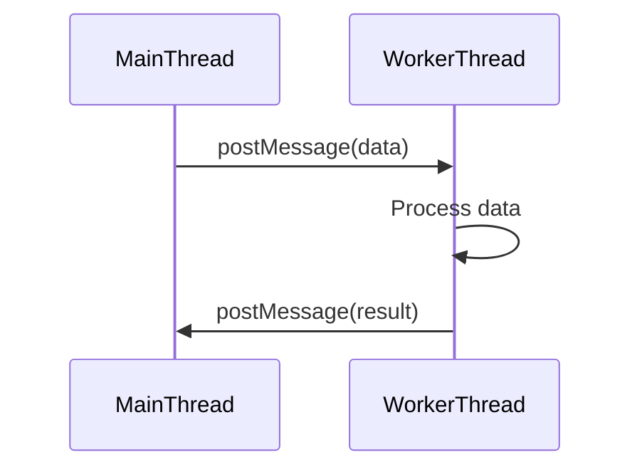

## 10. Concurrency Patterns
### 10.5 Web Workers and Worker Threads

Concurrency in JavaScript is crucial for building responsive and efficient applications. This section explores two powerful tools for achieving concurrency: Web Workers for browser environments and Worker Threads for Node.js. Both allow JavaScript code to run in parallel, enhancing performance and responsiveness.

### Understand the Concepts

#### Web Workers (Browser Environment)
- **Purpose:** Web Workers enable the execution of scripts in background threads, allowing concurrent processing without blocking the main UI thread. This keeps applications responsive, especially during complex computations or high-frequency data updates.
- **How It Works:** Web Workers run in a separate global context, meaning they don't have access to the DOM directly but can communicate with the main thread through message passing.

#### Worker Threads (Node.js Environment)
- **Purpose:** Worker Threads in Node.js utilize the `worker_threads` module to run JavaScript code in parallel threads. This is particularly useful for offloading CPU-intensive tasks from the main event loop, which is traditionally single-threaded.
- **How It Works:** Worker Threads allow Node.js applications to perform heavy computations without blocking the main thread, thus maintaining efficient I/O operations.

### Implementation Steps

#### Web Workers

1. **Create a Worker Script:**
   - Write a separate JavaScript file (`worker.js`) containing the code to be executed in the worker.

   ```javascript
   // worker.js
   onmessage = function(event) {
       const result = event.data * 2; // Example computation
       postMessage(result);
   };
   ```

2. **Instantiate a Web Worker:**
   - In your main script, create a new `Worker` instance.

   ```javascript
   const worker = new Worker('worker.js');
   ```

3. **Communicate with the Worker:**
   - Send data to the worker using `worker.postMessage(data)`.

   ```javascript
   worker.postMessage(10); // Send data to worker
   ```

   - In the worker script, listen for messages with `onmessage`.

   ```javascript
   onmessage = function(event) {
       const result = event.data * 2;
       postMessage(result);
   };
   ```

   - The worker sends messages back using `postMessage(data)`.

   ```javascript
   worker.onmessage = function(event) {
       console.log('Result from worker:', event.data);
   };
   ```

4. **Handle Errors:**
   - Listen for errors in the main script using `worker.onerror`.

   ```javascript
   worker.onerror = function(error) {
       console.error('Worker error:', error.message);
   };
   ```

#### Worker Threads in Node.js

1. **Enable Worker Threads:**
   - Ensure your Node.js version supports worker threads (Node.js 10.5.0 and above).

2. **Import the `worker_threads` Module:**

   ```javascript
   const { Worker } = require('worker_threads');
   ```

3. **Create a Worker:**

   ```javascript
   const worker = new Worker('./worker.js');
   ```

4. **Communicate Between Threads:**
   - Send messages using `worker.postMessage(data)` and receive with `parentPort.on('message', callback)` in the worker script.

   ```javascript
   // main.js
   const { Worker } = require('worker_threads');

   const worker = new Worker('./worker.js');

   worker.postMessage(10);

   worker.on('message', (result) => {
       console.log('Result from worker:', result);
   });

   // worker.js
   const { parentPort } = require('worker_threads');

   parentPort.on('message', (data) => {
       const result = data * 2;
       parentPort.postMessage(result);
   });
   ```

### Use Cases

#### Web Workers
- **Complex Computations:** Ideal for tasks like image processing, encryption, and data parsing.
- **High-Frequency Data Updates:** Handle frequent updates without freezing the UI.

#### Worker Threads
- **CPU-Intensive Tasks:** Suitable for tasks like data compression or large computations in Node.js applications.
- **Efficient I/O Operations:** Keep the main event loop free for handling I/O operations.

### Practice

#### Web Workers
- **Example Project:** Implement a web application that performs image manipulation (e.g., filters) using Web Workers. This can involve applying complex algorithms to images without affecting the UI responsiveness.

#### Worker Threads
- **Example Project:** Create a Node.js application that hashes large files using worker threads to improve performance. This demonstrates the ability to handle CPU-bound tasks efficiently.

### Considerations

- **Data Transfer:**
  - In Web Workers, data is copied between the main thread and worker thread using structured cloning. Use `Transferable` objects (e.g., `ArrayBuffer`) to transfer ownership and improve performance.

- **Thread Safety:**
  - Be cautious with shared state to avoid race conditions. Worker threads do not share any scope with the main thread, ensuring isolation.

- **Performance Overhead:**
  - Consider the cost of creating workers; for small tasks, the overhead might outweigh the benefits.

- **Error Handling:**
  - Ensure proper error handling to prevent crashes and leaks. Implement robust error handling mechanisms in both the main and worker scripts.

### Visual Aids

#### Web Worker Communication Flow


#### Worker Thread Communication Flow



### Conclusion

Web Workers and Worker Threads are essential tools for achieving concurrency in JavaScript applications. By leveraging these patterns, developers can build responsive and efficient applications capable of handling complex computations and high-frequency data updates. Understanding and implementing these patterns will significantly enhance the performance and scalability of your JavaScript applications.

## Quiz Time!



### What is the primary purpose of Web Workers in a browser environment?

- [x] To execute scripts in background threads, allowing concurrent processing without blocking the main UI thread.
- [ ] To access the DOM directly from a separate thread.
- [ ] To handle network requests more efficiently.
- [ ] To improve the rendering speed of the browser.

> **Explanation:** Web Workers allow scripts to run in background threads, preventing the main UI thread from being blocked, thus keeping the application responsive.

### How do Worker Threads in Node.js differ from Web Workers?

- [x] Worker Threads are used in Node.js for parallel processing, while Web Workers are used in browsers.
- [ ] Worker Threads can directly access the DOM, unlike Web Workers.
- [ ] Worker Threads are only for handling I/O operations, whereas Web Workers handle computations.
- [ ] Worker Threads are deprecated in favor of Web Workers.

> **Explanation:** Worker Threads are specific to Node.js and are used for parallel processing, whereas Web Workers are used in browser environments for similar purposes.

### Which module is required to use Worker Threads in Node.js?

- [x] `worker_threads`
- [ ] `threads`
- [ ] `concurrency`
- [ ] `parallel`

> **Explanation:** The `worker_threads` module is used in Node.js to create and manage worker threads for parallel processing.

### What is a common use case for Web Workers?

- [x] Performing complex computations like image processing without freezing the UI.
- [ ] Accessing and manipulating the DOM directly.
- [ ] Handling server-side rendering tasks.
- [ ] Managing database connections in a web application.

> **Explanation:** Web Workers are commonly used for tasks like image processing, where heavy computations are offloaded to prevent UI blocking.

### How can data be transferred more efficiently between the main thread and Web Workers?

- [x] By using `Transferable` objects like `ArrayBuffer`.
- [ ] By directly sharing variables between threads.
- [ ] By using synchronous message passing.
- [ ] By compressing data before sending.

> **Explanation:** `Transferable` objects allow ownership of data to be transferred, improving performance by avoiding data copying.

### What is a key consideration when using Worker Threads in Node.js?

- [x] Avoiding race conditions by ensuring thread safety.
- [ ] Directly accessing the main thread's variables.
- [ ] Using them only for I/O operations.
- [ ] Ensuring they can manipulate the DOM.

> **Explanation:** Thread safety is crucial when using Worker Threads to prevent race conditions and ensure data integrity.

### What is the potential downside of using Web Workers for small tasks?

- [x] The overhead of creating workers might outweigh the benefits.
- [ ] They cannot handle any form of computation.
- [ ] They block the main UI thread.
- [ ] They require a separate server to function.

> **Explanation:** For small tasks, the overhead of creating and managing Web Workers might not be justified compared to the performance gains.

### How do you handle errors in a Web Worker?

- [x] By listening for errors using `worker.onerror` in the main script.
- [ ] By directly catching exceptions in the worker script.
- [ ] By using a try-catch block in the main thread.
- [ ] By ignoring errors as they do not affect the main thread.

> **Explanation:** Errors in a Web Worker can be handled by setting up an `onerror` listener in the main script to manage exceptions and prevent crashes.

### What is the role of `parentPort` in a Node.js Worker Thread?

- [x] It is used to communicate between the main thread and the worker thread.
- [ ] It provides access to the main thread's variables.
- [ ] It is used to manage the lifecycle of the worker thread.
- [ ] It allows direct manipulation of the DOM.

> **Explanation:** `parentPort` is used for message passing between the main thread and the worker thread in Node.js.

### True or False: Web Workers can directly manipulate the DOM.

- [ ] True
- [x] False

> **Explanation:** Web Workers run in a separate global context and do not have direct access to the DOM. They communicate with the main thread through message passing.


