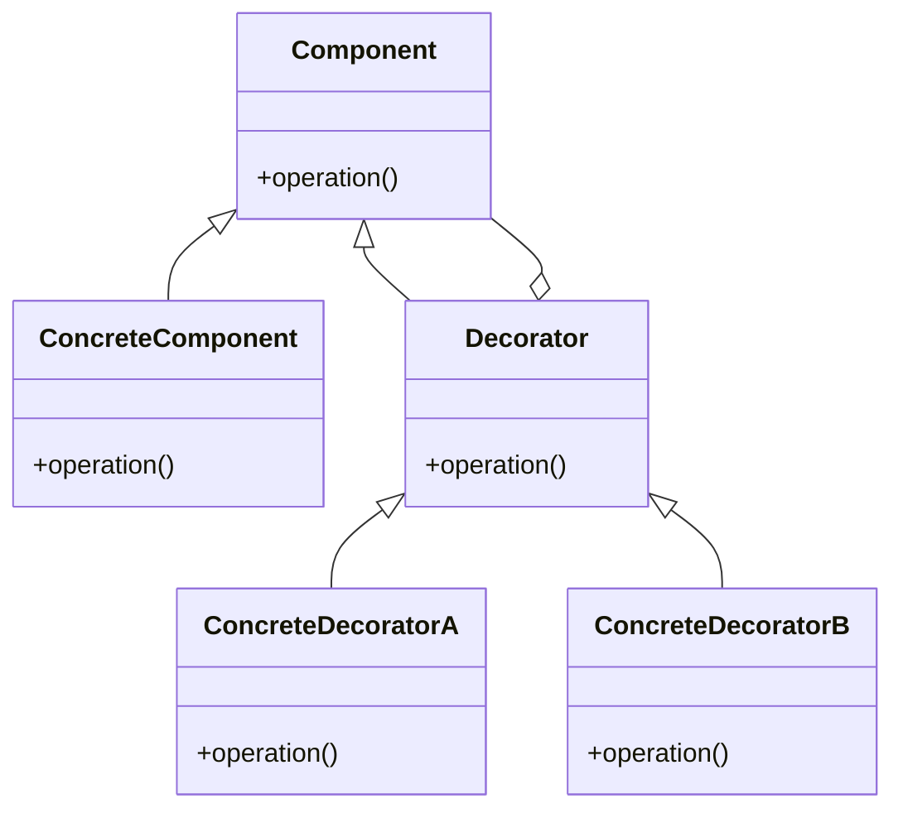

## 10.5 Object Composition over Inheritance

In the realm of object-oriented programming (OOP), developers often face the decision of whether to use inheritance or composition to build their applications. While inheritance has been a staple in OOP, object composition offers a more flexible and maintainable approach, especially in JavaScript. In this section, we will explore the concept of object composition, its advantages over inheritance, and how to effectively implement it in JavaScript.

### Understanding Object Composition

Object composition is a design principle that involves building complex objects by combining simpler ones. Unlike inheritance, which creates a hierarchy of classes, composition focuses on assembling objects with specific behaviors and properties. This approach allows for greater flexibility and reusability, as objects can be easily modified or extended without altering existing code.

#### Key Differences Between Composition and Inheritance

- **Inheritance**: Involves creating a class hierarchy where child classes inherit properties and methods from parent classes. This can lead to tightly coupled code and deep inheritance chains, making maintenance difficult.
- **Composition**: Involves assembling objects from smaller, reusable components. This promotes loose coupling and enhances code flexibility.

### Drawbacks of Deep Inheritance Hierarchies

Deep inheritance hierarchies can lead to several issues:

- **Tight Coupling**: Changes in a parent class can have unintended consequences on child classes, leading to fragile code.
- **Limited Flexibility**: Inheritance locks you into a specific class structure, making it difficult to adapt to changing requirements.
- **Code Duplication**: Common functionality may be duplicated across different branches of the hierarchy.
- **Complexity**: Managing and understanding deep hierarchies can become cumbersome, especially in large codebases.

### Benefits of Object Composition

Object composition offers several advantages over inheritance:

- **Flexibility**: Objects can be easily extended or modified by adding or removing components.
- **Reusability**: Components can be reused across different objects, reducing code duplication.
- **Maintainability**: Changes to a component do not affect other parts of the system, making maintenance easier.
- **Decoupling**: Promotes loose coupling between components, leading to more robust and adaptable code.

### Implementing Object Composition in JavaScript

JavaScript's dynamic nature makes it well-suited for object composition. Let's explore some techniques for composing objects in JavaScript.

#### Using Mixins

Mixins are a way to add functionality to objects by copying properties and methods from one object to another. This allows for the reuse of code across different objects without the need for inheritance.

```javascript
// Define a mixin with shared functionality
const canFly = {
  fly() {
    console.log(`${this.name} is flying!`);
  }
};

// Define a mixin with another shared functionality
const canSwim = {
  swim() {
    console.log(`${this.name} is swimming!`);
  }
};

// Create an object and compose it with mixins
const bird = {
  name: 'Eagle',
  ...canFly
};

const fish = {
  name: 'Shark',
  ...canSwim
};

bird.fly(); // Output: Eagle is flying!
fish.swim(); // Output: Shark is swimming!
```

#### Delegation

Delegation involves forwarding method calls from one object to another. This allows objects to share behavior without inheriting from a common parent.

```javascript
// Define a delegate object
const printer = {
  print() {
    console.log('Printing...');
  }
};

// Define an object that delegates to the printer
const document = {
  title: 'My Document',
  print() {
    printer.print();
  }
};

document.print(); // Output: Printing...
```

### Design Patterns Encouraging Composition

Several design patterns promote object composition over inheritance. Let's explore some of these patterns.

#### Decorator Pattern

The Decorator Pattern allows behavior to be added to individual objects, dynamically, without affecting the behavior of other objects from the same class. This pattern is particularly useful for adhering to the Single Responsibility Principle.

```javascript
// Base class
class Coffee {
  cost() {
    return 5;
  }
}

// Decorator class
class MilkDecorator {
  constructor(coffee) {
    this.coffee = coffee;
  }

  cost() {
    return this.coffee.cost() + 1;
  }
}

// Usage
let myCoffee = new Coffee();
myCoffee = new MilkDecorator(myCoffee);

console.log(myCoffee.cost()); // Output: 6
```

#### Strategy Pattern

The Strategy Pattern defines a family of algorithms, encapsulates each one, and makes them interchangeable. This pattern allows the algorithm to vary independently from clients that use it.

```javascript
// Define strategies
const add = (a, b) => a + b;
const multiply = (a, b) => a * b;

// Context class
class Calculator {
  constructor(strategy) {
    this.strategy = strategy;
  }

  execute(a, b) {
    return this.strategy(a, b);
  }
}

// Usage
const addition = new Calculator(add);
console.log(addition.execute(2, 3)); // Output: 5

const multiplication = new Calculator(multiply);
console.log(multiplication.execute(2, 3)); // Output: 6
```

### When to Choose Composition Over Inheritance

While both inheritance and composition have their place in software design, composition is often the preferred choice in the following scenarios:

- **Dynamic Behavior**: When you need to change the behavior of objects at runtime.
- **Code Reusability**: When you want to reuse functionality across different parts of your application.
- **Avoiding Fragile Base Class Problem**: When changes to a base class should not affect derived classes.
- **Simplifying Code**: When you want to avoid the complexity of deep inheritance hierarchies.

### Visualizing Object Composition

To better understand object composition, let's visualize how objects interact using a class diagram.



In this diagram, `ConcreteComponent` is the base object, and `ConcreteDecoratorA` and `ConcreteDecoratorB` are decorators that add functionality to the base object. This illustrates how composition allows for flexible and dynamic behavior modification.

### Try It Yourself

Experiment with the code examples provided in this section. Try adding new behaviors to objects using mixins or decorators. Consider how you might refactor existing code to use composition instead of inheritance.

### Knowledge Check

- What are the main differences between inheritance and composition?
- How can mixins be used to add functionality to objects in JavaScript?
- What are the benefits of using the Decorator Pattern?
- When should you choose composition over inheritance?

### Summary

Object composition offers a powerful alternative to inheritance, providing flexibility, reusability, and maintainability in JavaScript applications. By understanding and applying composition techniques, you can build robust and adaptable software that is easier to maintain and extend.

### Further Reading

- [MDN Web Docs: Object-Oriented Programming](https://developer.mozilla.org/en-US/docs/Learn/JavaScript/Objects/Object-oriented_JS)
- [JavaScript Design Patterns](https://www.patterns.dev/posts/classic-design-patterns/)
- [Refactoring Guru: Design Patterns](https://refactoring.guru/design-patterns)

Remember, this is just the beginning. As you progress, you'll build more complex and interactive applications. Keep experimenting, stay curious, and enjoy the journey!

## Quiz: Mastering Object Composition in JavaScript



### What is a key advantage of object composition over inheritance?

- [x] Flexibility in modifying object behavior
- [ ] Easier to understand class hierarchies
- [ ] Faster execution time
- [ ] Simpler syntax

> **Explanation:** Object composition allows for flexible modification of object behavior by combining different components, whereas inheritance can lead to rigid class hierarchies.

### Which pattern is commonly used to add behavior to objects dynamically?

- [x] Decorator Pattern
- [ ] Singleton Pattern
- [ ] Factory Pattern
- [ ] Observer Pattern

> **Explanation:** The Decorator Pattern is used to add behavior to objects dynamically without affecting other objects from the same class.

### What is a mixin in JavaScript?

- [x] A way to add functionality to objects by copying properties and methods
- [ ] A type of class inheritance
- [ ] A built-in JavaScript function
- [ ] A method for handling asynchronous code

> **Explanation:** Mixins are used to add functionality to objects by copying properties and methods from one object to another, promoting code reuse.

### When should you choose composition over inheritance?

- [x] When you need dynamic behavior modification
- [ ] When you have a simple class hierarchy
- [ ] When performance is the primary concern
- [ ] When you want to use built-in JavaScript classes

> **Explanation:** Composition is preferred when you need to modify object behavior dynamically or when you want to avoid the complexity of deep inheritance hierarchies.

### Which of the following is a drawback of deep inheritance hierarchies?

- [x] Tight coupling between classes
- [ ] Increased code readability
- [ ] Simplified debugging process
- [ ] Enhanced performance

> **Explanation:** Deep inheritance hierarchies can lead to tight coupling between classes, making the codebase fragile and difficult to maintain.

### What does the Strategy Pattern allow you to do?

- [x] Define a family of algorithms and make them interchangeable
- [ ] Create a single instance of a class
- [ ] Observe changes in object state
- [ ] Decorate objects with additional functionality

> **Explanation:** The Strategy Pattern allows you to define a family of algorithms, encapsulate each one, and make them interchangeable, promoting flexibility.

### How does delegation work in JavaScript?

- [x] By forwarding method calls from one object to another
- [ ] By inheriting properties from a parent class
- [ ] By creating a new instance of a class
- [ ] By using asynchronous callbacks

> **Explanation:** Delegation involves forwarding method calls from one object to another, allowing objects to share behavior without inheritance.

### What is the primary focus of object composition?

- [x] Assembling objects from smaller, reusable components
- [ ] Creating deep class hierarchies
- [ ] Optimizing code execution speed
- [ ] Simplifying syntax

> **Explanation:** Object composition focuses on assembling objects from smaller, reusable components, promoting flexibility and reusability.

### Which of the following is NOT a benefit of object composition?

- [ ] Flexibility
- [ ] Reusability
- [ ] Maintainability
- [x] Increased complexity

> **Explanation:** Object composition reduces complexity by promoting loose coupling and reusability, whereas deep inheritance hierarchies can increase complexity.

### True or False: Object composition is always better than inheritance.

- [ ] True
- [x] False

> **Explanation:** While object composition offers many advantages, there are scenarios where inheritance is more appropriate, such as when a clear hierarchical relationship exists.




