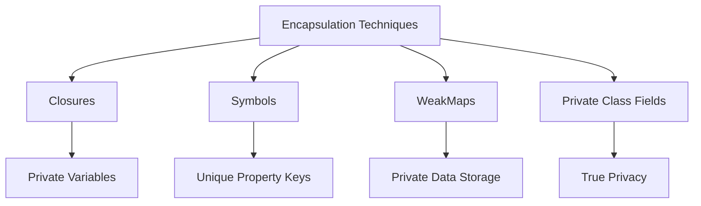

## 10.7 Encapsulation and Privacy

Encapsulation is a fundamental concept in object-oriented programming (OOP) that involves bundling the data (variables) and the methods (functions) that operate on the data into a single unit or class. It restricts direct access to some of an object's components, which can prevent the accidental modification of data. In JavaScript, achieving encapsulation and privacy can be challenging due to its prototypal inheritance model and lack of built-in access modifiers like `private` or `protected` found in other languages. However, JavaScript provides several techniques to achieve encapsulation and privacy, which we will explore in this section.

### Importance of Encapsulation in OOP

Encapsulation serves several purposes in OOP:

- **Data Protection**: By restricting access to certain components, encapsulation protects the integrity of the data.
- **Modularity**: It allows for the separation of concerns, making the code more modular and easier to maintain.
- **Flexibility and Reusability**: Encapsulation enables objects to be reused in different contexts without exposing their internal workings.
- **Ease of Maintenance**: Encapsulated code is easier to debug and maintain because it limits the scope of changes.

### Achieving Privacy in JavaScript

JavaScript offers multiple ways to achieve privacy and encapsulation, each with its own advantages and trade-offs. Let's explore these methods in detail.

#### Using Closures to Create Private Variables

Closures are a powerful feature in JavaScript that allow functions to have access to variables from an outer function even after the outer function has finished executing. This can be used to create private variables.

**Example:**

```javascript
function createCounter() {
  let count = 0; // Private variable

  return {
    increment: function() {
      count++;
      console.log(count);
    },
    decrement: function() {
      count--;
      console.log(count);
    }
  };
}

const counter = createCounter();
counter.increment(); // 1
counter.increment(); // 2
counter.decrement(); // 1
```

**Pros:**
- Simple and effective for creating private variables.
- Well-supported across all JavaScript environments.

**Cons:**
- Can lead to memory leaks if not managed properly, as closures can retain references to outer variables.

#### Utilizing Symbols for Private Properties

Symbols are a primitive data type introduced in ES6 that can be used to create unique property keys. They can be used to simulate private properties.

**Example:**

```javascript
const _privateProperty = Symbol('privateProperty');

class MyClass {
  constructor() {
    this[_privateProperty] = 'secret';
  }

  getPrivateProperty() {
    return this[_privateProperty];
  }
}

const instance = new MyClass();
console.log(instance.getPrivateProperty()); // secret
console.log(instance._privateProperty); // undefined
```

**Pros:**
- Provides a way to create properties that are not easily accessible.
- Symbols are unique, preventing accidental property name clashes.

**Cons:**
- Not truly private, as symbols can be accessed if the symbol reference is known.

#### Employing WeakMaps for Private Data Storage

WeakMaps allow you to associate private data with an object without exposing it as a property. They are particularly useful for storing private data in classes.

**Example:**

```javascript
const privateData = new WeakMap();

class MyClass {
  constructor() {
    privateData.set(this, { secret: 'hidden' });
  }

  getSecret() {
    return privateData.get(this).secret;
  }
}

const instance = new MyClass();
console.log(instance.getSecret()); // hidden
```

**Pros:**
- Truly private, as WeakMap keys are not enumerable and cannot be accessed directly.
- Prevents memory leaks, as WeakMaps do not prevent garbage collection of keys.

**Cons:**
- Slightly more complex to implement compared to closures or symbols.

#### Using the `#` Syntax for Private Class Fields (ES2022)

The `#` syntax is a recent addition to JavaScript that allows you to define private fields in classes.

**Example:**

```javascript
class MyClass {
  #privateField = 'secret';

  getPrivateField() {
    return this.#privateField;
  }
}

const instance = new MyClass();
console.log(instance.getPrivateField()); // secret
console.log(instance.#privateField); // SyntaxError: Private field '#privateField' must be declared in an enclosing class
```

**Pros:**
- Provides true privacy at the language level.
- Simple and intuitive syntax.

**Cons:**
- Requires modern JavaScript environments that support ES2022.

### Best Practices for Maintaining Encapsulation

1. **Use Closures for Simple Use Cases**: When you need to encapsulate a small amount of data or logic, closures are a straightforward choice.

2. **Leverage Symbols for Unique Properties**: Use symbols when you want to avoid property name clashes and need a level of privacy.

3. **Adopt WeakMaps for Complex Data**: When dealing with complex data structures or when privacy is paramount, WeakMaps offer a robust solution.

4. **Utilize Private Class Fields for Modern Code**: If you are working in a modern JavaScript environment, the `#` syntax is the most straightforward way to achieve privacy.

5. **Avoid Over-Encapsulation**: While encapsulation is important, over-encapsulation can lead to unnecessary complexity. Use it judiciously.

6. **Consistent Naming Conventions**: Use consistent naming conventions for private variables and methods to avoid confusion.

7. **Document Your Code**: Clearly document the intended privacy of variables and methods to aid understanding and maintenance.

### Visualizing Encapsulation Techniques

Below is a diagram illustrating how different encapsulation techniques work in JavaScript:



**Diagram Description:** This diagram shows the different encapsulation techniques in JavaScript, including closures, symbols, WeakMaps, and private class fields, and their respective features.

### Try It Yourself

Experiment with the code examples provided in this section. Try modifying the examples to:

- Add more methods to the `createCounter` function that interact with the private `count` variable.
- Use symbols to create multiple private properties in a class.
- Store additional private data in a class using WeakMaps.
- Define multiple private fields in a class using the `#` syntax.

### References and Links

- [MDN Web Docs: Closures](https://developer.mozilla.org/en-US/docs/Web/JavaScript/Closures)
- [MDN Web Docs: Symbols](https://developer.mozilla.org/en-US/docs/Web/JavaScript/Reference/Global_Objects/Symbol)
- [MDN Web Docs: WeakMap](https://developer.mozilla.org/en-US/docs/Web/JavaScript/Reference/Global_Objects/WeakMap)
- [MDN Web Docs: Private Class Fields](https://developer.mozilla.org/en-US/docs/Web/JavaScript/Reference/Classes/Private_class_fields)

### Knowledge Check

- What is encapsulation and why is it important in OOP?
- How can closures be used to create private variables in JavaScript?
- What are the advantages and disadvantages of using symbols for private properties?
- How do WeakMaps provide privacy in JavaScript?
- What is the `#` syntax and how does it enable privacy in classes?

### Embrace the Journey

Remember, mastering encapsulation and privacy in JavaScript is a journey. As you continue to explore these techniques, you'll gain a deeper understanding of how to write robust and maintainable code. Keep experimenting, stay curious, and enjoy the journey!

## Quiz: Mastering Encapsulation and Privacy in JavaScript



### What is the primary purpose of encapsulation in OOP?

- [x] To protect data and restrict access to certain components
- [ ] To make all data publicly accessible
- [ ] To increase the complexity of the code
- [ ] To ensure all methods are static

> **Explanation:** Encapsulation is used to protect data and restrict access to certain components, ensuring data integrity and modularity.

### How can closures be used to create private variables?

- [x] By defining variables in an outer function and accessing them in an inner function
- [ ] By using the `var` keyword
- [ ] By declaring variables globally
- [ ] By using the `this` keyword

> **Explanation:** Closures allow functions to access variables from an outer function, creating private variables.

### What is a disadvantage of using symbols for private properties?

- [x] Symbols are not truly private if the reference is known
- [ ] Symbols are not unique
- [ ] Symbols can be easily enumerated
- [ ] Symbols are not supported in JavaScript

> **Explanation:** Symbols are not truly private because they can be accessed if the symbol reference is known.

### How do WeakMaps provide privacy in JavaScript?

- [x] By associating private data with an object without exposing it as a property
- [ ] By using the `var` keyword
- [ ] By making data globally accessible
- [ ] By using the `this` keyword

> **Explanation:** WeakMaps allow private data to be associated with an object without exposing it as a property.

### What is the `#` syntax used for in JavaScript?

- [x] To define private fields in classes
- [ ] To declare global variables
- [ ] To create public methods
- [ ] To define static properties

> **Explanation:** The `#` syntax is used to define private fields in classes, providing true privacy.

### Which encapsulation technique is best for modern JavaScript environments?

- [x] Private class fields using the `#` syntax
- [ ] Using global variables
- [ ] Using `var` for variable declarations
- [ ] Using public methods only

> **Explanation:** Private class fields using the `#` syntax provide true privacy and are best for modern JavaScript environments.

### What is a benefit of using WeakMaps for private data storage?

- [x] They prevent memory leaks by allowing garbage collection of keys
- [ ] They make data globally accessible
- [ ] They are easier to implement than closures
- [ ] They are not supported in JavaScript

> **Explanation:** WeakMaps prevent memory leaks by allowing garbage collection of keys, making them suitable for private data storage.

### What is a common use case for closures in JavaScript?

- [x] Creating private variables and functions
- [ ] Declaring global variables
- [ ] Making all data publicly accessible
- [ ] Using the `this` keyword

> **Explanation:** Closures are commonly used to create private variables and functions by accessing outer function variables.

### How can symbols help avoid property name clashes?

- [x] By providing unique property keys
- [ ] By making properties public
- [ ] By using the `var` keyword
- [ ] By declaring variables globally

> **Explanation:** Symbols provide unique property keys, helping avoid property name clashes.

### True or False: Encapsulation can lead to unnecessary complexity if overused.

- [x] True
- [ ] False

> **Explanation:** While encapsulation is important, over-encapsulation can lead to unnecessary complexity, so it should be used judiciously.


