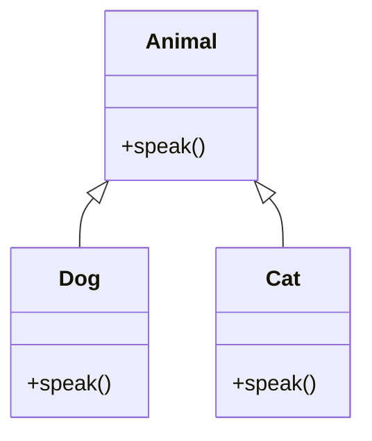

## 10.8 Polymorphism in JavaScript

Polymorphism is a foundational concept in object-oriented programming (OOP) that allows objects of different types to be treated as instances of the same class through a common interface. This capability is crucial for writing flexible and extensible code, enabling developers to design systems that can grow and adapt over time. In JavaScript, polymorphism is achieved primarily through duck typing and method overriding, which we will explore in detail in this section.

### Understanding Polymorphism

**Polymorphism** comes from the Greek words "poly," meaning many, and "morph," meaning form. In programming, it refers to the ability of different objects to respond to the same function or method call in their own unique way. This is typically achieved through a shared interface or superclass.

#### Role in Object-Oriented Programming

In OOP, polymorphism allows for the design of systems where objects can be interacted with through a common interface, regardless of their specific types. This abstraction is powerful because it enables developers to write more generic and reusable code. For example, a function that operates on a `Shape` interface can work with any object that implements `Shape`, whether it's a `Circle`, `Square`, or `Triangle`.

### Polymorphism in JavaScript

JavaScript, being a prototype-based language, achieves polymorphism through **duck typing** and **method overriding**. Let's delve into these concepts.

#### Duck Typing

Duck typing is a concept where the type or class of an object is determined by its behavior (methods and properties) rather than its explicit inheritance from a particular class. The name comes from the saying, "If it looks like a duck, swims like a duck, and quacks like a duck, then it probably is a duck."

In JavaScript, duck typing allows us to treat objects as instances of a particular type if they have the necessary methods and properties, regardless of their actual class or prototype chain.

**Example of Duck Typing:**

```javascript
function makeSound(animal) {
    if (animal.quack) {
        animal.quack();
    } else {
        console.log("This animal doesn't quack.");
    }
}

const duck = {
    quack: function() {
        console.log("Quack!");
    }
};

const dog = {
    bark: function() {
        console.log("Woof!");
    }
};

makeSound(duck); // Output: Quack!
makeSound(dog);  // Output: This animal doesn't quack.
```

In this example, the `makeSound` function checks if the `animal` object has a `quack` method. If it does, it calls the method, demonstrating polymorphic behavior based on the object's capabilities.

#### Method Overriding

Method overriding is another way JavaScript achieves polymorphism. It allows a subclass or derived object to provide a specific implementation of a method that is already defined in its superclass or prototype chain.

**Example of Method Overriding:**

```javascript
class Animal {
    speak() {
        console.log("Animal makes a sound");
    }
}

class Dog extends Animal {
    speak() {
        console.log("Woof! Woof!");
    }
}

class Cat extends Animal {
    speak() {
        console.log("Meow! Meow!");
    }
}

const animals = [new Dog(), new Cat()];

animals.forEach(animal => animal.speak());
// Output:
// Woof! Woof!
// Meow! Meow!
```

In this example, both `Dog` and `Cat` classes override the `speak` method of the `Animal` class. When the `speak` method is called on each object, the overridden method in the respective class is executed, demonstrating polymorphism.

### Benefits of Polymorphism

Polymorphism offers several advantages that enhance the flexibility and extensibility of code:

1. **Code Reusability**: By allowing objects to be treated as instances of their superclass, polymorphism enables the reuse of code across different object types.

2. **Flexibility**: It allows developers to write more flexible code that can work with objects of different types, as long as they adhere to a common interface.

3. **Extensibility**: New object types can be added with minimal changes to existing code, as long as they implement the required interface or methods.

4. **Simplified Code Maintenance**: Polymorphic code is often easier to maintain and extend because it reduces the need for complex conditional logic to handle different object types.

### Challenges and Mitigation

While polymorphism is powerful, it can introduce challenges if not used carefully:

- **Type Safety**: Since JavaScript is dynamically typed, polymorphism can lead to runtime errors if objects do not implement the expected methods. To mitigate this, developers should implement thorough testing and use TypeScript for static type checking.

- **Complexity**: Overuse of polymorphism can make code difficult to understand and maintain. It's important to strike a balance and use polymorphism judiciously.

- **Performance**: Polymorphic code can sometimes be less performant due to dynamic method resolution. Profiling and optimization techniques should be employed to address performance bottlenecks.

### Visualizing Polymorphism in JavaScript

To better understand how polymorphism works in JavaScript, let's visualize the interaction between objects and their methods using a class diagram.



**Diagram Description**: This class diagram illustrates the relationship between the `Animal` superclass and its subclasses `Dog` and `Cat`. Both subclasses override the `speak` method, demonstrating polymorphism through method overriding.

### Try It Yourself

To deepen your understanding of polymorphism in JavaScript, try modifying the examples above:

1. **Add a New Animal**: Create a new class, `Bird`, that extends `Animal` and overrides the `speak` method. Add it to the `animals` array and observe the output.

2. **Experiment with Duck Typing**: Modify the `makeSound` function to check for a different method, such as `bark`, and test it with various objects.

### Knowledge Check

To reinforce your understanding of polymorphism in JavaScript, consider the following questions and challenges:

- How does duck typing differ from traditional type checking?
- What are the benefits of using method overriding in JavaScript?
- Can you identify potential pitfalls of polymorphism and how to avoid them?

### Summary

In this section, we've explored the concept of polymorphism in JavaScript, a key feature of object-oriented programming that enhances code flexibility and extensibility. By leveraging duck typing and method overriding, JavaScript allows developers to write more generic and reusable code. While polymorphism offers significant benefits, it's important to use it judiciously and be aware of potential challenges.

Remember, mastering polymorphism is just one step in your journey to becoming a proficient JavaScript developer. Keep experimenting, stay curious, and enjoy the process of learning and growing as a developer!

## Quiz: Mastering Polymorphism in JavaScript



### What is polymorphism in programming?

- [x] The ability of different objects to be treated as instances of the same class through a common interface.
- [ ] The process of converting one data type to another.
- [ ] A technique for optimizing code performance.
- [ ] A method for debugging JavaScript applications.

> **Explanation:** Polymorphism allows objects of different types to be treated as instances of the same class through a common interface, enhancing code flexibility and reusability.

### How does JavaScript achieve polymorphism?

- [x] Through duck typing and method overriding.
- [ ] By using static typing.
- [ ] Through explicit type declarations.
- [ ] By using only prototype chains.

> **Explanation:** JavaScript achieves polymorphism through duck typing, where objects are treated based on their behavior, and method overriding, where subclasses provide specific implementations of methods.

### What is duck typing?

- [x] A concept where an object's type is determined by its behavior rather than its explicit class.
- [ ] A method for optimizing JavaScript code.
- [ ] A technique for handling asynchronous operations.
- [ ] A way to manage memory in JavaScript.

> **Explanation:** Duck typing allows objects to be treated as instances of a particular type if they have the necessary methods and properties, regardless of their actual class.

### What is method overriding?

- [x] Allowing a subclass to provide a specific implementation of a method already defined in its superclass.
- [ ] A technique for optimizing code execution.
- [ ] A method for handling errors in JavaScript.
- [ ] A way to manage event listeners.

> **Explanation:** Method overriding allows subclasses to provide specific implementations of methods, enabling polymorphic behavior in JavaScript.

### What are the benefits of polymorphism?

- [x] Code reusability and flexibility.
- [x] Simplified code maintenance.
- [ ] Increased memory usage.
- [ ] Reduced code readability.

> **Explanation:** Polymorphism enhances code reusability, flexibility, and maintainability, making it easier to extend and adapt systems.

### What is a potential challenge of using polymorphism in JavaScript?

- [x] Type safety issues due to dynamic typing.
- [ ] Increased code readability.
- [ ] Reduced code flexibility.
- [ ] Simplified debugging process.

> **Explanation:** Polymorphism can lead to type safety issues in JavaScript due to its dynamic typing nature, requiring careful testing and type checking.

### How can developers mitigate type safety issues in JavaScript?

- [x] By using TypeScript for static type checking.
- [ ] By avoiding polymorphism altogether.
- [ ] By using only prototype chains.
- [ ] By writing more complex conditional logic.

> **Explanation:** TypeScript provides static type checking, helping developers mitigate type safety issues in JavaScript.

### What is the role of polymorphism in OOP?

- [x] It allows objects to be interacted with through a common interface, regardless of their specific types.
- [ ] It optimizes code performance.
- [ ] It simplifies memory management.
- [ ] It enhances error handling capabilities.

> **Explanation:** Polymorphism enables objects to be interacted with through a common interface, enhancing code flexibility and reusability in OOP.

### What is the relationship between polymorphism and method overriding?

- [x] Method overriding is a way to achieve polymorphism by allowing subclasses to provide specific implementations of methods.
- [ ] Method overriding is unrelated to polymorphism.
- [ ] Method overriding reduces code flexibility.
- [ ] Method overriding simplifies memory management.

> **Explanation:** Method overriding allows subclasses to provide specific implementations of methods, enabling polymorphic behavior in JavaScript.

### True or False: Polymorphism can lead to performance bottlenecks in JavaScript.

- [x] True
- [ ] False

> **Explanation:** Polymorphic code can sometimes be less performant due to dynamic method resolution, requiring profiling and optimization techniques.


