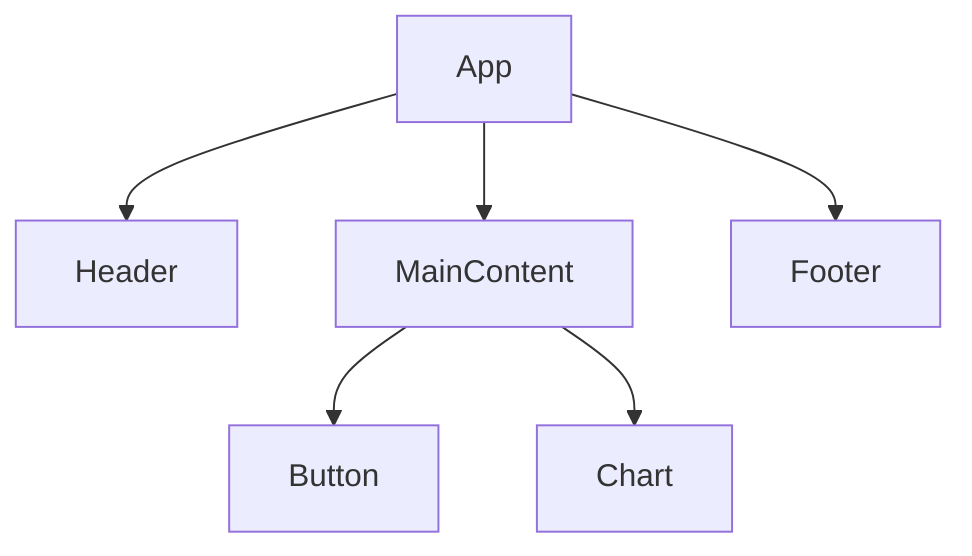

## 10.9 Designing Reusable Components

In modern web development, designing reusable components is crucial for creating maintainable, scalable, and efficient applications. Reusable components allow developers to write code once and use it across multiple projects or within different parts of the same project. This approach not only saves time but also ensures consistency and reduces the potential for errors. In this section, we will explore the principles of modular design, how to create self-contained components with clear interfaces, and best practices for documentation and testing.

### Principles of Modular Design and Separation of Concerns

Modular design is a software design technique that emphasizes separating a program into distinct, independent modules, each responsible for a specific aspect of the application's functionality. This separation of concerns allows developers to focus on one part of the application at a time, making the code easier to understand, test, and maintain.

#### Key Principles

1. **Single Responsibility Principle (SRP)**: Each module or component should have one responsibility or reason to change. This principle helps in maintaining the focus and clarity of each component.

2. **Encapsulation**: Hide the internal details of a component and expose only what is necessary through a well-defined interface. This reduces the complexity of the system and prevents unintended interference between components.

3. **Loose Coupling**: Minimize dependencies between components. Components should interact with each other through interfaces, making it easier to replace or modify them without affecting the rest of the system.

4. **High Cohesion**: Ensure that the elements within a module are closely related in terms of functionality. High cohesion within modules makes them easier to understand and maintain.

5. **Reusability**: Design components to be reusable across different parts of an application or even across different projects. This involves creating generic and configurable components.

### Creating Self-Contained Components with Clear Interfaces

To create reusable components, it's essential to design them as self-contained units with clear interfaces. This means defining what inputs a component accepts, what outputs it produces, and how it interacts with other components.

#### Using Classes and Modules

JavaScript's class syntax and module system provide powerful tools for creating reusable components. Let's explore how to use these features effectively.

**Example: Creating a Reusable Button Component**

```javascript
// button.js - A reusable button component

export default class Button {
  constructor(label, onClick) {
    this.label = label;
    this.onClick = onClick;
  }

  render() {
    const buttonElement = document.createElement('button');
    buttonElement.textContent = this.label;
    buttonElement.addEventListener('click', this.onClick);
    return buttonElement;
  }
}

// Usage
import Button from './button.js';

const myButton = new Button('Click Me', () => alert('Button clicked!'));
document.body.appendChild(myButton.render());
```

In this example, the `Button` class encapsulates the logic for creating a button element. It exposes a `render` method that returns a DOM element, allowing the component to be easily integrated into any part of an application.

#### Design Patterns for Reusable Components

Design patterns provide proven solutions to common problems in software design. When designing reusable components, consider using patterns such as:

- **Factory Pattern**: To create instances of components with different configurations.
- **Decorator Pattern**: To add additional functionality to components without modifying their structure.
- **Observer Pattern**: To allow components to communicate changes to other parts of the application.

### Considerations for Component Configuration and Customization

Reusable components should be configurable and customizable to meet the needs of different use cases. This can be achieved through:

- **Constructor Parameters**: Allowing configuration through parameters passed to the constructor.
- **Method Parameters**: Providing methods that accept parameters to modify the component's behavior.
- **Configuration Objects**: Using objects to pass multiple configuration options at once.

**Example: Configurable Chart Component**

```javascript
// chart.js - A configurable chart component

export default class Chart {
  constructor({ type = 'bar', data = [], options = {} }) {
    this.type = type;
    this.data = data;
    this.options = options;
  }

  render() {
    // Logic to render the chart based on type, data, and options
  }
}

// Usage
import Chart from './chart.js';

const myChart = new Chart({
  type: 'line',
  data: [1, 2, 3, 4, 5],
  options: { color: 'blue' }
});
myChart.render();
```

In this example, the `Chart` component is configured using an object passed to the constructor, allowing for flexible customization.

### Documentation and Testing Practices for Reusable Components

Proper documentation and testing are essential for ensuring that reusable components are easy to use and maintain.

#### Documentation

- **API Documentation**: Clearly document the component's interface, including its methods, parameters, and expected behavior.
- **Usage Examples**: Provide examples of how to use the component in different scenarios.
- **Configuration Options**: Document all available configuration options and their effects.

#### Testing

- **Unit Tests**: Write tests for each component to verify its functionality in isolation.
- **Integration Tests**: Test how the component interacts with other parts of the application.
- **Mocking and Stubbing**: Use mocking and stubbing to simulate interactions with external dependencies.

**Example: Testing a Reusable Component with Jest**

```javascript
// button.test.js - Testing the Button component

import Button from './button.js';

test('Button renders with correct label', () => {
  const button = new Button('Test', () => {});
  const buttonElement = button.render();
  expect(buttonElement.textContent).toBe('Test');
});

test('Button calls onClick handler when clicked', () => {
  const mockHandler = jest.fn();
  const button = new Button('Test', mockHandler);
  const buttonElement = button.render();
  buttonElement.click();
  expect(mockHandler).toHaveBeenCalled();
});
```

### Packaging Components for Distribution (npm Packages)

To share reusable components with others, consider packaging them as npm packages. This allows other developers to easily install and use your components in their projects.

#### Steps to Create an npm Package

1. **Initialize the Package**: Use `npm init` to create a `package.json` file.
2. **Write the Code**: Develop your component and ensure it is well-documented and tested.
3. **Publish the Package**: Use `npm publish` to publish your package to the npm registry.

**Example: Publishing a Simple npm Package**

```bash
# Initialize the package
npm init

# Write your component code

# Publish the package
npm publish
```

### Visualizing Component Interaction

To better understand how components interact within an application, let's visualize a simple component hierarchy using Mermaid.js.



**Caption**: This diagram represents a simple application structure with a main `App` component containing `Header`, `MainContent`, and `Footer` components. The `MainContent` component further contains `Button` and `Chart` components.

### Knowledge Check

- **What is the Single Responsibility Principle, and why is it important in modular design?**
- **How can encapsulation improve the maintainability of a component?**
- **What are some common design patterns used in creating reusable components?**
- **How can you ensure that a component is easily configurable and customizable?**
- **Why is documentation important for reusable components, and what should it include?**

### Exercises

1. **Create a Reusable Modal Component**: Design a modal component that can display different types of content and handle various events.
2. **Test a Reusable Form Component**: Write unit tests for a form component that validates user input and displays error messages.

### Embrace the Journey

Remember, designing reusable components is an ongoing process. As you gain experience, you'll discover new ways to improve your components and make them even more versatile. Keep experimenting, stay curious, and enjoy the journey!

## Quiz: Mastering Reusable Components in JavaScript



### What is the primary benefit of designing reusable components?

- [x] Code reuse and maintainability
- [ ] Faster execution speed
- [ ] Reduced memory usage
- [ ] Enhanced security

> **Explanation:** Reusable components promote code reuse and maintainability, allowing developers to write code once and use it across multiple projects.

### Which principle emphasizes that a module should have only one reason to change?

- [x] Single Responsibility Principle
- [ ] Encapsulation
- [ ] Loose Coupling
- [ ] High Cohesion

> **Explanation:** The Single Responsibility Principle states that a module should have only one reason to change, focusing on a single responsibility.

### What is encapsulation in the context of reusable components?

- [x] Hiding internal details and exposing a clear interface
- [ ] Combining multiple components into one
- [ ] Increasing the complexity of a component
- [ ] Making a component dependent on others

> **Explanation:** Encapsulation involves hiding the internal details of a component and exposing only what is necessary through a well-defined interface.

### Which design pattern is useful for adding additional functionality to components without modifying their structure?

- [x] Decorator Pattern
- [ ] Factory Pattern
- [ ] Observer Pattern
- [ ] Singleton Pattern

> **Explanation:** The Decorator Pattern allows additional functionality to be added to components without modifying their structure.

### How can a component be made configurable?

- [x] Using constructor parameters and configuration objects
- [ ] By hardcoding values
- [ ] By making it dependent on global variables
- [ ] By removing all configuration options

> **Explanation:** A component can be made configurable by using constructor parameters and configuration objects to allow flexible customization.

### What should be included in the documentation of a reusable component?

- [x] API documentation, usage examples, and configuration options
- [ ] Only the source code
- [ ] A list of known bugs
- [ ] The developer's personal notes

> **Explanation:** Documentation should include API documentation, usage examples, and configuration options to help users understand and use the component effectively.

### What is the purpose of unit tests for reusable components?

- [x] To verify the functionality of the component in isolation
- [ ] To test the entire application
- [ ] To check the component's performance
- [ ] To ensure the component is secure

> **Explanation:** Unit tests verify the functionality of a component in isolation, ensuring it behaves as expected.

### How can reusable components be shared with others?

- [x] By packaging them as npm packages
- [ ] By copying and pasting the code
- [ ] By sending the source code via email
- [ ] By writing detailed blog posts

> **Explanation:** Reusable components can be shared with others by packaging them as npm packages, allowing easy installation and use.

### What is the role of the `render` method in a component?

- [x] To create and return a DOM element
- [ ] To initialize the component's state
- [ ] To handle user input
- [ ] To manage component dependencies

> **Explanation:** The `render` method creates and returns a DOM element, allowing the component to be integrated into the application.

### True or False: High cohesion within a module makes it easier to understand and maintain.

- [x] True
- [ ] False

> **Explanation:** High cohesion ensures that the elements within a module are closely related in terms of functionality, making it easier to understand and maintain.



By following these guidelines and principles, you can design reusable components that enhance the maintainability and scalability of your JavaScript applications. Keep exploring and refining your skills, and you'll be well on your way to mastering the art of reusable component design.
