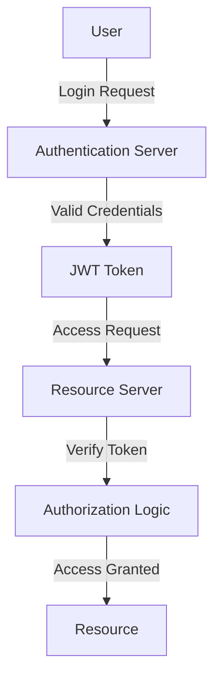

---

linkTitle: "11.1 Authentication and Authorization Strategies"
title: "Authentication and Authorization Strategies: Secure Your JavaScript and TypeScript Applications"
description: "Explore comprehensive strategies for implementing authentication and authorization in JavaScript and TypeScript applications, focusing on modern techniques like OAuth 2.0, JWT, and RBAC."
categories:
- Security
- JavaScript
- TypeScript
tags:
- Authentication
- Authorization
- JWT
- OAuth
- RBAC
date: 2024-10-25
type: docs
nav_weight: 11100

canonical: "https://softwarepatternslexicon.com/patterns-js/11/1"
license: "© 2024 Tokenizer Inc. CC BY-NC-SA 4.0"
---

## 11. Security Patterns
### 11.1 Authentication and Authorization Strategies

In the realm of software development, especially in web applications, ensuring that users are who they claim to be and have access only to what they are permitted is crucial. This section delves into the strategies for implementing robust authentication and authorization mechanisms in JavaScript and TypeScript applications.

### Understand the Concepts

#### Authentication
Authentication is the process of verifying the identity of a user or entity. It ensures that the person or system accessing the application is who they claim to be. Common methods include passwords, biometrics, and multi-factor authentication.

#### Authorization
Authorization determines what an authenticated user is allowed to do. It involves setting permissions and access levels to ensure that users can only access resources they are permitted to use.

### Implementation Steps

#### 1. Choose an Authentication Method

- **OAuth 2.0:** A widely used open standard for access delegation, commonly used as a way to grant websites or applications limited access to user information without exposing passwords.
  
- **JWT (JSON Web Tokens):** A compact, URL-safe means of representing claims to be transferred between two parties. It is often used for stateless authentication sessions.

- **Session-Based Authentication:** Traditional method where the server maintains a session for each user, typically stored in a database or in-memory store like Redis.

#### 2. Set Up Authorization Logic

- **Define User Roles and Permissions:** Establish roles such as admin, user, and guest, and assign permissions accordingly.

- **Role-Based Access Control (RBAC):** A method of regulating access to resources based on the roles of individual users within an organization.

#### 3. Implement Secure Storage

- **Hashing and Salting:** Use cryptographic hashing algorithms like bcrypt to securely store passwords. Salting adds an additional layer of security by adding random data to the input of the hash function.

### Code Examples

#### Using Passport.js in Node.js for Authentication

Passport.js is a popular middleware for Node.js that simplifies the process of implementing authentication strategies.

```javascript
const express = require('express');
const passport = require('passport');
const LocalStrategy = require('passport-local').Strategy;
const bcrypt = require('bcrypt');

const users = []; // This should be replaced with a database

passport.use(new LocalStrategy(
  function(username, password, done) {
    const user = users.find(user => user.username === username);
    if (!user) {
      return done(null, false, { message: 'Incorrect username.' });
    }
    bcrypt.compare(password, user.password, (err, res) => {
      if (res) {
        return done(null, user);
      } else {
        return done(null, false, { message: 'Incorrect password.' });
      }
    });
  }
));

const app = express();
app.use(passport.initialize());

app.post('/login', passport.authenticate('local', {
  successRedirect: '/',
  failureRedirect: '/login'
}));
```

#### Implementing JWT-Based Authentication

JWTs are ideal for stateless authentication, where the server does not need to store session information.

```typescript
import express from 'express';
import jwt from 'jsonwebtoken';

const app = express();
const SECRET_KEY = 'your-secret-key';

app.post('/login', (req, res) => {
  const { username, password } = req.body;
  // Validate user credentials (this should be done with a database)
  if (username === 'user' && password === 'password') {
    const token = jwt.sign({ username }, SECRET_KEY, { expiresIn: '1h' });
    res.json({ token });
  } else {
    res.status(401).send('Invalid credentials');
  }
});

app.get('/protected', (req, res) => {
  const token = req.headers['authorization'];
  if (token) {
    jwt.verify(token, SECRET_KEY, (err, decoded) => {
      if (err) {
        return res.status(401).send('Invalid token');
      } else {
        res.json({ message: 'Protected data', user: decoded });
      }
    });
  } else {
    res.status(401).send('No token provided');
  }
});
```

### Use Cases

- **Securing Web Applications:** Implementing authentication and authorization ensures that only legitimate users can access the application and perform actions based on their roles.

- **APIs and Microservices:** Protect APIs by requiring authentication tokens and implementing role-based access control to manage permissions.

### Practice

To solidify your understanding, try building a simple login system using JWT for authentication and role-based authorization. This exercise will help you grasp the practical aspects of implementing these strategies.

### Considerations

- **Use HTTPS:** Always use HTTPS to encrypt data in transit and protect against man-in-the-middle attacks.

- **Regularly Update and Patch Libraries:** Keep your authentication libraries up to date to protect against vulnerabilities.

### Visual Aids

#### Authentication and Authorization Flow



### Advantages and Disadvantages

#### Advantages

- **Security:** Proper authentication and authorization mechanisms protect sensitive data and resources.
- **Scalability:** Stateless authentication like JWT scales well with distributed systems.

#### Disadvantages

- **Complexity:** Implementing robust security measures can add complexity to the application.
- **Token Management:** JWTs require careful management to avoid security risks like token expiration and revocation.

### Best Practices

- **Use Strong Password Policies:** Encourage users to create strong passwords and consider implementing multi-factor authentication.
- **Implement Least Privilege:** Grant users the minimum level of access necessary for their role.
- **Regularly Audit Access Logs:** Monitor and review access logs to detect unauthorized access attempts.

### Comparisons

- **OAuth vs. JWT:** OAuth is more suitable for third-party access delegation, while JWT is ideal for stateless authentication within your own applications.
- **Session-Based vs. JWT:** Session-based authentication is easier to implement for small applications, but JWTs offer better scalability for distributed systems.

### Conclusion

Implementing effective authentication and authorization strategies is essential for securing modern web applications. By understanding the concepts and following best practices, developers can protect their applications from unauthorized access and ensure that users have the appropriate permissions.

## Quiz Time!



### What is the primary purpose of authentication?

- [x] Verifying the identity of a user or entity
- [ ] Determining the access levels of a user
- [ ] Encrypting data in transit
- [ ] Storing user credentials securely

> **Explanation:** Authentication is the process of verifying the identity of a user or entity to ensure they are who they claim to be.

### Which of the following is a common method for implementing stateless authentication?

- [ ] Session-based authentication
- [x] JWT (JSON Web Tokens)
- [ ] OAuth 1.0
- [ ] Basic authentication

> **Explanation:** JWT is commonly used for stateless authentication, where the server does not need to store session information.

### What is the role of authorization in a security system?

- [ ] Verifying user identity
- [x] Determining access levels or permissions
- [ ] Encrypting sensitive data
- [ ] Logging user activities

> **Explanation:** Authorization determines what an authenticated user is allowed to do by setting permissions and access levels.

### Which library is commonly used in Node.js for implementing authentication strategies?

- [x] Passport.js
- [ ] Express.js
- [ ] React.js
- [ ] Angular.js

> **Explanation:** Passport.js is a popular middleware for Node.js that simplifies the process of implementing authentication strategies.

### What is the benefit of using HTTPS in authentication systems?

- [x] Protects data in transit
- [ ] Increases server response time
- [ ] Simplifies token management
- [ ] Reduces code complexity

> **Explanation:** HTTPS encrypts data in transit, protecting it from interception and man-in-the-middle attacks.

### What is a key advantage of using JWT for authentication?

- [ ] Requires server-side session storage
- [x] Stateless and scalable
- [ ] Limited to small applications
- [ ] Complex to implement

> **Explanation:** JWTs are stateless, meaning they do not require server-side session storage, making them scalable for distributed systems.

### Which access control mechanism is based on user roles?

- [ ] Discretionary Access Control (DAC)
- [x] Role-Based Access Control (RBAC)
- [ ] Mandatory Access Control (MAC)
- [ ] Attribute-Based Access Control (ABAC)

> **Explanation:** Role-Based Access Control (RBAC) regulates access to resources based on user roles.

### What is a common technique for securely storing passwords?

- [x] Hashing and salting
- [ ] Plain text storage
- [ ] Base64 encoding
- [ ] URL encoding

> **Explanation:** Hashing and salting are techniques used to securely store passwords by adding random data to the input of the hash function.

### Which of the following is a disadvantage of using JWT?

- [ ] Requires server-side session storage
- [x] Token management complexity
- [ ] Limited scalability
- [ ] Incompatible with HTTPS

> **Explanation:** JWTs require careful management to avoid security risks like token expiration and revocation.

### True or False: OAuth 2.0 is primarily used for third-party access delegation.

- [x] True
- [ ] False

> **Explanation:** OAuth 2.0 is an open standard for access delegation, commonly used to grant websites or applications limited access to user information without exposing passwords.


