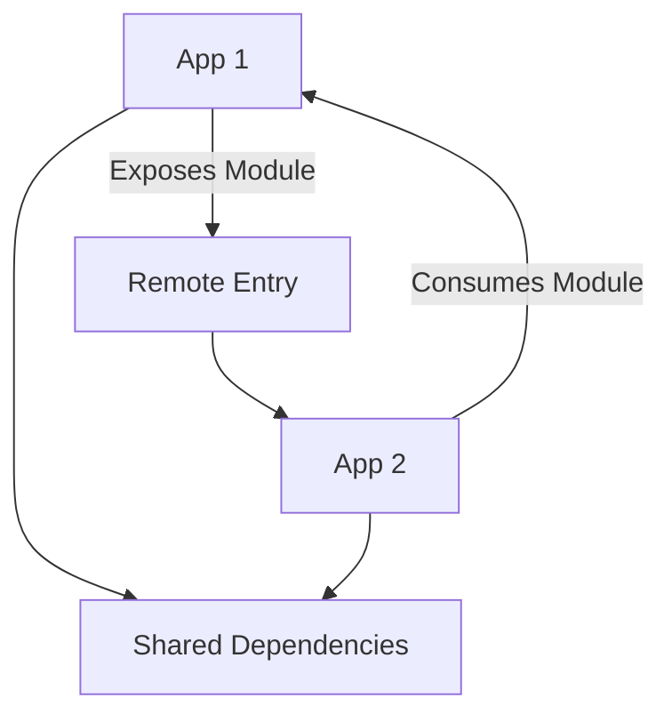

## 11.12 Module Federation with Webpack 5

### Introduction to Module Federation

Module Federation is a revolutionary feature introduced in Webpack 5 that allows developers to share code between different applications at runtime. This capability is particularly useful in the context of micro-frontends, where different parts of a web application are developed and deployed independently. With Module Federation, you can dynamically load modules from other applications, reducing duplication and enabling more flexible and scalable architectures.

### The Purpose of Module Federation

The primary purpose of Module Federation is to facilitate the sharing of code and dependencies between separate applications without the need for complex build-time integrations. This is achieved by allowing applications to expose and consume modules at runtime, effectively enabling a plug-and-play architecture for web applications.

### Facilitating Micro-Frontends

Micro-frontends are an architectural style where a web application is composed of semi-independent fragments, each owned by different teams. Module Federation makes it easier to implement micro-frontends by allowing these fragments to share common code and libraries dynamically. This reduces the overhead of maintaining multiple versions of the same library across different parts of the application.

### Dynamic Module Loading

Dynamic module loading is a key feature of Module Federation. It allows applications to load modules from other applications on demand, rather than bundling all dependencies at build time. This not only reduces the initial load time of the application but also allows for more granular updates and deployments.

### Configuring Module Federation in Webpack 5

To configure Module Federation in Webpack 5, you need to modify your Webpack configuration file to define which modules should be exposed and which should be consumed. Here is a basic example:

```javascript
// webpack.config.js
const ModuleFederationPlugin = require('webpack/lib/container/ModuleFederationPlugin');

module.exports = {
  mode: 'development',
  devServer: {
    port: 3001,
  },
  plugins: [
    new ModuleFederationPlugin({
      name: 'app1',
      filename: 'remoteEntry.js',
      exposes: {
        './Button': './src/Button',
      },
      remotes: {
        app2: 'app2@http://localhost:3002/remoteEntry.js',
      },
      shared: ['react', 'react-dom'],
    }),
  ],
};
```

#### Explanation of Configuration

- **name**: This is the name of the module federation container.
- **filename**: The name of the file that will be used to expose the modules.
- **exposes**: Specifies which modules should be exposed to other applications.
- **remotes**: Defines the remote applications and their entry points.
- **shared**: Lists the shared dependencies between the applications.

### Benefits of Module Federation

1. **Reduced Duplication**: By sharing common libraries and components, Module Federation reduces the duplication of code across different parts of an application.
2. **Independent Deployment**: Each part of the application can be developed and deployed independently, allowing for more agile development processes.
3. **Scalability**: Applications can scale more effectively by loading only the necessary modules at runtime.
4. **Flexibility**: Developers can choose which parts of the application to update without affecting the entire system.

### Considerations for Version Compatibility and Shared Dependencies

When using Module Federation, it's important to consider version compatibility and shared dependencies. Here are some best practices:

- **Version Compatibility**: Ensure that shared libraries are compatible across different applications. This may involve using specific versions or implementing version checks.
- **Shared Dependencies**: Define shared dependencies carefully to avoid conflicts. Use the `shared` option in the Webpack configuration to specify which libraries should be shared.

### Visualizing Module Federation

To better understand how Module Federation works, let's visualize the interaction between different applications using a Mermaid.js diagram:



**Diagram Description**: This diagram illustrates how App 1 exposes a module via a remote entry, which is then consumed by App 2. Both applications share common dependencies.

### Resources and Further Reading

For more detailed information on Module Federation, refer to the [Webpack Module Federation Guide](https://webpack.js.org/concepts/module-federation/).

### Knowledge Check

To reinforce your understanding of Module Federation, consider the following questions:

- What is the primary purpose of Module Federation in Webpack 5?
- How does Module Federation facilitate micro-frontends?
- What are the key components of a Module Federation configuration in Webpack?
- How can you ensure version compatibility when using shared dependencies?

### Summary

Module Federation in Webpack 5 is a powerful tool for modern web development, enabling dynamic module loading and facilitating the implementation of micro-frontends. By understanding and leveraging this feature, developers can create more scalable, flexible, and maintainable applications.

### Embrace the Journey

Remember, this is just the beginning. As you progress, you'll discover more advanced techniques and patterns that will further enhance your web development skills. Keep experimenting, stay curious, and enjoy the journey!

## Mastering Module Federation with Webpack 5



### What is the primary purpose of Module Federation in Webpack 5?

- [x] To enable code sharing between applications at runtime
- [ ] To compile JavaScript code faster
- [ ] To reduce the size of the Webpack configuration file
- [ ] To improve CSS handling in Webpack

> **Explanation:** Module Federation is designed to allow applications to share code and dependencies at runtime, facilitating more modular and scalable architectures.

### How does Module Federation facilitate micro-frontends?

- [x] By allowing different parts of an application to share common code and libraries
- [ ] By reducing the need for CSS inlining
- [ ] By improving server-side rendering capabilities
- [ ] By enhancing image optimization

> **Explanation:** Module Federation enables micro-frontends by allowing different parts of an application to share code and dependencies dynamically, reducing duplication and enabling independent deployment.

### What is the role of the `exposes` option in Module Federation configuration?

- [x] It specifies which modules should be exposed to other applications
- [ ] It defines the entry point for the application
- [ ] It lists the shared dependencies
- [ ] It sets the development server port

> **Explanation:** The `exposes` option in the Module Federation configuration specifies which modules are available for other applications to consume.

### Which of the following is a benefit of using Module Federation?

- [x] Reduced duplication of code
- [ ] Increased build time
- [ ] More complex configuration
- [ ] Limited scalability

> **Explanation:** Module Federation reduces code duplication by allowing applications to share common libraries and components.

### What should be considered when defining shared dependencies in Module Federation?

- [x] Version compatibility
- [ ] The size of the Webpack configuration file
- [ ] The number of CSS files
- [ ] The use of inline scripts

> **Explanation:** When defining shared dependencies, it's important to ensure version compatibility to avoid conflicts between different parts of the application.

### What is the `remotes` option used for in Module Federation?

- [x] It defines the remote applications and their entry points
- [ ] It specifies the output directory
- [ ] It lists the plugins to be used
- [ ] It sets the mode to development or production

> **Explanation:** The `remotes` option in the Module Federation configuration defines which remote applications can be accessed and their entry points.

### How can Module Federation improve scalability?

- [x] By loading only the necessary modules at runtime
- [ ] By increasing the number of CSS files
- [ ] By reducing the number of HTML files
- [ ] By limiting the use of JavaScript

> **Explanation:** Module Federation improves scalability by allowing applications to load only the necessary modules at runtime, reducing the initial load time and enabling more granular updates.

### What is a key consideration when using Module Federation?

- [x] Ensuring version compatibility and managing shared dependencies
- [ ] Increasing the number of JavaScript files
- [ ] Reducing the number of HTML elements
- [ ] Limiting the use of CSS

> **Explanation:** A key consideration when using Module Federation is ensuring that shared dependencies are compatible across different applications to avoid conflicts.

### True or False: Module Federation allows for independent deployment of different parts of an application.

- [x] True
- [ ] False

> **Explanation:** True. Module Federation enables independent deployment by allowing different parts of an application to be developed and deployed separately.

### True or False: Module Federation is only useful for large-scale applications.

- [ ] True
- [x] False

> **Explanation:** False. While Module Federation is particularly beneficial for large-scale applications, it can also be useful for smaller projects that require modular architecture and dynamic code sharing.


