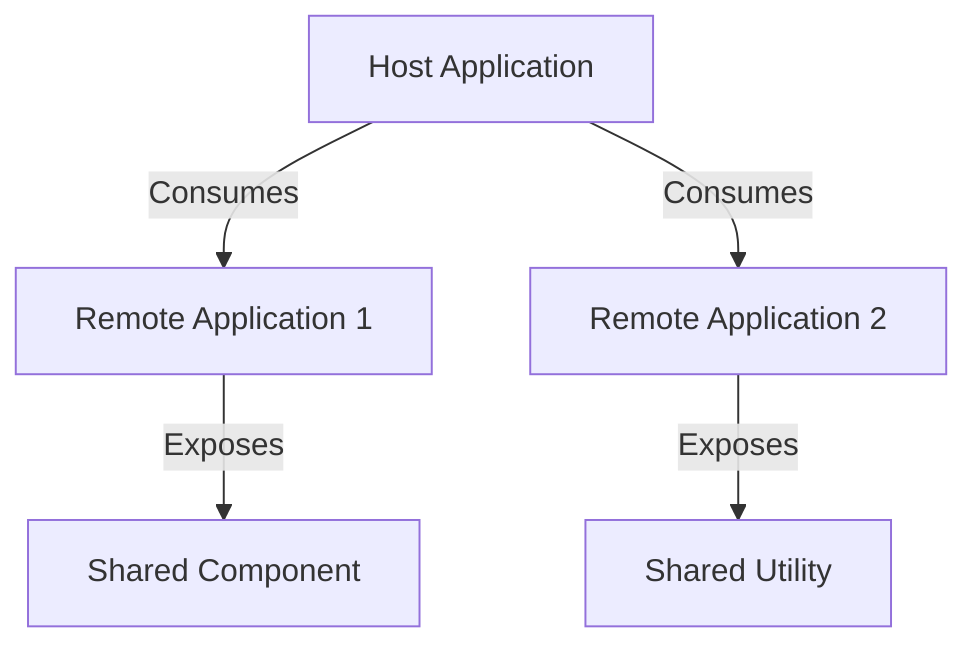

## 11.13 Building Micro-Frontends with Module Federation

In the ever-evolving landscape of web development, the need for scalable, maintainable, and efficient front-end architectures has led to the rise of micro-frontends. This approach allows multiple teams to work independently on different parts of a front-end application, promoting agility and reducing bottlenecks. Module Federation, introduced in Webpack 5, is a powerful tool that facilitates the implementation of micro-frontend architectures by enabling the dynamic sharing of code between applications.

### Understanding Micro-Frontend Architecture

Micro-frontends extend the concept of microservices to the front-end world. Instead of a monolithic front-end application, the UI is divided into smaller, more manageable pieces, each owned by an independent team. This architecture offers several benefits:

- **Scalability**: Teams can scale independently, focusing on their specific domain without affecting others.
- **Flexibility**: Different parts of the application can use different technologies, allowing teams to choose the best tools for their needs.
- **Maintainability**: Smaller codebases are easier to manage, test, and deploy.

However, implementing micro-frontends comes with challenges, such as ensuring consistent user experience and managing shared dependencies.

### Introducing Module Federation

Module Federation is a feature of Webpack 5 that allows multiple applications to share code at runtime. It enables the dynamic loading of remote modules, making it possible to build applications that can consume code from other applications without bundling it during the build process.

#### Key Concepts of Module Federation

- **Remote and Host Applications**: In Module Federation, an application can be a host (consuming remote modules) or a remote (providing modules to other applications).
- **Exposes and Remotes**: Modules can be exposed by a remote application and consumed by a host application.
- **Shared Dependencies**: Dependencies can be shared between applications to avoid duplication and ensure consistency.

### Setting Up Module Federation for Micro-Frontends

Let's walk through the process of setting up Module Federation for a micro-frontend architecture.

#### Step 1: Configure Webpack for Module Federation

First, ensure that your project is using Webpack 5. Then, configure the `ModuleFederationPlugin` in your Webpack configuration.

```javascript
// webpack.config.js
const ModuleFederationPlugin = require("webpack").container.ModuleFederationPlugin;

module.exports = {
  // Other configurations...
  plugins: [
    new ModuleFederationPlugin({
      name: "app1",
      filename: "remoteEntry.js",
      exposes: {
        "./Button": "./src/Button",
      },
      remotes: {
        app2: "app2@http://localhost:3002/remoteEntry.js",
      },
      shared: ["react", "react-dom"],
    }),
  ],
};
```

- **name**: The unique name of the application.
- **filename**: The file where the remote entry point is exposed.
- **exposes**: The modules that this application exposes to others.
- **remotes**: The remote applications that this application can consume.
- **shared**: The dependencies that are shared between applications.

#### Step 2: Expose Components and Utilities

In the example above, we expose a `Button` component. This allows other applications to consume this component without bundling it.

```javascript
// src/Button.js
import React from 'react';

const Button = () => {
  return <button>Click Me</button>;
};

export default Button;
```

#### Step 3: Consume Remote Modules

In another application, configure Webpack to consume the exposed module.

```javascript
// webpack.config.js for app2
const ModuleFederationPlugin = require("webpack").container.ModuleFederationPlugin;

module.exports = {
  // Other configurations...
  plugins: [
    new ModuleFederationPlugin({
      name: "app2",
      remotes: {
        app1: "app1@http://localhost:3001/remoteEntry.js",
      },
      shared: ["react", "react-dom"],
    }),
  ],
};
```

Now, you can import and use the `Button` component from `app1`.

```javascript
// src/App.js
import React from 'react';
const Button = React.lazy(() => import('app1/Button'));

const App = () => {
  return (
    <React.Suspense fallback="Loading Button...">
      <Button />
    </React.Suspense>
  );
};

export default App;
```

### Sharing Components and Utilities

Module Federation allows you to share not only UI components but also utilities and services. This is crucial for maintaining consistency across different parts of the application.

#### Strategies for Sharing

- **Common Libraries**: Share libraries like React, Redux, or utility libraries to avoid duplication.
- **Design Systems**: Share design system components to ensure a consistent look and feel.
- **State Management**: Share state management logic to synchronize state across applications.

### Routing, State Management, and Inter-Application Communication

Implementing micro-frontends requires careful consideration of routing, state management, and communication between applications.

#### Routing

Use a top-level router to manage navigation across different micro-frontends. Each micro-frontend can have its own internal routing logic.

```javascript
// Example of a top-level router
import { BrowserRouter as Router, Route, Switch } from 'react-router-dom';

const App = () => (
  <Router>
    <Switch>
      <Route path="/app1" component={App1} />
      <Route path="/app2" component={App2} />
    </Switch>
  </Router>
);
```

#### State Management

Consider using a global state management solution like Redux or Context API to manage shared state. Alternatively, each micro-frontend can manage its own state and communicate changes through events or a shared service.

#### Inter-Application Communication

Use custom events or a shared event bus to facilitate communication between micro-frontends. This allows applications to remain decoupled while still being able to interact.

### Challenges and Solutions

Building micro-frontends with Module Federation presents several challenges:

- **Style Isolation**: Ensure that styles do not leak between micro-frontends. Use CSS Modules or Shadow DOM to encapsulate styles.
- **Dependency Conflicts**: Manage shared dependencies carefully to avoid version conflicts. Use the `shared` option in Module Federation to specify compatible versions.
- **Performance**: Lazy load remote modules to improve performance and reduce initial load times.

### Best Practices for Consistency and Performance

- **Version Control**: Use semantic versioning for shared modules to manage updates and compatibility.
- **Testing**: Implement end-to-end tests to ensure that micro-frontends work together seamlessly.
- **Monitoring**: Use monitoring tools to track performance and identify bottlenecks.
- **Documentation**: Maintain clear documentation for shared components and utilities to facilitate collaboration.

### Visualizing Micro-Frontend Architecture

Below is a diagram illustrating the interaction between host and remote applications in a micro-frontend architecture using Module Federation.



**Caption**: This diagram shows how a host application consumes remote applications, which expose shared components and utilities.

### Try It Yourself

Experiment with the provided code examples by:

- Modifying the exposed components to include additional functionality.
- Adding new remote applications and configuring them to share different modules.
- Implementing a shared state management solution and observing how it affects inter-application communication.

### Conclusion

Building micro-frontends with Module Federation offers a scalable and flexible approach to front-end development. By enabling independent teams to work on different parts of an application, organizations can improve agility and reduce time-to-market. However, careful planning and consideration of shared dependencies, routing, and state management are essential to ensure a seamless user experience.

### Knowledge Check

## Test Your Knowledge on Building Micro-Frontends with Module Federation



### What is the primary benefit of using micro-frontends?

- [x] Scalability and independent team collaboration
- [ ] Reduced code complexity
- [ ] Improved server-side rendering
- [ ] Enhanced security

> **Explanation:** Micro-frontends allow independent teams to work on different parts of an application, improving scalability and collaboration.

### Which Webpack feature enables dynamic sharing of code between applications?

- [x] Module Federation
- [ ] Code Splitting
- [ ] Tree Shaking
- [ ] Hot Module Replacement

> **Explanation:** Module Federation is a Webpack 5 feature that allows dynamic sharing of code between applications.

### What is the purpose of the `shared` option in Module Federation?

- [x] To manage shared dependencies and avoid duplication
- [ ] To expose modules to other applications
- [ ] To configure remote applications
- [ ] To specify entry points

> **Explanation:** The `shared` option is used to manage shared dependencies and avoid duplication across applications.

### How can you ensure style isolation in micro-frontends?

- [x] Use CSS Modules or Shadow DOM
- [ ] Use inline styles
- [ ] Use global stylesheets
- [ ] Use CSS preprocessors

> **Explanation:** CSS Modules or Shadow DOM can be used to encapsulate styles and ensure isolation between micro-frontends.

### What strategy can be used for inter-application communication in micro-frontends?

- [x] Custom events or a shared event bus
- [ ] Global variables
- [ ] Direct function calls
- [ ] Inline scripts

> **Explanation:** Custom events or a shared event bus allow decoupled communication between micro-frontends.

### Which of the following is a challenge when implementing micro-frontends?

- [x] Dependency conflicts
- [ ] Increased server load
- [ ] Reduced code reusability
- [ ] Limited technology choices

> **Explanation:** Dependency conflicts can arise when managing shared dependencies across micro-frontends.

### What is a recommended practice for managing shared components?

- [x] Use semantic versioning
- [ ] Use inline scripts
- [ ] Use global variables
- [ ] Use direct imports

> **Explanation:** Semantic versioning helps manage updates and compatibility for shared components.

### How can you improve performance in a micro-frontend architecture?

- [x] Lazy load remote modules
- [ ] Use inline styles
- [ ] Increase server resources
- [ ] Use global variables

> **Explanation:** Lazy loading remote modules can improve performance by reducing initial load times.

### What is a key consideration for routing in micro-frontends?

- [x] Use a top-level router for navigation
- [ ] Use inline scripts for routing
- [ ] Use global variables for routes
- [ ] Use direct imports for routing

> **Explanation:** A top-level router can manage navigation across different micro-frontends effectively.

### True or False: Module Federation allows applications to consume code from other applications without bundling it during the build process.

- [x] True
- [ ] False

> **Explanation:** Module Federation enables applications to consume code from other applications dynamically at runtime, without bundling it during the build process.



Remember, this is just the beginning. As you progress, you'll build more complex and interactive web applications. Keep experimenting, stay curious, and enjoy the journey!
