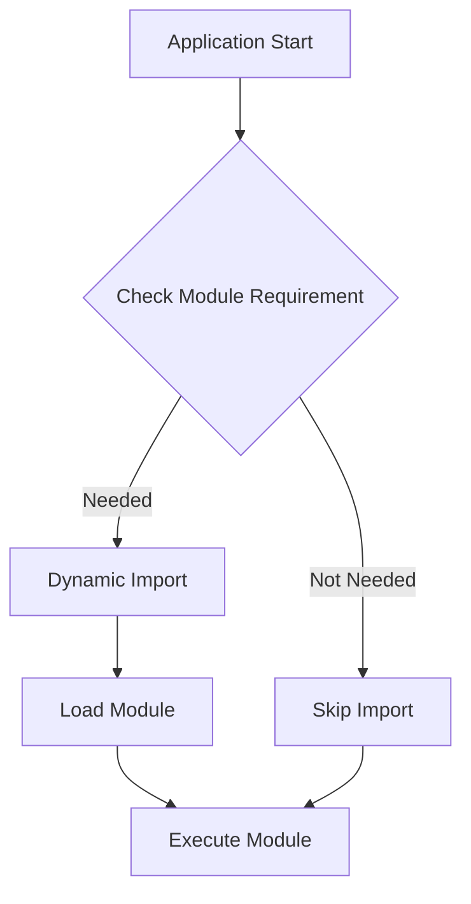

## 11.3 Dynamic Imports and Code Splitting

In the ever-evolving landscape of web development, optimizing performance is a key concern. As applications grow in complexity, the need to efficiently manage resources becomes paramount. Dynamic imports and code splitting are powerful techniques that allow developers to load JavaScript modules asynchronously, improving load times and enhancing user experience. In this section, we'll delve into these concepts, explore their benefits, and provide practical examples to help you master their implementation.

### Understanding Dynamic Imports

Dynamic imports in JavaScript are a way to load modules asynchronously at runtime. Unlike static imports, which are resolved at compile time, dynamic imports use the `import()` function to fetch modules when they are needed. This approach is particularly useful for large applications where loading all modules upfront can lead to performance bottlenecks.

#### The `import()` Function

The `import()` function is a built-in JavaScript function that returns a promise. This promise resolves to the module object, allowing you to access its exports. Here's a basic example:

```javascript
// Dynamic import of a module
import('./module.js')
  .then((module) => {
    // Use the module's exports
    module.someFunction();
  })
  .catch((error) => {
    console.error('Error loading module:', error);
  });
```

In this example, the module `./module.js` is loaded asynchronously. Once the promise resolves, you can use the module's exports. If there's an error during loading, it can be handled in the `catch` block.

### The Power of Code Splitting

Code splitting is a technique that divides your code into smaller chunks, which can be loaded on demand. This is particularly beneficial for large applications, as it reduces the initial load time by only loading the necessary code for the current view or functionality.

#### How Code Splitting Works

Code splitting works by breaking down your application into smaller bundles. These bundles are loaded as needed, rather than all at once. This can be achieved through dynamic imports, which allow you to specify when and how different parts of your application should be loaded.

#### Benefits of Code Splitting

- **Improved Load Times**: By loading only the necessary code, you reduce the initial load time of your application.
- **Better Resource Management**: Code splitting helps manage resources more efficiently, as unused code is not loaded until it's needed.
- **Enhanced User Experience**: Faster load times and smoother transitions lead to a better user experience.

### Implementing Dynamic Imports for Lazy Loading

Lazy loading is a technique where certain parts of your application are loaded only when they are needed. This is particularly useful for components or routes that are not immediately visible to the user.

#### Example: Lazy Loading a Component

Consider an application with multiple components, where some components are only needed based on user interaction. Here's how you can use dynamic imports to lazy load a component:

```javascript
// Lazy loading a component
const loadComponent = () => import('./MyComponent.js');

document.getElementById('loadButton').addEventListener('click', () => {
  loadComponent().then((module) => {
    const MyComponent = module.default;
    const componentInstance = new MyComponent();
    document.body.appendChild(componentInstance.render());
  });
});
```

In this example, the `MyComponent` module is loaded only when the user clicks the button. This reduces the initial load time and improves performance.

### Support in Bundlers: Webpack and Rollup

Modern JavaScript bundlers like Webpack and Rollup provide built-in support for dynamic imports and code splitting. They automatically create separate bundles for dynamically imported modules, optimizing the loading process.

#### Webpack

Webpack uses dynamic imports to create separate chunks for each module. These chunks are loaded on demand, reducing the initial bundle size.

```javascript
// Webpack configuration for code splitting
module.exports = {
  entry: './src/index.js',
  output: {
    filename: '[name].bundle.js',
    chunkFilename: '[name].chunk.js',
    path: __dirname + '/dist',
  },
  optimization: {
    splitChunks: {
      chunks: 'all',
    },
  },
};
```

In this configuration, Webpack splits the code into chunks, which are loaded as needed.

#### Rollup

Rollup also supports dynamic imports and code splitting. It generates separate bundles for each dynamically imported module.

```javascript
// Rollup configuration for code splitting
import { terser } from 'rollup-plugin-terser';

export default {
  input: 'src/main.js',
  output: {
    dir: 'output',
    format: 'esm',
  },
  plugins: [terser()],
};
```

Rollup's configuration is straightforward, and it efficiently handles code splitting for optimized performance.

### Use Cases for Dynamic Imports and Code Splitting

Dynamic imports and code splitting are particularly useful in scenarios where certain parts of the application are not needed immediately. Here are some common use cases:

- **Loading Routes on Demand**: In single-page applications (SPAs), you can load routes dynamically as the user navigates through the application.
- **Loading Components on Interaction**: Components that are not immediately visible can be loaded when the user interacts with the application.
- **Optimizing Third-Party Libraries**: Large third-party libraries can be loaded only when their functionality is required.

### Considerations for Error Handling and Fallbacks

When using dynamic imports, it's important to handle errors gracefully. Network issues or incorrect module paths can lead to loading failures. Providing fallbacks ensures that your application remains functional even if a module fails to load.

#### Example: Handling Errors with Fallbacks

```javascript
// Dynamic import with error handling
import('./OptionalModule.js')
  .then((module) => {
    module.initialize();
  })
  .catch((error) => {
    console.warn('Optional module failed to load:', error);
    // Fallback logic
    loadFallbackModule();
  });

function loadFallbackModule() {
  console.log('Loading fallback module...');
  // Fallback implementation
}
```

In this example, if the `OptionalModule` fails to load, a fallback module is loaded instead. This ensures that the application continues to function smoothly.

### Visualizing Dynamic Imports and Code Splitting

To better understand how dynamic imports and code splitting work, let's visualize the process using a flowchart.



**Figure 1**: This flowchart illustrates the decision-making process for dynamic imports. The application checks if a module is needed, and if so, it dynamically imports and executes the module.

### Knowledge Check

To reinforce your understanding of dynamic imports and code splitting, consider the following questions:

- What are the main benefits of using dynamic imports in a web application?
- How does code splitting improve the performance of a large application?
- What are some common use cases for lazy loading components?
- How can you handle errors when using dynamic imports?

### Embrace the Journey

Remember, mastering dynamic imports and code splitting is just one step in optimizing your web applications. As you continue to explore these techniques, you'll discover new ways to enhance performance and improve user experience. Keep experimenting, stay curious, and enjoy the journey!

### Summary

Dynamic imports and code splitting are powerful tools in the modern web developer's toolkit. By loading modules asynchronously and splitting code into manageable chunks, you can significantly improve the performance of your applications. Whether you're building a complex SPA or optimizing a simple website, these techniques offer a flexible and efficient way to manage resources.


## Quiz: Mastering Dynamic Imports and Code Splitting in JavaScript



### What is the primary purpose of dynamic imports in JavaScript?

- [x] To load modules asynchronously at runtime
- [ ] To load all modules at compile time
- [ ] To replace static imports
- [ ] To improve code readability

> **Explanation:** Dynamic imports allow modules to be loaded asynchronously at runtime, improving performance by loading only the necessary code.

### How does code splitting benefit web applications?

- [x] It reduces initial load time by loading only necessary code
- [ ] It increases the size of the initial bundle
- [ ] It eliminates the need for dynamic imports
- [ ] It makes code harder to manage

> **Explanation:** Code splitting reduces initial load time by dividing the application into smaller chunks, loading only the necessary code for the current view.

### Which JavaScript function is used for dynamic imports?

- [x] `import()`
- [ ] `require()`
- [ ] `load()`
- [ ] `fetch()`

> **Explanation:** The `import()` function is used for dynamic imports, returning a promise that resolves to the module object.

### What is a common use case for lazy loading components?

- [x] Loading components based on user interaction
- [ ] Loading all components at once
- [ ] Replacing static imports
- [ ] Improving code readability

> **Explanation:** Lazy loading is often used to load components based on user interaction, reducing initial load time and improving performance.

### How do bundlers like Webpack support dynamic imports?

- [x] By creating separate chunks for each module
- [ ] By loading all modules at once
- [ ] By eliminating the need for dynamic imports
- [ ] By increasing the size of the initial bundle

> **Explanation:** Bundlers like Webpack create separate chunks for each dynamically imported module, optimizing the loading process.

### What should you do if a dynamically imported module fails to load?

- [x] Provide a fallback mechanism
- [ ] Ignore the error
- [ ] Reload the entire application
- [ ] Use static imports instead

> **Explanation:** Providing a fallback mechanism ensures that the application remains functional even if a module fails to load.

### Which of the following is NOT a benefit of code splitting?

- [ ] Improved load times
- [ ] Better resource management
- [ ] Enhanced user experience
- [x] Increased initial bundle size

> **Explanation:** Code splitting reduces the initial bundle size, improving load times and resource management.

### What is the result of using the `import()` function?

- [x] A promise that resolves to the module object
- [ ] A synchronous module load
- [ ] An error if the module is not found
- [ ] A static import

> **Explanation:** The `import()` function returns a promise that resolves to the module object, allowing for asynchronous loading.

### True or False: Code splitting can be used to load third-party libraries only when needed.

- [x] True
- [ ] False

> **Explanation:** Code splitting can be used to load third-party libraries only when their functionality is required, optimizing resource usage.

### True or False: Dynamic imports are resolved at compile time.

- [ ] True
- [x] False

> **Explanation:** Dynamic imports are resolved at runtime, allowing modules to be loaded asynchronously as needed.



By mastering dynamic imports and code splitting, you're well on your way to creating efficient, high-performance web applications. Keep exploring these techniques, and you'll continue to unlock new possibilities in your development journey.
