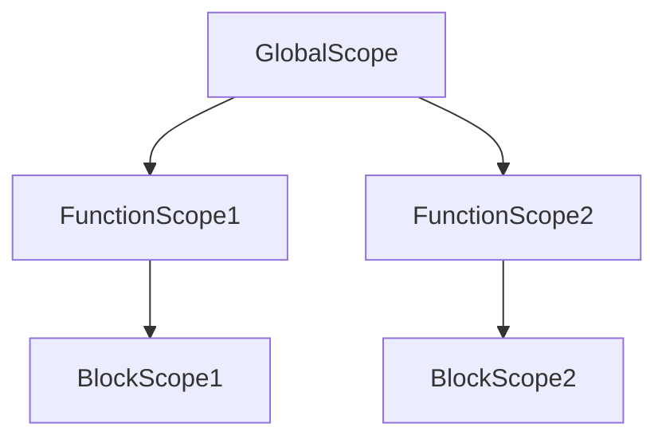
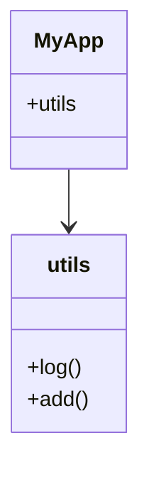

## 11.4 Namespacing and Avoiding Global Scope Pollution

In the world of JavaScript, managing the global scope is crucial for maintaining clean, efficient, and error-free code. As we delve into namespacing and techniques to avoid global scope pollution, we'll explore the problems associated with global variables, various namespacing patterns, and how modern JavaScript features like ES Modules inherently help in managing scope. We'll also discuss best practices for module design and variable declarations, and introduce tools that can help detect global variables.

### Understanding the Problem with Global Variables

Global variables are accessible from anywhere in your code, which can lead to several issues:

- **Name Collisions**: When multiple scripts define variables with the same name, they can overwrite each other, leading to unexpected behavior.
- **Tight Coupling**: Global variables can create dependencies between different parts of your code, making it harder to maintain and refactor.
- **Security Risks**: Exposing too much information globally can lead to security vulnerabilities, especially in web applications.
- **Debugging Challenges**: Tracking down issues in a codebase with many global variables can be difficult, as changes in one part of the code can affect others unexpectedly.

To mitigate these issues, we can use namespacing techniques to encapsulate code and limit the exposure of variables to the global scope.

### Namespacing Patterns in JavaScript

Namespacing is a technique used to group related code under a single global identifier, reducing the risk of name collisions and improving code organization. Let's explore some common namespacing patterns in JavaScript.

#### Using Objects for Namespacing

One of the simplest ways to create a namespace in JavaScript is by using objects. By encapsulating variables and functions within an object, we can limit their exposure to the global scope.

```javascript
// Create a namespace
var MyApp = MyApp || {};

// Add properties and methods to the namespace
MyApp.utils = {
  log: function(message) {
    console.log(message);
  },
  add: function(a, b) {
    return a + b;
  }
};

// Usage
MyApp.utils.log("Hello, World!");
console.log(MyApp.utils.add(2, 3));
```

In this example, we create a `MyApp` object that serves as a namespace. The `utils` object within `MyApp` contains methods that can be accessed without polluting the global scope.

#### Module Pattern

The Module Pattern is a design pattern used to encapsulate code within a function, providing both private and public access to variables and methods. This pattern is particularly useful for creating self-contained modules.

```javascript
var MyModule = (function() {
  // Private variables and functions
  var privateVar = "I am private";

  function privateMethod() {
    console.log(privateVar);
  }

  // Public API
  return {
    publicMethod: function() {
      privateMethod();
    }
  };
})();

// Usage
MyModule.publicMethod(); // Outputs: I am private
```

Here, `MyModule` is an immediately invoked function expression (IIFE) that returns an object containing public methods. The private variables and methods are not accessible from outside the module, preventing global scope pollution.

#### Revealing Module Pattern

The Revealing Module Pattern is a variation of the Module Pattern that explicitly defines which variables and methods are public, enhancing readability and maintainability.

```javascript
var MyRevealingModule = (function() {
  var privateVar = "I am private";

  function privateMethod() {
    console.log(privateVar);
  }

  function publicMethod() {
    privateMethod();
  }

  // Reveal public pointers to private functions and variables
  return {
    publicMethod: publicMethod
  };
})();

// Usage
MyRevealingModule.publicMethod(); // Outputs: I am private
```

In this pattern, we define the public API at the end of the module, making it clear which methods are exposed.

### ES Modules: A Modern Solution

With the introduction of ES6, JavaScript gained native support for modules, providing a robust solution for managing scope and dependencies. ES Modules allow us to import and export code between files, inherently preventing global scope pollution.

#### Importing and Exporting with ES Modules

ES Modules use the `import` and `export` keywords to share code between files. Here's a simple example:

```javascript
// math.js
export function add(a, b) {
  return a + b;
}

export const PI = 3.14159;

// main.js
import { add, PI } from './math.js';

console.log(add(2, 3)); // Outputs: 5
console.log(PI); // Outputs: 3.14159
```

In this example, `math.js` exports a function and a constant, which are then imported into `main.js`. This modular approach keeps the global scope clean and makes code more maintainable.

#### Default Exports

ES Modules also support default exports, allowing a module to export a single value or function as the default.

```javascript
// logger.js
export default function log(message) {
  console.log(message);
}

// main.js
import log from './logger.js';

log("Hello, World!"); // Outputs: Hello, World!
```

Default exports simplify importing when a module exports only one entity.

### Best Practices for Module Design and Variable Declarations

To further prevent global scope pollution and improve code organization, consider the following best practices:

- **Use `let` and `const`**: Prefer `let` and `const` over `var` for variable declarations to limit scope to the block level.
- **Encapsulate Code**: Use functions, objects, or modules to encapsulate code and limit exposure to the global scope.
- **Avoid Global Variables**: Minimize the use of global variables. If necessary, use a single global object as a namespace.
- **Use Linters**: Tools like ESLint can help detect and warn about global variables, enforcing best practices in your codebase.

### Tools for Detecting Global Variables

Linters are essential tools for maintaining code quality and preventing global scope pollution. ESLint, for example, can be configured to detect global variables and enforce coding standards.

#### Configuring ESLint

To set up ESLint to detect global variables, you can use the following configuration:

```json
{
  "env": {
    "browser": true,
    "es6": true
  },
  "rules": {
    "no-undef": "error",
    "no-global-assign": "error"
  }
}
```

This configuration enables the detection of undefined variables and prevents assignment to global variables.

### Visualizing Scope and Namespacing

To better understand how namespacing and scope work in JavaScript, let's visualize these concepts using Mermaid.js diagrams.

#### Scope Chain Diagram



**Figure 1**: This diagram illustrates the scope chain in JavaScript, showing how variables are resolved from the innermost scope outward to the global scope.

#### Namespacing with Objects



**Figure 2**: This diagram represents the `MyApp` namespace, encapsulating the `utils` object and its methods.

### Knowledge Check

To reinforce your understanding of namespacing and avoiding global scope pollution, consider the following questions:

1. What are the main problems associated with using global variables?
2. How does the Module Pattern help in encapsulating code?
3. What is the difference between a regular module and a revealing module?
4. How do ES Modules prevent global scope pollution?
5. Why is it recommended to use `let` and `const` over `var`?

### Exercises

1. **Create a Namespace**: Write a JavaScript object that serves as a namespace for a set of related functions. Ensure that no global variables are used.
2. **Convert to ES Modules**: Take a piece of code that uses the Module Pattern and convert it to use ES Modules instead.
3. **Configure ESLint**: Set up ESLint in a project to detect global variables and enforce best practices.

### Summary

In this section, we've explored the importance of namespacing and techniques to avoid global scope pollution in JavaScript. By using objects, the Module Pattern, and ES Modules, we can encapsulate code and improve maintainability. Remember to use tools like ESLint to enforce best practices and keep your codebase clean.

### Embrace the Journey

As you continue your journey in mastering JavaScript, remember that managing scope and organizing code are fundamental skills. Keep experimenting with different patterns and tools, stay curious, and enjoy the process of creating clean and efficient code.

## Quiz: Mastering Namespacing and Avoiding Global Scope Pollution



### What is a primary issue with using global variables in JavaScript?

- [x] Name collisions
- [ ] Improved performance
- [ ] Easier debugging
- [ ] Increased security

> **Explanation:** Global variables can lead to name collisions, where multiple scripts define variables with the same name, causing unexpected behavior.

### Which pattern encapsulates code within a function to provide private and public access?

- [x] Module Pattern
- [ ] Singleton Pattern
- [ ] Observer Pattern
- [ ] Factory Pattern

> **Explanation:** The Module Pattern encapsulates code within a function, allowing for private and public access to variables and methods.

### How do ES Modules help prevent global scope pollution?

- [x] By using import and export to manage dependencies
- [ ] By using global variables
- [ ] By using `eval` statements
- [ ] By using `with` statements

> **Explanation:** ES Modules use import and export statements to manage dependencies, keeping the global scope clean.

### What is a key benefit of using the Revealing Module Pattern?

- [x] Improved readability by explicitly defining public methods
- [ ] Increased complexity
- [ ] More global variables
- [ ] Less encapsulation

> **Explanation:** The Revealing Module Pattern improves readability by explicitly defining which methods are public.

### Which keyword should be preferred for variable declarations to limit scope to the block level?

- [x] `let` and `const`
- [ ] `var`
- [ ] `global`
- [ ] `static`

> **Explanation:** `let` and `const` limit variable scope to the block level, reducing the risk of global scope pollution.

### What tool can help detect global variables in a JavaScript codebase?

- [x] ESLint
- [ ] Babel
- [ ] Webpack
- [ ] Node.js

> **Explanation:** ESLint is a linter that can be configured to detect global variables and enforce coding standards.

### What is the purpose of using a namespace in JavaScript?

- [x] To group related code under a single global identifier
- [ ] To increase the number of global variables
- [ ] To decrease code readability
- [ ] To make code less maintainable

> **Explanation:** Namespaces group related code under a single global identifier, reducing the risk of name collisions.

### What is the advantage of using default exports in ES Modules?

- [x] Simplifies importing when a module exports only one entity
- [ ] Increases the number of global variables
- [ ] Makes code less readable
- [ ] Decreases module encapsulation

> **Explanation:** Default exports simplify importing when a module exports only one entity, making the code cleaner.

### What is a common practice to avoid global scope pollution?

- [x] Encapsulate code using functions or modules
- [ ] Use more global variables
- [ ] Avoid using functions
- [ ] Use `eval` statements

> **Explanation:** Encapsulating code using functions or modules helps avoid global scope pollution.

### True or False: Using `var` is recommended over `let` and `const` for variable declarations.

- [ ] True
- [x] False

> **Explanation:** It is recommended to use `let` and `const` over `var` to limit variable scope and avoid global scope pollution.


