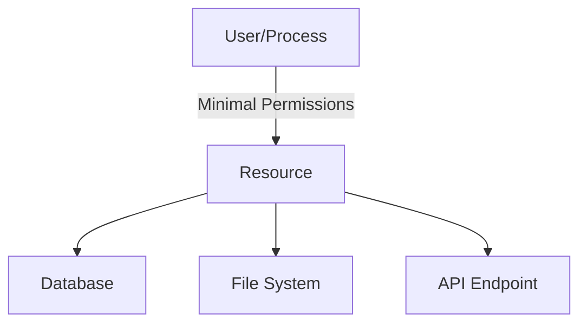

---

linkTitle: "11.4 Principle of Least Privilege"
title: "Principle of Least Privilege: Enhancing Security in JavaScript and TypeScript Applications"
description: "Explore the Principle of Least Privilege in JavaScript and TypeScript applications, its implementation, use cases, and best practices for enhanced security."
categories:
- Security
- Design Patterns
- JavaScript
tags:
- Security Patterns
- Least Privilege
- JavaScript
- TypeScript
- Access Control
date: 2024-10-25
type: docs
nav_weight: 1140000
canonical: "https://softwarepatternslexicon.com/patterns-js/11/4"
license: "© 2024 Tokenizer Inc. CC BY-NC-SA 4.0"
---

## 11.4 Principle of Least Privilege

In the realm of software development, security is paramount. The Principle of Least Privilege (PoLP) is a fundamental security concept that dictates granting only the minimum necessary permissions to users or processes to perform their functions. This principle is crucial in minimizing the attack surface and potential damage from compromised accounts. Let's delve into the details of implementing this principle in JavaScript and TypeScript applications.

### Understand the Concept

The Principle of Least Privilege is about minimizing access rights for users and processes to the bare minimum necessary to perform their tasks. This approach reduces the risk of malicious activities and accidental errors by limiting the potential impact of a security breach.

### Implementation Steps

Implementing the Principle of Least Privilege involves several key steps:

#### Define Roles and Permissions

- **Identify Tasks:** Begin by identifying the specific tasks that each user or process needs to perform.
- **Assign Necessary Permissions:** Assign only the permissions required to complete those tasks. Avoid granting broad access rights.

#### Restrict Access

- **Limit Database Access:** Ensure that database users have access only to the data they need. For instance, a read-only user should not have write permissions.
- **File System Permissions:** Restrict file system access to only those files and directories necessary for the application's operation.
- **API Endpoints:** Limit access to API endpoints based on user roles and permissions.

#### Regularly Review and Audit

- **Update Permissions:** As roles change within the organization, update permissions to reflect these changes.
- **Conduct Audits:** Regularly audit permissions to ensure compliance with the Principle of Least Privilege.

### Code Examples

Implementing access control checks is a practical way to enforce the Principle of Least Privilege. Below is a TypeScript example demonstrating how to implement role-based access control (RBAC) in a Node.js application using Express.js:

```typescript
import express, { Request, Response, NextFunction } from 'express';

const app = express();

interface User {
  id: number;
  role: string;
}

const users: User[] = [
  { id: 1, role: 'admin' },
  { id: 2, role: 'user' },
];

const rolesPermissions: Record<string, string[]> = {
  admin: ['read', 'write', 'delete'],
  user: ['read'],
};

const checkPermission = (requiredPermission: string) => {
  return (req: Request, res: Response, next: NextFunction) => {
    const userId = parseInt(req.headers['user-id'] as string);
    const user = users.find(u => u.id === userId);

    if (!user) {
      return res.status(403).json({ message: 'User not found' });
    }

    const permissions = rolesPermissions[user.role];
    if (permissions.includes(requiredPermission)) {
      next();
    } else {
      res.status(403).json({ message: 'Permission denied' });
    }
  };
};

app.get('/data', checkPermission('read'), (req: Request, res: Response) => {
  res.json({ data: 'Secure data' });
});

app.listen(3000, () => {
  console.log('Server running on port 3000');
});
```

### Use Cases

The Principle of Least Privilege is applicable in various scenarios, including:

- **Reducing Attack Surface:** By limiting permissions, you reduce the number of potential entry points for attackers.
- **Minimizing Damage:** In the event of a security breach, limited permissions can help contain the damage.
- **Compliance:** Many regulatory frameworks require adherence to the Principle of Least Privilege as part of their compliance standards.

### Practice

To effectively practice the Principle of Least Privilege, consider the following:

- **Database Configuration:** Configure database users with limited privileges corresponding to their application functions. For example, a reporting tool should only have read access to the necessary tables.
- **File Permissions:** Ensure that application servers have read/write access only to the directories they need.
- **API Security:** Implement role-based access control for API endpoints to ensure that users can only access resources they are authorized to use.

### Considerations

When implementing the Principle of Least Privilege, keep the following considerations in mind:

- **Default Permissions:** Be vigilant about default permissions, as many systems grant wide access by default.
- **Automation:** Automate permission management where possible to ensure consistency and reduce human error.

### Visual Aids

Below is a conceptual diagram illustrating the Principle of Least Privilege:



### Advantages and Disadvantages

#### Advantages

- **Enhanced Security:** Reduces the risk of unauthorized access and potential damage from security breaches.
- **Compliance:** Helps meet regulatory requirements for data protection and privacy.
- **Operational Efficiency:** Limits the scope of potential errors by restricting access to critical resources.

#### Disadvantages

- **Complexity:** Implementing and maintaining a least privilege model can be complex, especially in large organizations.
- **Overhead:** Regular audits and updates to permissions can introduce administrative overhead.

### Best Practices

- **Regular Audits:** Conduct regular audits of permissions to ensure they align with current roles and responsibilities.
- **Automate Where Possible:** Use automation tools to manage permissions and reduce the risk of human error.
- **Educate Users:** Train users on the importance of security and the Principle of Least Privilege.

### Comparisons

The Principle of Least Privilege can be compared to other security patterns such as:

- **Defense in Depth:** While PoLP focuses on minimizing permissions, Defense in Depth involves multiple layers of security controls.
- **Role-Based Access Control (RBAC):** PoLP is often implemented using RBAC, which assigns permissions based on user roles.

### Conclusion

The Principle of Least Privilege is a cornerstone of secure software development. By granting only the necessary permissions, you can significantly reduce the risk of security breaches and minimize potential damage. Implementing this principle requires careful planning, regular audits, and a commitment to security best practices.

## Quiz Time!



### What is the main goal of the Principle of Least Privilege?

- [x] To grant the minimum necessary permissions required for users or processes to perform their functions.
- [ ] To provide maximum access to all users for convenience.
- [ ] To ensure all users have equal permissions.
- [ ] To eliminate all user permissions.

> **Explanation:** The Principle of Least Privilege aims to minimize permissions to reduce security risks.

### Which of the following is a key step in implementing the Principle of Least Privilege?

- [x] Define roles and permissions.
- [ ] Grant all permissions by default.
- [ ] Allow unrestricted access to all resources.
- [ ] Ignore permission audits.

> **Explanation:** Defining roles and permissions is crucial for implementing PoLP effectively.

### How can you restrict access to a database according to the Principle of Least Privilege?

- [x] Limit database access to only necessary data.
- [ ] Allow all users full access to the database.
- [ ] Disable all database security features.
- [ ] Share database credentials with everyone.

> **Explanation:** Limiting access to necessary data helps adhere to PoLP.

### What is a common method for enforcing the Principle of Least Privilege in web applications?

- [x] Role-Based Access Control (RBAC)
- [ ] Open Access Policy
- [ ] Full Access Control
- [ ] No Access Control

> **Explanation:** RBAC is commonly used to enforce PoLP by assigning permissions based on roles.

### Why is it important to regularly review and audit permissions?

- [x] To ensure permissions align with current roles and responsibilities.
- [ ] To increase administrative overhead.
- [ ] To grant more permissions over time.
- [ ] To ignore changes in user roles.

> **Explanation:** Regular reviews and audits help maintain alignment with current roles and responsibilities.

### What is a potential disadvantage of implementing the Principle of Least Privilege?

- [x] Complexity in managing permissions.
- [ ] Increased security risks.
- [ ] Reduced operational efficiency.
- [ ] Non-compliance with regulations.

> **Explanation:** Managing permissions can become complex, especially in large organizations.

### How can automation help in implementing the Principle of Least Privilege?

- [x] By ensuring consistency and reducing human error.
- [ ] By granting all permissions automatically.
- [ ] By eliminating the need for audits.
- [ ] By ignoring changes in user roles.

> **Explanation:** Automation helps maintain consistency and reduces the risk of human error.

### What is a key advantage of the Principle of Least Privilege?

- [x] Enhanced security by reducing unauthorized access.
- [ ] Increased complexity in permission management.
- [ ] More permissions for all users.
- [ ] Less compliance with regulations.

> **Explanation:** PoLP enhances security by limiting unauthorized access.

### Which of the following is NOT a use case for the Principle of Least Privilege?

- [ ] Reducing the attack surface.
- [x] Granting full access to all users.
- [ ] Minimizing damage from security breaches.
- [ ] Meeting regulatory compliance standards.

> **Explanation:** Granting full access contradicts the Principle of Least Privilege.

### True or False: The Principle of Least Privilege is only applicable to user accounts.

- [ ] True
- [x] False

> **Explanation:** PoLP applies to both user accounts and processes, ensuring minimal permissions for all.




