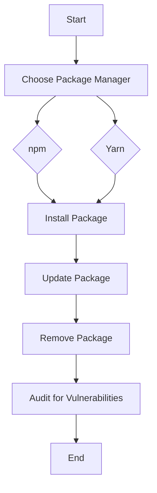

## 11.5 Dependency Management with npm and Yarn

In the world of JavaScript development, managing dependencies efficiently is crucial for building robust and maintainable applications. This section delves into the intricacies of dependency management using two of the most popular package managers: npm and Yarn. We'll explore how to install, update, and publish packages, while also discussing best practices and security considerations.

### The Role of Package Managers in JavaScript Development

Package managers are essential tools in modern software development, especially in JavaScript, where they facilitate the installation, updating, and management of libraries and frameworks. They help developers:

- **Automate Dependency Management**: Automatically handle the installation of libraries and their dependencies.
- **Ensure Consistency**: Maintain consistent versions of libraries across different environments.
- **Simplify Updates**: Easily update libraries to their latest versions.
- **Enhance Security**: Provide tools to audit and fix vulnerabilities in dependencies.

### npm: Node Package Manager

npm is the default package manager for Node.js and is widely used in the JavaScript ecosystem. It allows developers to install packages from the npm registry, manage project dependencies, and publish their own packages.

#### Installing Packages Locally and Globally

- **Local Installation**: Installs the package in the `node_modules` directory within the project. This is the most common method for project-specific dependencies.

  ```bash
  npm install <package-name>
  ```

- **Global Installation**: Installs the package globally on your system, making it accessible from any project. This is typically used for command-line tools.

  ```bash
  npm install -g <package-name>
  ```

#### Understanding `package.json` and `package-lock.json`

- **`package.json`**: This file is the heart of any Node.js project. It contains metadata about the project, including its dependencies, scripts, and versioning information.

  ```json
  {
    "name": "my-project",
    "version": "1.0.0",
    "description": "A sample project",
    "main": "index.js",
    "scripts": {
      "start": "node index.js"
    },
    "dependencies": {
      "express": "^4.17.1"
    }
  }
  ```

- **`package-lock.json`**: This file ensures that the exact versions of dependencies are installed, providing a consistent environment across different installations. It records the entire dependency tree, including nested dependencies.

  ```json
  {
    "name": "my-project",
    "version": "1.0.0",
    "lockfileVersion": 1,
    "requires": true,
    "dependencies": {
      "express": {
        "version": "4.17.1",
        "resolved": "https://registry.npmjs.org/express/-/express-4.17.1.tgz",
        "integrity": "sha512-...",
        "requires": {
          "accepts": "~1.3.7",
          "array-flatten": "1.1.1",
          ...
        }
      }
    }
  }
  ```

### Introducing Yarn

Yarn is an alternative package manager that was developed by Facebook to address some of the shortcomings of npm. It offers features like offline caching and deterministic installs, which can improve performance and reliability.

#### Features of Yarn

- **Offline Caching**: Yarn caches every package it downloads, allowing you to install them without an internet connection later.
- **Deterministic Installs**: Ensures that the same dependencies are installed on every machine by using a lockfile (`yarn.lock`).

#### Understanding `yarn.lock`

The `yarn.lock` file is similar to `package-lock.json` in npm. It locks the versions of dependencies to ensure consistent installations across different environments.

```yaml
express@^4.17.1:
  version "4.17.1"
  resolved "https://registry.yarnpkg.com/express/-/express-4.17.1.tgz#..."
  integrity sha512-...
  dependencies:
    accepts "~1.3.7"
    array-flatten "1.1.1"
    ...
```

### Common Commands in npm and Yarn

#### npm Commands

- **Install a Package**: `npm install <package-name>`
- **Update a Package**: `npm update <package-name>`
- **Remove a Package**: `npm uninstall <package-name>`
- **List Installed Packages**: `npm list`
- **Audit for Vulnerabilities**: `npm audit`

#### Yarn Commands

- **Install a Package**: `yarn add <package-name>`
- **Update a Package**: `yarn upgrade <package-name>`
- **Remove a Package**: `yarn remove <package-name>`
- **List Installed Packages**: `yarn list`
- **Audit for Vulnerabilities**: `yarn audit`

### Best Practices for Versioning and Dependency Updates

- **Use Semantic Versioning**: Follow the `MAJOR.MINOR.PATCH` format to manage versions. Update dependencies carefully to avoid breaking changes.
- **Regularly Audit Dependencies**: Use `npm audit` or `yarn audit` to identify and fix vulnerabilities.
- **Lock Dependency Versions**: Use `package-lock.json` or `yarn.lock` to ensure consistent installations.
- **Test After Updates**: Always test your application after updating dependencies to catch any issues early.

### Security Considerations and Auditing Tools

Security is a critical aspect of dependency management. Both npm and Yarn provide tools to help you identify and fix vulnerabilities in your dependencies.

- **npm Audit**: Scans your project for vulnerabilities and provides a report with suggested fixes.

  ```bash
  npm audit
  ```

- **Yarn Audit**: Similar to npm audit, it checks for vulnerabilities in your dependencies.

  ```bash
  yarn audit
  ```

- **Regular Updates**: Keep your dependencies up to date to benefit from security patches and improvements.

### Try It Yourself

To get hands-on experience, try installing a package using both npm and Yarn. Experiment with updating and removing packages, and use the audit tools to check for vulnerabilities. Modify the `package.json` and `yarn.lock` files to see how changes affect your project.

### Visualizing Dependency Management

Below is a simple flowchart illustrating the process of installing a package and managing dependencies using npm and Yarn.



### Knowledge Check

To reinforce your understanding, consider the following questions:

- What are the benefits of using a package manager in JavaScript development?
- How does `package-lock.json` differ from `yarn.lock`?
- What are some best practices for managing dependencies in a project?

### Conclusion

Dependency management is a vital part of JavaScript development, and mastering npm and Yarn will significantly enhance your workflow. Remember to keep your dependencies up to date, audit them regularly for vulnerabilities, and follow best practices for versioning and updates. This is just the beginning of your journey in mastering dependency management. Keep experimenting, stay curious, and enjoy the process!

## Quiz: Mastering Dependency Management with npm and Yarn



### What is the primary role of package managers like npm and Yarn in JavaScript development?

- [x] Automate dependency management
- [ ] Compile JavaScript code
- [ ] Manage database connections
- [ ] Optimize network requests

> **Explanation:** Package managers automate the installation, updating, and management of libraries and frameworks in JavaScript development.

### Which file in npm ensures consistent dependency versions across different environments?

- [x] package-lock.json
- [ ] package.json
- [ ] yarn.lock
- [ ] node_modules

> **Explanation:** The `package-lock.json` file locks the exact versions of dependencies, ensuring consistency across installations.

### What is a key feature of Yarn that improves installation reliability?

- [x] Deterministic installs
- [ ] Automatic code minification
- [ ] Built-in testing framework
- [ ] Real-time code compilation

> **Explanation:** Yarn's deterministic installs ensure that the same dependencies are installed on every machine using a lockfile.

### How can you install a package globally using npm?

- [x] npm install -g <package-name>
- [ ] npm install <package-name>
- [ ] npm add <package-name>
- [ ] npm global <package-name>

> **Explanation:** The `-g` flag in `npm install -g <package-name>` installs the package globally on your system.

### Which command is used to audit dependencies for vulnerabilities in Yarn?

- [x] yarn audit
- [ ] yarn check
- [ ] yarn verify
- [ ] yarn inspect

> **Explanation:** The `yarn audit` command checks for vulnerabilities in your project's dependencies.

### What is semantic versioning?

- [x] A versioning system using MAJOR.MINOR.PATCH format
- [ ] A method for compressing JavaScript files
- [ ] A tool for debugging JavaScript code
- [ ] A framework for building web applications

> **Explanation:** Semantic versioning uses the `MAJOR.MINOR.PATCH` format to manage software versions.

### Why is it important to lock dependency versions?

- [x] To ensure consistent installations
- [ ] To reduce file size
- [ ] To improve code readability
- [ ] To enhance network speed

> **Explanation:** Locking dependency versions ensures that the same versions are installed across different environments, maintaining consistency.

### Which command updates a package to its latest version in npm?

- [x] npm update <package-name>
- [ ] npm upgrade <package-name>
- [ ] npm refresh <package-name>
- [ ] npm renew <package-name>

> **Explanation:** The `npm update <package-name>` command updates the specified package to its latest version.

### What is the purpose of the `node_modules` directory?

- [x] To store installed packages
- [ ] To compile JavaScript files
- [ ] To manage database connections
- [ ] To optimize network requests

> **Explanation:** The `node_modules` directory stores all the packages installed for a project.

### True or False: Yarn can install packages without an internet connection if they are cached.

- [x] True
- [ ] False

> **Explanation:** Yarn's offline caching feature allows it to install packages without an internet connection if they have been previously downloaded and cached.


