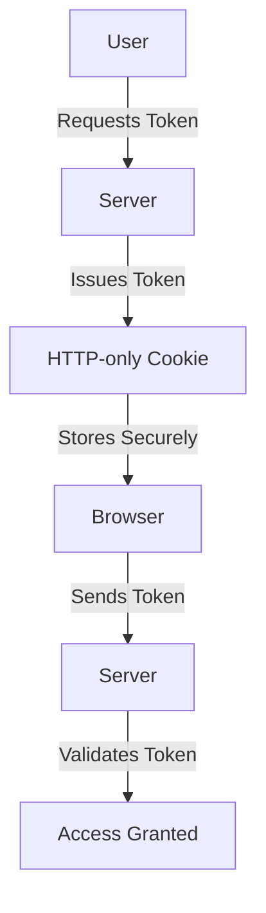

---

linkTitle: "11.5 Secure Token Storage"
title: "Secure Token Storage: Best Practices for JavaScript and TypeScript"
description: "Explore best practices for secure token storage in JavaScript and TypeScript applications, focusing on protecting tokens from unauthorized access and attacks like XSS and CSRF."
categories:
- Security
- JavaScript
- TypeScript
tags:
- Secure Token Storage
- JWT
- API Security
- XSS
- CSRF
date: 2024-10-25
type: docs
nav_weight: 1150000
canonical: "https://softwarepatternslexicon.com/patterns-js/11/5"
license: "© 2024 Tokenizer Inc. CC BY-NC-SA 4.0"
---

## 11. Security Patterns
### 11.5 Secure Token Storage

In the world of web development, securing tokens such as JSON Web Tokens (JWTs) and API keys is crucial to protect sensitive data and maintain the integrity of user sessions. This section delves into the best practices for secure token storage in JavaScript and TypeScript applications, emphasizing the importance of safeguarding tokens from unauthorized access and attacks like Cross-Site Scripting (XSS) and Cross-Site Request Forgery (CSRF).

### Understand the Importance

Tokens are often used to authenticate users and authorize access to resources. If these tokens are compromised, attackers can impersonate users and gain unauthorized access to sensitive data. Therefore, understanding how to store and manage these tokens securely is vital for any web application.

### Implementation Steps

#### Store Tokens Securely

1. **Use HTTP-only Cookies:**
   - HTTP-only cookies are not accessible via JavaScript, which helps protect tokens from XSS attacks. By setting the `httpOnly` flag, you ensure that the token cannot be accessed through client-side scripts.

2. **Avoid Local Storage:**
   - Local storage is vulnerable to XSS attacks because any script running on the page can access it. Therefore, storing sensitive tokens like JWTs in local storage is not recommended.

#### Implement Security Measures

1. **Use CSRF Tokens:**
   - CSRF tokens are used to protect against cross-site request forgery attacks. They ensure that requests made to the server are legitimate and initiated by authenticated users.

2. **Employ Same-Site Cookie Attributes:**
   - The `SameSite` attribute can be set on cookies to restrict how they are sent with cross-site requests, providing an additional layer of protection against CSRF attacks.

### Code Examples

Let's look at how to set cookies with `httpOnly` and `secure` flags in an Express.js application:

```javascript
const express = require('express');
const app = express();

app.get('/set-token', (req, res) => {
    // Set a secure, HTTP-only cookie
    res.cookie('authToken', 'your-jwt-token', {
        httpOnly: true,  // Prevents JavaScript access
        secure: true,    // Ensures the cookie is sent over HTTPS
        sameSite: 'Strict' // Prevents the cookie from being sent with cross-site requests
    });
    res.send('Token set securely!');
});

app.listen(3000, () => {
    console.log('Server running on http://localhost:3000');
});
```

### Use Cases

Secure token storage is particularly relevant for web applications that manage user sessions and authentication tokens. For instance, e-commerce platforms, social media sites, and online banking applications all require robust token management to protect user data and maintain session integrity.

### Practice

To practice secure token storage, try implementing session management using secure cookies in a sample web application. Ensure that all tokens are stored in HTTP-only cookies and that CSRF protection is in place.

### Considerations

- **Encrypt Tokens:**
  - If tokens must be stored in less secure locations, consider encrypting them to add an extra layer of security.

- **Regularly Rotate Tokens:**
  - Implement token rotation and enforce expiration to minimize the risk of token misuse. Regularly rotating tokens ensures that even if a token is compromised, its validity is limited.

### Visual Aids

Below is a conceptual diagram illustrating the secure token storage process:



### Advantages and Disadvantages

**Advantages:**
- **Enhanced Security:** Protects tokens from XSS and CSRF attacks.
- **Improved User Trust:** Users are more likely to trust applications that prioritize security.

**Disadvantages:**
- **Complexity:** Implementing secure token storage can add complexity to the application.
- **Performance Overhead:** Additional security measures may introduce slight performance overhead.

### Best Practices

- **Use HTTPS:** Always use HTTPS to encrypt data in transit, ensuring that tokens are not intercepted.
- **Monitor for Breaches:** Regularly monitor for security breaches and respond promptly to any incidents.
- **Educate Developers:** Ensure that all team members are aware of best practices for secure token storage.

### Comparisons

When comparing secure token storage methods, consider the trade-offs between security and convenience. While local storage offers convenience, it lacks the security features of HTTP-only cookies.

### Conclusion

Secure token storage is a critical aspect of web application security. By following best practices and implementing robust security measures, developers can protect tokens from unauthorized access and ensure the integrity of user sessions. As security threats continue to evolve, staying informed and proactive is essential for safeguarding sensitive data.

## Quiz Time!



### What is the primary advantage of using HTTP-only cookies for token storage?

- [x] They prevent JavaScript access to the token.
- [ ] They allow easy access to tokens for client-side scripts.
- [ ] They are stored in local storage.
- [ ] They are accessible via the browser console.

> **Explanation:** HTTP-only cookies are not accessible via JavaScript, which helps protect tokens from XSS attacks.

### Why should local storage be avoided for storing sensitive tokens?

- [x] It is vulnerable to XSS attacks.
- [ ] It is difficult to implement.
- [ ] It is not supported by all browsers.
- [ ] It requires additional server-side configuration.

> **Explanation:** Local storage is vulnerable to XSS attacks because any script running on the page can access it.

### What is the purpose of CSRF tokens?

- [x] To protect against cross-site request forgery attacks.
- [ ] To encrypt tokens before storage.
- [ ] To allow cross-site requests.
- [ ] To store tokens in local storage.

> **Explanation:** CSRF tokens are used to protect against cross-site request forgery attacks by ensuring requests are legitimate.

### Which attribute can be set on cookies to restrict cross-site requests?

- [x] SameSite
- [ ] Secure
- [ ] HttpOnly
- [ ] Path

> **Explanation:** The `SameSite` attribute can be set on cookies to restrict how they are sent with cross-site requests.

### What should be done if tokens must be stored in less secure locations?

- [x] Encrypt them.
- [ ] Store them in local storage.
- [x] Regularly rotate them.
- [ ] Use plain text storage.

> **Explanation:** Encrypting tokens and regularly rotating them adds an extra layer of security.

### What is a potential disadvantage of implementing secure token storage?

- [x] Complexity
- [ ] Increased convenience
- [ ] Reduced security
- [ ] Easier access to tokens

> **Explanation:** Implementing secure token storage can add complexity to the application.

### How can you ensure data in transit is not intercepted?

- [x] Use HTTPS
- [ ] Use HTTP
- [x] Encrypt tokens
- [ ] Store tokens in local storage

> **Explanation:** Using HTTPS encrypts data in transit, ensuring that tokens are not intercepted.

### What is a benefit of regularly rotating tokens?

- [x] Limits the validity of compromised tokens.
- [ ] Increases the risk of token misuse.
- [ ] Allows indefinite token validity.
- [ ] Simplifies token management.

> **Explanation:** Regularly rotating tokens ensures that even if a token is compromised, its validity is limited.

### What should developers be educated about regarding token storage?

- [x] Best practices for secure token storage.
- [ ] How to store tokens in local storage.
- [ ] How to disable HTTP-only cookies.
- [ ] How to allow cross-site requests.

> **Explanation:** Educating developers about best practices for secure token storage is essential for safeguarding sensitive data.

### True or False: Using HTTP-only cookies is a recommended practice for secure token storage.

- [x] True
- [ ] False

> **Explanation:** Using HTTP-only cookies is a recommended practice because they prevent JavaScript access to the token, enhancing security.


