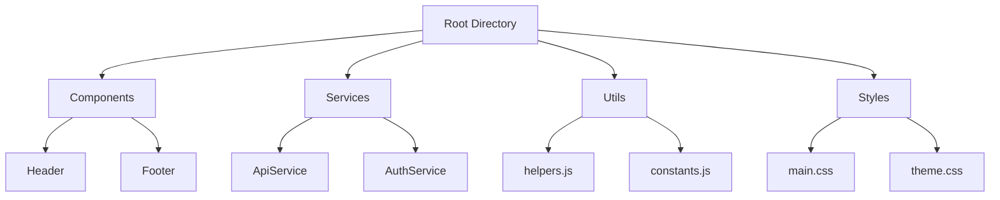

## 11.6 Organizing Large Codebases

As JavaScript applications grow in complexity, organizing your codebase becomes crucial for maintainability and scalability. In this section, we'll explore strategies and best practices for structuring large JavaScript codebases, focusing on principles like modularity, separation of concerns, and encapsulation. We'll also discuss guidelines for file and folder structure, partitioning code into modules, components, and services, and the importance of consistent naming conventions. Additionally, we'll highlight tools that aid in code navigation and refactoring.

### Principles of Code Organization

#### Modularity

Modularity is the practice of dividing a codebase into smaller, self-contained units or modules. Each module should have a single responsibility and be loosely coupled with other modules. This approach enhances code reusability and makes it easier to manage dependencies.

#### Separation of Concerns

Separation of concerns involves dividing a program into distinct sections, each addressing a separate concern or functionality. This principle helps in isolating changes, reducing the risk of unintended side effects, and improving code readability.

#### Encapsulation

Encapsulation is the concept of restricting access to certain parts of an object or module, exposing only what is necessary. This helps in protecting the internal state and behavior of a module, reducing the likelihood of bugs and enhancing security.

### File and Folder Structure

A well-organized file and folder structure is essential for navigating and maintaining a large codebase. Here are some guidelines:

- **Feature-Based Structure**: Organize files by feature or functionality. This approach groups related files together, making it easier to locate and manage them.
- **Domain-Driven Structure**: Organize files based on the domain or business logic they represent. This is particularly useful in complex applications with distinct business areas.
- **Layered Structure**: Separate files into layers, such as presentation, business logic, and data access. This helps in maintaining a clear separation of concerns.

#### Example Folder Structure

```plaintext
src/
  ├── components/
  │   ├── Header/
  │   │   ├── Header.js
  │   │   └── Header.css
  │   ├── Footer/
  │   │   ├── Footer.js
  │   │   └── Footer.css
  ├── services/
  │   ├── ApiService.js
  │   └── AuthService.js
  ├── utils/
  │   ├── helpers.js
  │   └── constants.js
  ├── styles/
  │   ├── main.css
  │   └── theme.css
  └── index.js
```

### Partitioning Code into Modules, Components, and Services

#### Modules

Modules are the building blocks of a JavaScript application. They encapsulate functionality and expose it through a public API. Use ES6 modules to import and export code, ensuring a clean and maintainable structure.

```javascript
// math.js
export function add(a, b) {
  return a + b;
}

export function subtract(a, b) {
  return a - b;
}

// main.js
import { add, subtract } from './math.js';

console.log(add(5, 3)); // 8
console.log(subtract(5, 3)); // 2
```

#### Components

Components are reusable UI elements that encapsulate both structure and behavior. In frameworks like React, components are the primary way to build user interfaces.

```javascript
// Button.js
import React from 'react';

function Button({ label, onClick }) {
  return <button onClick={onClick}>{label}</button>;
}

export default Button;
```

#### Services

Services are responsible for handling business logic and data access. They often interact with APIs or databases and provide a clean interface for other parts of the application.

```javascript
// ApiService.js
class ApiService {
  async fetchData(endpoint) {
    const response = await fetch(endpoint);
    return response.json();
  }
}

export default new ApiService();
```

### Feature Folders and Domain-Driven Organization

Feature folders and domain-driven organization are techniques for structuring code based on features or business domains. This approach helps in managing complexity and aligning the codebase with business requirements.

#### Feature Folders

Feature folders group all files related to a specific feature in a single directory. This includes components, styles, tests, and any other related files.

```plaintext
src/
  ├── features/
  │   ├── user/
  │   │   ├── UserProfile.js
  │   │   ├── UserProfile.css
  │   │   ├── userActions.js
  │   │   └── userReducer.js
  │   ├── product/
  │   │   ├── ProductList.js
  │   │   ├── ProductList.css
  │   │   ├── productActions.js
  │   │   └── productReducer.js
```

#### Domain-Driven Organization

Domain-driven organization structures code around business domains. This approach is beneficial for applications with complex business logic and multiple domains.

```plaintext
src/
  ├── domains/
  │   ├── billing/
  │   │   ├── BillingService.js
  │   │   ├── Invoice.js
  │   │   └── Payment.js
  │   ├── inventory/
  │   │   ├── InventoryService.js
  │   │   ├── Product.js
  │   │   └── Stock.js
```

### Consistent Naming Conventions

Consistent naming conventions improve code readability and maintainability. Follow these guidelines:

- **Use descriptive names**: Choose names that clearly describe the purpose of a variable, function, or module.
- **Follow a naming pattern**: Use camelCase for variables and functions, PascalCase for classes and components, and kebab-case for file names.
- **Avoid abbreviations**: Use full words to avoid confusion and improve clarity.

### Tooling for Code Navigation and Refactoring

Effective tools can significantly enhance code navigation and refactoring in large codebases. Consider the following:

- **Integrated Development Environments (IDEs)**: Use IDEs like Visual Studio Code or WebStorm, which offer powerful features for code navigation, refactoring, and debugging.
- **Linters and Formatters**: Use tools like ESLint and Prettier to enforce coding standards and maintain a consistent code style.
- **Code Analysis Tools**: Employ tools like SonarQube to analyze code quality and identify potential issues.
- **Version Control Systems**: Use Git for version control, enabling collaboration and tracking changes across the codebase.

### Visualizing Code Organization

To better understand how these principles and structures come together, let's visualize a typical JavaScript codebase organization using a Mermaid.js diagram.



**Diagram Description**: This diagram illustrates a typical folder structure for a JavaScript codebase, highlighting the separation of components, services, utilities, and styles.

### Try It Yourself

Experiment with the concepts discussed in this section by organizing a small project using the principles of modularity, separation of concerns, and encapsulation. Create a simple application with a feature-based folder structure, and use ES6 modules to manage dependencies. Try refactoring parts of the codebase to improve readability and maintainability.

### Knowledge Check

- What are the benefits of using a feature-based folder structure?
- How does separation of concerns improve code maintainability?
- Why is encapsulation important in a large codebase?
- What tools can help with code navigation and refactoring?

### Summary

Organizing large JavaScript codebases requires careful planning and adherence to best practices. By focusing on modularity, separation of concerns, and encapsulation, you can create a maintainable and scalable codebase. Consistent naming conventions and a well-structured file and folder organization further enhance readability and ease of navigation. Utilize tools and techniques to aid in code management, ensuring your codebase remains clean and efficient as it grows.

Remember, this is just the beginning. As you progress, you'll build more complex and interactive applications. Keep experimenting, stay curious, and enjoy the journey!

## Quiz: Mastering Codebase Organization in JavaScript



### What is the primary benefit of modularity in a codebase?

- [x] Enhances code reusability and manageability
- [ ] Increases code complexity
- [ ] Reduces code readability
- [ ] Limits code functionality

> **Explanation:** Modularity enhances code reusability and manageability by dividing the codebase into smaller, self-contained units.

### Which principle involves dividing a program into distinct sections for different functionalities?

- [x] Separation of Concerns
- [ ] Modularity
- [ ] Encapsulation
- [ ] Abstraction

> **Explanation:** Separation of concerns involves dividing a program into distinct sections, each addressing a separate concern or functionality.

### What is the purpose of encapsulation in a codebase?

- [x] Restrict access to certain parts of an object or module
- [ ] Increase the number of global variables
- [ ] Simplify code logic
- [ ] Enhance code readability

> **Explanation:** Encapsulation restricts access to certain parts of an object or module, protecting its internal state and behavior.

### How does a feature-based folder structure benefit a codebase?

- [x] Groups related files together for easier management
- [ ] Increases the number of files
- [ ] Complicates code navigation
- [ ] Reduces code modularity

> **Explanation:** A feature-based folder structure groups related files together, making it easier to locate and manage them.

### What is the recommended naming convention for classes and components?

- [x] PascalCase
- [ ] camelCase
- [ ] snake_case
- [ ] kebab-case

> **Explanation:** PascalCase is recommended for naming classes and components to maintain consistency and readability.

### Which tool is used for enforcing coding standards in JavaScript?

- [x] ESLint
- [ ] Webpack
- [ ] Babel
- [ ] Node.js

> **Explanation:** ESLint is a tool used for enforcing coding standards and maintaining a consistent code style in JavaScript.

### What is the role of services in a JavaScript application?

- [x] Handle business logic and data access
- [ ] Render UI components
- [ ] Manage application state
- [ ] Define CSS styles

> **Explanation:** Services handle business logic and data access, often interacting with APIs or databases.

### Which file structure is beneficial for applications with complex business logic?

- [x] Domain-Driven Structure
- [ ] Flat Structure
- [ ] Random Structure
- [ ] Alphabetical Structure

> **Explanation:** A domain-driven structure is beneficial for applications with complex business logic and multiple domains.

### What is the advantage of using ES6 modules in a codebase?

- [x] Ensures a clean and maintainable structure
- [ ] Increases code redundancy
- [ ] Reduces code readability
- [ ] Limits code functionality

> **Explanation:** ES6 modules ensure a clean and maintainable structure by encapsulating functionality and managing dependencies.

### True or False: Consistent naming conventions improve code readability.

- [x] True
- [ ] False

> **Explanation:** Consistent naming conventions improve code readability by providing clear and descriptive names for variables, functions, and modules.


