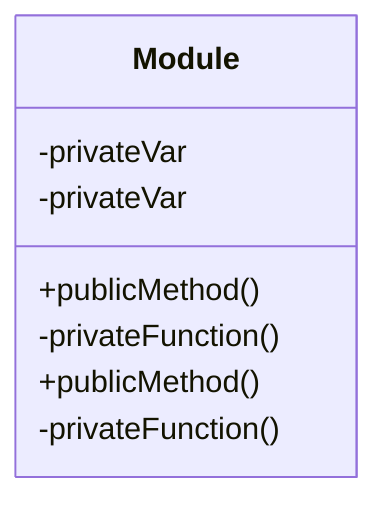

## 11.7 Patterns for Reusable Modules

In modern web development, creating reusable modules is a cornerstone of efficient and maintainable code. Reusable modules allow developers to encapsulate functionality, promote code reuse, and simplify maintenance. In this section, we will explore various patterns and best practices for creating reusable JavaScript modules, including the Module Pattern, Revealing Module Pattern, and ES Modules. We will also discuss the importance of clear APIs, documentation, semantic versioning, and the distribution of modules via npm.

### Benefits of Reusable Modules

Reusable modules offer several advantages:

- **Encapsulation**: Modules encapsulate functionality, reducing complexity and improving code readability.
- **Maintainability**: By isolating code into modules, updates and bug fixes become easier to manage.
- **Reusability**: Modules can be reused across different projects, saving time and effort.
- **Collaboration**: Modules with clear APIs and documentation facilitate collaboration among developers.
- **Scalability**: Modular codebases are easier to scale and extend.

### The Module Pattern

The Module Pattern is a classic design pattern used to create encapsulated and reusable code. It leverages JavaScript's closures to create private and public members.

#### Intent

The intent of the Module Pattern is to encapsulate private data and expose only the necessary parts of the module through a public API.

#### Key Participants

- **Private Variables and Functions**: Encapsulated within the module and not accessible from the outside.
- **Public API**: Exposed methods and properties that interact with the private members.

#### Sample Code Snippet

```javascript
const myModule = (function() {
    // Private variable
    let privateVar = 'I am private';

    // Private function
    function privateFunction() {
        console.log(privateVar);
    }

    return {
        // Public method
        publicMethod: function() {
            privateFunction();
        }
    };
})();

// Usage
myModule.publicMethod(); // Output: I am private
```

> **Explanation**: In this example, `privateVar` and `privateFunction` are encapsulated within the module, while `publicMethod` is exposed as part of the public API.

### The Revealing Module Pattern

The Revealing Module Pattern is a variation of the Module Pattern that aims to improve readability by defining all functions and variables in the private scope and returning an object that maps public members to private ones.

#### Intent

The intent is to clearly separate private and public members, enhancing code readability and maintainability.

#### Sample Code Snippet

```javascript
const revealingModule = (function() {
    let privateVar = 'I am private';

    function privateFunction() {
        console.log(privateVar);
    }

    function publicMethod() {
        privateFunction();
    }

    return {
        publicMethod: publicMethod
    };
})();

// Usage
revealingModule.publicMethod(); // Output: I am private
```

> **Explanation**: This pattern makes it easier to see which functions are intended to be public, as they are all returned at the end of the module.

### ES Modules

With the introduction of ES6, JavaScript gained native support for modules, known as ES Modules. This modern approach allows developers to import and export functionality between files, promoting better code organization.

#### Key Features

- **Import and Export**: Use `import` and `export` keywords to share functionality between files.
- **Static Analysis**: ES Modules enable static analysis, improving tooling and optimization.
- **Scope Isolation**: Each module has its own scope, preventing global variable pollution.

#### Sample Code Snippet

```javascript
// math.js
export function add(a, b) {
    return a + b;
}

export function subtract(a, b) {
    return a - b;
}

// main.js
import { add, subtract } from './math.js';

console.log(add(5, 3)); // Output: 8
console.log(subtract(5, 3)); // Output: 2
```

> **Explanation**: In this example, `add` and `subtract` functions are exported from `math.js` and imported in `main.js`, demonstrating the modularity and reusability of ES Modules.

### Creating Modules with Clear APIs

A clear and well-defined API is crucial for the usability of a module. Here are some best practices:

- **Consistency**: Ensure consistent naming conventions and parameter order.
- **Documentation**: Provide comprehensive documentation for each method and property.
- **Error Handling**: Implement robust error handling and provide meaningful error messages.
- **Versioning**: Use semantic versioning to communicate changes and maintain backward compatibility.

### Importance of Documentation and Semantic Versioning

Documentation is essential for understanding how to use a module effectively. It should include:

- **Usage Examples**: Demonstrate how to use the module in different scenarios.
- **API Reference**: Detail each method, its parameters, return values, and exceptions.
- **Changelog**: Track changes across versions to inform users of updates.

Semantic versioning (SemVer) is a versioning scheme that conveys meaning about the underlying changes. It follows the format `MAJOR.MINOR.PATCH`, where:

- **MAJOR**: Incompatible API changes.
- **MINOR**: Backward-compatible functionality.
- **PATCH**: Backward-compatible bug fixes.

### Packaging and Distributing Modules via npm

npm (Node Package Manager) is the standard package manager for JavaScript, allowing developers to publish and distribute modules.

#### Steps to Publish a Module

1. **Create a Package**: Use `npm init` to create a `package.json` file.
2. **Write Code**: Develop your module with clear APIs and documentation.
3. **Test**: Ensure your module is thoroughly tested.
4. **Version**: Update the version number following semantic versioning.
5. **Publish**: Use `npm publish` to publish your module to the npm registry.

#### Considerations for Open-Source Contributions

When contributing to open-source projects, consider the following:

- **Licensing**: Choose an appropriate open-source license.
- **Contribution Guidelines**: Provide clear guidelines for contributing to the project.
- **Code of Conduct**: Establish a code of conduct to foster a welcoming community.
- **Issue Tracking**: Use issue tracking to manage bugs and feature requests.

### Visualizing Module Interactions

To better understand how modules interact, let's visualize a simple module system using a class diagram.



> **Description**: This diagram illustrates a module with private variables and functions, exposing a public method.

### Knowledge Check

- **What are the benefits of using reusable modules in JavaScript?**
- **How does the Module Pattern differ from the Revealing Module Pattern?**
- **What are the key features of ES Modules?**
- **Why is documentation important for reusable modules?**
- **What is semantic versioning, and why is it important?**

### Exercises

1. **Create a Module**: Write a module that encapsulates a counter with methods to increment, decrement, and reset the counter.
2. **Document a Module**: Choose a module you have written and create comprehensive documentation for it.
3. **Publish a Module**: Follow the steps to publish a simple module to npm.

### Embrace the Journey

Remember, creating reusable modules is just the beginning. As you progress, you'll build more complex and interactive applications. Keep experimenting, stay curious, and enjoy the journey!

### Quiz: Mastering JavaScript Reusable Modules



### What is the primary benefit of using the Module Pattern?

- [x] Encapsulation of private data
- [ ] Improved performance
- [ ] Simplified syntax
- [ ] Increased execution speed

> **Explanation:** The Module Pattern encapsulates private data, allowing only specific parts of the module to be exposed through a public API.

### Which keyword is used to export functions in ES Modules?

- [x] export
- [ ] module
- [ ] expose
- [ ] public

> **Explanation:** The `export` keyword is used in ES Modules to make functions or variables available for import in other files.

### What does semantic versioning help communicate?

- [x] Changes and compatibility of a module
- [ ] The size of a module
- [ ] The author of a module
- [ ] The performance of a module

> **Explanation:** Semantic versioning communicates changes and compatibility, helping users understand the impact of updates.

### What is a key feature of the Revealing Module Pattern?

- [x] Clear separation of private and public members
- [ ] Improved performance
- [ ] Simplified syntax
- [ ] Increased execution speed

> **Explanation:** The Revealing Module Pattern clearly separates private and public members, enhancing code readability.

### Which tool is commonly used to publish JavaScript modules?

- [x] npm
- [ ] GitHub
- [ ] Babel
- [ ] Webpack

> **Explanation:** npm (Node Package Manager) is the standard tool for publishing and distributing JavaScript modules.

### What is the purpose of a changelog in module documentation?

- [x] Track changes across versions
- [ ] List all contributors
- [ ] Provide installation instructions
- [ ] Display module size

> **Explanation:** A changelog tracks changes across versions, informing users of updates and modifications.

### What is the format of semantic versioning?

- [x] MAJOR.MINOR.PATCH
- [ ] PATCH.MINOR.MAJOR
- [ ] MINOR.MAJOR.PATCH
- [ ] PATCH.MAJOR.MINOR

> **Explanation:** Semantic versioning follows the format MAJOR.MINOR.PATCH, indicating the level of changes.

### What is a common practice when contributing to open-source projects?

- [x] Provide contribution guidelines
- [ ] Keep code private
- [ ] Avoid documentation
- [ ] Use proprietary licenses

> **Explanation:** Providing contribution guidelines helps maintain consistency and quality in open-source projects.

### What is the primary advantage of using ES Modules?

- [x] Better code organization
- [ ] Faster execution
- [ ] Simplified syntax
- [ ] Increased security

> **Explanation:** ES Modules promote better code organization by allowing developers to import and export functionality between files.

### True or False: The Revealing Module Pattern exposes all private members.

- [ ] True
- [x] False

> **Explanation:** The Revealing Module Pattern only exposes selected private members through a public API, not all of them.



By understanding and applying these patterns and best practices, you can create robust, maintainable, and reusable JavaScript modules that enhance your development workflow and contribute to the broader developer community.
