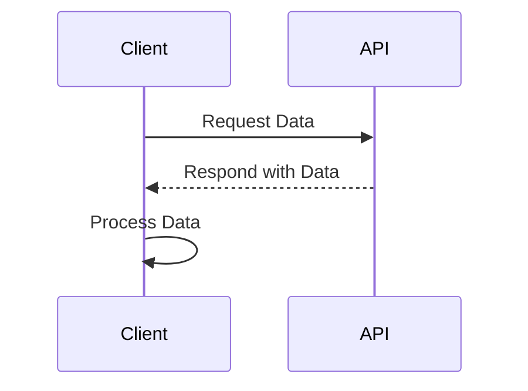

## 11.8 Working with Private and Public APIs

In the world of JavaScript development, creating robust and maintainable code often hinges on how well we can encapsulate our logic and expose only the necessary parts to the outside world. This is where the concepts of private and public APIs come into play. By carefully designing our modules with clear boundaries between what is internal and what is exposed, we can create more reliable and easier-to-maintain codebases.

### Understanding Module Encapsulation

Module encapsulation is a fundamental concept in software design that involves hiding the internal implementation details of a module and exposing only the necessary parts through a public interface. This separation of concerns allows developers to change the internal workings of a module without affecting the code that depends on it.

#### Why Encapsulation Matters

- **Maintainability**: By hiding the internal details, you can change the implementation without affecting other parts of your application.
- **Security**: Encapsulation can prevent unauthorized access to sensitive data or functions.
- **Simplicity**: A well-defined public API makes it easier for other developers to understand and use your module.

### Techniques for Hiding Internal Implementation Details

JavaScript offers several techniques to achieve encapsulation, including closures, symbols, and private class fields. Let's explore each of these methods.

#### Using Closures

Closures are a powerful feature in JavaScript that allow you to create private variables and functions. By defining variables within a function and returning an object that exposes only the public methods, you can effectively hide the internal details.

```javascript
function createCounter() {
  let count = 0; // Private variable

  return {
    increment() {
      count++;
    },
    getCount() {
      return count;
    }
  };
}

const counter = createCounter();
counter.increment();
console.log(counter.getCount()); // Outputs: 1
```

In this example, the `count` variable is private and can only be accessed through the `increment` and `getCount` methods.

#### Using Symbols

Symbols are a unique and immutable data type that can be used to create private properties in objects. Since symbols are unique, they can be used to hide properties from being accessed directly.

```javascript
const _privateProperty = Symbol('privateProperty');

class MyClass {
  constructor() {
    this[_privateProperty] = 'secret';
  }

  getPrivateProperty() {
    return this[_privateProperty];
  }
}

const instance = new MyClass();
console.log(instance.getPrivateProperty()); // Outputs: secret
```

Here, `_privateProperty` is a symbol that acts as a private property, accessible only through the `getPrivateProperty` method.

#### Using Private Class Fields

With the introduction of private class fields in ECMAScript 2022, JavaScript now has a more formal way to define private properties within classes. These fields are prefixed with a `#` and are not accessible outside the class.

```javascript
class MyClass {
  #privateField = 'secret';

  getPrivateField() {
    return this.#privateField;
  }
}

const instance = new MyClass();
console.log(instance.getPrivateField()); // Outputs: secret
```

The `#privateField` is a private class field that can only be accessed within the class itself.

### Best Practices for API Design and Documentation

Designing a good API involves more than just hiding internal details. It also requires careful consideration of how the API will be used and documented.

#### Principles of Good API Design

- **Consistency**: Ensure that your API follows consistent naming conventions and patterns.
- **Simplicity**: Keep the API as simple as possible, exposing only what is necessary.
- **Predictability**: The behavior of the API should be predictable and intuitive.
- **Extensibility**: Design the API in a way that allows for future extensions without breaking existing functionality.

#### Documenting APIs with TypeScript and JSDoc

Documentation is crucial for any API, as it helps other developers understand how to use it. TypeScript and JSDoc are two popular tools for documenting JavaScript APIs.

##### Using TypeScript for Interfaces

TypeScript provides a powerful type system that can be used to define interfaces for your APIs. This not only helps with documentation but also provides compile-time type checking.

```typescript
interface Counter {
  increment(): void;
  getCount(): number;
}

class MyCounter implements Counter {
  private count: number = 0;

  increment() {
    this.count++;
  }

  getCount() {
    return this.count;
  }
}
```

##### Using JSDoc for Documentation

JSDoc is a popular tool for adding documentation comments to JavaScript code. It allows you to describe the purpose and usage of your functions and classes.

```javascript
/**
 * Creates a new counter.
 * @returns {Object} An object with increment and getCount methods.
 */
function createCounter() {
  let count = 0;

  return {
    /**
     * Increments the counter.
     */
    increment() {
      count++;
    },
    /**
     * Gets the current count.
     * @returns {number} The current count.
     */
    getCount() {
      return count;
    }
  };
}
```

### Semantic Versioning and Backward Compatibility

When designing APIs, it's important to consider how changes will affect existing users. Semantic versioning is a versioning scheme that helps communicate the nature of changes in your API.

#### Understanding Semantic Versioning

Semantic versioning uses a three-part version number: `MAJOR.MINOR.PATCH`.

- **MAJOR**: Incremented for incompatible API changes.
- **MINOR**: Incremented for backward-compatible functionality.
- **PATCH**: Incremented for backward-compatible bug fixes.

By following semantic versioning, you can ensure that users of your API are aware of any breaking changes and can plan accordingly.

#### Ensuring Backward Compatibility

Backward compatibility is the ability of an API to continue functioning with older versions of the software that depend on it. To maintain backward compatibility:

- **Deprecate**: Mark features as deprecated before removing them.
- **Provide Alternatives**: Offer alternative methods or properties for deprecated features.
- **Communicate Changes**: Clearly communicate any changes in your API documentation.

### Try It Yourself

To solidify your understanding of private and public APIs, try modifying the code examples provided. For instance, experiment with adding new methods to the `createCounter` function or use TypeScript to define more complex interfaces.

### Visualizing JavaScript's Interaction with APIs

To better understand how JavaScript interacts with APIs, let's visualize the process using a sequence diagram.



This diagram illustrates a simple interaction between a client and an API, where the client requests data and processes the response.

### Knowledge Check

To reinforce your understanding, consider the following questions:

1. What are the benefits of encapsulating module internals?
2. How can closures be used to create private variables?
3. What is the purpose of semantic versioning?
4. How can TypeScript help in defining API interfaces?

### Summary

In this section, we've explored the importance of encapsulation in JavaScript module design, techniques for hiding internal details, and best practices for API design and documentation. By following these principles, you can create robust and maintainable JavaScript modules that are easy to use and extend.

Remember, this is just the beginning. As you progress, you'll build more complex and interactive web applications. Keep experimenting, stay curious, and enjoy the journey!

## Quiz: Mastering JavaScript APIs



### What is the primary purpose of module encapsulation?

- [x] To hide internal implementation details
- [ ] To expose all internal details
- [ ] To make code more complex
- [ ] To increase the number of public methods

> **Explanation:** Module encapsulation is used to hide internal implementation details, making the code more maintainable and secure.

### Which JavaScript feature allows for the creation of private variables?

- [x] Closures
- [ ] Global variables
- [ ] Public methods
- [ ] Arrow functions

> **Explanation:** Closures allow for the creation of private variables by enclosing them within a function scope.

### What is a symbol in JavaScript?

- [x] A unique and immutable data type
- [ ] A mutable data type
- [ ] A type of array
- [ ] A type of function

> **Explanation:** A symbol is a unique and immutable data type used to create private properties in objects.

### How are private class fields denoted in JavaScript?

- [x] With a `#` prefix
- [ ] With a `$` prefix
- [ ] With an `@` prefix
- [ ] With a `*` prefix

> **Explanation:** Private class fields are denoted with a `#` prefix in JavaScript.

### What does semantic versioning help communicate?

- [x] The nature of changes in an API
- [ ] The size of the codebase
- [ ] The number of developers
- [ ] The complexity of the code

> **Explanation:** Semantic versioning helps communicate the nature of changes in an API, such as major, minor, and patch updates.

### Which tool is used for adding documentation comments to JavaScript code?

- [x] JSDoc
- [ ] TypeScript
- [ ] Babel
- [ ] ESLint

> **Explanation:** JSDoc is used for adding documentation comments to JavaScript code.

### What is the benefit of using TypeScript for API design?

- [x] Provides compile-time type checking
- [ ] Increases runtime errors
- [ ] Makes code less readable
- [ ] Reduces code performance

> **Explanation:** TypeScript provides compile-time type checking, which helps in designing robust APIs.

### What is the purpose of backward compatibility?

- [x] To ensure older versions continue to function
- [ ] To break existing functionality
- [ ] To increase code complexity
- [ ] To reduce code readability

> **Explanation:** Backward compatibility ensures that older versions of software continue to function with new updates.

### How can you mark features as deprecated?

- [x] By clearly communicating in documentation
- [ ] By removing them without notice
- [ ] By hiding them in the code
- [ ] By changing their names

> **Explanation:** Features can be marked as deprecated by clearly communicating this in the documentation.

### True or False: Semantic versioning uses a two-part version number.

- [ ] True
- [x] False

> **Explanation:** Semantic versioning uses a three-part version number: MAJOR.MINOR.PATCH.


