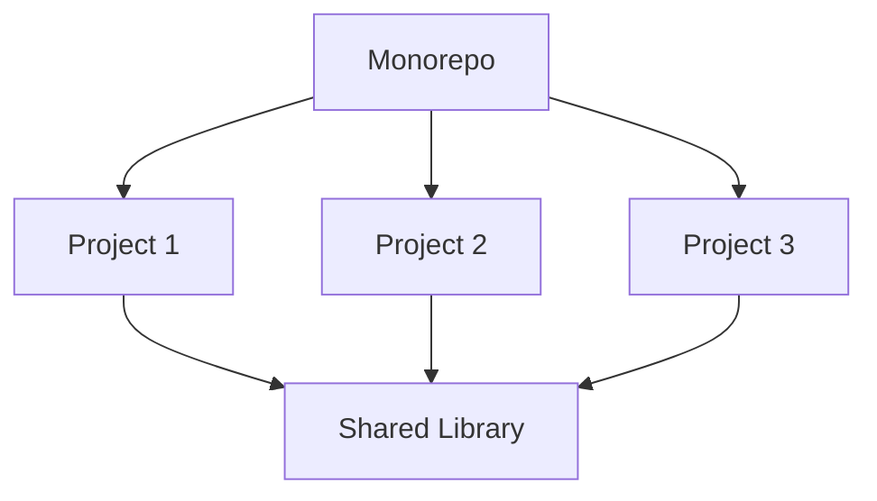
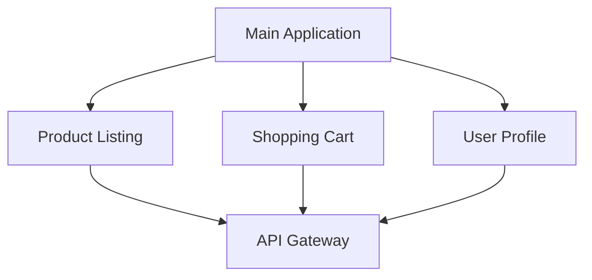

## 11.9 Monorepos and Micro-Frontends

In the ever-evolving landscape of web development, managing complex codebases efficiently is crucial. Two architectural approaches that have gained traction in recent years are **monorepos** and **micro-frontends**. These methodologies offer solutions for organizing codebases that include multiple projects or applications, enhancing collaboration, and streamlining deployment processes.

### Understanding Monorepos

**Monorepos** (short for "monolithic repositories") are a way to manage multiple projects within a single repository. This approach contrasts with polyrepos, where each project resides in its own repository. Monorepos have become popular in large-scale software development due to their ability to simplify dependency management and improve code sharing.

#### Benefits of Monorepos

1. **Simplified Dependency Management**: With all projects in a single repository, managing dependencies becomes more straightforward. Shared dependencies can be updated in one place, reducing version conflicts.

2. **Improved Code Sharing**: Code that is common across multiple projects can be easily shared, reducing duplication and ensuring consistency.

3. **Enhanced Collaboration**: Developers can work across different projects more easily, as all code is accessible from a single repository.

4. **Consistent Tooling and Processes**: Monorepos allow for uniform build, test, and deployment processes, which can be applied across all projects.

5. **Atomic Changes**: Changes that affect multiple projects can be made atomically, ensuring that all related updates are synchronized.

#### Tools for Managing Monorepos

Managing a monorepo effectively requires the right tools. Two popular tools in the JavaScript ecosystem are **Lerna** and **Nx**.

##### Lerna

[Lerna](https://lerna.js.org/) is a tool designed to manage JavaScript projects with multiple packages. It simplifies the process of managing dependencies and versioning across projects.

- **Features**:
  - **Versioning and Publishing**: Lerna automates the versioning and publishing of packages.
  - **Dependency Management**: It links local dependencies, reducing the need for repetitive installations.
  - **Bootstrap Command**: This command installs all dependencies and links cross-dependencies.

- **Example Usage**:
  ```bash
  # Initialize a new Lerna monorepo
  npx lerna init

  # Add a new package
  lerna create my-package

  # Bootstrap the monorepo
  lerna bootstrap
  ```

##### Nx

[Nx](https://nx.dev/) is an extensible monorepo tool that offers advanced features for managing large codebases. It is particularly well-suited for enterprise-level applications.

- **Features**:
  - **Integrated Development Experience**: Nx provides a comprehensive set of tools for building, testing, and deploying applications.
  - **Code Generation**: It includes generators for creating new components, modules, and libraries.
  - **Dependency Graph**: Nx visualizes the dependency graph of the entire monorepo, helping developers understand project interdependencies.

- **Example Usage**:
  ```bash
  # Create a new Nx workspace
  npx create-nx-workspace myworkspace

  # Generate a new application
  nx generate @nrwl/react:app myapp

  # Run the application
  nx serve myapp
  ```

### Introducing Micro-Frontends

**Micro-frontends** extend the principles of microservices to the frontend world. This architecture involves splitting a web application into smaller, independently deployable pieces, each responsible for a specific feature or functionality.

#### Architecture of Micro-Frontends

Micro-frontends aim to break down the monolithic frontend into smaller, manageable parts. Each micro-frontend can be developed, tested, and deployed independently, allowing teams to work autonomously.

- **Key Principles**:
  - **Independence**: Each micro-frontend is a self-contained unit with its own codebase and dependencies.
  - **Technology Agnostic**: Different micro-frontends can use different technologies, allowing teams to choose the best tools for their needs.
  - **Decentralized Governance**: Teams have the autonomy to make decisions about their micro-frontends without needing to coordinate with other teams.

#### Strategies for Implementing Micro-Frontends

1. **Vertical Split**: Divide the application based on features or business domains. Each micro-frontend handles a specific feature, such as user authentication or product catalog.

2. **Horizontal Split**: Divide the application based on layers, such as presentation, business logic, and data access. Each micro-frontend manages a specific layer.

3. **Integration Techniques**:
   - **Server-Side Composition**: Assemble micro-frontends on the server before sending them to the client.
   - **Client-Side Composition**: Load and render micro-frontends dynamically on the client side.

#### Challenges of Micro-Frontends

While micro-frontends offer many benefits, they also present challenges:

- **Code Sharing**: Ensuring consistent code sharing across micro-frontends can be difficult, especially when different technologies are used.
- **Dependency Management**: Managing dependencies across multiple micro-frontends requires careful planning to avoid conflicts.
- **Coordination**: Coordinating deployments and updates across micro-frontends can be complex, especially in large teams.

#### Example of Implementing Micro-Frontends

Consider a simple e-commerce application with three micro-frontends: **Product Listing**, **Shopping Cart**, and **User Profile**.

```javascript
// Product Listing Micro-Frontend
class ProductListing {
  render() {
    // Render product listing
  }
}

// Shopping Cart Micro-Frontend
class ShoppingCart {
  render() {
    // Render shopping cart
  }
}

// User Profile Micro-Frontend
class UserProfile {
  render() {
    // Render user profile
  }
}

// Main Application
function renderApp() {
  const productListing = new ProductListing();
  const shoppingCart = new ShoppingCart();
  const userProfile = new UserProfile();

  productListing.render();
  shoppingCart.render();
  userProfile.render();
}

renderApp();
```

### Visualizing Monorepos and Micro-Frontends

To better understand the relationship between monorepos and micro-frontends, let's visualize their architectures.



**Caption**: This diagram illustrates a monorepo structure where multiple projects share a common library.



**Caption**: This diagram shows a micro-frontend architecture with separate components for different application features.

### References and Further Reading

- [Monorepos: Please don't!](https://danluu.com/monorepo/)
- [Micro-Frontends: Revolutionizing Frontend Development](https://micro-frontends.org/)
- [Lerna Documentation](https://lerna.js.org/)
- [Nx Documentation](https://nx.dev/)

### Knowledge Check

- **What are the main benefits of using a monorepo?**
- **How does Lerna help in managing JavaScript projects?**
- **What is the primary goal of micro-frontends?**
- **What are some challenges associated with micro-frontends?**

### Embrace the Journey

Remember, adopting monorepos and micro-frontends is just the beginning. As you progress, you'll discover more efficient ways to manage complex codebases and deliver high-quality applications. Keep experimenting, stay curious, and enjoy the journey!

## Quiz: Mastering Monorepos and Micro-Frontends



### What is a monorepo?

- [x] A single repository containing multiple projects
- [ ] A repository with a single project
- [ ] A tool for managing dependencies
- [ ] A type of database

> **Explanation:** A monorepo is a single repository that contains multiple projects, allowing for shared dependencies and consistent tooling.

### Which tool is used for managing JavaScript projects with multiple packages?

- [x] Lerna
- [ ] Git
- [ ] Docker
- [ ] Jenkins

> **Explanation:** Lerna is a tool specifically designed for managing JavaScript projects with multiple packages.

### What is the primary benefit of micro-frontends?

- [x] Independent deployment of frontend components
- [ ] Reduced server load
- [ ] Improved database performance
- [ ] Enhanced security

> **Explanation:** Micro-frontends allow for the independent deployment of frontend components, enabling teams to work autonomously.

### Which of the following is a challenge of using micro-frontends?

- [x] Dependency management
- [ ] Increased server costs
- [ ] Reduced code readability
- [ ] Improved security

> **Explanation:** Managing dependencies across multiple micro-frontends can be challenging, especially with different technologies involved.

### What is the purpose of Nx in a monorepo?

- [x] To provide advanced features for managing large codebases
- [ ] To replace Git
- [ ] To enhance database performance
- [ ] To improve network security

> **Explanation:** Nx offers advanced features for managing large codebases, making it suitable for enterprise-level applications.

### How can micro-frontends be integrated?

- [x] Server-side composition
- [x] Client-side composition
- [ ] Database integration
- [ ] Network integration

> **Explanation:** Micro-frontends can be integrated using server-side or client-side composition techniques.

### What is a common strategy for splitting applications in micro-frontends?

- [x] Vertical split
- [x] Horizontal split
- [ ] Diagonal split
- [ ] Circular split

> **Explanation:** Applications can be split vertically by features or horizontally by layers in micro-frontends.

### Which of the following is a feature of Lerna?

- [x] Dependency management
- [ ] Database optimization
- [ ] Network security
- [ ] User authentication

> **Explanation:** Lerna provides features for managing dependencies and versioning in JavaScript projects.

### True or False: Micro-frontends can use different technologies for different components.

- [x] True
- [ ] False

> **Explanation:** Micro-frontends are technology agnostic, allowing different components to use different technologies.

### What is the main advantage of using a monorepo for multiple projects?

- [x] Simplified dependency management
- [ ] Increased server costs
- [ ] Reduced code readability
- [ ] Improved security

> **Explanation:** Monorepos simplify dependency management by allowing shared dependencies to be updated in one place.




