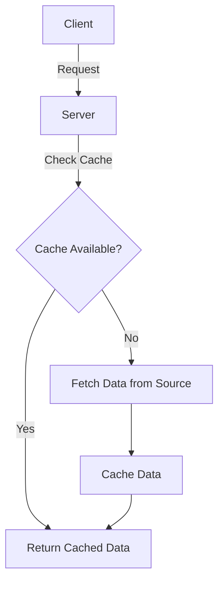

## 12.1 Caching Strategies

In the realm of web development, performance optimization is paramount. Caching strategies play a crucial role in reducing server load, decreasing response times, and ultimately enhancing the user experience. This section delves into various caching strategies applicable to JavaScript and TypeScript applications, providing insights into their implementation and best practices.

### Understand the Importance of Caching

Caching is a technique used to store copies of files or data in a temporary storage location, known as a cache, to reduce the time and resources needed to access them. Here are some key benefits:

- **Reduce Server Load:** By serving cached data, you can significantly reduce the number of requests hitting your server.
- **Faster Response Times:** Cached data can be retrieved much faster than fetching it from the original source, leading to quicker response times.
- **Enhanced User Experience:** Users benefit from faster page loads and smoother interactions.

### Implementation Steps

Implementing an effective caching strategy involves several key steps:

#### Identify Cachable Data

The first step in implementing caching is to identify which data can be cached. This typically includes:

- **Static Assets:** Images, CSS, JavaScript files, and other resources that do not change frequently.
- **API Responses:** Data from API calls that remain constant over a period of time.

Analyze your application to determine which data doesn't change frequently and can be cached without affecting the application's functionality.

#### Select Caching Mechanisms

Choosing the right caching mechanism is crucial for effective caching. Here are some common options:

##### Client-Side Caching

- **Browser Storage:** Utilize LocalStorage, SessionStorage, or IndexedDB to store data on the client side. This is useful for storing user preferences, session data, or other non-sensitive information.
- **HTTP Caching:** Implement HTTP caching by setting appropriate headers such as `Cache-Control` and `Expires`. This allows browsers to cache responses and reduce network requests.

##### Server-Side Caching

- **In-Memory Caches:** Use tools like Redis or Memcached to store frequently accessed data in memory for quick retrieval. This is particularly useful for caching database query results or session data.
- **Database Query Caching:** Some databases offer built-in query caching mechanisms that can be leveraged to reduce database load.

##### CDN Caching

- **Content Delivery Networks (CDNs):** Distribute static assets across a network of servers to reduce latency and improve load times for users around the world.

#### Set Cache Policies

Defining clear cache policies is essential to ensure data freshness and consistency:

- **Time-To-Live (TTL):** Set appropriate TTL values to determine how long data should be cached before it is considered stale.
- **Cache Invalidation:** Implement strategies to invalidate or update cached data when the underlying data changes.

### Practice: Implementing Caching

Let's explore some practical examples of implementing caching in JavaScript and TypeScript applications.

#### Configuring HTTP Headers for Browser Caching

To enable browser caching, configure your server to send the appropriate HTTP headers. Here's an example using Node.js and Express:

```javascript
const express = require('express');
const app = express();

// Serve static files with caching headers
app.use(express.static('public', {
  maxAge: '1d', // Cache for 1 day
  etag: false
}));

app.listen(3000, () => {
  console.log('Server is running on port 3000');
});
```

In this example, static files in the `public` directory are served with a cache duration of one day.

#### Implementing Server-Side Caching with Redis

Redis is a popular in-memory data store that can be used for server-side caching. Here's how you can implement caching for database queries:

```typescript
import express from 'express';
import redis from 'redis';
import { promisify } from 'util';

const app = express();
const client = redis.createClient();
const getAsync = promisify(client.get).bind(client);
const setAsync = promisify(client.set).bind(client);

app.get('/data', async (req, res) => {
  const cacheKey = 'myData';
  const cachedData = await getAsync(cacheKey);

  if (cachedData) {
    return res.json(JSON.parse(cachedData));
  }

  // Simulate a database query
  const data = { message: 'Hello, world!' };

  // Cache the data with a TTL of 60 seconds
  await setAsync(cacheKey, JSON.stringify(data), 'EX', 60);

  res.json(data);
});

app.listen(3000, () => {
  console.log('Server is running on port 3000');
});
```

In this example, data is cached in Redis for 60 seconds. If the data is available in the cache, it is returned immediately; otherwise, it is fetched from the database and cached.

### Considerations

While caching offers numerous benefits, it's important to consider the following:

- **Data Freshness:** Ensure that cached data is up-to-date and consistent with the source data.
- **Cache Invalidation:** Implement strategies to invalidate or update cached data when necessary.
- **Sensitive Information:** Avoid caching sensitive or user-specific information to prevent security risks.

### Visualizing Caching Strategies

To better understand how caching strategies work, consider the following diagram illustrating the flow of data with caching:



### Conclusion

Caching is a powerful technique for optimizing the performance of JavaScript and TypeScript applications. By carefully selecting caching mechanisms and setting appropriate cache policies, you can significantly reduce server load, improve response times, and enhance the user experience. Remember to consider data freshness and cache invalidation strategies to maintain data consistency.

## Quiz Time!



### What is the primary benefit of caching in web applications?

- [x] Reduce server load and response times
- [ ] Increase server load and response times
- [ ] Decrease user experience
- [ ] Increase data retrieval time

> **Explanation:** Caching helps reduce server load and response times, enhancing the overall user experience by providing faster data retrieval.

### Which of the following is a client-side caching mechanism?

- [x] LocalStorage
- [ ] Redis
- [ ] Memcached
- [ ] CDN

> **Explanation:** LocalStorage is a client-side storage option used for caching data in the browser.

### What is the purpose of the `Cache-Control` HTTP header?

- [x] To specify caching policies for HTTP responses
- [ ] To control server-side caching
- [ ] To manage database queries
- [ ] To configure CDN settings

> **Explanation:** The `Cache-Control` HTTP header is used to specify caching policies for HTTP responses, allowing browsers to cache responses and reduce network requests.

### Which tool is commonly used for server-side caching in Node.js applications?

- [x] Redis
- [ ] LocalStorage
- [ ] IndexedDB
- [ ] CDN

> **Explanation:** Redis is a popular in-memory data store used for server-side caching in Node.js applications.

### What is a key consideration when implementing caching strategies?

- [x] Data freshness and cache invalidation
- [ ] Increasing server load
- [ ] Decreasing response times
- [ ] Avoiding static assets

> **Explanation:** Ensuring data freshness and implementing cache invalidation strategies are key considerations when implementing caching strategies.

### Which caching mechanism is suitable for distributing static assets globally?

- [x] CDN
- [ ] LocalStorage
- [ ] Redis
- [ ] Memcached

> **Explanation:** Content Delivery Networks (CDNs) are used to distribute static assets globally, reducing latency and improving load times.

### What is the role of Time-To-Live (TTL) in caching?

- [x] To determine how long data should be cached
- [ ] To increase server load
- [ ] To decrease response times
- [ ] To manage database queries

> **Explanation:** Time-To-Live (TTL) is used to determine how long data should be cached before it is considered stale.

### Which of the following should be avoided in caching?

- [x] Sensitive or user-specific information
- [ ] Static assets
- [ ] API responses
- [ ] Database query results

> **Explanation:** Sensitive or user-specific information should be avoided in caching to prevent security risks.

### What is the benefit of using in-memory caches like Redis?

- [x] Quick data retrieval
- [ ] Slow data retrieval
- [ ] Increased server load
- [ ] Decreased user experience

> **Explanation:** In-memory caches like Redis provide quick data retrieval, reducing server load and improving response times.

### True or False: Caching can help improve the user experience by providing faster page loads.

- [x] True
- [ ] False

> **Explanation:** True. Caching can significantly improve the user experience by providing faster page loads and smoother interactions.


