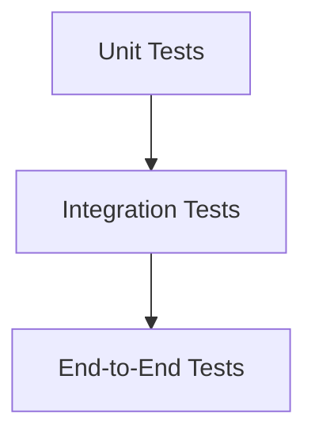

## 12.1 Introduction to Testing in JavaScript

In the ever-evolving landscape of software development, ensuring the quality and reliability of your code is paramount. Testing is a critical component of this process, providing a safety net that helps developers catch bugs early, maintain code quality, and ensure that applications behave as expected. In this section, we will explore the importance of testing in JavaScript development, discuss various types of tests, and examine how testing integrates into modern development workflows, including Continuous Integration and Deployment (CI/CD) pipelines.

### Why Testing is Crucial for Code Quality and Reliability

Testing is not just a checkbox to tick off in the development process; it is a fundamental practice that enhances the robustness and reliability of your software. Here are some reasons why testing is indispensable:

- **Bug Detection**: Testing helps identify bugs and issues early in the development cycle, reducing the cost and effort required to fix them later.
- **Code Quality**: By writing tests, developers are encouraged to write cleaner, more modular code that is easier to maintain and extend.
- **Documentation**: Tests serve as a form of documentation, providing insights into how the code is supposed to work.
- **Confidence in Changes**: With a comprehensive test suite, developers can make changes to the codebase with confidence, knowing that any regressions will be caught by the tests.
- **User Satisfaction**: Ultimately, testing ensures that the end product meets user expectations and functions correctly in various scenarios.

### Types of Tests in JavaScript

Testing in JavaScript can be broadly categorized into several types, each serving a specific purpose in the development lifecycle. Let's delve into each type:

#### Unit Tests

Unit tests focus on testing individual components or functions in isolation. They are the foundation of a robust testing strategy, providing fast feedback on the smallest units of code.

- **Purpose**: Validate that each function or component behaves as expected.
- **Scope**: Limited to a single function or component.
- **Tools**: Popular tools for unit testing in JavaScript include Jest, Mocha, and Jasmine.

**Example of a Unit Test:**

```javascript
// A simple function to add two numbers
function add(a, b) {
  return a + b;
}

// Unit test for the add function
describe('add', () => {
  it('should return the sum of two numbers', () => {
    expect(add(2, 3)).toBe(5);
  });

  it('should return a negative number when adding two negative numbers', () => {
    expect(add(-2, -3)).toBe(-5);
  });
});
```

#### Integration Tests

Integration tests focus on testing the interaction between different components or modules. They ensure that the integrated parts of the application work together as expected.

- **Purpose**: Verify that different parts of the system interact correctly.
- **Scope**: Multiple components or modules.
- **Tools**: Tools like Jest and Mocha can also be used for integration testing, often in combination with libraries like Supertest for HTTP assertions.

**Example of an Integration Test:**

```javascript
const request = require('supertest');
const app = require('../app'); // Assume this is your Express app

describe('GET /api/users', () => {
  it('should return a list of users', async () => {
    const response = await request(app).get('/api/users');
    expect(response.status).toBe(200);
    expect(response.body).toBeInstanceOf(Array);
  });
});
```

#### End-to-End (E2E) Tests

End-to-End tests simulate real user scenarios to ensure that the entire application flow works as expected. They test the application from the user's perspective, interacting with the UI and backend.

- **Purpose**: Validate the complete application flow from start to finish.
- **Scope**: The entire application, including UI and backend.
- **Tools**: Cypress and Selenium are popular tools for E2E testing in JavaScript.

**Example of an E2E Test:**

```javascript
// Using Cypress for E2E testing
describe('User Login Flow', () => {
  it('should allow a user to log in', () => {
    cy.visit('/login');
    cy.get('input[name=username]').type('testuser');
    cy.get('input[name=password]').type('password123');
    cy.get('button[type=submit]').click();
    cy.url().should('include', '/dashboard');
    cy.contains('Welcome, testuser');
  });
});
```

#### Acceptance Tests

Acceptance tests are similar to E2E tests but focus on verifying that the application meets business requirements and user needs. They are often written in collaboration with stakeholders to ensure that the application delivers the expected value.

- **Purpose**: Confirm that the application meets business requirements.
- **Scope**: User stories or business scenarios.
- **Tools**: Tools like Cucumber.js can be used for acceptance testing, allowing tests to be written in a human-readable format.

**Example of an Acceptance Test:**

```gherkin
Feature: User Login

  Scenario: Successful login
    Given I am on the login page
    When I enter valid credentials
    Then I should be redirected to the dashboard
    And I should see a welcome message
```

### The Testing Pyramid Concept

The testing pyramid is a concept that illustrates the ideal distribution of different types of tests in a software project. It emphasizes having a larger number of unit tests at the base, fewer integration tests in the middle, and even fewer E2E tests at the top. This structure ensures a solid foundation of fast, reliable tests, with more comprehensive tests to catch issues at higher levels.



**Description**: The testing pyramid highlights the importance of having a strong base of unit tests, supported by integration and E2E tests to ensure comprehensive coverage.

### Testing in Continuous Integration and Deployment (CI/CD) Pipelines

Testing is an integral part of CI/CD pipelines, which automate the process of building, testing, and deploying applications. By integrating testing into CI/CD pipelines, teams can ensure that code changes are automatically validated, reducing the risk of introducing bugs into production.

- **Continuous Integration (CI)**: Automatically run tests whenever code changes are pushed to the repository, providing immediate feedback to developers.
- **Continuous Deployment (CD)**: Automatically deploy code changes to production after passing all tests, ensuring that the latest features and fixes are always available to users.

**Example CI/CD Workflow:**

1. **Code Commit**: Developers commit code changes to the repository.
2. **Automated Testing**: CI server runs the test suite to validate changes.
3. **Build and Deploy**: If tests pass, the application is built and deployed to production.

### Encouraging a Testing Mindset

Adopting a testing mindset means integrating testing into every stage of the development process. Here are some tips to foster a testing culture:

- **Write Tests First**: Consider adopting Test-Driven Development (TDD), where tests are written before the actual code.
- **Automate Everything**: Automate as many tests as possible to ensure consistent and reliable results.
- **Review and Refactor**: Regularly review and refactor tests to keep them relevant and effective.
- **Collaborate with Stakeholders**: Involve stakeholders in writing acceptance tests to ensure that the application meets business needs.

### Try It Yourself

To solidify your understanding of testing in JavaScript, try modifying the code examples provided. Experiment with adding new test cases, refactoring the code, or integrating additional testing tools. This hands-on approach will help you gain confidence in writing and maintaining tests.

### Conclusion

Testing is a cornerstone of modern software development, providing the confidence and assurance needed to deliver high-quality applications. By understanding the different types of tests and how they fit into the development process, you can build more reliable and maintainable JavaScript applications. Remember, this is just the beginning. As you progress, you'll build more complex and interactive web pages. Keep experimenting, stay curious, and enjoy the journey!

## Mastering JavaScript Testing Concepts



### What is the primary purpose of unit tests in JavaScript?

- [x] To validate individual functions or components in isolation
- [ ] To test the entire application flow
- [ ] To ensure the application meets business requirements
- [ ] To simulate real user scenarios

> **Explanation:** Unit tests focus on testing individual components or functions in isolation to ensure they behave as expected.

### Which tool is commonly used for end-to-end testing in JavaScript?

- [ ] Jest
- [ ] Mocha
- [x] Cypress
- [ ] Supertest

> **Explanation:** Cypress is a popular tool for end-to-end testing in JavaScript, allowing developers to simulate real user scenarios.

### What does the testing pyramid emphasize?

- [x] Having more unit tests than integration and end-to-end tests
- [ ] Having more end-to-end tests than unit tests
- [ ] Having an equal number of unit, integration, and end-to-end tests
- [ ] Focusing only on integration tests

> **Explanation:** The testing pyramid emphasizes having a larger number of unit tests at the base, fewer integration tests in the middle, and even fewer end-to-end tests at the top.

### How do acceptance tests differ from end-to-end tests?

- [x] Acceptance tests focus on verifying business requirements
- [ ] Acceptance tests simulate real user scenarios
- [ ] Acceptance tests are written in JavaScript
- [ ] Acceptance tests are faster to execute

> **Explanation:** Acceptance tests focus on verifying that the application meets business requirements and user needs, often involving stakeholders in the process.

### What is a key benefit of integrating testing into CI/CD pipelines?

- [x] Automatically validating code changes
- [ ] Reducing the number of tests needed
- [ ] Eliminating the need for manual testing
- [ ] Increasing deployment time

> **Explanation:** Integrating testing into CI/CD pipelines ensures that code changes are automatically validated, reducing the risk of introducing bugs into production.

### Which of the following is a common tool for unit testing in JavaScript?

- [x] Jest
- [ ] Cypress
- [ ] Selenium
- [ ] Cucumber.js

> **Explanation:** Jest is a popular tool for unit testing in JavaScript, providing a simple and efficient way to test individual functions and components.

### What is the main focus of integration tests?

- [ ] Testing individual functions
- [x] Testing the interaction between different components
- [ ] Simulating real user scenarios
- [ ] Verifying business requirements

> **Explanation:** Integration tests focus on testing the interaction between different components or modules to ensure they work together as expected.

### Which type of test is typically written in collaboration with stakeholders?

- [ ] Unit tests
- [ ] Integration tests
- [ ] End-to-end tests
- [x] Acceptance tests

> **Explanation:** Acceptance tests are often written in collaboration with stakeholders to ensure that the application meets business requirements and delivers the expected value.

### What is a key characteristic of a testing mindset?

- [x] Integrating testing into every stage of development
- [ ] Writing tests only after code is complete
- [ ] Focusing solely on manual testing
- [ ] Avoiding automation

> **Explanation:** A testing mindset involves integrating testing into every stage of the development process, ensuring that tests are an integral part of the workflow.

### True or False: The testing pyramid suggests having more end-to-end tests than unit tests.

- [ ] True
- [x] False

> **Explanation:** The testing pyramid suggests having more unit tests than end-to-end tests, as unit tests provide fast feedback and a solid foundation for the test suite.




