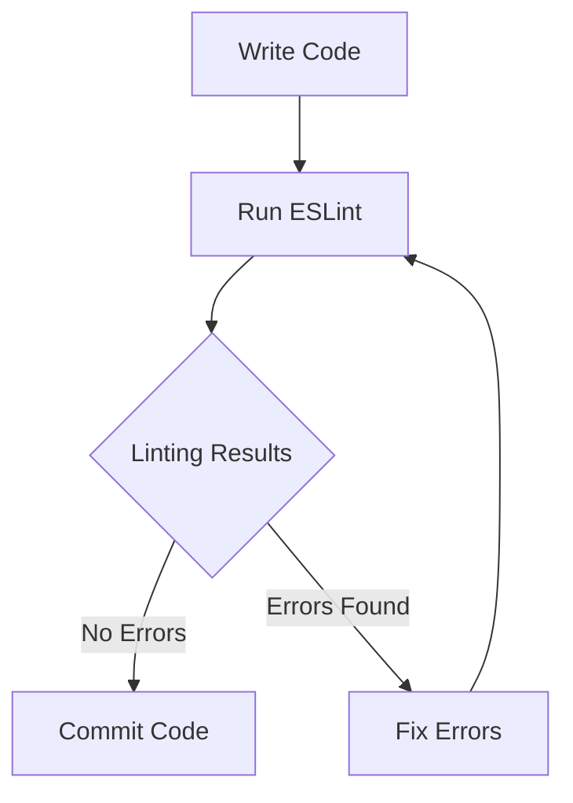

## 12.10 Static Code Analysis with ESLint

In the world of modern web development, maintaining high code quality is crucial for building robust and maintainable applications. Static code analysis is a technique used to examine source code without executing it, identifying potential errors, enforcing coding standards, and improving code quality. One of the most popular tools for static code analysis in JavaScript is [ESLint](https://eslint.org/).

### What is Static Code Analysis?

Static code analysis involves examining code for errors, bugs, and stylistic issues without actually running the program. This process helps developers catch potential problems early in the development cycle, ensuring that the code adheres to predefined standards and best practices. By using static code analysis tools like ESLint, developers can automate the process of code review, making it more efficient and consistent.

### How ESLint Works

ESLint is a powerful and flexible linting tool for JavaScript. It analyzes your code for potential errors and enforces coding standards by applying a set of rules. ESLint can be customized to fit the specific needs of your project, allowing you to define your own rules or extend existing configurations.

#### Key Features of ESLint

- **Customizable Rules**: ESLint allows you to define your own rules or use pre-defined ones.
- **Extensible Configuration**: You can extend configurations from popular style guides like Airbnb or Google.
- **Plugins**: ESLint supports plugins for additional functionality, such as TypeScript or React linting.
- **Integration**: ESLint can be integrated into code editors and CI/CD pipelines for continuous code quality checks.

### Setting Up ESLint in a Project

To get started with ESLint, you need to install it in your project. Follow these steps to set up ESLint:

1. **Install ESLint**: Use npm or yarn to install ESLint in your project.

   ```bash
   npm install eslint --save-dev
   ```

2. **Initialize ESLint**: Run the ESLint initialization command to create a configuration file.

   ```bash
   npx eslint --init
   ```

   During initialization, you'll be prompted to answer a series of questions to configure ESLint according to your project's needs.

3. **Create Configuration File**: ESLint will generate a configuration file (`.eslintrc.json`, `.eslintrc.js`, or `.eslintrc.yml`) based on your responses.

4. **Add Scripts**: Update your `package.json` to include scripts for running ESLint.

   ```json
   {
     "scripts": {
       "lint": "eslint ."
     }
   }
   ```

### Configuring ESLint Rules

ESLint's power lies in its configurability. You can define rules to enforce specific coding standards or extend configurations from popular style guides.

#### Extending Configurations

ESLint allows you to extend configurations from existing style guides. For example, to use the Airbnb style guide, install the necessary packages and extend the configuration in your ESLint config file.

```bash
npx install-peerdeps --dev eslint-config-airbnb
```

Update your `.eslintrc.json`:

```json
{
  "extends": "airbnb"
}
```

#### Custom Rules

You can also define custom rules in your ESLint configuration. Here's an example of setting a custom rule to enforce the use of single quotes:

```json
{
  "rules": {
    "quotes": ["error", "single"]
  }
}
```

### ESLint Plugins

ESLint's functionality can be extended with plugins. Plugins provide additional rules and configurations for specific frameworks or languages.

#### TypeScript Plugin

To use ESLint with TypeScript, install the TypeScript ESLint plugin:

```bash
npm install @typescript-eslint/parser @typescript-eslint/eslint-plugin --save-dev
```

Update your `.eslintrc.json` to use the TypeScript parser and plugin:

```json
{
  "parser": "@typescript-eslint/parser",
  "plugins": ["@typescript-eslint"],
  "extends": [
    "plugin:@typescript-eslint/recommended"
  ]
}
```

#### React Plugin

For React projects, use the React ESLint plugin:

```bash
npm install eslint-plugin-react --save-dev
```

Update your `.eslintrc.json`:

```json
{
  "plugins": ["react"],
  "extends": [
    "plugin:react/recommended"
  ]
}
```

### Integrating ESLint into Development Workflows

Integrating ESLint into your development workflow ensures consistent code quality checks throughout the development process.

#### Code Editor Integration

Most modern code editors, such as Visual Studio Code, support ESLint integration. By installing the ESLint extension, you can receive real-time feedback on code quality as you write.

#### Continuous Integration (CI) Integration

Integrating ESLint into your CI pipeline automates code quality checks, ensuring that only code meeting your standards is merged into the main branch. Here's an example of integrating ESLint with GitHub Actions:

```yaml
name: Lint

on: [push, pull_request]

jobs:
  lint:
    runs-on: ubuntu-latest
    steps:
    - uses: actions/checkout@v2
    - name: Install Node.js
      uses: actions/setup-node@v2
      with:
        node-version: '14'
    - run: npm install
    - run: npm run lint
```

### Benefits of Using ESLint

- **Consistent Coding Standards**: ESLint enforces consistent coding standards across your codebase, reducing the likelihood of bugs and improving readability.
- **Early Error Detection**: By catching potential errors early, ESLint helps prevent issues from reaching production.
- **Improved Code Quality**: Regular use of ESLint leads to cleaner, more maintainable code.
- **Customizability**: ESLint's flexibility allows you to tailor it to your project's specific needs.

### Encouraging Consistent Coding Standards

Consistent coding standards are essential for maintaining a high-quality codebase. By using ESLint, you can enforce these standards automatically, ensuring that all team members adhere to the same guidelines.

### Try It Yourself

To get hands-on experience with ESLint, try setting up a new JavaScript project and configuring ESLint with different style guides and plugins. Experiment with custom rules and see how ESLint helps maintain code quality.

### Visualizing ESLint Workflow

Below is a diagram illustrating the workflow of ESLint in a development environment:



**Diagram Description**: This flowchart represents the typical ESLint workflow in a development environment. Developers write code, run ESLint, and based on the results, either commit the code or fix errors and re-run ESLint.

### Knowledge Check

To reinforce your understanding of ESLint and static code analysis, consider the following questions:

1. What is static code analysis, and why is it important?
2. How does ESLint help in maintaining code quality?
3. What are some popular style guides that can be extended in ESLint?
4. How can ESLint be integrated into a CI pipeline?
5. What are the benefits of using ESLint plugins?

### Summary

In this section, we've explored the power of ESLint for static code analysis in JavaScript. By setting up ESLint in your projects, configuring rules, and integrating it into your development workflow, you can ensure consistent coding standards and improve code quality. Remember, this is just the beginning. As you continue to develop your skills, you'll find that tools like ESLint are invaluable for maintaining high-quality codebases. Keep experimenting, stay curious, and enjoy the journey!

## Mastering ESLint for JavaScript Code Quality



### What is the primary purpose of ESLint?

- [x] To perform static code analysis and enforce coding standards
- [ ] To compile JavaScript code into machine code
- [ ] To manage project dependencies
- [ ] To provide a runtime environment for JavaScript

> **Explanation:** ESLint is primarily used for static code analysis and enforcing coding standards in JavaScript projects.

### Which command is used to initialize ESLint in a project?

- [x] `npx eslint --init`
- [ ] `npm init eslint`
- [ ] `eslint init`
- [ ] `npx init eslint`

> **Explanation:** The command `npx eslint --init` is used to initialize ESLint in a project, creating a configuration file.

### How can you extend the Airbnb style guide in ESLint?

- [x] By installing the Airbnb configuration and extending it in `.eslintrc.json`
- [ ] By copying Airbnb's configuration file into your project
- [ ] By using the `--airbnb` flag with ESLint
- [ ] By downloading a separate Airbnb linter

> **Explanation:** To extend the Airbnb style guide, you install the Airbnb configuration and extend it in your ESLint configuration file.

### What is a benefit of integrating ESLint into a CI pipeline?

- [x] It automates code quality checks and ensures only compliant code is merged
- [ ] It speeds up the build process
- [ ] It compiles code faster
- [ ] It provides a backup of the codebase

> **Explanation:** Integrating ESLint into a CI pipeline automates code quality checks, ensuring that only code meeting the standards is merged into the main branch.

### Which ESLint plugin is used for TypeScript support?

- [x] `@typescript-eslint`
- [ ] `eslint-plugin-typescript`
- [ ] `typescript-eslint-plugin`
- [ ] `eslint-typescript`

> **Explanation:** The `@typescript-eslint` plugin is used to provide TypeScript support in ESLint.

### What does the ESLint rule `"quotes": ["error", "single"]` enforce?

- [x] The use of single quotes for strings
- [ ] The use of double quotes for strings
- [ ] The use of backticks for strings
- [ ] The use of no quotes for strings

> **Explanation:** The rule `"quotes": ["error", "single"]` enforces the use of single quotes for strings in the code.

### What is the role of ESLint plugins?

- [x] To provide additional rules and configurations for specific frameworks or languages
- [ ] To compile JavaScript code
- [ ] To manage project dependencies
- [ ] To provide a runtime environment

> **Explanation:** ESLint plugins provide additional rules and configurations for specific frameworks or languages, enhancing ESLint's functionality.

### Which of the following is a key feature of ESLint?

- [x] Customizable rules
- [ ] Code compilation
- [ ] Dependency management
- [ ] Runtime environment

> **Explanation:** One of the key features of ESLint is its customizable rules, allowing developers to tailor it to their project's needs.

### True or False: ESLint can only be used with JavaScript.

- [ ] True
- [x] False

> **Explanation:** False. ESLint can be extended to work with TypeScript and other languages through plugins.

### What is the main advantage of using static code analysis tools like ESLint?

- [x] They help identify potential errors and enforce coding standards without executing the code
- [ ] They compile code into machine language
- [ ] They provide a runtime environment for code execution
- [ ] They manage project dependencies

> **Explanation:** Static code analysis tools like ESLint help identify potential errors and enforce coding standards without executing the code, improving code quality and consistency.



Remember, mastering tools like ESLint is a journey. As you continue to explore and integrate these tools into your workflow, you'll find that they significantly enhance your development process. Keep learning, stay curious, and enjoy the journey!
