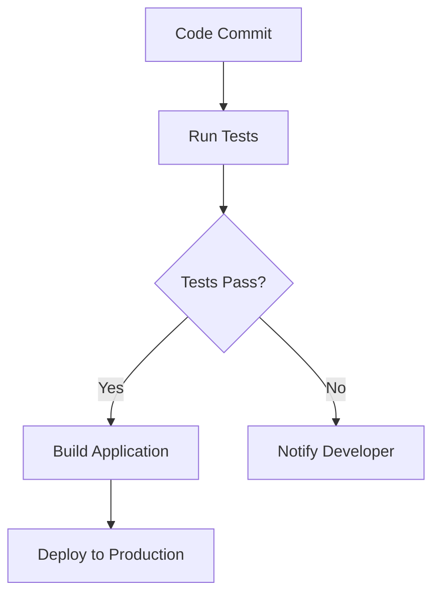

## 12.11 Continuous Integration and Deployment

In the fast-paced world of modern web development, ensuring that code changes are integrated and deployed efficiently is crucial. Continuous Integration (CI) and Continuous Deployment (CD) are practices that automate these processes, allowing teams to deliver high-quality software rapidly and reliably. In this section, we will explore the concepts of CI and CD, discuss popular tools and platforms, and provide practical examples of setting up CI/CD pipelines.

### Understanding Continuous Integration (CI)

Continuous Integration is a development practice where developers integrate code into a shared repository frequently, ideally several times a day. Each integration is verified by an automated build and automated tests to detect integration errors as quickly as possible.

#### Importance of CI

- **Early Detection of Errors**: By integrating frequently, errors can be detected and fixed early, reducing the cost of bug fixes.
- **Improved Collaboration**: CI encourages developers to share their work and collaborate more effectively.
- **Consistent Code Quality**: Automated tests and linting ensure that code quality is maintained across the project.

### Understanding Continuous Deployment (CD)

Continuous Deployment is the practice of automatically deploying every change that passes the automated tests to production. This ensures that the software is always in a deployable state.

#### Importance of CD

- **Faster Time to Market**: Changes are deployed to production quickly, allowing for faster feedback and iteration.
- **Reduced Deployment Risk**: Smaller, incremental updates reduce the risk of deployment failures.
- **Increased Developer Productivity**: Developers can focus on writing code rather than worrying about deployment processes.

### Popular CI/CD Tools and Platforms

Several tools and platforms facilitate CI/CD processes. Here are some of the most popular ones:

#### Jenkins

[Jenkins](https://www.jenkins.io/) is an open-source automation server that enables developers to build, test, and deploy their software. It is highly customizable and supports a wide range of plugins.

#### Travis CI

[Travis CI](https://travis-ci.org/) is a cloud-based CI service that integrates with GitHub repositories. It is known for its ease of use and support for multiple programming languages.

#### CircleCI

[CircleCI](https://circleci.com/) is a cloud-based CI/CD platform that automates the build, test, and deployment processes. It offers robust support for Docker and Kubernetes.

#### GitHub Actions

[GitHub Actions](https://github.com/features/actions) is a CI/CD platform that allows developers to automate workflows directly within their GitHub repositories. It supports a wide range of actions and integrations.

### Setting Up a CI Pipeline

Let's walk through setting up a basic CI pipeline using GitHub Actions. This pipeline will run tests and linting on every push to the repository.

```yaml
# .github/workflows/ci.yml
name: CI

on:
  push:
    branches:
      - main

jobs:
  build:
    runs-on: ubuntu-latest

    steps:
    - name: Checkout code
      uses: actions/checkout@v2

    - name: Set up Node.js
      uses: actions/setup-node@v2
      with:
        node-version: '14'

    - name: Install dependencies
      run: npm install

    - name: Run lint
      run: npm run lint

    - name: Run tests
      run: npm test
```

#### Explanation

- **Trigger**: The pipeline is triggered on every push to the `main` branch.
- **Jobs**: The `build` job runs on the latest Ubuntu environment.
- **Steps**: The steps include checking out the code, setting up Node.js, installing dependencies, running linting, and executing tests.

### Automating Deployments

Once the tests pass, we can automate deployments to a production environment. Here's an example of how to extend the GitHub Actions pipeline to deploy to a cloud provider like AWS.

```yaml
# .github/workflows/deploy.yml
name: Deploy

on:
  push:
    branches:
      - main

jobs:
  deploy:
    runs-on: ubuntu-latest

    steps:
    - name: Checkout code
      uses: actions/checkout@v2

    - name: Set up Node.js
      uses: actions/setup-node@v2
      with:
        node-version: '14'

    - name: Install dependencies
      run: npm install

    - name: Run build
      run: npm run build

    - name: Deploy to AWS
      uses: aws-actions/configure-aws-credentials@v1
      with:
        aws-access-key-id: ${{ secrets.AWS_ACCESS_KEY_ID }}
        aws-secret-access-key: ${{ secrets.AWS_SECRET_ACCESS_KEY }}
        aws-region: us-east-1

    - name: Deploy
      run: aws s3 sync ./build s3://my-bucket-name
```

#### Explanation

- **AWS Credentials**: The deployment uses AWS credentials stored in GitHub Secrets.
- **Build and Deploy**: The code is built and then synchronized with an S3 bucket.

### Best Practices for Reliable Pipelines

- **Keep Pipelines Simple**: Avoid overly complex pipelines that are difficult to maintain.
- **Use Caching**: Cache dependencies to speed up build times.
- **Monitor Pipeline Performance**: Regularly review pipeline performance and optimize as needed.
- **Secure Secrets**: Use secure methods to store and access secrets and credentials.
- **Implement Rollback Strategies**: Have a plan in place to roll back deployments if something goes wrong.

### Security and Access Control Considerations

- **Limit Access**: Restrict access to CI/CD tools and environments to only those who need it.
- **Audit Logs**: Enable logging and auditing to track changes and access to the CI/CD system.
- **Regular Updates**: Keep CI/CD tools and dependencies up to date to protect against vulnerabilities.

### Visualizing a CI/CD Pipeline

Below is a simple flowchart illustrating a typical CI/CD pipeline using Mermaid.js:



**Description**: This diagram represents a CI/CD pipeline where code commits trigger tests. If tests pass, the application is built and deployed to production. If tests fail, the developer is notified.

### Conclusion

Continuous Integration and Deployment are essential practices for modern software development. By automating testing and deployment processes, teams can deliver high-quality software quickly and efficiently. Remember, this is just the beginning. As you progress, you'll build more complex and interactive pipelines. Keep experimenting, stay curious, and enjoy the journey!

### Knowledge Check

## Test Your Knowledge on Continuous Integration and Deployment



### What is the primary goal of Continuous Integration (CI)?

- [x] To integrate code changes frequently and detect errors early
- [ ] To deploy code changes to production automatically
- [ ] To replace manual testing with automated testing
- [ ] To eliminate the need for code reviews

> **Explanation:** The primary goal of CI is to integrate code changes frequently and detect errors early, ensuring code quality and reducing integration issues.

### Which of the following is a popular CI/CD tool?

- [x] Jenkins
- [ ] Visual Studio Code
- [ ] Sublime Text
- [ ] Notepad++

> **Explanation:** Jenkins is a popular CI/CD tool used to automate the building, testing, and deployment of software.

### What is the main benefit of Continuous Deployment (CD)?

- [x] Faster time to market
- [ ] Increased code complexity
- [ ] Manual deployment processes
- [ ] Reduced testing requirements

> **Explanation:** Continuous Deployment allows for faster time to market by automatically deploying changes that pass tests to production.

### In a CI/CD pipeline, what happens if tests fail?

- [x] The developer is notified
- [ ] The code is deployed to production
- [ ] The build process continues
- [ ] The code is automatically fixed

> **Explanation:** If tests fail, the developer is notified so they can address the issues before proceeding with deployment.

### Which of the following is a best practice for maintaining reliable CI/CD pipelines?

- [x] Keep pipelines simple
- [ ] Use complex scripts
- [ ] Avoid caching dependencies
- [ ] Ignore pipeline performance

> **Explanation:** Keeping pipelines simple is a best practice to ensure they are maintainable and reliable.

### What is the purpose of using caching in CI/CD pipelines?

- [x] To speed up build times
- [ ] To increase code complexity
- [ ] To store secrets securely
- [ ] To eliminate the need for testing

> **Explanation:** Caching is used to speed up build times by storing dependencies and other resources that do not change frequently.

### How can you secure secrets in a CI/CD pipeline?

- [x] Use secure methods to store and access secrets
- [ ] Store secrets in plain text files
- [ ] Share secrets with all team members
- [ ] Avoid using secrets altogether

> **Explanation:** Secure methods should be used to store and access secrets to protect sensitive information in CI/CD pipelines.

### What is a rollback strategy in the context of CI/CD?

- [x] A plan to revert to a previous version if deployment fails
- [ ] A method to accelerate deployment processes
- [ ] A technique to skip testing phases
- [ ] A strategy to increase code complexity

> **Explanation:** A rollback strategy is a plan to revert to a previous version of the software if deployment fails, ensuring stability.

### Which tool allows you to automate workflows directly within GitHub repositories?

- [x] GitHub Actions
- [ ] Jenkins
- [ ] CircleCI
- [ ] Travis CI

> **Explanation:** GitHub Actions allows developers to automate workflows directly within GitHub repositories.

### Continuous Integration and Deployment practices help in reducing deployment risk.

- [x] True
- [ ] False

> **Explanation:** Continuous Integration and Deployment practices help in reducing deployment risk by ensuring that changes are tested and deployed incrementally.



By mastering CI/CD practices, you can significantly enhance your development workflow, ensuring that your software is always in a deployable state. Keep exploring and refining your pipelines to achieve even greater efficiency and reliability.
