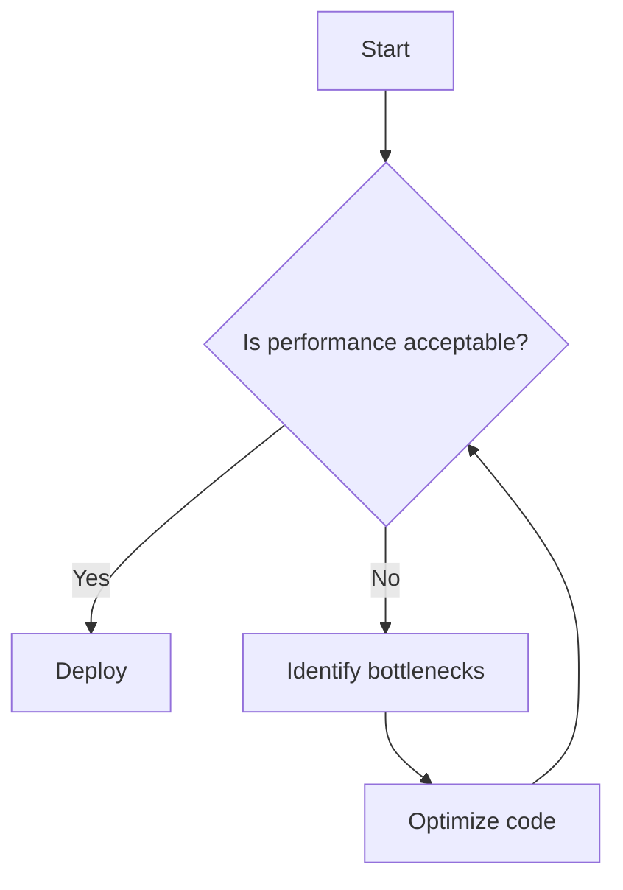

## 12.12 Performance Testing and Benchmarking

Performance testing and benchmarking are critical components of modern web development, especially when working with JavaScript. As applications grow in complexity, ensuring that they run efficiently across various environments becomes paramount. This section will guide you through the importance of performance testing, introduce you to essential tools like Benchmark.js and browser profiling tools, and provide practical examples and best practices for optimizing your JavaScript code.

### Why Performance Testing is Important

Performance testing helps identify bottlenecks and inefficiencies in your code, ensuring that your application runs smoothly and efficiently. It is crucial for:

- **User Experience**: Slow applications can frustrate users, leading to higher bounce rates and lower engagement.
- **Resource Utilization**: Efficient code uses fewer resources, which can reduce costs, especially in cloud environments.
- **Scalability**: Identifying performance issues early ensures that your application can scale effectively as demand grows.
- **Competitive Advantage**: Faster applications can provide a competitive edge in the market.

### Tools for Performance Testing and Benchmarking

#### Benchmark.js

[Benchmark.js](https://benchmarkjs.com/) is a popular library for benchmarking JavaScript code. It provides accurate and reliable performance tests, making it an excellent choice for developers looking to optimize their code.

**Key Features of Benchmark.js:**

- **High-Resolution Timing**: Uses high-resolution timers for precise measurement.
- **Statistical Analysis**: Provides statistical analysis of benchmark results.
- **Cross-Platform**: Works in browsers and Node.js environments.

**Example Usage:**

```javascript
const Benchmark = require('benchmark');
const suite = new Benchmark.Suite;

// Add tests
suite.add('RegExp#test', function() {
  /o/.test('Hello World!');
})
.add('String#indexOf', function() {
  'Hello World!'.indexOf('o') > -1;
})
// Add listeners
.on('cycle', function(event) {
  console.log(String(event.target));
})
.on('complete', function() {
  console.log('Fastest is ' + this.filter('fastest').map('name'));
})
// Run the tests
.run({ 'async': true });
```

**Try It Yourself**: Modify the code to test different string methods or add more test cases to see how they compare.

#### Browser Profiling Tools

Modern browsers come equipped with powerful profiling tools that can help you analyze the performance of your JavaScript code. These tools provide insights into:

- **Execution Time**: How long each function takes to execute.
- **Call Stacks**: The sequence of function calls leading to a particular point in execution.
- **Memory Usage**: How much memory your application is consuming.

**Using Chrome DevTools for Profiling:**

1. **Open DevTools**: Press `F12` or `Ctrl+Shift+I` (Windows/Linux) or `Cmd+Option+I` (Mac).
2. **Navigate to the Performance Tab**: This tab allows you to record and analyze the performance of your application.
3. **Record a Session**: Click the record button, perform actions in your application, and stop the recording to analyze the results.
4. **Analyze the Results**: Look for long-running scripts, memory leaks, and other performance bottlenecks.

### Writing Benchmarks for Critical Code Paths

When writing benchmarks, focus on critical code paths—sections of your code that are executed frequently or are known to be performance-sensitive.

**Example Benchmark for Array Operations:**

```javascript
const Benchmark = require('benchmark');
const suite = new Benchmark.Suite;

const array = Array.from({length: 1000}, (_, i) => i);

// Add tests
suite.add('Array#forEach', function() {
  let sum = 0;
  array.forEach(num => sum += num);
})
.add('Array#reduce', function() {
  array.reduce((sum, num) => sum + num, 0);
})
// Add listeners
.on('cycle', function(event) {
  console.log(String(event.target));
})
.on('complete', function() {
  console.log('Fastest is ' + this.filter('fastest').map('name'));
})
// Run the tests
.run({ 'async': true });
```

**Try It Yourself**: Experiment with different array sizes or methods to see how performance scales.

### Interpreting Profiling Data

Interpreting profiling data requires understanding the metrics and visualizations provided by your tools. Key metrics include:

- **CPU Time**: The amount of time the CPU spends executing your code.
- **Memory Usage**: The amount of memory allocated by your application.
- **Call Frequency**: How often functions are called.

**Example Interpretation:**

- **High CPU Time**: Indicates functions that may need optimization.
- **Frequent Garbage Collection**: Suggests potential memory leaks or inefficient memory usage.
- **Deep Call Stacks**: May indicate overly complex or recursive functions.

### Best Practices for Optimizing Code

1. **Minimize DOM Manipulations**: Batch DOM updates to reduce reflows and repaints.
2. **Use Efficient Algorithms**: Choose algorithms with optimal time complexity for your use case.
3. **Avoid Memory Leaks**: Ensure that objects are properly dereferenced when no longer needed.
4. **Leverage Asynchronous Operations**: Use `async/await` or Promises to handle long-running tasks without blocking the main thread.
5. **Optimize Loops**: Use `for` loops instead of `forEach` for performance-critical sections.

### Considerations for Testing in Different Environments

Performance can vary significantly across different environments, such as:

- **Browsers**: Different browsers may have varying JavaScript engine optimizations.
- **Devices**: Performance on mobile devices can differ from desktops due to hardware constraints.
- **Network Conditions**: Test under various network conditions to ensure robust performance.

### Visualizing Performance Data

Visualizing performance data can help you better understand and communicate findings. Use tools like Chrome DevTools' flame charts to see where time is being spent in your application.



**Diagram Description**: This flowchart represents the iterative process of performance testing and optimization.

### References and Links

- [Benchmark.js Documentation](https://benchmarkjs.com/)
- [Chrome DevTools Performance Analysis](https://developer.chrome.com/docs/devtools/evaluate-performance/)
- [MDN Web Docs on Performance](https://developer.mozilla.org/en-US/docs/Web/Performance)

### Knowledge Check

- What are the key benefits of performance testing?
- How does Benchmark.js help in performance testing?
- What are some common performance bottlenecks in JavaScript applications?

### Exercises

1. **Benchmark a Sorting Algorithm**: Write a benchmark to compare the performance of different sorting algorithms in JavaScript.
2. **Profile a Web Application**: Use browser profiling tools to analyze the performance of a web application you have developed.

### Summary

Performance testing and benchmarking are essential for ensuring that your JavaScript applications run efficiently and provide a smooth user experience. By leveraging tools like Benchmark.js and browser profiling tools, you can identify bottlenecks, optimize your code, and ensure that your applications are ready to scale. Remember, this is just the beginning. As you progress, you'll build more complex and interactive web pages. Keep experimenting, stay curious, and enjoy the journey!

## Quiz: Mastering JavaScript Performance Testing and Benchmarking



### What is the primary goal of performance testing in JavaScript?

- [x] To identify bottlenecks and optimize code efficiency
- [ ] To add new features to the application
- [ ] To ensure code readability
- [ ] To improve security

> **Explanation:** Performance testing aims to identify bottlenecks and optimize code efficiency to enhance user experience and resource utilization.

### Which tool is commonly used for benchmarking JavaScript code?

- [x] Benchmark.js
- [ ] Mocha
- [ ] ESLint
- [ ] Babel

> **Explanation:** Benchmark.js is a popular library specifically designed for benchmarking JavaScript code.

### What does high CPU time in profiling data indicate?

- [x] Functions that may need optimization
- [ ] Efficient memory usage
- [ ] Low network latency
- [ ] High security

> **Explanation:** High CPU time indicates functions that may need optimization to improve performance.

### What is a common performance bottleneck in JavaScript applications?

- [x] Frequent DOM manipulations
- [ ] Using `const` instead of `let`
- [ ] Declaring functions
- [ ] Using strict mode

> **Explanation:** Frequent DOM manipulations can lead to performance bottlenecks due to reflows and repaints.

### Which of the following is a best practice for optimizing JavaScript code?

- [x] Minimize DOM manipulations
- [ ] Use `eval` for dynamic code execution
- [ ] Avoid asynchronous operations
- [ ] Use global variables extensively

> **Explanation:** Minimizing DOM manipulations is a best practice to reduce reflows and repaints, improving performance.

### What does the Chrome DevTools Performance tab help you analyze?

- [x] Execution time and memory usage
- [ ] Code syntax errors
- [ ] CSS styles
- [ ] HTML structure

> **Explanation:** The Chrome DevTools Performance tab helps analyze execution time and memory usage to identify performance issues.

### What should you consider when testing performance in different environments?

- [x] Browser differences and device constraints
- [ ] Code syntax
- [ ] HTML tags
- [ ] CSS styles

> **Explanation:** Consider browser differences and device constraints as performance can vary significantly across environments.

### What is the benefit of using asynchronous operations in JavaScript?

- [x] They prevent blocking the main thread
- [ ] They increase code complexity
- [ ] They reduce code readability
- [ ] They improve security

> **Explanation:** Asynchronous operations prevent blocking the main thread, allowing other tasks to run concurrently.

### What is the purpose of using flame charts in performance analysis?

- [x] To visualize where time is being spent in the application
- [ ] To display CSS styles
- [ ] To show HTML structure
- [ ] To list JavaScript variables

> **Explanation:** Flame charts help visualize where time is being spent in the application, aiding in performance analysis.

### True or False: Performance testing is only necessary for large applications.

- [ ] True
- [x] False

> **Explanation:** Performance testing is important for applications of all sizes to ensure efficient resource utilization and a smooth user experience.


