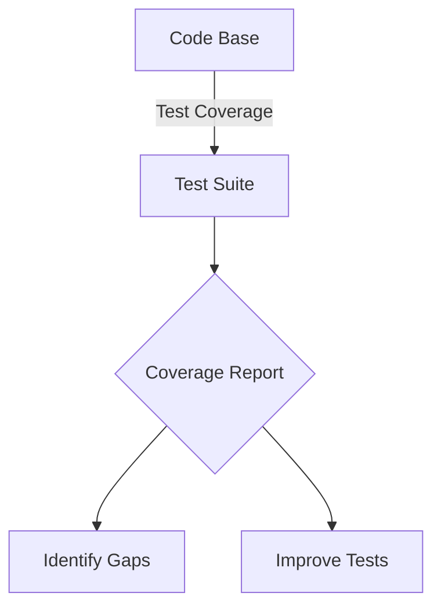

## 12.13 Writing Effective Tests

In the realm of software development, testing is an indispensable practice that ensures the reliability and functionality of code. Writing effective tests is not just about verifying that code works; it's about creating a safety net that allows developers to refactor and extend code with confidence. In this section, we will explore the characteristics of good tests, provide tips on naming conventions and test structure, and discuss strategies for writing clear, maintainable, and reliable tests in JavaScript.

### Characteristics of Good Tests

Good tests share several key characteristics that make them valuable assets in the development process:

1. **Reliability**: Tests should consistently pass or fail based on the code's behavior. They should not produce false positives or negatives due to external factors or flaky conditions.

2. **Readability**: Tests should be easy to understand. Clear and concise test descriptions help developers quickly grasp what is being tested and why.

3. **Maintainability**: As code evolves, tests should be easy to update and maintain. This involves writing tests that are not tightly coupled to implementation details.

4. **Independence**: Each test should be independent of others, ensuring that the outcome of one test does not affect another.

5. **Speed**: Tests should run quickly to provide immediate feedback to developers. Slow tests can hinder the development process and discourage frequent testing.

### Naming Conventions and Test Structure

Effective naming conventions and a well-organized test structure are crucial for maintaining clarity and readability in your test suite.

#### Naming Conventions

- **Descriptive Names**: Use descriptive names for test cases that clearly convey the purpose of the test. For example, `shouldReturnTrueForValidEmail` is more informative than `testEmail`.

- **Consistent Style**: Adopt a consistent naming style across your test suite. Whether you use camelCase, snake_case, or another convention, consistency helps maintain readability.

#### Test Structure

- **Arrange-Act-Assert (AAA)**: This pattern structures tests into three distinct sections:
  - **Arrange**: Set up the initial conditions and inputs.
  - **Act**: Execute the code under test.
  - **Assert**: Verify that the outcome matches the expected result.

```javascript
// Example of Arrange-Act-Assert pattern
describe('Email Validator', () => {
  it('should return true for valid email', () => {
    // Arrange
    const email = 'test@example.com';
    
    // Act
    const result = isValidEmail(email);
    
    // Assert
    expect(result).toBe(true);
  });
});
```

### Testing One Thing at a Time

Focus on testing one aspect of the code at a time. This approach simplifies test cases and makes it easier to identify the cause of a failure. Avoid writing tests that try to cover multiple scenarios or functionalities in a single case.

#### Avoiding Brittle Tests

Brittle tests are those that break easily when the code changes, even if the functionality remains correct. To avoid brittle tests:

- **Avoid Testing Implementation Details**: Focus on testing the behavior and outcomes rather than the internal workings of the code.

- **Use Mocks and Stubs Wisely**: While mocks and stubs can isolate the unit under test, overusing them can lead to tests that are too dependent on specific implementations.

### Data-Driven Tests and Parameterized Testing

Data-driven tests allow you to run the same test logic with different inputs, reducing redundancy and improving coverage.

#### Parameterized Testing

Many testing frameworks support parameterized tests, where you can define a test once and run it with multiple sets of data.

```javascript
// Example of parameterized testing with Jest
describe.each([
  ['test@example.com', true],
  ['invalid-email', false],
  ['another@test.com', true],
])('isValidEmail(%s)', (email, expected) => {
  it(`should return ${expected}`, () => {
    expect(isValidEmail(email)).toBe(expected);
  });
});
```

### Testing Edge Cases and Error Conditions

Testing edge cases and error conditions is crucial for ensuring that your code handles unexpected inputs and situations gracefully.

- **Boundary Values**: Test inputs at the boundaries of valid ranges to ensure correct behavior at the limits.

- **Invalid Inputs**: Test how your code handles invalid or unexpected inputs, such as null, undefined, or incorrect data types.

- **Error Handling**: Verify that your code correctly handles and reports errors, ensuring that exceptions are thrown or logged as expected.

### The Role of Code Reviews in Improving Test Quality

Code reviews are an essential part of the development process, providing an opportunity to improve test quality through peer feedback.

- **Review Test Coverage**: Ensure that tests cover all critical paths and edge cases.

- **Evaluate Test Readability**: Assess whether test cases are clear and easy to understand.

- **Identify Redundancies**: Look for redundant tests or overlapping coverage that can be consolidated.

### Visualizing Test Coverage

Visualizing test coverage can help identify gaps in your test suite and ensure comprehensive testing.



*Diagram: Visualizing the relationship between the code base, test suite, and coverage report.*

### Try It Yourself

To reinforce your understanding of writing effective tests, try modifying the code examples provided. Experiment with different inputs, add new test cases, and observe how changes affect the test outcomes. This hands-on approach will deepen your understanding of test writing principles.

### Summary

Writing effective tests is a critical skill for any developer. By focusing on reliability, readability, and maintainability, you can create a robust test suite that supports the development process and ensures code quality. Remember to test one thing at a time, use data-driven tests, and cover edge cases and error conditions. Engage in code reviews to continuously improve your tests and leverage visualization tools to assess test coverage.

### Knowledge Check

To solidify your understanding of writing effective tests, complete the following quiz.

## Effective JavaScript Testing Quiz



### What is a key characteristic of a good test?

- [x] Reliability
- [ ] Complexity
- [ ] Ambiguity
- [ ] Dependency

> **Explanation:** A good test should be reliable, consistently passing or failing based on the code's behavior.

### What pattern is recommended for structuring tests?

- [x] Arrange-Act-Assert
- [ ] Test-Driven Development
- [ ] Behavior-Driven Development
- [ ] Waterfall

> **Explanation:** The Arrange-Act-Assert pattern structures tests into three sections: setup, execution, and verification.

### Why should tests focus on one thing at a time?

- [x] To simplify test cases and make failures easier to diagnose
- [ ] To increase test complexity
- [ ] To cover multiple scenarios in one test
- [ ] To reduce the number of tests

> **Explanation:** Testing one thing at a time simplifies test cases and makes it easier to identify the cause of a failure.

### What is the benefit of parameterized testing?

- [x] It allows running the same test logic with different inputs
- [ ] It increases test redundancy
- [ ] It reduces test coverage
- [ ] It complicates test maintenance

> **Explanation:** Parameterized testing allows you to run the same test logic with different inputs, reducing redundancy and improving coverage.

### What should be avoided to prevent brittle tests?

- [x] Testing implementation details
- [ ] Testing behavior and outcomes
- [ ] Using mocks and stubs
- [ ] Testing edge cases

> **Explanation:** Avoid testing implementation details to prevent brittle tests that break easily with code changes.

### Why is testing edge cases important?

- [x] To ensure code handles unexpected inputs and situations gracefully
- [ ] To increase test complexity
- [ ] To reduce test coverage
- [ ] To focus on common scenarios

> **Explanation:** Testing edge cases ensures that your code handles unexpected inputs and situations gracefully.

### What role do code reviews play in test quality?

- [x] They provide an opportunity to improve test quality through peer feedback
- [ ] They increase test redundancy
- [ ] They complicate test maintenance
- [ ] They reduce test coverage

> **Explanation:** Code reviews provide an opportunity to improve test quality through peer feedback.

### What is a benefit of visualizing test coverage?

- [x] Identifying gaps in the test suite
- [ ] Increasing test complexity
- [ ] Reducing test coverage
- [ ] Focusing on common scenarios

> **Explanation:** Visualizing test coverage helps identify gaps in the test suite and ensure comprehensive testing.

### What is the purpose of using mocks and stubs in testing?

- [x] To isolate the unit under test
- [ ] To increase test complexity
- [ ] To reduce test coverage
- [ ] To focus on common scenarios

> **Explanation:** Mocks and stubs are used to isolate the unit under test, allowing for more focused testing.

### True or False: Tests should be tightly coupled to implementation details.

- [ ] True
- [x] False

> **Explanation:** Tests should not be tightly coupled to implementation details to ensure maintainability and flexibility.



Remember, this is just the beginning. As you progress, you'll build more complex and interactive test suites. Keep experimenting, stay curious, and enjoy the journey!
