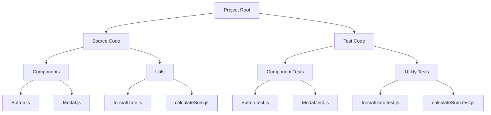

## 12.14 Test Organization and Management

In the realm of software development, testing is a critical component that ensures the reliability and quality of code. As projects grow in complexity, the organization and management of test suites become paramount. In this section, we will delve into strategies for organizing test code, managing test suites, and maintaining a clean and scalable test codebase. We will explore the use of test fixtures, setup/teardown methods, and the management of test data and external dependencies. Additionally, we will highlight tools that aid in test management and reporting.

### Organizing Tests Parallel to Code Structure

One of the foundational principles of test organization is to mirror the structure of your codebase. This approach simplifies navigation and ensures that tests are easily discoverable. By organizing tests in parallel with the code structure, developers can quickly locate the relevant tests for a given module or component.

#### Example Structure

Consider a project with the following structure:

```
src/
  ├── components/
  │   ├── Button.js
  │   └── Modal.js
  ├── utils/
  │   ├── formatDate.js
  │   └── calculateSum.js
tests/
  ├── components/
  │   ├── Button.test.js
  │   └── Modal.test.js
  ├── utils/
  │   ├── formatDate.test.js
  │   └── calculateSum.test.js
```

In this structure, each test file corresponds to a source file, making it intuitive to find and manage tests.

### Grouping Tests into Suites and Using Descriptive Naming

Grouping tests into suites allows for better organization and readability. Test suites can be created using frameworks like Jest or Mocha, which provide mechanisms to group related tests together.

#### Example with Jest

```javascript
describe('Button Component', () => {
  test('renders correctly', () => {
    // Test implementation
  });

  test('handles click events', () => {
    // Test implementation
  });
});
```

In this example, the `describe` block groups tests related to the `Button` component. Descriptive naming of test cases further enhances clarity and understanding.

### Using Test Fixtures and Setup/Teardown Methods

Test fixtures are used to set up the necessary environment for tests to run. They help in creating a consistent state before each test is executed. Setup and teardown methods are crucial for preparing and cleaning up the test environment.

#### Example with Mocha

```javascript
const { expect } = require('chai');

describe('User Module', () => {
  let user;

  beforeEach(() => {
    // Setup: Create a new user instance before each test
    user = new User('John Doe', 'john@example.com');
  });

  afterEach(() => {
    // Teardown: Clean up after each test
    user = null;
  });

  it('should have a valid email', () => {
    expect(user.email).to.match(/^[\w-\.]+@([\w-]+\.)+[\w-]{2,4}$/);
  });
});
```

In this example, `beforeEach` and `afterEach` are used to set up and tear down the test environment, ensuring that each test runs in isolation.

### Managing Test Data and Mocking External Dependencies

Managing test data is crucial for ensuring that tests are reliable and repeatable. Mocking external dependencies allows tests to run independently of external systems, such as databases or APIs.

#### Mocking with Jest

```javascript
jest.mock('axios');

const axios = require('axios');
const fetchData = require('./fetchData');

test('fetches data from API', async () => {
  axios.get.mockResolvedValue({ data: { userId: 1, id: 1, title: 'Test' } });

  const data = await fetchData();
  expect(data.title).toBe('Test');
});
```

In this example, `axios` is mocked to simulate API responses, allowing the test to run without making actual network requests.

### Best Practices for Maintaining a Clean and Organized Test Codebase

1. **Consistency**: Maintain a consistent structure and naming convention across all test files.
2. **Isolation**: Ensure tests are independent and do not rely on shared state.
3. **Readability**: Write clear and concise test cases with descriptive names.
4. **Documentation**: Document complex test setups and any non-obvious logic.
5. **Regular Refactoring**: Periodically review and refactor test code to improve maintainability.

### Tools for Test Management and Reporting

Several tools can aid in managing and reporting test results, providing insights into test coverage and performance.

- **Jest**: A comprehensive testing framework with built-in support for test coverage and mocking.
- **Mocha**: A flexible testing framework that can be paired with assertion libraries like Chai.
- **Cypress**: An end-to-end testing framework with powerful features for testing web applications.
- **Allure**: A test reporting tool that provides detailed insights into test execution and results.

### Visualizing Test Organization

To better understand the organization of test suites, let's visualize a typical test structure using a Mermaid.js diagram.



This diagram illustrates how test files are organized in parallel with the source code, facilitating easy navigation and management.

### Conclusion

Organizing and managing test suites effectively is crucial for maintaining a scalable and maintainable codebase. By mirroring the code structure, grouping tests into suites, using fixtures, and managing test data, we can ensure that our tests are reliable and easy to manage. Tools like Jest, Mocha, and Cypress provide powerful features for test management and reporting, aiding in the overall quality assurance process.

### Knowledge Check

## Test Organization and Management Quiz



### What is a key benefit of organizing tests parallel to the code structure?

- [x] Simplifies navigation and ensures tests are easily discoverable
- [ ] Reduces the number of test files
- [ ] Increases test execution speed
- [ ] Eliminates the need for test documentation

> **Explanation:** Organizing tests parallel to the code structure makes it easier to find and manage tests related to specific modules or components.

### What is the purpose of using `describe` blocks in Jest?

- [x] To group related tests together
- [ ] To execute tests in parallel
- [ ] To mock external dependencies
- [ ] To generate test reports

> **Explanation:** `describe` blocks in Jest are used to group related tests together, improving organization and readability.

### Which method is used in Mocha to set up the test environment before each test?

- [x] `beforeEach`
- [ ] `afterEach`
- [ ] `setup`
- [ ] `initialize`

> **Explanation:** `beforeEach` is used in Mocha to set up the test environment before each test is executed.

### What is the advantage of mocking external dependencies in tests?

- [x] Allows tests to run independently of external systems
- [ ] Increases test execution speed
- [ ] Reduces the number of test cases
- [ ] Simplifies test code

> **Explanation:** Mocking external dependencies allows tests to run independently of external systems, such as databases or APIs.

### Which tool is known for providing detailed insights into test execution and results?

- [x] Allure
- [ ] Jest
- [ ] Mocha
- [ ] Cypress

> **Explanation:** Allure is a test reporting tool that provides detailed insights into test execution and results.

### What is a best practice for maintaining a clean and organized test codebase?

- [x] Maintain a consistent structure and naming convention
- [ ] Use global variables for test data
- [ ] Write lengthy and detailed test cases
- [ ] Avoid refactoring test code

> **Explanation:** Maintaining a consistent structure and naming convention is a best practice for keeping a test codebase clean and organized.

### What is the purpose of using `afterEach` in Mocha?

- [x] To clean up the test environment after each test
- [ ] To set up the test environment before each test
- [ ] To execute tests in parallel
- [ ] To generate test reports

> **Explanation:** `afterEach` is used in Mocha to clean up the test environment after each test is executed.

### Which of the following is a benefit of using test fixtures?

- [x] Ensures a consistent state before each test
- [ ] Increases test execution speed
- [ ] Reduces the number of test cases
- [ ] Simplifies test code

> **Explanation:** Test fixtures ensure a consistent state before each test, contributing to reliable and repeatable tests.

### What is a common tool used for end-to-end testing of web applications?

- [x] Cypress
- [ ] Jest
- [ ] Mocha
- [ ] Allure

> **Explanation:** Cypress is a popular tool for end-to-end testing of web applications.

### True or False: Grouping tests into suites is only beneficial for large projects.

- [ ] True
- [x] False

> **Explanation:** Grouping tests into suites is beneficial for projects of all sizes, as it improves organization and readability.



Remember, this is just the beginning. As you progress, you'll build more complex and interactive test suites. Keep experimenting, stay curious, and enjoy the journey!
